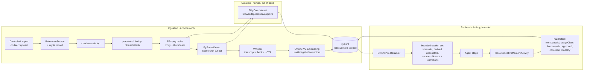
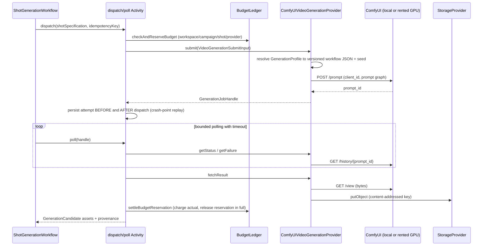
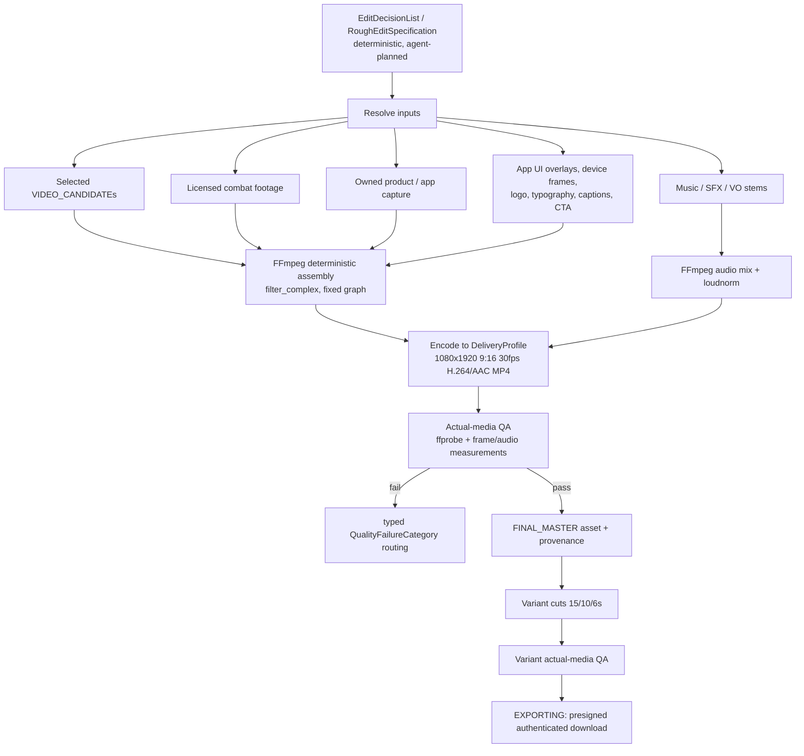
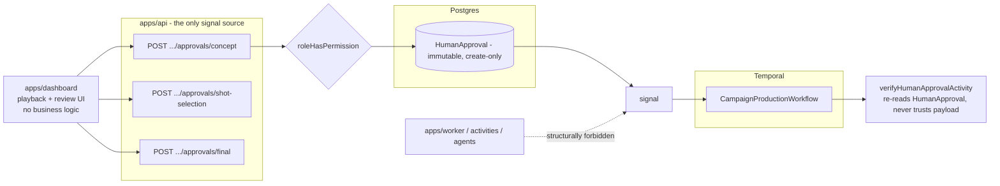
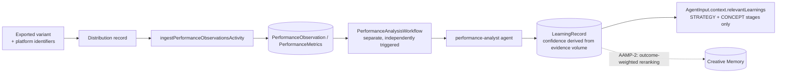
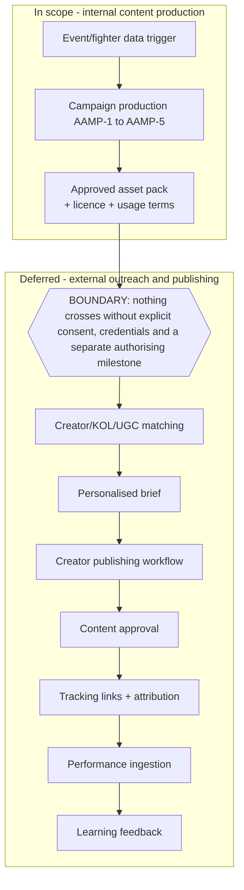

# AAMP — Agent Automation Marketing Plan

Status: **AAMP-0 complete (architecture).** Implementation has begun:
**AAMP-1 step 1 (live PostgreSQL migration baseline, §6 tasks 1–3) is done** —
see `docs/architecture.md` §8's AAMP-1 step 1 entry and
`docs/runbooks/database-migrations.md` — and **AAMP-1 step 2 (verified Clerk
authentication, §6 task 4) is done**, see §8's AAMP-1 step 2 entry and
**ADR-0006**.

Beyond the AAMP-1 tasks, four vertical slices have been delivered against this
blueprint's invariants (§3) rather than in its phase order: real FFmpeg
rendering, the ComfyUI gateway, prompt-driven source generation, and Creative
Memory ingestion → retrieval → role-specific injection. Those are now joined by
a **production AAMP composition root** — one canonical dependency factory, typed
`FIXTURE`/`LOCAL_PRODUCTION`/`PRODUCTION` execution modes derived from the
dependencies actually built, sealed run provenance, and a read-only
`pnpm aamp:doctor` preflight — exercised end to end against live local
PostgreSQL, live Qdrant and real FFmpeg, and by a **controlled creative
benchmark** (`pnpm aamp:benchmark`) that runs the same campaign with Creative
Memory off and required and compares nineteen dimensions. See
`docs/architecture.md` §8's production-composition-root and
creative-benchmark-runner entries, and `docs/runbooks/creative-benchmark.md`.

**AAMP-1 step 3 (durable `SERIALIZABLE` budget enforcement, §6 task 5) is
done** — `checkAndReserveBudget`'s compensating guard is removed and every
applicable policy is now reserved inside one PostgreSQL `SERIALIZABLE`
transaction, proven against a live database. See `docs/architecture.md` §8's
AAMP-1 step 3 entry and `docs/runbooks/database-migrations.md` §8.

Two further vertical slices have since been delivered against §3's invariants:
a **zero-cost footage-first creative preview**, in which a person authors the
creative as a validated plan and the pipeline executes it with no reasoning or
generation provider constructed at all; and **read-only Combat Reviews live-UI
capture**, which turns approved public product screens into rights-controlled
production assets. The second one supplies what the first was missing — real
product footage — and does so without adding a render path: capture terminates
at `captured-assets.json`, a deterministic merge produces an ordinary
`ProductionAssetManifest`, and the existing preflight and renderer take it from
there unchanged. Its rights bases (`OWNED_UI_CAPTURE`, `LICENSED_UI_CAPTURE`)
project onto the existing `OWNED` / `LICENSED_FOR_OUTPUT` vocabulary, so §3's
licensing invariant is inherited rather than reimplemented, and a capture taken
without a human-authored rights declaration is `REVIEW_REQUIRED` and refused
entry to a manifest by name. See `docs/architecture.md` §8's live-UI-capture
entry and `docs/runbooks/combat-reviews-live-ui-capture.md`.

The next step in this document's own plan is **AAMP-1 step 4: `apps/worker`
against a live Temporal server** (§6 task 6).
Date: 2026-07-26. Baseline: `ad3d241` (post-M14 foundation audit repair).

This document is the delivery blueprint for turning the completed M0–M14
foundation into a system that produces **real, downloadable, human-approved
9:16 advertisements** for Combat Reviews. It does not restate the foundation.
Read it against:

- `docs/architecture.md` — package structure (§1), service boundaries (§2),
  workflow state machine (§3), entities (§4), provider interfaces (§5), agent
  contracts (§6), risk register (§7), milestone history (§8).
- `docs/domain-model.md` — the 20-stage campaign machine (§4), asset lineage
  (§6), prompt versioning (§7), known limitations (§8).
- `docs/adr/0001`–`0004` — why the system is a deterministic orchestrator over
  specialist agents, the lifecycle correction, the agent runtime, and the
  agent/Activity boundary.
- `docs/adr/0005-aamp-creative-memory-and-real-media-architecture.md` — the
  decision record for everything in this document.

Where this document and the foundation documents disagree, the foundation
documents win until an ADR says otherwise.

---

## 1. What AAMP adds, in one paragraph

M0–M14 built a complete, tested **control plane**: a 20-stage campaign state
machine with three unbypassable human gates, fourteen specialist agents behind
a validated envelope, an append-only budget ledger, asset provenance, RBAC over
eighteen audited mutating endpoints, and deterministic mocks for every provider
category. What it does not have is **bytes**. `MotionGraphicsProvider.fetchRenderOutput`
is documented "Never real bytes — returns metadata only"; `VideoGenerationProvider`
has no real adapter; no Postgres migration has been applied; there is no caller
authentication; and no reference material of any kind is retained, indexed or
retrievable. AAMP closes exactly those five gaps, in dependency order:
**live infrastructure (AAMP-1) → lawful Creative Memory (AAMP-2) → a real
generation gateway (AAMP-3) → real composition, sound and export (AAMP-4) →
human review and one genuine proven campaign (AAMP-5)**, with
creator-distribution automation designed but deliberately unbuilt.

---

## 2. Product outcome

### 2.1 Input contract

| Input class          | Concrete inputs                                                                                                                                                          | Where it enters                                                                                        |
| -------------------- | ------------------------------------------------------------------------------------------------------------------------------------------------------------------------ | ------------------------------------------------------------------------------------------------------ |
| Brief                | campaign brief, audience, CTA, platform requirements, duration requirements, safety restrictions, licensing restrictions, budget                                         | `CampaignBrief` (versioned, immutable once accepted) + `Budget` rows at the four existing levels       |
| Brand kit            | Combat Reviews logo, colours, typography, motion rules                                                                                                                   | `UPLOADED_SOURCE` assets + a new workspace-scoped `BrandKit` version (AAMP-4)                          |
| Owned product media  | Combat Reviews UI screenshots, app screen recordings, owned product footage                                                                                              | `UPLOADED_SOURCE` assets with mandatory `LicenseRecord` (existing M5 ingestion rule)                   |
| Licensed footage     | licensed/original combat footage and photography                                                                                                                         | same ingestion path, `licenseType` + `rightsHolder` + `restrictions[]` + `expiresAt` required          |
| Lawful references    | high-performing advertising references across combat sports, sport, sports prediction, fantasy sport, betting-app creative, gaming, fashion, technology, creator-led UGC | **Creative Memory only** (AAMP-2), `usageClass: ANALYSIS_ONLY` — structurally barred from final output |
| Optional control     | reference images, reference video                                                                                                                                        | reference _images_ may be provider inputs when owned/licensed; reference _video_ stays metadata-only   |
| Delivery constraints | platform, duration, aspect ratio, safe areas, caption policy, CTA policy                                                                                                 | existing `DeliveryProfile` `VERTICAL_SHORT_FORM_V1` (`docs/architecture.md` §7.2 item 5)               |

### 2.2 Output contract

Every item below is a persisted, provenance-carrying artifact, not a report:

- real reviewable media candidates (`VIDEO_CANDIDATE` assets with non-zero bytes)
- real generated or selected shots (`ShotSelection` over real candidates)
- a polished 9:16 vertical advertisement (`FINAL_MASTER`, 1080×1920, 30 fps)
- 15 s / 10 s / 6 s variants (`VARIANT` assets, exact durations)
- app UI overlays, motion graphics, captions rendered deterministically
- music, SFX and voiceover where licensed (`SOUND_STEM` assets)
- quality-checked, downloadable MP4 files via authenticated presigned URLs
- asset, reference, prompt, model, provider, cost, approval and export provenance
- performance identifiers and `LearningRecord`s that feed later campaigns

### 2.3 The one thing AAMP will not claim

A shipped file is not a shipped advertisement. Acceptance is measured against
frames, audio, timing, brand rules, licensing, delivery specification and a
human approval record — never against "the model produced something". §10.2
defines the numeric rubric; `docs/adr/0005` records why.

---

## 3. Invariants AAMP must not break

These are restated only because every AAMP phase is tempted to break one.

1. **Temporal workflow files do no I/O.** Creative Memory retrieval, ComfyUI
   dispatch, FFmpeg execution and embedding computation are all Activities.
2. **Agents call nothing.** An agent is `(validated input) → (validated output)`
   plus one reasoning call. Creative Memory results reach an agent only as
   Activity-resolved `AgentInput.context` material — never as an agent-initiated
   query, tool call or database read. This is the single most load-bearing rule
   in AAMP-2.
3. **Three human gates, unchanged**: `CONCEPT_REVIEW -> SCRIPT_REVIEW`,
   `HUMAN_SHOT_SELECTION -> COMPOSITING`, `FINAL_APPROVAL -> VARIANT_GENERATION`,
   each requiring an immutable `HumanApproval` row, signalled only from `apps/api`.
4. **Every external operation** carries typed input/output, an idempotency key
   derived from `(workflowRunId, stage, entityId, attempt)`, bounded retries,
   a structured failure taxonomy, a budget reservation settled exactly once, a
   deterministic mock, and explicit cost/storage controls.
5. **Every workspace-owned row carries `workspaceId`**, folded into the query by
   the repository layer, never checked at the call site.
6. **No budget ledger row is mutated in place**; `settleBudgetReservation` is the
   only settlement path (post-M14 audit finding C-2).
7. **Provenance is created with the asset**, never after
   (`createAssetWithProvenance`).
8. **Mock mode always works.** Every AAMP phase must run its full test suite with
   no GPU, no external service, no credential and no network.

---

## 4. System diagrams

### 4.1 End-to-end campaign flow

```mermaid
flowchart TD
    B[CampaignBrief + brand kit + owned/licensed media] --> S[STRATEGY_REVIEW]
    CM[(Creative Memory<br/>AAMP-2)] -. bounded, cited retrieval .-> S
    S --> C[CONCEPT_REVIEW]
    CM -. .-> C
    C -->|GATE: CONCEPT| SC[SCRIPT_REVIEW]
    SC --> AC[ASSET_COLLECTION]
    AC --> P[PROMPTING]
    CM -. .-> P
    P --> G[SHOT_GENERATION<br/>ComfyUI gateway AAMP-3]
    G --> VQ[VISUAL_QA]
    VQ --> CQ[CONTINUITY_QA]
    CQ --> HS[HUMAN_SHOT_SELECTION]
    HS -->|GATE: SHOT_SELECTION| CO[COMPOSITING<br/>FFmpeg + overlays AAMP-4]
    CO --> RC[ROUGH_CUT]
    RC --> SD[SOUND_DESIGN]
    SD --> FQ[FINAL_QA<br/>actual-media QA AAMP-4]
    FQ --> FA[FINAL_APPROVAL]
    FA -->|GATE: FINAL| VG[VARIANT_GENERATION 15/10/6s]
    VG --> VQA[VARIANT_QA]
    VQA --> EX[EXPORTING]
    EX --> RD[READY_FOR_DISTRIBUTION]
    RD --> D[DISTRIBUTED]
    D --> PA[PerformanceAnalysisWorkflow<br/>separate workflow]
    PA --> L[(LearningRecord)]
    L -. strategy/concept context only .-> S
```

### 4.2 Creative Memory ingestion and retrieval



### 4.3 Real generation provider flow



### 4.4 Media composition / export flow



### 4.5 Human approval boundaries



### 4.6 Performance-learning feedback loop



### 4.7 Creator-distribution boundary (deferred)



---

## 5. Phase template

Every AAMP phase below is specified with exactly these headings, in this order:
**objective · user-visible outcome · existing components reused · new components ·
interfaces extended · entities added · dependency order · implementation tasks ·
deterministic tests · live integration tests · acceptance criteria · security
risks · licensing risks · hardware/storage requirements · what remains mocked ·
rollback/fallback plan · unresolved decisions.**

---

## 6. AAMP-1 — Live infrastructure baseline

### Objective

Make the existing control plane run against real Postgres, real Temporal and
real S3-compatible storage, with real caller authentication and a durable
transactional budget guarantee — so that every later AAMP phase is proving
_creative_ behaviour rather than infrastructure behaviour.

### User-visible outcome

An operator can start the stack, sign in as a real authenticated user, create a
campaign through `apps/dashboard`, and watch a `CampaignProductionWorkflow`
execution advance in the Temporal UI with rows persisted in Postgres and
uploaded assets stored in MinIO. No creative capability changes.

### Existing components reused

`infrastructure/docker-compose.yml` (already defines `postgres:16-alpine`,
`temporalio/auto-setup:1.24.2`, `temporalio/ui`, `minio`, `minio-init`);
`packages/config`'s zod env schemas (`apiEnvSchema`, `workerEnvSchema`,
`dashboardEnvSchema`, `refineReasoningConfig` fail-closed refinement);
`packages/database` repositories and the transition service;
`packages/providers`' `MinioStorageProvider`; `packages/observability`'s
redacting pino logger and tracing; `createWorkerActivities` and the
`activity-name-contract.ts` conformance proof; `apps/api`'s
`route-authorization.ts` registry.

### New components

- `packages/auth` — finally un-deferred (`docs/architecture.md` §7.1 item 0).
  Session/token verification producing a verified `principal { userId, workspaceId }`;
  **replaces the request-supplied `userId`** in every mutating route (§7.1 item 11b).
- `apps/api` request-authentication plugin (Fastify `preHandler`) that resolves
  the principal before `roleHasPermission`, so authorization keeps its existing
  shape and the route registry stays the audit surface.
- `WorkflowRun` table + `packages/database` repository, closing §7.1 item 11c —
  the deterministic `campaign-production:${campaignId}` convention becomes a
  persisted mapping rather than a naming agreement between two files.
- `infrastructure/` operational scripts: migrate, seed, backup, restore,
  retention sweep, health probe.

### Interfaces extended

- `StorageProvider` — unchanged interface; add a lifecycle/retention **policy
  configuration** consumed by a new retention Activity, so `deleteObject`'s
  existing `{authorizedBy, reason}` contract remains the only delete path.
- `packages/config` — new `authEnvSchema`, `retentionEnvSchema`,
  `backupEnvSchema`; environment separation via `NODE_ENV` +
  `DEPLOY_ENV: local | test | staging | production`, with production-only
  refinements that fail closed (mirroring `refineReasoningConfig`).
- `apps/worker` — readiness/liveness split on the existing health server:
  `/live` (process up) vs `/ready` (DB reachable, Temporal task queue polled,
  storage bucket writable).

### Entities added

`WorkflowRun`, `Session` (or an external-IdP subject mapping — see unresolved
decisions), `RetentionPolicy`, `BackupRecord`. No creative entities.

### Dependency order

1. Migrations (nothing else can be proven without them) →
2. Auth (every later acceptance test needs a real principal) →
3. Temporal worker running against a live server →
4. Storage lifecycle + retention →
5. Durable budget transaction →
6. Backup/restore + health checks.

### Implementation tasks

1. `docker compose -f infrastructure/docker-compose.yml up -d postgres` then
   `pnpm --filter @combat/database run migrate` to generate the **first real
   migration** covering every model since M10 (`docs/domain-model.md` §8).
   Migration files are generated by `prisma migrate dev`, never hand-edited.
2. Verify with `prisma migrate diff --from-schema-datasource --to-schema-datamodel`
   returning an empty diff; add that as a CI-optional live check.
3. Document and script rollback: `prisma migrate resolve --rolled-back` plus a
   restore-from-backup path; forward-only expand/contract for destructive changes.
4. Implement `packages/auth`; wire the `apps/api` preHandler; delete the
   body-supplied `userId` from every route schema; extend the
   `route-authorization.ts` test to assert **no route reads `userId` from the
   request body**.
5. Replace `checkAndReserveBudget`'s compensating guard with a `SERIALIZABLE`
   transaction (the durable fix M14 identified but could not exercise), keeping
   the compensating logic as a tested fallback for non-serializable stores.
6. `apps/worker` connects to live Temporal with `createWorkerActivities(deps)`;
   confirm every contract name in `activity-name-contract.ts` is registered
   against a real server.
7. Retention: `RetentionPolicy` per `AssetKind` (non-selected `VIDEO_CANDIDATE`s
   are the volume problem — `docs/architecture.md` §7.2 item 6); a scheduled
   Activity marks and then deletes via `deleteObject` with a machine-generated
   `{authorizedBy: 'retention-policy:<id>', reason}`; provenance rows survive
   deletion (the `Asset` row is tombstoned, never removed).
8. Backup: `pg_dump` schedule + MinIO bucket replication/versioning; a restore
   drill script that restores into a scratch database and runs a row-count and
   referential-integrity assertion.
9. Secrets: no secret in git; `.env.example` placeholders only; production
   secrets injected by the deployment platform and read **only** through
   `packages/config`; add a CI check for credential-shaped literals.

### Deterministic tests

- Config: production-mode schema rejects default/dev credentials
  (`minioadmin`, `postgres://localhost`, empty session secret) — fails closed.
- Auth: unauthenticated request → 401 before any RBAC or DB call; valid session
  with insufficient role → 403 with no side effects; session for workspace A
  against workspace B → 404 (existing wrong-workspace behaviour preserved).
- Route registry: every mutating route resolves its principal from the auth
  layer; zero routes accept a body `userId`.
- Retention: a policy sweep never deletes a selected candidate, a `FINAL_MASTER`,
  a `VARIANT`, or any asset referenced by a live `AssetProvenance` edge.
- Budget: existing M14 concurrency tests still pass against the in-memory store.

### Live integration tests

Gated behind `DEPLOY_ENV=test` with live services (never in the default CI job):

- Migration applies to an empty database and the schema diff is empty.
- `CampaignProductionWorkflow` starts, signals through all three gates, and
  completes against a live Temporal server (this also finally exercises
  `TestWorkflowEnvironment`, closing §7.1 item 11a).
- Concurrent distinct-key reservations against live Postgres under
  `SERIALIZABLE` cannot exceed a cap; same-key retries resolve idempotently.
- Presigned upload → `headObject` → `ingestAssetActivity` → `inspectMediaActivity`
  round-trip with real ffprobe.
- Restore drill: backup → drop → restore → assertions pass.

### Acceptance criteria

1. `pnpm typecheck lint test build format:check` unchanged and green.
2. A migration directory exists and applies cleanly to an empty database.
3. No mutating endpoint accepts a caller-supplied identity.
4. A campaign reaches `READY_FOR_DISTRIBUTION` against live Postgres + Temporal
   - MinIO using only mock creative providers.
5. `/ready` returns 503 when any dependency is down, and the worker does not
   poll the task queue in that state.
6. A documented, executed restore drill.

### Security risks

Authentication is the highest-risk change in all of AAMP — it is the one control
that currently does not exist. Risks: session fixation, token replay, missing
workspace binding on the principal, and the migration window where both the old
body-`userId` path and the new principal path exist. Mitigation: no dual path —
the body field is removed in the same change, and the registry test enforces it.
Secondary risks: presigned URL scope (must be object-scoped and short-lived),
storage bucket policy (no public read), and secrets reaching logs (pino
redaction already covers credentials, connection strings and auth headers).

### Licensing risks

None new. Retention must not delete an asset whose `LicenseRecord` obliges
retention for audit; the retention policy is evaluated per `AssetKind` and
skips anything with an unexpired obligation.

### Hardware/storage requirements

No GPU. Postgres at least 50 GB, MinIO sized for candidate retention (see
AAMP-3's disk controls), 8 GB RAM for the local stack. Docker required —
**not currently available in this environment**, which is why every item here is
planned, not done.

### What remains mocked

All creative providers: `VideoGenerationProvider`, `MotionGraphicsProvider`,
`DesignProvider`, `ReviewProvider`, and `ReasoningProvider` unless explicitly
configured to `claude`. AAMP-1 changes no creative behaviour.

### Rollback/fallback plan

Every step is reversible independently: auth behind a `DEPLOY_ENV` guard that
can be reverted to the previous release (never re-enabling body `userId`);
migrations rolled back via restore-from-backup; the worker can be pointed back
at the in-memory dev server (`apps/api/src/dev-fake-server.ts`) which remains
the CI/E2E target; the `SERIALIZABLE` transaction falls back to the M14
compensating guard on stores that do not support it.

### Unresolved decisions

| #   | Decision                          | Criteria (no vendor chosen here)                                                                                                                                                                                                                                          |
| --- | --------------------------------- | ------------------------------------------------------------------------------------------------------------------------------------------------------------------------------------------------------------------------------------------------------------------------- |
| 1   | Authentication mechanism          | **RESOLVED 2026-07-26 (ADR-0006): external IdP — Clerk for identity, PostgreSQL for authorization, Organizations disabled.** Decided on blast radius: first-party sessions would make this repository responsible for credential storage, reset flows and breach response |
| 2   | Temporal Cloud vs self-hosted     | already open (`docs/architecture.md` §7.2 item 3): ops burden, cost at expected workflow volume, data residency                                                                                                                                                           |
| 3   | Cloud vendor / hosting            | **deliberately unresolved** — repository documentation resolves nothing. Criteria: GPU availability for AAMP-3, S3 egress cost, managed Postgres maturity, Temporal support, data residency for licensed footage, ability to run Windows `aerender` if ever needed        |
| 4   | Retention windows per `AssetKind` | storage cost vs re-generation cost vs audit obligation; blocked on real candidate volume from AAMP-3                                                                                                                                                                      |
| 5   | Approval SLA / escalation         | already open (§7.2 item 4); pick a policy before production, not before AAMP-2                                                                                                                                                                                            |

---

## 7. AAMP-2 — Creative Memory and lawful reference library

### Objective

Give agents **bounded, cited, rights-aware** access to structural knowledge
distilled from lawful reference material — hook structure, pacing, framing,
transition language, caption rhythm, CTA timing — without ever putting protected
reference bytes into an output, a provider payload, or an unbounded prompt.

### User-visible outcome

A curator can import reference material, review it in FiftyOne, approve or reject
it, and see exactly which references (with source, licence and restrictions)
informed a given strategy, concept, script or shot prompt. An unapproved or
expired reference cannot influence anything.

### Existing components reused

`Asset`/`AssetProvenance`/`LicenseRecord` and `createAssetWithProvenance`;
`ingestAssetActivity`'s mandatory-licence rule and `(workspaceId, checksum, kind)`
dedup; `packages/media`'s `probeMedia`/`generateThumbnail`/`generateProxy` and
`CommandRunner` seam; `StorageProvider`; the `AgentInput.context` envelope
(`priorArtifactRefs`, `relevantLearnings`) — Creative Memory results ride the
same references-not-blobs discipline; `packages/observability`.

### New components

| Component                                 | Package                              | Role                                                                                        |
| ----------------------------------------- | ------------------------------------ | ------------------------------------------------------------------------------------------- |
| `CreativeMemoryProvider` interface + mock | `packages/providers`                 | provider-neutral retrieval surface (`search`, `rerank`, `describeIndex`, `health`)          |
| `QdrantCreativeMemoryProvider`            | `packages/providers`                 | real adapter, credentials via `packages/config` only                                        |
| `EmbeddingProvider` interface + mock      | `packages/providers`                 | `embedText`/`embedImage`/`embedVideo`, model and version pinned per call                    |
| `SceneDetectionProvider` interface + mock | `packages/providers`                 | PySceneDetect behind a job-shaped interface                                                 |
| `TranscriptionProvider` interface + mock  | `packages/providers`                 | Whisper behind a job-shaped interface                                                       |
| `ReferenceIngestionWorkflow` + activities | `packages/workflows`                 | probe → dedup → scene detect → transcribe → embed → index, each an Activity                 |
| `resolveCreativeMemoryActivity`           | `packages/workflows/src/activities`  | **the only** path from a stage to Creative Memory; applies every hard filter                |
| FiftyOne curation surface                 | `infrastructure/` (out-of-band tool) | human browsing/tagging/duplicate review; writes approval state back through `apps/api` only |

FiftyOne is a **curation tool, not a runtime dependency**: no Activity, agent or
API route calls it. It reads proxies/thumbnails from storage and records
curation decisions through the existing authenticated API, so approval state
lives in Postgres and is auditable like every other decision.

### Interfaces extended

- `LicenseRecord` gains the fields lawful reference handling actually requires:
  `usageClass: ANALYSIS_ONLY | INTERNAL_REFERENCE | LICENSED_FOR_OUTPUT | OWNED`,
  `attributionRequired`/`attributionText`, `permittedUses[]`, `prohibitedUses[]`,
  `geographicRestrictions[]`, `sourceUrl`, `sourceCapturedAt`, `takedownStatus`.
  `expiresAt` and `restrictions[]` already exist.
- `AssetKind` gains `REFERENCE_SOURCE`, `REFERENCE_SCENE_CLIP`,
  `REFERENCE_KEYFRAME` (all barred from composition by `usageClass`, not by kind).
- `AgentInput.context` gains `creativeMemory?: CreativeMemoryContext` — a bounded,
  Activity-populated field, never an agent capability.

### Entities added

`ReferenceSource` (one per imported item: origin, importer, rights, checksum),
`ReferenceScene` (PySceneDetect boundary: start/end frame, duration, shot type),
`ReferenceShot` (sub-scene unit where scene detection over-segments),
`ReferenceTranscript` + `TranscriptSegment` (Whisper output with timings),
`ReferenceHook` / `ReferenceCaption` / `ReferenceCta` (derived structural
entities, each pointing at a transcript/scene span),
`PerceptualHash` (`pHash`/`aHash` per keyframe for near-duplicate review),
`EmbeddingRecord` (`{ subjectType, subjectId, modelKey, modelVersion, indexVersion, vectorId, dims, createdAt }`),
`EmbeddingModelVersion`,
`VectorIndexVersion` (`{ key, version, status: BUILDING|ACTIVE|RETIRED, embeddingModelVersionId, builtAt }`),
`ReferenceCollection` + `ReferenceCollectionMember` (campaign-specific or
workspace-wide), `ReferenceApproval` (immutable, mirrors `HumanApproval`'s
create-only shape), `RetrievalQuery` + `RetrievalCitation` (what was asked, what
was returned, which `indexVersion`, which agent invocation consumed it),
`TakedownRecord`.

### 7.1 Ingestion workflow

```
import request (controlled) --> rights capture (mandatory, pre-storage)
   |                                |
   |                                +- reject before any byte is stored if
   |                                   licenseType/rightsHolder/usageClass absent
   +--> checksum dedup on (workspaceId, checksum, kind)
   +--> FFmpeg probe --> reject non-media / oversize / disallowed MIME
   +--> proxy (PREVIEW_720P) + keyframe thumbnails  [only proxies leave storage]
   +--> perceptual hash per keyframe --> near-duplicate candidate list
   |        +- near-duplicates are FLAGGED for human review, never auto-merged
   +--> PySceneDetect --> ReferenceScene[] (content-aware detector, min-scene-len)
   +--> Whisper --> ReferenceTranscript + segments --> hook/caption/CTA extraction
   +--> Qwen3-VL-Embedding --> vectors for text, keyframes, scene clips
   +--> Qdrant upsert into indexVersion, status=BUILDING
              +- becomes retrievable only when (a) indexVersion is ACTIVE and
                 (b) a ReferenceApproval row exists
```

**Direct upload vs controlled import.** Direct upload is the existing M5 path
(`presign` → `confirm-upload` → `ingestAssetActivity`) and stays the only route
for owned and licensed material. Controlled import — anything sourced from
outside — is a **separate, permissioned, audited** route: it requires an explicit
`usageClass`, an operator-supplied provenance statement (`sourceUrl`,
`sourceCapturedAt`, how the material was lawfully obtained), and a
`ReferenceApproval` before retrieval. There is no automated crawler, no scraping
Activity, and no bulk platform ingestion in this architecture; adding one would
require its own ADR covering platform terms of service.

### 7.2 Rights model

Every `ReferenceSource` carries: source, rights holder, licence type,
`usageClass`, permitted uses, prohibited uses, geographic restrictions, expiry,
attribution requirement and text, and takedown status. Three rules make this
enforceable rather than decorative:

1. **`usageClass: ANALYSIS_ONLY` is structurally barred from output.** The
   composition input resolver (AAMP-4) accepts only assets whose `usageClass` is
   `OWNED` or `LICENSED_FOR_OUTPUT` **and** whose licence has not expired. This
   is a typed check at the resolver, not a prompt instruction — an agent cannot
   route around it, and neither can a mis-written timeline.
2. **Expiry is evaluated at retrieval and again at composition.** A reference
   whose `expiresAt` has passed is invisible to retrieval and rejected at
   composition even if an older plan referenced it.
3. **Takedown propagates.** A `TakedownRecord` immediately (a) hides the source
   from retrieval, (b) removes its vectors from every active index, (c) marks
   derived scenes/transcripts/embeddings `WITHDRAWN`, and (d) surfaces every
   campaign whose `RetrievalCitation` rows referenced it. Bytes are deleted via
   `deleteObject` with `{authorizedBy, reason}`; the `ReferenceSource` row and its
   citations survive as an audit record.

### 7.3 Embedding and index versioning

`Qwen3-VL-Embedding` is the **default** multimodal embedding model for text,
images, screenshots and video; `Qwen3-VL-Reranker` is the default reranker;
**`VLM2Vec-V2` is a fallback benchmark only** — it is run to produce comparison
numbers on the AAMP-2 evaluation set, never as the production index unless a
documented decision changes the default.

- Every `EmbeddingRecord` pins `modelKey` + `modelVersion` + `indexVersion`.
- An index is immutable once `ACTIVE`. A model or preprocessing change creates a
  **new** `VectorIndexVersion`, built in the background (`BUILDING`), evaluated
  against a held-out retrieval set, then promoted atomically; the previous index
  stays available for rollback until explicitly `RETIRED`.
- Rebuild is idempotent and resumable: re-embedding a subject that already has an
  `EmbeddingRecord` for `(subjectId, modelVersion, indexVersion)` is a no-op.
- Retrieval always records which `indexVersion` served it, so a later "why did
  this campaign get these references" question is answerable exactly.

### 7.4 Retrieval contract

One shape, used by every agent stage, populated only by
`resolveCreativeMemoryActivity`:

```ts
interface CreativeMemoryQuery {
  workspaceId: string;
  campaignId: string;
  stage: WorkflowStage;
  agentName: SpecialistAgentName;
  // HOOK_STRUCTURE | PACING | FRAMING | CAMERA_MOVEMENT | VISUAL_TREATMENT |
  // TRANSITION_LANGUAGE | CAPTION_RHYTHM | TYPOGRAPHY_TREATMENT |
  // APP_DEMONSTRATION | SOCIAL_PROOF | CTA_TIMING | CONTINUITY | QUALITY_REFERENCE
  intent: RetrievalIntent;
  text?: string;
  imageAssetIds?: string[]; // owned/licensed only
  filters: {
    collectionIds?: string[]; // campaign-specific reference collections
    verticals?: string[]; // combat sports, betting-app creative, gaming, ...
    durationSecondsRange?: [number, number];
    platform?: string;
    approvedOnly: true; // not optional
    usageClasses: UsageClass[]; // ANALYSIS_ONLY is legal to retrieve, never to ship
  };
  topK: number; // bounded per agent, see the policy table
}

interface CreativeMemoryResult {
  indexVersion: string;
  citations: CreativeMemoryCitation[]; // never more than topK
  descriptors: StructuralDescriptor[]; // derived, quantitative - see below
  truncated: boolean; // true when the bound clipped results, never silent
}

interface CreativeMemoryCitation {
  referenceSourceId: string;
  sceneId?: string;
  score: number;
  source: string;
  rightsHolder: string;
  licenseType: LicenseType;
  usageClass: UsageClass;
  restrictions: string[];
  attributionRequired: boolean;
  expiresAt?: string;
  excerpt?: string; // bounded transcript span, hard-capped
  thumbnailAssetId?: string; // proxy/keyframe only, never source bytes
}
```

**Structural descriptors are the product, not the clips.** A descriptor is a
quantitative, non-expressive summary — shot-length histogram, cuts per second,
time-to-first-product-frame, caption words-per-second, hook taxonomy label,
CTA onset as a fraction of duration, motion-energy curve, framing distribution
(`CU`/`MS`/`WS`), colour-temperature trend. These carry the transferable craft
knowledge and carry none of the protected expression. Citations exist so a human
can audit the descriptor, not so an agent can imitate a specific ad.

### 7.5 Bounded per-agent retrieval policy

| Agent                       | Intents permitted                                           | Modalities                | `topK` | Max excerpt | Notes                                                           |
| --------------------------- | ----------------------------------------------------------- | ------------------------- | ------ | ----------- | --------------------------------------------------------------- |
| `campaign-strategist`       | `HOOK_STRUCTURE`, `SOCIAL_PROOF`, `CTA_TIMING`              | text descriptors only     | 8      | 240 chars   | no imagery — strategy must not anchor on a specific ad's look   |
| `creative-director`         | `HOOK_STRUCTURE`, `VISUAL_TREATMENT`, `TRANSITION_LANGUAGE` | descriptors + keyframes   | 10     | 240 chars   | keyframes are proxies, max 3 per citation                       |
| `script-timing-director`    | `PACING`, `CAPTION_RHYTHM`, `HOOK_STRUCTURE`, `CTA_TIMING`  | descriptors + transcript  | 10     | 400 chars   | timing curves, not lines of copy                                |
| `shot-prompt-engineer`      | `FRAMING`, `CAMERA_MOVEMENT`, `VISUAL_TREATMENT`            | descriptors + keyframes   | 6      | 160 chars   | **never** receives a reference's transcript text or brand names |
| `edit-director`             | `PACING`, `TRANSITION_LANGUAGE`, `APP_DEMONSTRATION`        | descriptors only          | 8      | 160 chars   | cut-rhythm statistics                                           |
| `sound-director`            | `PACING`, `CTA_TIMING`                                      | descriptors + audio stats | 6      | 160 chars   | tempo/energy alignment; no audio excerpts leave storage         |
| `visual-quality-controller` | `QUALITY_REFERENCE`                                         | descriptors only          | 5      | 0           | thresholds, not exemplars                                       |
| `continuity-controller`     | `CONTINUITY`                                                | descriptors only          | 5      | 0           | intra-campaign only by default                                  |
| `final-qa-controller`       | `QUALITY_REFERENCE`, `CAPTION_RHYTHM`, `CTA_TIMING`         | descriptors only          | 5      | 0           | delivery-spec adherence, not taste                              |
| `performance-analyst`       | `HOOK_STRUCTURE`, `PACING`, `CTA_TIMING`                    | descriptors only          | 12     | 240 chars   | correlates descriptors with `PerformanceObservation`s           |

Every policy is enforced in `resolveCreativeMemoryActivity` from a typed table,
and a conformance test asserts the table covers exactly the agents that declare
a Creative Memory dependency — the same shape as
`workflows/activity-name-contract.ts`'s compile-time coverage proof.

**As implemented (2026-07-27), on the `aamp:generate` path.** The shipped
version covers the four planning agents that path actually runs, as versioned
`CreativeMemoryRetrievalPlan`s in `@combat/domain`
(`creative-memory-retrieval-plans.ts`) resolved by a `CreativeMemoryInjector` in
`apps/aamp-cli`. Three deliberate differences from the table above, each for a
reason worth recording:

- **No excerpt budget, because there are no excerpts.** The shipped context
  carries no transcript, no caption copy and no keyframe at all — only
  measurements, a reviewer's abstraction and the approved transferable
  principle. The excerpt caps become a whole-context character budget
  (5 000–8 000 per role), enforced by trimming lowest-ranked items and failing
  with `CONTEXT_BUDGET_OVERFLOW` rather than truncating silently.
- **`topK` is lower** (3–5, not 6–10), because the scope is craft evidence
  rather than citation breadth, and because the library is small.
- **Intents become Creative Memory business roles plus permitted observation
  fields**, which is the vocabulary the ingestion side already records. The
  substance is unchanged: the Shot-Prompt Engineer still receives no transcript,
  no copy and no brand name, and the Strategist still receives no imagery.

The blueprint's `resolveCreativeMemoryActivity` remains the shape for the
Temporal path; the injector is deliberately the same resolution discipline in
the composition root, so an Activity can adopt the plans unchanged.

### 7.6 How references legitimately inform each craft dimension

| Dimension           | What is extracted                                                                | What is never extracted                       |
| ------------------- | -------------------------------------------------------------------------------- | --------------------------------------------- |
| hook structure      | taxonomy label (question / claim / conflict / stat / face-to-camera), onset time | the hook's actual words or shot               |
| pacing              | shot-length histogram, cuts/second, energy curve                                 | the specific edit                             |
| storytelling        | beat-count and beat-order pattern                                                | the narrative script                          |
| framing             | shot-size distribution, subject placement statistics                             | a recognisable composition of a branded scene |
| camera movement     | movement-type frequencies (push / whip / handheld / static)                      | a signature move tied to one brand            |
| visual treatment    | colour-temperature and contrast trends, grade family                             | a brand's proprietary LUT or look             |
| transition language | transition-type frequency and placement                                          | a bespoke branded transition                  |
| caption rhythm      | words/second, characters/line, caption-onset offsets                             | caption copy                                  |
| typography          | weight/size/case ratios and safe-area behaviour                                  | a brand's typeface or lockup                  |
| app demonstration   | time-to-first-UI-frame, UI-dwell duration, device-frame usage rate               | another app's UI                              |
| social proof        | proof-type taxonomy and placement                                                | actual testimonial content                    |
| CTA timing          | CTA onset fraction, duration, repetition count                                   | CTA wording or lockup                         |

### 7.7 Explicit prohibitions and how each is enforced

| Prohibition                                        | Enforcement                                                                                                                                                                             |
| -------------------------------------------------- | --------------------------------------------------------------------------------------------------------------------------------------------------------------------------------------- |
| copying a protected ad shot-for-shot               | agents receive descriptors + at most `topK` citations, never an ordered shot list from one source; `shot-prompt-engineer` gets no brand names or transcript text                        |
| reproducing another brand's distinctive creative   | brand-name and lockup terms are stripped from excerpts; Final QA's brand check flags third-party marks in output frames                                                                 |
| unlicensed reference footage in a final export     | the composition resolver accepts only `OWNED`/`LICENSED_FOR_OUTPUT` with an unexpired licence — a typed check, tested both ways                                                         |
| unrestricted historical context returned to agents | every query is workspace-scoped, collection-scoped, `approvedOnly: true`, `topK`-bounded, and `truncated` is explicit                                                                   |
| prompt dumping entire libraries                    | per-agent `topK` + excerpt caps + a hard token ceiling on `CreativeMemoryContext`; exceeding it fails the Activity, it does not truncate silently                                       |
| losing source/licensing attribution                | `CreativeMemoryCitation` requires source, rights holder, licence type, usage class and restrictions — non-optional fields; a `RetrievalCitation` row is persisted per consumed citation |

**As implemented (2026-07-27).** Three enforcement points were added on top of
the table above, all on the `aamp:generate` path:

| Prohibition                                           | Enforcement                                                                                                                                                                                                   |
| ----------------------------------------------------- | ------------------------------------------------------------------------------------------------------------------------------------------------------------------------------------------------------------- |
| an unapproved library influencing a campaign          | an approved, active, same-workspace `BenchmarkGovernanceProfile` is required per agent role; it is written once, versioned, checksummed over its governing fields and withdrawable                            |
| a retrieved principle surviving into output unchanged | each agent must return a `creativeMemoryDivergence` record; a deterministic evaluator blocks an 8-word run copied from a craft note, a replayed beat sequence, an imitation instruction and leaked paths/URLs |
| an unsafe context reaching a model at all             | `assertAgentSafeContext` walks the serialised envelope before **every** invocation and fails closed on forbidden keys, path/URL/media patterns and imitation phrasing                                         |

### 7.8 Storage lifecycle and cost controls

Source reference bytes are stored once, cold, and never re-encoded. Only proxies
(`PREVIEW_720P`) and keyframes are read at scale. Scene clips are cut lazily on
first curation request and expire on a short TTL. Vector storage is bounded by a
per-workspace embedding count cap; exceeding it fails ingestion with a typed
error rather than silently growing. A retired `VectorIndexVersion` is deleted on
a fixed schedule, and its `EmbeddingRecord`s are tombstoned, not orphaned.

### Dependency order

AAMP-1 (Postgres for the entities, storage for proxies) → embedding/scene/
transcription providers + mocks → ingestion workflow → index versioning →
retrieval activity + per-agent policy → FiftyOne curation loop → agent wiring.

### Implementation tasks

1. Extend `LicenseRecord`, `AssetKind` and `AgentInput.context` (migration).
2. Add the four provider interfaces with deterministic mocks **first**.
3. Build `ReferenceIngestionWorkflow` as Activities, each idempotent on
   `(referenceSourceId, stage, modelVersion)`.
4. Build index versioning with atomic promotion and rollback.
5. Build `resolveCreativeMemoryActivity` + the typed per-agent policy table +
   the coverage conformance test.
6. Wire Creative Memory into the ten agent stages listed in §7.5 via existing
   `run*Activity` functions — no agent gains a tool.
7. Build the FiftyOne curation loop against exported proxies, with approval
   written back through authenticated `apps/api` routes (new registry entries,
   new permission `CURATE_REFERENCES`).
8. Build the retrieval evaluation set and the Qwen3-VL vs VLM2Vec-V2 benchmark.

### Deterministic tests

- Mock embedding provider returns fixed vectors; retrieval ordering is exactly
  reproducible; snapshot tests over `CreativeMemoryResult`.
- An unapproved, expired, wrong-workspace, wrong-collection or taken-down
  reference is never returned — one test per exclusion, asserting empty results
  rather than filtered-later results.
- `topK`/excerpt/token caps: a query that would exceed any bound returns
  `truncated: true` with the bound respected; a context exceeding the hard token
  ceiling throws a typed error.
- `ANALYSIS_ONLY` asset rejected by the composition input resolver (an AAMP-4
  contract, tested from AAMP-2 so the barrier exists before real media does).
- Takedown: after a `TakedownRecord`, retrieval returns nothing, vectors are
  gone from every active index, and affected campaigns are enumerable.
- Index rebuild is idempotent and resumable; promotion is atomic; rollback
  restores the previous index's exact result set.
- Every returned citation carries non-empty source, rights holder, licence type
  and usage class.
- Scene detection and transcription mocks make the whole pipeline runnable with
  no Python, no models and no GPU.

### Live integration tests

Gated: real Qdrant in `infrastructure/docker-compose.yml`; real PySceneDetect,
Whisper and Qwen3-VL behind an opt-in flag. Verify recall@k on the evaluation
set, index build time, and that reranking improves a labelled ordering.

### Acceptance criteria

1. A reference can be imported, curated, approved and retrieved end-to-end
   against mocks with zero network access.
2. Every retrieval result carries complete rights metadata; a result missing any
   rights field is impossible by type.
3. Prohibited-path tests (§7.7) all pass.
4. Retrieval is reproducible given `(query, indexVersion)`.
5. A takedown is provably complete.
6. Benchmark numbers for Qwen3-VL-Embedding/Reranker vs VLM2Vec-V2 are recorded
   in this document before the default is confirmed.

### Security risks

Vector databases leak across tenants when filters are advisory — `workspaceId`
is a **partition/filter enforced in the provider adapter**, never a caller
argument that can be omitted. Prompt-injection via transcript text: excerpts are
bounded, escaped, and clearly delimited as untrusted data in agent prompts; a
transcript can never introduce an instruction the harness acts on, because
agents have no tools. The curation UI is out-of-band and must not become an
unauthenticated back door — FiftyOne reads proxies and writes nothing directly.

### Licensing risks

The highest-risk phase in AAMP. Mitigations: rights capture is pre-storage and
mandatory; `usageClass` gates output structurally; no crawler exists; excerpts
are bounded; descriptors are non-expressive; attribution travels with every
citation; takedown is provably complete. **The unresolved policy question
(`docs/architecture.md` §7.2 item 1) still blocks production** — this phase makes
the policy _enforceable_ once it exists, it does not decide it.

### Hardware/storage requirements

A curation/ingestion GPU is optional but strongly preferred for Whisper and
Qwen3-VL embedding throughput (see AAMP-3's hardware gates — the same machine
serves both). Storage: reference sources dominate; budget per-workspace caps.
Qdrant is modest, but memory scales with vector count × dimensionality.

### What remains mocked

All four new providers in CI. Real models run only behind an explicit opt-in
flag on a machine chosen in AAMP-3.

### Rollback/fallback plan

Creative Memory is **additive and optional**: if `resolveCreativeMemoryActivity`
fails or is disabled, agents run exactly as they do today with empty
`creativeMemory` context. No campaign can be blocked by a retrieval outage.
Index promotion is reversible. A provider swap (Qdrant to another vector store)
touches one adapter.

### Unresolved decisions

| #   | Decision                                                       | Criteria                                                                                   |
| --- | -------------------------------------------------------------- | ------------------------------------------------------------------------------------------ |
| 1   | Reference sourcing policy                                      | **needs user/legal direction** — what may lawfully be imported, by whom, under what record |
| 2   | Embedding default confirmation                                 | recall@10 and reranked nDCG on the evaluation set; latency; VRAM; licence of model weights |
| 3   | Qdrant hosting (self-hosted vs managed)                        | ops burden, backup story, workspace-partition guarantees, cost at expected vector count    |
| 4   | Whether ANALYSIS_ONLY references may be shown in the dashboard | audit value vs the risk of a curator exporting them manually                               |
| 5   | Per-workspace embedding cap                                    | storage cost vs retrieval quality; set after the first real corpus                         |

---

## 8. AAMP-3 — Real generation gateway

### Objective

Produce real video bytes behind the **unchanged** `VideoGenerationProvider`
interface, through ComfyUI as a single open-source generation gateway, with
model/workflow versioning, seed and prompt provenance, GPU scheduling, bounded
cost and a benchmark that decides which model is used for what.

### User-visible outcome

`HUMAN_SHOT_SELECTION` shows real, playable candidate clips generated from the
campaign's shot specifications, each with its model, workflow version, seed,
prompt and cost recorded.

### Existing components reused

`VideoGenerationProvider` (its `getCapabilities`/`submit`/`getStatus`/
`getFailure`/`fetchResult`/`getUsage`/`cancel` shape needs no change — it was
built vendor-neutral "so a local ComfyUI/Wan adapter can be added later without
touching `ShotGenerationWorkflow`"); `ShotGenerationWorkflow` and its
dispatch/poll/cancel Activities including M14's crash-point replay coverage;
`ShotSpecification` with its mandatory `promptVersionId`; `BudgetLedger` +
`settleBudgetReservation`; `StorageProvider`; `packages/media` probing;
`video-generation-profiles.ts` (illustrative capability shapes).

### New components

- `ComfyUIVideoGenerationProvider` (`packages/providers`) — HTTP adapter over
  ComfyUI's `POST /prompt`, `GET /history/{id}`, `GET /view`, `POST /interrupt`,
  and the `/ws` progress socket; credentials/endpoint only via `packages/config`.
- `GenerationProfileRegistry` — a versioned, checked-in mapping from a domain-level
  profile (`HERO_ACTION_9x16_5S`, `UI_INSERT_9x16_3S`, `DRAFT_FAST_9x16_5S`) to a
  ComfyUI workflow JSON template + model + sampler settings + negative prompt
  defaults + expected VRAM/latency.
- `ComfyWorkflowTemplate` store — workflow JSON is **versioned content**, stored
  and hashed like a prompt version, never edited in place.
- `GpuScheduler` Activity-level component — concurrent-job limits, queue depth,
  disk headroom checks, and lease acquisition before dispatch.
- `GenerationBenchmarkHarness` — offline, reproducible scoring runs.

### Interfaces extended

`VideoGenerationProvider` gains **no required method**. Additive, optional
capability fields (all defaulting false so existing mocks stay valid):
`supportsFirstFrameControl`, `supportsLastFrameControl`,
`supportsReferenceVideoControl`, `supportedModelKeys`, `maxConcurrentJobs`.
Control inputs ride the existing typed-but-open `params.providerOptions`, with a
zod schema per profile so "open" never means "unvalidated".
`ReferenceVideoMetadata` stays **metadata-only for third-party APIs**; a local,
self-hosted ComfyUI may accept owned/licensed reference _bytes_ because no
redistribution occurs — that distinction is `usageClass`-gated and recorded in
ADR-0005, not assumed.

### Entities added

`GenerationProfile` (immutable, versioned), `ComfyWorkflowTemplate`
(`{key, version, jsonHash, modelKeys[], createdAt}`), `ModelVersion`
(`{key, family, quantisation, weightsHash, licence, source}`),
`GenerationBenchmarkRun` + `BenchmarkScore`, `GpuLease`
(`{leaseId, host, vramMb, acquiredAt, expiresAt, jobRef}`).

### 8.1 Models and roles

| Model            | Role                                                           | Status                                |
| ---------------- | -------------------------------------------------------------- | ------------------------------------- |
| HunyuanVideo-1.5 | first **primary** high-quality candidate for hero/action shots | benchmark first, then confirm default |
| LTX-2.3          | fast drafts, iteration loops, synchronised-audio experiments   | benchmark first                       |
| (future)         | any additional open model                                      | must pass the same rubric to be added |

Model **selection is an outcome of the benchmark**, not a decision made here. The
architecture supports a two-tier default (fast draft → high-quality final) only
if the benchmark shows the draft tier meaningfully reduces cost per accepted shot.

### 8.2 Dispatch lifecycle

1. Budget reservation at workspace/campaign/shot/provider (existing).
2. GPU lease + disk-headroom check; refuse with a typed `RESOURCE_UNAVAILABLE`
   failure rather than queueing unboundedly.
3. Resolve `GenerationProfile` → workflow template version → concrete prompt
   graph; **hash the resolved graph** and record it with the attempt.
4. Persist the attempt **before** dispatch and again **after** dispatch (M14's
   two crash windows) — no duplicate submission, charge or derived asset.
5. `POST /prompt` with a deterministic `client_id` derived from the idempotency
   key; ComfyUI's `prompt_id` becomes the `providerJobRef`.
6. Poll with bounded attempts and a wall-clock timeout; cancellation via
   `/interrupt` plus queue removal; a cancelled job releases its reservation.
7. Fetch outputs, probe with ffprobe, reject zero-byte/undecodable/wrong-duration
   output as `PROVIDER_ERROR` before creating an asset.
8. `putObject` to a content-addressed key; `createAssetWithProvenance` with
   `providerJobRef`, seed, model version, workflow-template version and prompt
   version.
9. `settleBudgetReservation` — charge actual, release the reservation in full.
10. Release the GPU lease in a `finally` path; expired leases are reaped.

### 8.3 Failure taxonomy

Mapped onto the existing `VideoGenerationFailureReason` values, with a documented
sub-reason string on `VideoGenerationFailure.detail`:

| Reason                   | ComfyUI condition                                                  | Retryable |
| ------------------------ | ------------------------------------------------------------------ | --------- |
| `UNSUPPORTED_CAPABILITY` | requested mode/aspect/duration/control not in profile capabilities | no        |
| `PROVIDER_REJECTED`      | graph validation error, missing model/node, safety refusal         | no        |
| `PROVIDER_TIMEOUT`       | poll budget exhausted, worker unreachable                          | bounded   |
| `PROVIDER_ERROR`         | OOM, CUDA fault, corrupt/zero-byte output, disk full               | bounded   |

`RESOURCE_UNAVAILABLE` (no GPU lease, no disk) is surfaced as a
`PROVIDER_TIMEOUT` with an explicit sub-reason rather than adding an enum value
in AAMP-3; promoting it to its own reason is an AAMP-3 implementation decision
recorded at the time. Model fallback: a profile may declare an ordered fallback
chain (`HunyuanVideo-1.5 → LTX-2.3`), attempted only on `PROVIDER_ERROR`, at most
once, with the fallback recorded on the attempt so a candidate's true model is
never ambiguous.

### 8.4 Hardware decision gates

No hardware is chosen, installed or purchased in AAMP-0. The decision runs
against these gates, all measured on the benchmark set:

| Gate                      | What must be established                                                                   |
| ------------------------- | ------------------------------------------------------------------------------------------ |
| GPU model                 | supported by the chosen model's kernels; measured throughput, not spec-sheet TFLOPs        |
| VRAM                      | peak VRAM at target resolution/duration/quantisation, with headroom for concurrent jobs    |
| System RAM                | model load + VAE decode + FFmpeg post-processing concurrently                              |
| Disk capacity             | candidates/shot × shots/campaign × campaigns/week × retention window, plus model weights   |
| Operating system          | Linux vs Windows (this repository's dev machine is Windows 11); WSL2 viability for ComfyUI |
| CUDA compatibility        | driver/toolkit/PyTorch matrix pinned and reproducible                                      |
| Model quantisation        | quality delta vs VRAM/latency saving, measured on the rubric — never assumed               |
| Expected generation speed | seconds of wall-clock per second of output at target quality                               |
| Thermal/power             | sustained throughput under a realistic campaign burst, not a single-clip peak              |
| Local vs rented GPU       | cost per accepted shot including idle time; data-residency of licensed footage; ops burden |

**Local vs remote execution boundary.** The adapter is agnostic: ComfyUI is
addressed by URL. Local execution keeps licensed footage on owned hardware and
has zero marginal cost; a rented GPU has better peak throughput and no capital
outlay but exports licensed material to a third party and needs credential and
data-residency controls. The decision is made after the benchmark, on cost per
accepted shot plus the licensing constraint — not before.

### 8.5 Benchmark rubric

Each model × profile is scored on a fixed prompt set (hero combat action, app UI
insert, product hero, transition/abstract, crowd/venue), 3 seeds each, scored
blind by a rubric with numeric anchors. Targets are provisional, to be confirmed
by the first run — they are not asserted results.

| Criterion                 | Measurement                                                               | Scale       | Target |
| ------------------------- | ------------------------------------------------------------------------- | ----------- | ------ |
| prompt adherence          | rubric score against the shot specification's required elements           | 0–5         | ≥ 3.5  |
| realism                   | blind human rating vs licensed reference footage                          | 0–5         | ≥ 3.0  |
| temporal consistency      | flicker/identity-drift rating + frame-difference variance                 | 0–5         | ≥ 3.5  |
| anatomy                   | count of anatomical faults per clip (hands, limbs, faces)                 | count       | ≤ 0.5  |
| motion quality            | rating for physical plausibility of motion and contact                    | 0–5         | ≥ 3.0  |
| combat-action credibility | domain rating: strike mechanics, impact, stance, crowd/venue plausibility | 0–5         | ≥ 3.0  |
| product/UI accuracy       | structural comparison against the real Combat Reviews UI capture          | 0–5         | ≥ 4.0  |
| reference adherence       | similarity to the supplied control image or first frame                   | 0–5         | ≥ 3.5  |
| typography contamination  | frames containing model-hallucinated text                                 | % of frames | = 0    |
| artefacts                 | blockiness/warping/ghosting incidents per clip                            | count       | ≤ 1    |
| generation latency        | wall-clock seconds per second of output                                   | seconds     | record |
| VRAM use                  | peak MB                                                                   | MB          | record |
| failure rate              | dispatches ending in a terminal failure                                   | %           | ≤ 10   |
| cost per accepted shot    | (compute cost + retries) ÷ shots passing Visual QA                        | currency    | record |

**Typography contamination must be exactly zero** for any profile used in a shot
that will carry burned-in captions: all typography is rendered deterministically
in AAMP-4, and model-generated text is a defect, not a stylistic choice.

### Dependency order

AAMP-1 (budget durability, storage, worker) → adapter + capability discovery →
profile/workflow versioning → GPU scheduling and disk controls → benchmark →
model default confirmation → wiring into `ShotGenerationWorkflow` (no workflow
change required).

### Implementation tasks

1. Extend the deterministic mock first with the new optional capabilities.
2. Build the ComfyUI adapter against a recorded-fixture HTTP transport so all
   unit tests are offline.
3. Build the profile/template registry with hash-pinned workflow JSON.
4. Build the GPU lease + disk-headroom guard.
5. Extend dispatch/poll/cancel Activities for the new failure sub-reasons and
   fallback chain — reusing, not duplicating, the M14 crash-replay tests.
6. Build the benchmark harness and run it; record results in this document.
7. Confirm (or change) the model defaults by ADR amendment.

### Deterministic tests

Recorded-fixture adapter tests for submit/poll/fetch/cancel/failure mapping;
idempotent submit (same key → same `prompt_id`, one dispatch); crash-point replay
in both windows; profile capability rejection **before** any state is recorded
(mirroring `MotionGraphicsProviderError`'s documented behaviour); zero-byte and
undecodable output rejected before asset creation; budget charged once and the
reservation released in full; fallback chain attempted at most once and recorded;
GPU lease released on every terminal path including cancellation; disk-headroom
refusal is typed, not an exception leak.

### Live integration tests

Opt-in, real ComfyUI: capability discovery matches the profile registry; one clip
per profile generates, ingests, probes and appears as a playable candidate; an
interrupted job cancels and releases budget; the concurrent-job limit is
respected.

### Acceptance criteria

1. `ShotGenerationWorkflow` is unchanged and passes its existing tests.
2. Every candidate asset carries model, workflow-template version, seed, prompt
   version, provider job ref and actual cost.
3. Benchmark table populated for both models across all five prompt classes.
4. Zero typography contamination on any caption-bearing profile.
5. Full offline test suite passes with no GPU and no ComfyUI.

### Security risks

ComfyUI is an unauthenticated local service by default: it must be bound to
localhost or sit behind an authenticated reverse proxy, never exposed. Workflow
JSON is executable configuration — it is checked in, hashed and reviewed, never
accepted from an API caller. Custom nodes are a supply-chain surface: pin
versions, review before adding. A rented GPU means licensed footage leaves owned
infrastructure — gate on the licensing decision.

### Licensing risks

Model weight licences must be recorded per `ModelVersion` and permit commercial
output. Reference _bytes_ may only be sent to a **self-hosted** endpoint and only
for `OWNED`/`LICENSED_FOR_OUTPUT` material. Any hosted GPU changes that analysis
and requires an explicit decision.

### Hardware/storage requirements

The first real GPU requirement in the project. Provisional: at least 24 GB VRAM
for HunyuanVideo-1.5 at 9:16 target resolution without aggressive quantisation;
at least 64 GB system RAM; at least 2 TB of fast local disk for weights and
candidate churn. **These are inputs to the decision gates, not a purchase
recommendation.**

### What remains mocked

Everything in CI. Real generation happens only on an opt-in flag against a chosen
machine, and never in `.github/workflows/ci.yml`.

### Rollback/fallback plan

The mock provider remains selectable by config at all times; reverting is a
one-line environment change. Workflow-template and profile versions roll back
independently. A model default reverts by pointing profiles at the previous
`ModelVersion` — no code change.

### Unresolved decisions

| #   | Decision                                                                  | Criteria                                                                    |
| --- | ------------------------------------------------------------------------- | --------------------------------------------------------------------------- |
| 1   | Hardware: local vs rented GPU                                             | §8.4 gates, decided on cost per accepted shot + licensing residency         |
| 2   | Primary model default                                                     | §8.5 rubric outcome                                                         |
| 3   | Two-tier draft/final generation                                           | only if the draft tier measurably reduces cost per accepted shot            |
| 4   | Candidates per shot                                                       | quality lift per extra candidate vs cost and storage; measured, not guessed |
| 5   | Whether to promote `RESOURCE_UNAVAILABLE` to a first-class failure reason | churn on a stable enum vs diagnostic clarity                                |

---

## 9. AAMP-4 — Real composition, sound and export

### Objective

Replace metadata-only render outputs with real, deterministic media: assemble the
approved timeline, burn overlays and captions, mix licensed audio to a loudness
target, encode to the delivery profile, and prove the result with measurements
taken from the file itself.

### User-visible outcome

A reviewer plays an actual rough cut and an actual final master in the dashboard,
and downloads a real MP4 that opens in any player.

### Existing components reused

`MotionGraphicsProvider` and its `MotionGraphicsTimeline` (already
provider-neutral, already the seam the M9 compositing Activity maps
`RoughEditSpecification` onto — "a different renderer (aerender, ffmpeg concat, a
hosted editor API) can be substituted behind the same interface");
`CompositionJob`/`CompositionAttempt`/`RenderJob`/`VariantGenerationJob`
lifecycles with bounded retries; `packages/media`'s `CommandRunner`, `probeMedia`,
`generateThumbnail`, `generateProxy`; `EditDecisionList`/`Timeline`/`SoundCue`/
`SoundDesignPlan`/`VariantSpecification`; the `VERTICAL_SHORT_FORM_V1`
`DeliveryProfile`; the typed `QualityFailureCategory` routing.

### New components

- `FfmpegMotionGraphicsProvider` — a real `MotionGraphicsProvider` implementation
  that renders a `MotionGraphicsTimeline` deterministically via FFmpeg
  `filter_complex`, replacing metadata-only output with bytes. The interface does
  not change; `fetchRenderOutput`'s doc comment does.
- `packages/media` composition surface: `assembleTimeline`, `renderCaptions`,
  `renderOverlay`, `mixAudio`, `measureLoudness`, `encodeDelivery`,
  `extractFrames`, each a pure function over a `CommandRunner` so every test is
  offline and argument-level.
- `CaptionRenderer` — deterministic burned-in captions from timed cues
  (`libass`/`drawtext`), with font, size, case, stroke, safe-area and
  words-per-second rules from the brand kit.
- `BrandKit` (versioned, immutable) — logo lockups, colour tokens, typography,
  motion rules, safe-area configuration, CTA treatment.
- `ActualMediaQaService` — the measurement suite in §9.3, feeding
  `FinalQAResult`.

### Interfaces extended

`MediaProvider` (`packages/media`) gains `assemble`, `encode`, `mix`,
`measureLoudness`, `extractFrames`, `renderCaptions` — the shape
`docs/architecture.md` §5 already anticipated (`assemble(timeline)`,
`encode(asset, profile)`), with content-addressed idempotent output paths.
`MotionGraphicsProvider` gains optional `supportsBurnedInCaptions` /
`supportsAudioMix` capability flags. No workflow signature changes.

### Entities added

`BrandKit` + `BrandKitVersion`, `CaptionCue` (timed, per variant), `AudioStem`
(`MUSIC | SFX | VOICEOVER`, each with its own `LicenseRecord`),
`LoudnessMeasurement` (`integratedLufs`, `truePeakDbtp`, `lra`),
`MediaQaMeasurement` (one row per check in §9.3, with measured value, threshold
and verdict), `ExportRecord`
(`{variantId, deliveryProfileKey+version, s3Key, sizeBytes, checksum, downloadedBy?, expiresAt}`).

### 9.1 Deterministic timeline assembly

The timeline is **fully determined before rendering**: an `EditDecisionList`
resolves to an ordered list of
`(sourceAssetId, inFrame, outFrame, transitionIn, overlays[], captions[], audio[])`.
Rendering is a pure function of that list plus the brand kit version plus the
delivery profile version. The same inputs produce the same bytes (fixed encoder
settings, no wall-clock, no randomness), so the output key is content-addressed
and a replay dedupes rather than re-renders.

**Input resolution is where licensing is enforced.** The resolver accepts a
source only if `usageClass` is `OWNED` or `LICENSED_FOR_OUTPUT`, the licence has
not expired, no geographic restriction conflicts with the campaign's target, and
no `TakedownRecord` exists. Anything else — including every `ANALYSIS_ONLY`
Creative Memory reference — is rejected with a typed error before FFmpeg is
invoked.

### 9.2 Delivery contract

`VERTICAL_SHORT_FORM_V1`, unchanged from M12: 1080×1920, 9:16, 30 fps, burned-in
captions required, configurable safe areas (`TOP`/`BOTTOM`/`CENTER`), durations
15 s / 10 s / 6 s, CTA visible in the final two seconds for any variant of at
least 10 s (the 6 s cutdown is exempt via `ctaMinimumDurationSeconds`). Container
MP4, video H.264 High profile, yuv420p, audio AAC-LC 48 kHz stereo, faststart.
Loudness target −14 LUFS integrated, true peak at most −1 dBTP (a documented
default, revisable per platform by a new profile version — never by editing a
version).

### 9.3 Actual-media QA

Every check is measured **from the produced file**, by ffprobe or an FFmpeg
filter, and persisted as a `MediaQaMeasurement`. No check is satisfied by a
model's opinion.

| Check               | Instrument                                                           | Pass condition                                                                      |
| ------------------- | -------------------------------------------------------------------- | ----------------------------------------------------------------------------------- |
| file existence      | `StorageProvider.headObject`                                         | object exists                                                                       |
| non-zero size       | `headObject.sizeBytes`                                               | greater than zero and above a per-duration floor                                    |
| decodability        | `ffmpeg -v error -i … -f null -`                                     | no errors, full decode                                                              |
| duration            | ffprobe                                                              | within ±1 frame of the variant's exact target                                       |
| resolution          | ffprobe                                                              | exactly 1080×1920                                                                   |
| frame rate          | ffprobe                                                              | exactly the profile's fps                                                           |
| codec / container   | ffprobe                                                              | H.264 + AAC in MP4, yuv420p, faststart                                              |
| aspect ratio        | ffprobe                                                              | 9:16, square pixels                                                                 |
| black/frozen frames | `blackdetect`, `freezedetect`                                        | no black run over 0.3 s; no freeze run over 0.5 s outside a held end card           |
| visual artefacts    | frame-difference and blockiness heuristics + agent multimodal review | below threshold; the agent finding is advisory, the measurement is binding          |
| caption presence    | OCR/pixel-diff on the caption safe area across sampled frames        | captions present for at least the scripted caption coverage                         |
| caption timing      | cue list vs sampled frames                                           | each cue visible within ±2 frames of its scheduled window                           |
| text safe areas     | bounding-box check on rendered text layers                           | all text inside the profile's safe area                                             |
| logo/CTA presence   | template-match against the brand kit lockup                          | logo present for its scheduled window; CTA present in the final 2 s for ≥ 10 s cuts |
| audio presence      | ffprobe stream + RMS                                                 | audio stream exists and is not digital silence                                      |
| clipping            | `astats` peak count                                                  | no sample clipping                                                                  |
| measured loudness   | `loudnorm` analysis pass                                             | integrated within ±1 LU of target; true peak at most −1 dBTP                        |
| missing media       | resolver audit                                                       | every timeline entry resolved to a real asset                                       |
| licensing           | resolver audit + `LicenseRecord` join                                | every contributing asset owned/licensed, unexpired, attribution satisfied           |
| brand consistency   | colour-token sampling + typography metadata                          | palette and type within brand-kit tolerance                                         |
| export integrity    | checksum after upload vs after download                              | identical                                                                           |

The **licensing row is the one that closes `docs/architecture.md` §7.2 item 1's
software half** — the policy still needs Combat Reviews' legal input, but after
AAMP-4 the check exists, runs, and can block the gate.

### Dependency order

AAMP-1 (storage, live worker, ffmpeg present) → `packages/media` composition
surface → caption/overlay rendering + brand kit → `FfmpegMotionGraphicsProvider`
→ sound mixing and loudness → delivery encode → actual-media QA → variants →
export. AAMP-3 is **not** a hard dependency: composition can be proven against
licensed/owned footage before any generated shot exists, and should be.

### Implementation tasks

1. Build the `packages/media` composition functions against `CommandRunner` with
   argument-level assertions (offline).
2. Build `BrandKit` versioning and the deterministic caption/overlay renderers.
3. Implement `FfmpegMotionGraphicsProvider`; keep the mock identical in shape so
   the compositing Activity is untouched.
4. Implement audio mixing and two-pass `loudnorm`.
5. Implement delivery encode per `DeliveryProfile` version.
6. Implement `ActualMediaQaService` and wire it into `FINAL_QA`/`VARIANT_QA`,
   routing failures through the existing `QualityFailureCategory` map.
7. Implement authenticated export download (presigned, short-lived,
   permission-checked, recorded as an `ExportRecord`).

### Deterministic tests

Command-construction snapshots for every FFmpeg invocation (the highest-value
offline test — it catches filter-graph regressions without running FFmpeg);
timeline resolution rejects `ANALYSIS_ONLY`, expired, taken-down and
geographically-restricted sources; caption cue → drawtext/ass mapping is exact;
safe-area violations are detected from geometry alone; loudness/QA parsers are
tested against recorded ffprobe/`loudnorm` output fixtures; content-addressed
output paths dedupe on replay; every QA check has a passing and a failing
fixture, and a failing check routes to the correct repair stage.

### Live integration tests

Opt-in with real FFmpeg: render a 15 s timeline from checked-in tiny fixture
media, run the full QA suite on the produced file, and assert every measured
value. This is small enough to be a genuine end-to-end proof without a GPU.

### Acceptance criteria

1. A `FINAL_MASTER` exists as a real MP4 satisfying every §9.3 check.
2. 15 s / 10 s / 6 s variants have exact durations and pass QA independently.
3. Captions, logo, CTA and safe areas are verified by measurement.
4. Loudness is within ±1 LU of target.
5. An unlicensed or expired source cannot reach a render — proven by test.
6. Download requires authentication and produces a checksum-identical file.

### Security risks

FFmpeg argument construction must never interpolate untrusted strings into a
shell — `CommandRunner` takes an argv array, and caption text is passed via a
file, not an argument. Presigned download URLs must be object-scoped and
short-lived. Rendering untrusted uploaded media is a parser-attack surface:
inputs are already MIME-allowlisted and size-capped at ingestion; keep the render
worker unprivileged and disk-quota'd.

### Licensing risks

This is where licensing becomes real: bytes ship. Mitigations are the resolver
gate, the QA licensing check, attribution propagation into `ExportRecord`, and
the rule that no `ANALYSIS_ONLY` material can appear in any output artifact —
including thumbnails and previews.

### Hardware/storage requirements

CPU-only; FFmpeg with libx264, libass, aac and loudnorm. No GPU required
(optional NVENC only as a later optimisation, never as a correctness dependency).
Storage grows with masters + variants + proxies + thumbnails per campaign.

### What remains mocked

Nothing structural — but every test runs against the mock `CommandRunner` by
default, and CI never invokes real FFmpeg. Voiceover generation, if it is ever
synthesised rather than recorded, stays out of scope until licensed.

### Rollback/fallback plan

The metadata-only mock provider stays selectable, so a broken renderer degrades
to today's behaviour rather than blocking campaigns. Delivery profile and brand
kit versions roll back independently. QA thresholds live in the delivery profile
version, so tightening one is a new version, never a silent edit.

### Unresolved decisions

| #   | Decision                           | Criteria                                                                      |
| --- | ---------------------------------- | ----------------------------------------------------------------------------- |
| 1   | Loudness target per platform       | platform specs vs a single −14 LUFS default; a new profile version either way |
| 2   | Caption style authority            | brand kit vs per-campaign override; needs a brand decision                    |
| 3   | Music/SFX licensing source         | **needs user direction** — library subscription, bespoke, or none             |
| 4   | Voiceover: recorded vs synthesised | licensing, brand voice, cost; synthesis needs its own ADR                     |
| 5   | Artefact-detection thresholds      | calibrated against the first real corpus, not guessed                         |

---

## 10. AAMP-5 — Human review and genuine campaign proof

### Objective

Make the three existing gates reviewable against **real media**, then prove the
whole system with one complete, genuine Combat Reviews advertisement.

### User-visible outcome

A reviewer watches candidates, rough cuts and final masters in the dashboard,
approves at each gate, and downloads a 15 s MP4 plus 10 s and 6 s variants, with
full provenance visible for every element.

### Existing components reused

The three approval endpoints and their immutable `HumanApproval` rows; the
Playwright suite already covering `HUMAN_SHOT_SELECTION` and `FINAL_APPROVAL`
gate behaviour (post-M14 audit repair H-3); `apps/dashboard`'s
no-business-logic boundary; `verifyHumanApprovalActivity`'s independent
re-verification.

### New components

Video playback surfaces (proxy playback, frame scrubbing, A/B candidate compare,
caption-overlay preview, safe-area guides), a provenance panel per artifact, and
a rubric-scoring form that writes into `HumanApproval` as structured decision
data rather than free text.

### Interfaces extended

`apps/api` gains authenticated media-preview endpoints returning short-lived
presigned proxy URLs (permission-checked, workspace-scoped, registry-audited).
No new gate, no new signal, no change to the three existing ones.

### Entities added

`RubricScore` (per dimension, per reviewer, attached to a `HumanApproval`),
`ProofRun` (records the end-to-end proof campaign and its measured outcome).

### 10.1 The smallest genuine proof

**Campaign:** one Combat Reviews 15-second launch advertisement.
**Story beats:** event → information → predict → discuss → download CTA.

Requirements, all mandatory:

- owned/approved Combat Reviews app assets (UI captures, logo, brand kit)
- lawful combat footage and audio only (owned or licensed for output)
- real generated **or** selected visual media (AAMP-3 output or licensed footage —
  the proof does not require generation to succeed on every shot)
- real editing and composition (AAMP-4)
- real app overlays, real captions, real sound treatment
- actual-media QA passing every §9.3 check
- concept approval, shot-selection approval, final approval — all three, real rows
- a downloadable 15 s MP4, plus derived 10 s and 6 s variants
- complete cost, prompt, model, reference, asset, licence, approval and export
  provenance, reconstructible from the database alone

### 10.2 Quality rubric and pass threshold

Scored independently by at least two reviewers on a 0–5 scale with written
anchors per point. **"Looks good" is not an input.** Any dimension marked
_critical_ scoring below its floor fails the run regardless of the total.

| #   | Dimension                   | Anchor for a passing score                                                                   | Weight | Floor | Critical |
| --- | --------------------------- | -------------------------------------------------------------------------------------------- | ------ | ----- | -------- |
| 1   | hook clarity in first 1.5 s | a first-time viewer can state the subject after 1.5 s (tested with at least 5 naive viewers) | 12%    | 3.5   | yes      |
| 2   | product comprehension       | viewer can state what the app does after one viewing                                         | 10%    | 3.5   | yes      |
| 3   | pacing                      | no shot overstays; cut rhythm within the target shot-length distribution                     | 7%     | 3.0   | no       |
| 4   | visual hierarchy            | one clear focal element per beat; no competing overlays                                      | 7%     | 3.0   | no       |
| 5   | motion quality              | no judder, no unintended morphing, transitions land on beat                                  | 7%     | 3.0   | no       |
| 6   | combat authenticity         | a combat-sports-literate viewer finds nothing implausible                                    | 8%     | 3.0   | yes      |
| 7   | app/UI legibility           | UI text readable at 100% on a 6" phone at arm's length; the UI is the real product           | 8%     | 4.0   | yes      |
| 8   | brand consistency           | colours, type and logo within brand-kit tolerance; measured, not judged                      | 7%     | 4.0   | yes      |
| 9   | caption readability         | at most 2 lines, within safe area, at least 1.2 s per cue, contrast ratio at least 4.5:1     | 7%     | 4.0   | yes      |
| 10  | CTA clarity                 | the action is unambiguous and on screen through the final 2 s                                | 8%     | 4.0   | yes      |
| 11  | audio impact                | the mix supports the cut; no clipping; loudness on target                                    | 5%     | 3.0   | no       |
| 12  | technical delivery          | every §9.3 measurement passes                                                                | 8%     | 5.0   | yes      |
| 13  | licensing compliance        | every contributing asset lawful, unexpired, attributed                                       | 6%     | 5.0   | yes      |
| 14  | overall human approval      | a real `HumanApproval` row at the `FINAL` gate                                               | —      | pass  | yes      |

**Pass threshold:** weighted total at least **3.6 / 5**, **and** every critical
dimension at or above its floor, **and** dimensions 12–14 are binary pass.
Dimensions 12 and 13 are machine-measured; a human cannot override a failed
measurement — they can only reject something that measured fine.

### Dependency order

AAMP-1 → AAMP-4 (real media to review) → AAMP-3 (generated shots; licensed
footage can substitute for the first proof) → AAMP-5.

### Implementation tasks

Playback and compare surfaces; provenance panel; rubric capture on approval;
proof-run instrumentation; the proof campaign itself, executed end to end.

### Deterministic tests

Playwright against `dev-fake-server.ts` with checked-in fixture media: gate
controls stay disabled until the required state exists; the request behind each
control is refused server-side when sent directly (the existing H-3 pattern,
extended to the new preview endpoints); rubric submission with a missing critical
dimension is rejected; preview URLs are permission-checked and expire.

### Live integration tests

The proof run itself, against live infrastructure, recorded as a `ProofRun` with
every measurement and score attached.

### Acceptance criteria

One campaign, three real approvals, one downloadable 15 s MP4 plus exact 10 s and
6 s variants, every §9.3 measurement passing, a rubric total of at least 3.6 with
all critical floors met, and full provenance reconstructible from the database.

### Security risks

Preview endpoints are a new read surface over media — permission-checked,
workspace-scoped, short-lived, and added to `route-authorization.ts`'s registry
(read routes are not currently in that registry; extending it to audited read
routes is an AAMP-5 decision). Rubric data is decision evidence and must be
immutable once submitted.

### Licensing risks

The proof is the first time real material ships. Every asset's licence is
verified by machine before the gate, and the export record captures attribution.

### Hardware/storage requirements

Whatever AAMP-3's decision produced, plus modest storage for the proof campaign.

### What remains mocked

Nothing in the proof run — that is the point. CI continues to run entirely on
fixtures and mocks.

### Rollback/fallback plan

A failed proof is a diagnosis, not a rollback: rubric scores identify the
failing phase and route work back to it. No production traffic depends on the
proof, so there is nothing to revert.

### Unresolved decisions

| #   | Decision                                   | Criteria                                                                |
| --- | ------------------------------------------ | ----------------------------------------------------------------------- |
| 1   | Who the two rubric reviewers are           | needs a named accountable owner on the Combat Reviews side              |
| 2   | Naive-viewer test panel                    | 5 viewers is a documented default; adjust if hook scores are unstable   |
| 3   | Whether the proof must use generated shots | proof value vs schedule risk — recommended: licensed footage acceptable |

---

## 11. Deferred — creator-distribution automation

Designed here, **not implemented**, and gated behind an explicit authorising
milestone.

**Trigger.** Combat Reviews event/fighter data (an upcoming card, a signing, a
result) creates a campaign from a template brief. This is a new inbound
integration and needs its own contract, rate limits and idempotency.

**Matching.** Creator/KOL/UGC matching over a creator profile store (audience,
vertical, geography, past performance, rights posture), producing ranked
candidates — never automated outreach.

**Personalised briefs and asset packs.** Each matched creator receives a brief
plus an **approved asset pack**: a bundle of assets whose licences explicitly
permit third-party creator use, with usage terms attached. An asset whose
`usageClass` does not permit external distribution can never enter a pack —
the same structural gate as composition.

**Publishing, approval, tracking, learning.** A creator publishing workflow with
content approval before anything goes live; tracking links and attribution;
performance ingestion into the existing `PerformanceObservation` path; learning
feedback through the existing `PerformanceAnalysisWorkflow`.

**Distribution surfaces.** Combat micro-creators, fighters, coaches, gyms,
promoters, prediction creators, UGC creators, clippers, meme/theme pages, and
selected anchor creators.

**The boundary (diagram §4.7).** Internal content production ends at an approved
asset pack. Everything past that point — outreach, publishing, platform
credentials, creator consent, personal data about creators, and any automated
posting — is outside the current system boundary and requires: explicit creator
consent records, per-platform credentials handled through `packages/config` and
`ProviderCredential`, platform terms-of-service review, and a separate ADR. No
part of AAMP-1..5 may quietly acquire a posting capability.

---

## 12. Conclusion

### 12.1 Smallest viable path to one genuine downloadable 15-second MP4

Strictly the shortest route from `ad3d241`:

1. **Live Postgres + first migration** (AAMP-1 tasks 1–3). Without persisted
   schema nothing else is provable.
2. **Real authentication** (AAMP-1 task 4). Every later acceptance test needs a
   real principal, and this is the standing production blocker.
3. **Live Temporal worker + MinIO** (AAMP-1 tasks 6, 9).
4. **`packages/media` composition surface + caption/overlay rendering + brand
   kit** (AAMP-4 tasks 1–2).
5. **`FfmpegMotionGraphicsProvider`** replacing metadata-only render output
   (AAMP-4 task 3), plus audio mix and delivery encode (tasks 4–5).
6. **Actual-media QA** wired into `FINAL_QA`/`VARIANT_QA` (AAMP-4 task 6) and
   authenticated export (task 7).
7. **Dashboard playback + the three real approvals** (AAMP-5).
8. Run the proof campaign using **owned app capture and licensed combat footage
   only** — no generation, no Creative Memory.

That path yields a genuine, lawful, human-approved, downloadable 15 s MP4 with
10 s and 6 s variants **without any GPU, any model download, or any Creative
Memory work**. AAMP-2 and AAMP-3 raise the ceiling on creative quality and
originality; they are not on the critical path to the first real file.

### 12.2 Exact first implementation milestone after AAMP-0 — **done**

**AAMP-1, step 1: live PostgreSQL and the first applied Prisma migration.**
Bring up `infrastructure/docker-compose.yml`'s `postgres` service, run
`pnpm --filter @combat/database run migrate` to generate the first migration
covering every model since M10, verify with an empty `prisma migrate diff`, and
document the rollback path. It is the smallest change that removes the oldest
standing limitation (`docs/domain-model.md` §8) and unblocks every other phase.
It required Docker, named here as the first practical dependency.

**Completed 2026-07-26.** Docker Desktop, WSL 2 and Docker Compose became
available; the `postgres` service runs healthy on PostgreSQL 16.14; the initial
full-schema migration `20260726053508_init` is generated, reviewed, applied and
committed; the drift check reports `No difference detected.`; and
`docs/runbooks/database-migrations.md` documents the forward-only rollback and
recovery path. Full accounting: `docs/architecture.md` §8's AAMP-1 step 1 entry.

**AAMP-1 step 2 completed 2026-07-26.** §12.4's decision 4 (external IdP versus
first-party sessions) is resolved in favour of an external IdP: **Clerk for
identity, PostgreSQL for authorization**, Organizations disabled — ADR-0006.
`packages/auth` exists, `apps/api` authenticates every non-public request via a
single default-deny `onRequest` hook before any authorization work, the
body-supplied `userId` is removed from every route and from the dashboard, and
the development identity picker is deleted. Authorization is unchanged: role,
membership and permission are still read from PostgreSQL, and Clerk claims are
never trusted for any of them. Full accounting: `docs/architecture.md` §8's
AAMP-1 step 2 entry.

**AAMP-1 step 3 completed 2026-07-27.** §6 implementation task 5 is done:
`checkAndReserveBudget`'s M14 compensating guard is **removed**, not retained as
a fallback, and budget reservation runs inside one PostgreSQL `SERIALIZABLE`
transaction over every applicable policy. Task 5's wording ("keeping the
compensating logic as a tested fallback for non-serializable stores") is
deliberately not followed: a fallback would let a store that cannot serialize
reserve budget anyway, which is the failure the task exists to close. The
in-memory stores implement the transaction seam by strictly serializing bodies
and rolling back a failed one — a stricter fake, never a looser one. The
live-integration expectation in §6 ("concurrent distinct-key reservations
against live Postgres under `SERIALIZABLE` cannot exceed a cap; same-key retries
resolve idempotently") is met and is now an executable suite:
`pnpm --filter @combat/database test:postgres`. Full accounting:
`docs/architecture.md` §8's AAMP-1 step 3 entry.

**The next step is AAMP-1 step 4: `apps/worker` against a live Temporal server**
(§6 implementation task 6).

### 12.3 Dependency-ordered milestone list

| Milestone | Name                                  | Hard dependencies     | Unblocks                         |
| --------- | ------------------------------------- | --------------------- | -------------------------------- |
| AAMP-0    | Architecture and blueprint (this doc) | —                     | everything                       |
| AAMP-1    | Live infrastructure baseline          | Docker                | AAMP-2, AAMP-3, AAMP-4           |
| AAMP-4    | Real composition, sound and export    | AAMP-1                | AAMP-5, first real MP4           |
| AAMP-5    | Human review and campaign proof       | AAMP-1, AAMP-4        | production readiness assessment  |
| AAMP-3    | Real generation gateway               | AAMP-1, GPU decision  | generated shots in AAMP-5 reruns |
| AAMP-2    | Creative Memory + reference library   | AAMP-1, rights policy | creative quality lift, learning  |
| AAMP-6+   | Creator distribution (deferred)       | AAMP-5, consent + ADR | external distribution            |

Numerically AAMP-2 precedes AAMP-3 and AAMP-4 (it is the knowledge layer they
draw on), but **on the critical path to the first real file, AAMP-4 comes first**.
Both orderings are valid; §12.1 is the recommendation.

### 12.4 Critical unresolved decisions requiring user direction

1. **Reference sourcing and licensing policy** — what may lawfully be imported
   into Creative Memory, by whom, under what record. Also the still-open
   `docs/architecture.md` §7.2 item 1 (combat-sports footage and athlete
   likeness). Blocks AAMP-2 acceptance and production launch.
2. **Hardware: local machine vs rented GPU** — needs the §8.4 gates answered
   against a real budget and the data-residency constraint on licensed footage.
   Blocks AAMP-3.
3. **Cloud vendor / hosting** — deliberately unresolved in the repository. Blocks
   AAMP-1's production configuration, not its local baseline.
4. ~~**Authentication mechanism** — external IdP vs first-party sessions.~~
   **Resolved 2026-07-26 (ADR-0006): Clerk for identity, PostgreSQL for
   authorization, Clerk Organizations disabled.**
5. **Music/SFX/voiceover licensing source** — blocks the audio half of AAMP-4.
6. **Named accountable reviewers** for the AAMP-5 rubric.
7. **Approval SLA / escalation policy** — `docs/architecture.md` §7.2 item 4,
   still open.

### 12.5 Decisions that can safely use documented defaults

- Delivery contract: `VERTICAL_SHORT_FORM_V1` (1080×1920, 9:16, 30 fps, burned-in
  captions, 15/10/6 s, CTA in the final 2 s for variants of at least 10 s).
- Codec/container: H.264 High + AAC-LC in MP4, yuv420p, faststart.
- Loudness: −14 LUFS integrated, true peak at most −1 dBTP.
- Creative Memory stack: FiftyOne (curation), PySceneDetect (scenes), FFmpeg
  (media), Whisper (transcripts), Qwen3-VL-Embedding + Qwen3-VL-Reranker
  (retrieval), Qdrant (vector store), VLM2Vec-V2 as fallback benchmark only.
- Generation gateway: ComfyUI; HunyuanVideo-1.5 as the first primary benchmark
  candidate, LTX-2.3 for drafts — both subject to the §8.5 rubric.
- Retrieval bounds: the per-agent `topK`/excerpt/intent table in §7.5.
- Rubric pass threshold: weighted at least 3.6/5 with all critical floors met.
- Proof-run naive-viewer panel: 5 viewers.
- Retention: non-selected candidates are the first retention target; the exact
  window is set from real volume.

### 12.6 What each completion state actually means

| State                                     | Definition                                                                                                                                                                                                                         | Reached when                |
| ----------------------------------------- | ---------------------------------------------------------------------------------------------------------------------------------------------------------------------------------------------------------------------------------- | --------------------------- |
| **Architecture complete**                 | phases, contracts, entities, tests, risks and decision criteria are written down and internally consistent                                                                                                                         | **now** (AAMP-0)            |
| **Implementation complete**               | the code for a phase exists, is typed, is tested against deterministic mocks, and passes repository validation                                                                                                                     | per phase                   |
| **Infrastructure live**                   | Postgres migrated, Temporal running the worker, storage writable, auth enforcing real principals, backups drilled                                                                                                                  | end of AAMP-1               |
| **First real media generated**            | one real video candidate with non-zero decodable bytes, provenance and a settled budget charge                                                                                                                                     | end of AAMP-3               |
| **First approved advertisement exported** | one campaign through all three real gates producing a downloadable 15 s MP4 + variants passing every §9.3 measurement                                                                                                              | end of AAMP-5               |
| **Production-ready system**               | all of the above **plus** the licensing policy resolved and enforced, multimodal QA reliability verified (§7.2 item 2), approval SLA defined, retention policy set, hosting chosen, and an operated backup/restore/on-call posture | not scheduled by AAMP alone |

None of these implies the next. In particular, "first real media generated" says
nothing about quality, and "first approved advertisement exported" says nothing
about repeatability — that is what the rubric and the learning loop are for.
