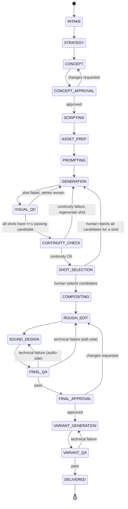
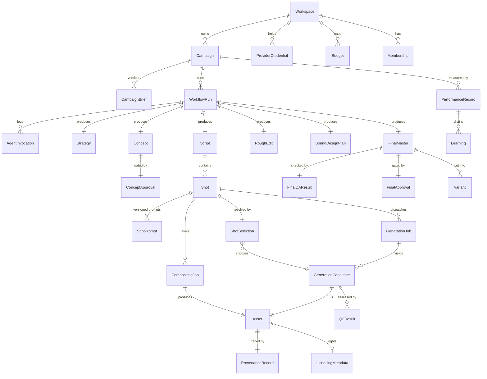

# Combat Creative OS — Architecture Proposal

Status: **DRAFT — awaiting approval**
Owner: Principal Architecture (this document)
Scope: System design only. No application code has been written. Nothing in this
document has been scaffolded yet.

---

## 0. Guiding constraints (restated, because they drive every decision below)

1. This is an **orchestrator + specialist agents** system, not a single autonomous
   "make an ad" agent, and not a free-form multi-agent chat. See
   [ADR-0001](./adr/0001-specialist-workflows-over-freeform-chat.md).
2. Every workflow transition is validated. Every agent output is schema-validated
   before it is trusted by anything downstream.
3. Three human approval gates are **structurally unbypassable**: concept approval,
   shot selection, final-master approval. "Unbypassable" is a workflow-engine
   guarantee (the workflow cannot progress past the gate without a recorded,
   authorized signal), not a UI convention.
4. Everything that costs money or calls a third party is metered, idempotent,
   retried with backoff, capped by budget, and observable.
5. Local development must work with **zero paid API keys** via mock providers that
   implement the exact same interfaces as production providers.

---

## 1. Monorepo package structure

Tooling: **pnpm workspaces + Turborepo** for task graph/caching. Turborepo is chosen
over Nx for lower configuration overhead given a moderate package count and because
the team's stated stack (Next.js, Vitest, Playwright) is Turborepo's home turf. This
is a low-risk, reversible choice — noted here, not treated as unresolved.

```
combat-creative-os/
├── apps/
│   ├── dashboard/            # Next.js frontend only: brief intake UI, approval-
│   │                         # gate UI, review queues, run inspector. Thin
│   │                         # server-rendering/session glue at most — no
│   │                         # business logic, no Temporal client, no direct DB
│   │                         # writes. Every command/query goes through apps/api.
│   ├── api/                   # Authenticated control-plane API (REST). Owns RBAC
│   │                         # enforcement, campaign CRUD, the three approval-gate
│   │                         # endpoints (the only path that signals Temporal on a
│   │                         # human's behalf), provider-credential and budget
│   │                         # management, and read queries backing the dashboard.
│   │                         # See §2.1 for why this is a separate app.
│   ├── webhook-receiver/     # Small Fastify service that verifies provider
│   │                         # webhook signatures and turns them into Temporal
│   │                         # signals via packages/workflow-client. Kept separate
│   │                         # from apps/api because its trust model is signature
│   │                         # verification, not user sessions/RBAC.
│   └── worker/               # Temporal worker process(es): hosts workflow
│                             # definitions + activity implementations
│
├── packages/
│   ├── domain/                # Zod schemas for every contract in the system:
│   │                          # CampaignBrief, agent I/O, workflow events, DTOs.
│   │                          # The single source of truth for "shape of data."
│   ├── db/                    # Prisma schema, migrations, generated client,
│   │                          # repository layer (no raw Prisma calls outside this pkg)
│   ├── workflows/              # Temporal workflow definitions only. Pure,
│   │                          # deterministic, no I/O, no fetch, no Date.now().
│   ├── activities/             # Temporal activity implementations. All I/O lives
│   │                          # here: DB writes, provider calls, ffmpeg, agent calls.
│   ├── workflow-client/         # Typed Temporal client wrapper (signal/query
│   │                          # helpers) shared by apps/api and apps/webhook-
│   │                          # receiver, so both authenticate differently but
│   │                          # dispatch through one typed, tested path.
│   ├── agent-runtime/           # IMPLEMENTED (ADR-0003, 2026-07-24). Shared harness:
│   │                          # AgentDefinition/executeAgent, prompt versioning,
│   │                          # schema-validated structured output via strict tool
│   │                          # use, one corrective re-prompt on schema failure,
│   │                          # cost/hash/latency accounting, redacted logging.
│   │                          # Every specialist agent is built on top of this.
│   ├── agents/                 # IMPLEMENTED (ADR-0003) for 11 of 14 agents; the
│   │                          # other 3 are typed NOT_IMPLEMENTED placeholders.
│   │   ├── campaign-strategist/
│   │   ├── creative-director/
│   │   ├── script-timing-director/         # displayName "Script Director"
│   │   ├── asset-manager/                  # placeholder — see ADR-0003
│   │   ├── shot-prompt-engineer/
│   │   ├── video-generation-coordinator/   # placeholder — see ADR-0003
│   │   ├── visual-quality-controller/      # displayName "Visual QA Controller"
│   │   ├── continuity-controller/
│   │   ├── motion-compositing-coordinator/ # placeholder — see ADR-0003
│   │   ├── edit-director/
│   │   ├── sound-director/
│   │   ├── final-qa-controller/
│   │   ├── variant-generator/
│   │   └── performance-analyst/
│   │       # Each folder: schema.ts (Zod input/result), prompts/v1.ts (versioned
│   │       # PromptTemplate), agent.ts (the AgentDefinition). No agent imports
│   │       # another agent — see ADR-0001. Not yet called from any Temporal
│   │       # workflow/Activity — that wiring is separate, later-milestone work.
│   │
│   ├── providers/
│   │   ├── video-gen/          # VideoGenerationProvider interface + gemini-veo,
│   │   │                       # runway, mock implementations
│   │   ├── design/              # DesignProvider interface + figma, mock
│   │   ├── motion-graphics/     # MotionGraphicsProvider interface + aerender, mock
│   │   ├── review/               # ReviewProvider (Frame.io-compatible) + mock
│   │   ├── reasoning/             # IMPLEMENTED (ADR-0003): ReasoningProvider interface,
│   │   │                       # MockReasoningProvider (default), ClaudeReasoningProvider
│   │   │                       # (real @anthropic-ai/sdk adapter, strict tool-use structured
│   │   │                       # output, gated behind ANTHROPIC_API_KEY via @combat/config)
│   │   └── storage/                # S3-compatible client (MinIO/S3), presigned URLs
│   │
│   ├── media/                  # FFmpeg wrapper: probe, thumbnail, proxy, assemble,
│   │                           # concat, loudness/technical checks
│   ├── observability/           # OTel SDK setup, structured logger (pino), trace
│   │                           # helpers, shared across every app/package
│   ├── auth/                    # RBAC model, permission checks, session helpers
│   ├── config/                  # Zod-validated env schema + per-environment loader
│   └── testing/                  # Shared fixtures, mock-provider factories, Temporal
│                                # TestWorkflowEnvironment helpers
│
├── infra/
│   ├── docker-compose.yml        # Postgres, MinIO, Temporal (server + UI), Jaeger
│   ├── docker-compose.prod.yml   # Prod-shaped compose for staging; real prod
│   │                             # hosting (incl. Temporal Cloud vs. self-hosted)
│   │                             # is an open question — see §7.2
│   └── temporal/                 # Namespace registration, dynamicconfig overrides
│
├── docs/
│   ├── architecture.md           # this file
│   └── adr/
│
├── .env.example
├── pnpm-workspace.yaml
├── turbo.json
└── package.json
```

**Dependency direction rule** (enforced later via lint/dependency-cruiser):
`workflows` → may depend on `domain` only (types/schemas), never on `activities`,
`providers`, or `agents` directly — Temporal workflow code must stay side-effect-free
and deterministic. `activities` orchestrates `agents`, `providers`, `media`, `db`.
`agents` depends on `agent-runtime` + `domain`, never on `db` or `providers` directly
(an agent's job is reasoning over inputs it's given, not fetching its own data).
`apps/dashboard` depends only on `apps/api`'s HTTP contract (typed via
`packages/domain`) — it may not import `packages/db`, `packages/workflow-client`,
or any provider package directly. This is what makes "UI visibility is not
authorization" (§2.2) a structural fact rather than a convention.

---

## 2. Service boundaries

These are the runtime deployables, distinct from the source packages above.

| Service                 | Responsibility                                                                                                                            | Talks to                                                                                                           |
| ----------------------- | ----------------------------------------------------------------------------------------------------------------------------------------- | ------------------------------------------------------------------------------------------------------------------ |
| **dashboard** (Next.js) | Human UI only: brief intake, all 3 approval-gate UIs, run inspector, RBAC-gated admin views                                               | `apps/api` over HTTP only — no DB access, no Temporal client, no provider calls                                    |
| **api**                 | Authenticated control-plane: RBAC enforcement, campaign CRUD, approval-gate commands, provider-credential/budget management, read queries | DB (read/write), Temporal client (signal/query) via `packages/workflow-client`, never calls provider APIs directly |
| **webhook-receiver**    | Verifies inbound provider webhooks (video-gen completion, review comments), converts to Temporal signals                                  | Temporal client (signal only, restricted signal set — see §2.1), audit log write                                   |
| **worker**              | Hosts all Temporal workflows + activities; the only process that calls providers, agents, and ffmpeg                                      | DB, S3/MinIO, Claude API, video-gen/design/motion/review providers, Temporal server                                |
| **temporal-server**     | Durable execution engine                                                                                                                  | Postgres (its own schema), workers                                                                                 |
| **postgres**            | System of record: campaigns, workflow metadata mirror, assets, approvals, audit trail, agent invocations, all workspace-scoped            | worker, api                                                                                                        |
| **MinIO / S3**          | All binary assets                                                                                                                         | worker (write), api (issues presigned URLs to dashboard)                                                           |

**Hard boundary:** Temporal workflow code never performs network I/O. All provider
and agent calls happen inside Activities. This is what keeps workflows replayable
and is non-negotiable for Temporal correctness, not just a style preference.

**Agent isolation boundary:** an agent's `run()` is a pure-ish function of
`(validated input) → (validated output)` plus one Claude API call. Agents cannot
invoke other agents and cannot read/write the database. Only Activities sequence
agents and persist their output. This is the mechanism that makes "no free-form
multi-agent chat" true in code, not just in intent.

### 2.1 Why `apps/api` is separate from `apps/dashboard`

Resolved per review: **a separate `apps/api` service is required**, not Next.js
route handlers inside `dashboard`. Reasoning, for the record:

- Workflow commands (the three approval signals), provider operations, and budget
  management are the most sensitive mutation paths in the system. Coupling their
  authorization logic to a UI framework's route-handler conventions makes it easy
  for a future dashboard redesign to accidentally change or bypass enforcement.
  A standalone API keeps RBAC enforcement in one place, testable independent of
  any frontend.
- Future external clients (a CLI, a CI-triggered campaign run, a future mobile
  reviewer app) need the same control-plane surface without depending on Next.js.
- It keeps the "who can hold a Temporal client" set small and explicit:
  `apps/api` and `apps/webhook-receiver` only, via `packages/workflow-client`.
  `apps/dashboard` is structurally incapable of signaling a workflow directly,
  which is one more layer behind "approval cannot be bypassed" (§2.2, §3.3).
- `apps/webhook-receiver` remains a distinct service from `apps/api` rather than
  merging into it, because its trust model is fundamentally different
  (signature-verified anonymous inbound traffic vs. authenticated user sessions).
  Both share the same typed signal/query dispatch (`packages/workflow-client`) so
  the Temporal integration itself isn't duplicated — only the authentication layer
  in front of it differs.

### 2.2 Access control model (RBAC)

Five roles, fixed for the initial build (`packages/auth` + `packages/domain`):

| Role                  | Scope                                                                                                       |
| --------------------- | ----------------------------------------------------------------------------------------------------------- |
| `OWNER_ADMIN`         | Workspace configuration, provider-credential management, budget configuration, and all three approval gates |
| `CREATIVE_DIRECTOR`   | Strategy/concept review, concept approval, final-master approval                                            |
| `PRODUCTION_OPERATOR` | Generation dispatch, asset management, render/compositing operations                                        |
| `REVIEWER`            | Candidate feedback, shot selection                                                                          |
| `ANALYST`             | Read-only performance and reporting access                                                                  |

Permission matrix (illustrative — enforced as an explicit table in
`packages/auth`, not inferred from role names at call sites):

| Action                           | OWNER_ADMIN | CREATIVE_DIRECTOR | PRODUCTION_OPERATOR | REVIEWER | ANALYST |
| -------------------------------- | :---------: | :---------------: | :-----------------: | :------: | :-----: |
| Configure providers/credentials  |      ✓      |                   |                     |          |         |
| Manage budgets                   |      ✓      |                   |                     |          |         |
| Approve concept                  |      ✓      |         ✓         |                     |          |         |
| Approve final master             |      ✓      |         ✓         |                     |          |         |
| Select shots / candidates        |      ✓      |                   |                     |    ✓     |         |
| Provide candidate feedback       |      ✓      |         ✓         |                     |    ✓     |         |
| Trigger generation / render jobs |      ✓      |                   |          ✓          |          |         |
| Manage assets                    |      ✓      |                   |          ✓          |          |         |
| View performance / reporting     |      ✓      |         ✓         |          ✓          |    ✓     |    ✓    |
| Manage workspace membership      |      ✓      |                   |                     |          |         |

**M4 addition (2026-07-25):** `MANAGE_CAMPAIGNS` (create campaign, save/submit
a brief, start the production workflow) — not in this illustrative matrix,
which predates campaign intake. Granted to `OWNER_ADMIN` and
`CREATIVE_DIRECTOR`. See §8's M4 entry and `packages/domain/src/roles.ts`.

**Governing principle:** every permission check happens in `apps/api` (and, for
inbound provider events, in `apps/webhook-receiver`'s narrow signal allowlist)
before a command is accepted. `apps/dashboard` may hide controls a role can't use,
but that is a UX convenience only — hiding a button is not, and never substitutes
for, the server-side check. An unauthorized request to `apps/api` is rejected
regardless of what the UI would have allowed.

---

## 3. Workflow state machine

> **Note (domain-model milestone, see §7.1 item 8 and
> `docs/adr/0002-campaign-lifecycle-alignment.md`):** the diagram below is the
> original illustrative design and is retained for historical context only.
> The canonical, implemented state machine is the 20-stage lifecycle in
> `docs/domain-model.md` §4 and `packages/domain/src/workflow/transition-rules.ts`.
> An interim revision of this work briefly implemented a 17-stage machine that
> folded performance analysis into the linear campaign pipeline — this was
> identified as a deviation from the decision below (§7.1 item 8) and
> corrected; see ADR-0002 for the full account.

### 3.1 Top-level stages



`PERFORMANCE_ANALYSIS` is intentionally **not** a stage in this diagram — it is a
separate, independently-triggered workflow (`PerformanceAnalysisWorkflow`) that
starts on a schedule or an external event (ad-platform metrics available) after
`DELIVERED`, and writes to a `Learning` store that future `STRATEGY`/`CONCEPT`
stages read as context. Coupling it into the linear pipeline would force the
production workflow to stay "open" for weeks waiting on ad performance, which is
the wrong lifetime for a durable execution that's meant to complete.

### 3.2 Temporal workflow decomposition

- **`CampaignProductionWorkflow`** (parent, one per production run): drives the
  linear stage sequence above via Activities, awaits the three approval gates via
  **Signals**, exposes current state via **Queries**.
- **`ShotGenerationWorkflow`** (child; M6, done — one instance per PROMPTING/
  SHOT_GENERATION visit, covering every shot in that visit via bounded
  parallel `Promise.all` batches internally, not one workflow instance per
  shot as this bullet originally sketched — see §8's M6 entry for why):
  dispatches each shot's generation, polls to a terminal state via `sleep`,
  retries a poll-time failure up to a bounded attempt count before
  escalating that shot, and reports per-shot results back to the parent.
  Visual QC is not yet part of this loop (M7); today's retry loop covers
  only the provider-dispatch/poll `GENERATION` half. This isolates the only
  truly unbounded-iteration part of the pipeline into a child workflow with
  its own bounded retry policy, so the parent stays simple and linear.
- **`CompositingWorkflow`** (child, one per shot needing motion graphics, parallel):
  owns the After Effects/aerender + Figma asset dispatch and polling.
- **`PerformanceAnalysisWorkflow`** (separate top-level workflow, decoupled as above).

### 3.3 Signals, queries, retry/escalation policy

These signals are dispatched exclusively by `apps/api`, after RBAC and workflow-
state validation (§2.1, §2.2). `apps/dashboard` holds no Temporal client and
cannot call these directly — a rejected approval never leaves the browser as
anything more than an HTTP request that `apps/api` can refuse. `apps/webhook-
receiver` is restricted to a narrow, non-approval signal set (generation/render
job completion) driven by verified provider webhooks; it cannot dispatch
`approveConcept`, `selectShots`, or `approveFinal` under any circumstance. This is
the concrete backend enforcement behind "human approval cannot be bypassed."

Signals on `CampaignProductionWorkflow`:
`approveConcept(decision, comments, userId)`,
`selectShots(selections[], userId)`,
`approveFinal(decision, comments, userId)`,
`cancelCampaign(reason, userId)`.

Queries: `getCurrentStage()`, `getStageHistory()`, `getPendingApprovals()`,
`getBudgetStatus()`.

Retry/escalation policy (applies inside `ShotGenerationWorkflow` and analogous
loops):

- Each stage-level Activity uses Temporal's built-in retry policy
  (exponential backoff, capped attempts, non-retryable-error allowlist for things
  like schema validation failures that won't fix themselves on retry).
- Each **shot** gets a bounded number of generation attempts (config, default 3)
  before it's marked `NEEDS_HUMAN` and surfaced at the Shot Selection gate instead
  of silently retrying forever.
- Every regeneration attempt is gated by a **budget check** activity that
  evaluates all four applicable levels — workspace, campaign, shot, and provider
  (see the `Budget`/`BudgetLedger` entities in §4.3) — and reserves against the
  tightest one before dispatch. If any level is exhausted, the shot is marked
  `BUDGET_EXCEEDED` and escalated to a human rather than failing silently or
  overspending.
- Visual QC and Continuity failures return **structured revision feedback**
  (`RevisionFeedback` schema — see §6), which determines whether the next attempt
  re-runs the same prompt, asks the Shot Prompt Engineer to revise it, or escalates.
  This routing decision is explicit workflow logic, not a free-form agent judgment
  call, so it stays auditable and testable.

### 3.4 Per-entity status enums (illustrative, defined fully in `packages/domain`)

- `WorkflowRunStatus`: `RUNNING | AWAITING_APPROVAL | FAILED | CANCELLED | COMPLETED`
- `ShotStatus`: `PENDING | GENERATING | QC_REVIEW | NEEDS_HUMAN | BUDGET_EXCEEDED | SELECTED | REJECTED`
- `ApprovalGateStatus`: `PENDING | APPROVED | CHANGES_REQUESTED | REJECTED`
- `GenerationJobStatus` (implemented M6 as `JobStatus`/`ShotGenerationAttemptStatus`): `QUEUED | SUBMITTED | POLLING | SUCCEEDED | FAILED | TIMED_OUT | CANCELLED`

---

## 4. Database entities and relationships

PostgreSQL via Prisma. This is the system of record for everything except the
binary assets themselves (which live in object storage) and the transient
execution state of workflows (which lives in Temporal — Postgres holds a
queryable **mirror**, not the source of truth, for workflow status).

### 4.1 Core entity list

**Tenancy & identity:** `Workspace`, `User`, `Role`, `Membership` (user↔workspace↔role,
fixed to the five roles in §2.2). `Workspace` is the tenancy root — see §4.4.

**Campaign intake:** `Campaign`, `CampaignBrief` (versioned, immutable once accepted
into a run)

**Execution:** `WorkflowRun` (mirrors Temporal execution), `AgentInvocation`
(every specialist agent call: input, output, prompt version, model, tokens, cost,
latency, status), `AuditLogEntry` (append-only, every state transition/approval/
override)

**Creative artifacts:** `Strategy`, `Concept`, `ConceptApproval`, `Script`, `Shot`,
`ShotPrompt` (versioned per shot per provider)

**Generation:** `GenerationJob`, `GenerationCandidate`, `QCResult`,
`ContinuityCheck`, `ShotSelection`

**Post-production:** `CompositingJob`, `RoughEdit`, `SoundDesignPlan`,
`FinalMaster`, `FinalQAResult`, `FinalApproval`, `Variant`

**Assets & provenance:** `Asset` (polymorphic binary artifact), `ProvenanceRecord`,
`LicensingMetadata`, `Prompt` (agent system-prompt versions, distinct from
`ShotPrompt`)

**Governance:** `ProviderCredential` (workspace-scoped, encrypted at rest),
`Budget` (scoped via `level: WORKSPACE | CAMPAIGN | SHOT | PROVIDER` + `scopeId`),
`BudgetLedger` (append-only; every row is a `RESERVATION`, `CHARGE`, or `RELEASE`)

**Learning loop:** `PerformanceRecord`, `Learning`

### 4.2 Key relationships (ER diagram, primary path only)



### 4.3 Notes on the harder entities

- **`Asset`** is polymorphic and append-only: video candidates, thumbnails,
  proxies, motion-graphics renders, sound stems, and final masters are all rows
  here, distinguished by `kind`. Every `Asset` has an `s3Key`, `checksum`,
  `createdByAgentInvocationId | uploadedByUserId`, and a required
  `ProvenanceRecord` — this is what makes "asset provenance" and "no untrusted
  generated media" enforceable rather than aspirational.
- **`ProvenanceRecord`** is kept separate from `Asset` (rather than inlined)
  because provenance chains can be multi-hop (a `Variant` derived from a
  `FinalMaster` derived from a `RoughEdit` composed of several
  `GenerationCandidate`s) — it's a small append-only edge table
  (`assetId, derivedFromAssetId[], producedByInvocationId, providerJobRef`).
- **`LicensingMetadata`** is `0..1` on `Asset` deliberately — internally generated
  intermediate assets (proxies, thumbnails) don't need it; anything that could ship
  in a final ad does, and Final QA checks for its presence before allowing
  `FINAL_APPROVAL` to be requested.
- **`Budget`** and **`BudgetLedger`** are separate: `Budget` rows are configured
  caps at each of the four required levels (workspace, campaign, shot, provider —
  a shot can have its own cap independent of the campaign's, and a provider can
  have a workspace-wide cap independent of any single campaign). `BudgetLedger` is
  the append-only spend log every `GenerationJob` writes to before and after
  dispatch: a `RESERVATION` row is written synchronously before submission (under
  a `SELECT ... FOR UPDATE` / Postgres advisory lock keyed by the tightest
  applicable scope, so two parallel shots can't both pass a stale check), and
  either a `CHARGE` (on confirmed provider cost) or a `RELEASE` (on failure/
  cancellation) closes it out. No budget row is ever mutated in place — the ledger
  is the source of truth for "what has actually been spent or committed," and a
  `Budget`'s remaining amount is always a computed aggregate over it.

### 4.4 Tenancy scoping

Every entity that isn't purely global reference data (e.g. `Role`) carries a
`workspaceId` — directly on `Campaign`, `Asset`, `ProviderCredential`, `Budget`,
`BudgetLedger`, every approval record (`ConceptApproval`, `ShotSelection`,
`FinalApproval`), and `AuditLogEntry`, and transitively (via `Campaign`/`WorkflowRun`)
on everything else. `packages/db`'s repository layer takes `workspaceId` as a
mandatory first argument on every query and write — there is no code path that
reads or writes these tables without a workspace filter, so cross-workspace access
is a repository-layer bug class that unit tests can exhaustively cover (§8, M1),
not something each call site has to remember to check.

The initial deployment runs as a **single-workspace MVP**: exactly one `Workspace`
row is seeded, and there is no workspace-switching UI, workspace self-service
signup, or billing. The isolation is built now because retrofitting a
`workspaceId` onto ~15 tables and every repository method later is expensive;
turning on a second workspace later is not, because the schema and query layer
already require it.

---

## 5. Provider interfaces

All interfaces live in `packages/providers/*`, each with a `mock` implementation
used by default in local/test environments and selected via `packages/config`.
Every provider call is wrapped by the calling Activity with an **idempotency key**
derived from `(workflowRunId, stage, entityId, attempt)` so Temporal retries or
workflow replays never double-submit paid work.

Provider-specific status, resolved per review:

- **Video generation** (Veo, Runway): both remain mock-only through the milestones
  in §8. Veo is the preferred future provider for hero footage; Runway is the
  preferred future provider for alternative takes/shot repair (regenerating a
  single failed shot without re-running the whole set). Neither is connected with
  real credentials, and no real spend happens, until explicitly decided later —
  the interface and both adapter stubs are built now so that decision doesn't
  block anything else. Extended in M6 — see §8's M6 entry for the full
  accounting; `video-generation-profiles.ts` documents illustrative Veo/Runway
  capability shapes, not real adapters.
- **Motion graphics** (After Effects): `aerender` is **not** run inside Docker or
  any container in this architecture. It is treated as an external Windows render
  worker reachable only through `MotionGraphicsProvider` — a job-submission
  interface (submit → poll/webhook → fetch output), the same shape as the video-gen
  providers. Only the interface and a deterministic mock are built in the initial
  milestones; the real worker (a Windows machine or fleet polling a job queue, or
  invoked via a small agent process on that machine) is implemented later behind
  the unchanged interface.
- **Review** (Frame.io-compatible): the interface is provider-neutral by
  construction (`ReviewProvider`, below). A complete deterministic mock is built
  first and is sufficient for all local development — Frame.io is never a hard
  dependency for running the system locally. The real Frame.io integration is
  added only after the Shot Selection / review workflow passes end-to-end against
  the mock.

```ts
// providers/video-generation — the real M6 interface (packages/providers/src/video-generation.ts)
interface VideoGenerationProvider {
  readonly name: string;
  getCapabilities(): VideoGenerationCapabilities; // supported modes, aspect ratios, duration range, reference-image/video support, seed/negative-prompt support, max candidates

  submit(input: {
    idempotencyKey: string;
    shotId: string;
    mode: 'TEXT_TO_VIDEO' | 'IMAGE_TO_VIDEO';
    promptText: string;
    negativePrompt?: string;
    referenceImages?: readonly { assetId: string; weight?: number }[];
    referenceVideo?: { description: string; styleNotes?: string; sourceAssetId?: string }; // metadata only — never uploaded bytes
    candidateCount: number;
    params: VideoGenerationParams; // durationSeconds, aspectRatio, resolution?, frameRate?, seed?, negativePrompt?, providerOptions?
  }): Promise<GenerationJobHandle>;

  getStatus(handle: GenerationJobHandle): Promise<JobStatus>; // QUEUED|SUBMITTED|POLLING|SUCCEEDED|FAILED|TIMED_OUT|CANCELLED
  getFailure(handle: GenerationJobHandle): Promise<VideoGenerationFailure | null>; // non-null only once terminal-failed
  fetchResult(handle: GenerationJobHandle): Promise<GeneratedCandidateRef[]>;
  getUsage(handle: GenerationJobHandle): Promise<VideoGenerationUsage>; // costCents, currency, computeUnits
  cancel(handle: GenerationJobHandle): Promise<void>;
  // Providers may deliver results via webhook instead of polling in a future
  // real adapter; the mock and every M6 Activity are polling-based only.
}

interface DesignProvider {
  // Figma
  fetchNode(fileKey: string, nodeId: string): Promise<DesignAssetRef>;
  exportAsset(fileKey: string, nodeId: string, format: ExportFormat): Promise<AssetRef>;
}

interface MotionGraphicsProvider {
  // After Effects / aerender
  submitRenderJob(input: {
    idempotencyKey: string;
    template: string;
    dataBindings: Record<string, unknown>;
  }): Promise<RenderJobHandle>;
  getRenderStatus(handle: RenderJobHandle): Promise<RenderJobStatus>;
  fetchRenderOutput(handle: RenderJobHandle): Promise<AssetRef>;
}

interface ReviewProvider {
  // Frame.io-compatible
  createReviewAsset(asset: AssetRef, context: ReviewContext): Promise<ReviewAssetRef>;
  postComment(reviewAssetId: string, comment: ReviewComment): Promise<void>;
  getApprovalStatus(reviewAssetId: string): Promise<ReviewStatus>;
  generateShareLink(reviewAssetId: string): Promise<string>;
}

interface StorageProvider {
  // S3-compatible (MinIO / S3). Extended in M5 — see §7.1's M5 entry for the
  // full accounting, including why `deleteObject` below doesn't reverse the
  // "no lifecycle delete" principle this comment originally stated.
  putObject(input: PutObjectInput): Promise<{ s3Key: string; checksum: string }>;
  getObject(s3Key: string): Promise<GetObjectResult>;
  objectExists(s3Key: string): Promise<boolean>;
  headObject(s3Key: string): Promise<ObjectMetadata>;
  getPresignedUploadUrl(s3Key: string, input: PresignedUploadInput): Promise<string>;
  getPresignedUrl(s3Key: string, expirySeconds: number): Promise<string>;
  copyObject(src: string, dest: string): Promise<void>;
  // Explicitly-authorized-only — requires an {authorizedBy, reason} pair,
  // never a bare zero-argument delete, and nothing in the application code
  // this document describes calls it. Deletion-by-default is still via
  // lifecycle policy, not this method.
  deleteObject(s3Key: string, authorization: DeleteAuthorization): Promise<void>;
}

interface ReasoningProvider {
  // Claude API, used by agent-runtime
  invoke(input: {
    idempotencyKey: string;
    promptVersion: string;
    systemPrompt: string;
    messages: ReasoningMessage[]; // supports multimodal (frames/thumbnails) for QC
    responseSchema: ZodSchema;
  }): Promise<{ raw: unknown; validated: unknown; modelMeta: ModelMeta }>;
}
```

`FfmpegService` in `packages/media` is not a "provider" in the third-party sense
(no external account/API key) but follows the same shape: `probe(asset)`,
`thumbnail(asset, t)`, `proxy(asset, profile)`, `assemble(timeline)`,
`encode(asset, profile)` — deterministic, local, still wrapped with structured
logging and idempotent output paths (content-addressed by input hash + profile).

---

## 6. Agent input/output contracts

Every specialist agent is built on a common envelope from `agent-runtime`, so
validation, versioning, and audit logging are handled once, not per-agent.

```ts
interface AgentInput<T> {
  invocationId: string; // uuid, generated by the calling Activity
  workflowRunId: string;
  stage: WorkflowStage;
  promptVersion: string; // pins the exact system prompt used
  input: T; // validated against the agent's Zod input schema
  context: {
    campaignId: string;
    priorArtifactRefs: ArtifactRef[]; // references, not inlined blobs — agents
    // fetch what they need via Activity-provided
    // resolved data, keeping payloads bounded
    budgetRemaining: Money;
    relevantLearnings?: Learning[]; // from Performance Analyst, strategy/concept only
  };
}

interface AgentOutput<T> {
  invocationId: string;
  output: T; // validated against the agent's Zod output schema
  rationale?: string; // free-text explanation, never trusted structurally
  modelMeta: { model: string; tokensIn: number; tokensOut: number; latencyMs: number };
  validationStatus: 'VALID' | 'SCHEMA_INVALID' | 'NEEDS_HUMAN_REVIEW';
}
```

`validationStatus` is set by `agent-runtime`, not by the agent itself — the harness
parses the model response against the Zod schema; on failure it retries once with a
corrective re-prompt (schema errors appended), and if that still fails it returns
`SCHEMA_INVALID` and the calling Activity fails the stage rather than passing
malformed data downstream. This is the concrete mechanism behind "generated text
and UI cannot be trusted without validation."

**Implemented (ADR-0003, 2026-07-24).** The real envelope lives in
`packages/domain/src/agent-envelope.ts` (`AgentInput<T>`/`AgentOutput<T>`,
plus an additive optional `attachments?: AgentInputAttachment[]` field for
multimodal frame/thumbnail assessment) and the real harness in
`packages/agent-runtime/src/execute-agent.ts` (`executeAgent`, returning an
`AgentRun<TResult>` — a superset of the illustrative `AgentOutput<T>` above
that also carries `inputHash`/`outputHash`/`cost`/`evaluation`). The
structured-output mechanism is Claude strict tool use (`tool_choice` forced
to a single schema-derived tool, `strict: true`), not a JSON-mode "hope for
the best" prompt — see `packages/agent-runtime/src/json-schema.ts` and
`packages/providers/src/reasoning.claude.ts`. See `packages/agents/README.md`
for what's implemented versus what's still orchestrator-wiring work.

**Activity boundary implemented (ADR-0004, 2026-07-24).**
`createExecuteSpecialistAgentActivity` (`packages/workflows/src/activities/
execute-specialist-agent-activity.ts`) is the Temporal Activity that calls
`executeAgent`: it resolves an agent through an injected registry, verifies
campaign ownership/stage, checks budget at the WORKSPACE/CAMPAIGN/PROVIDER
levels, and persists every terminal outcome as an `AgentInvocation` row
(§4.1). No `CampaignProductionWorkflow` calls it yet — that remains M3/M4's
sequencing work.

### 6.1 Representative per-agent schemas (field-level, not full Zod)

| Agent                          | Input (beyond envelope)                                            | Output                                                                                |
| ------------------------------ | ------------------------------------------------------------------ | ------------------------------------------------------------------------------------- |
| Campaign Strategist            | `CampaignBrief`, relevant `Learning[]`                             | `Strategy { positioning, targetAudience, keyMessages[], toneGuidelines }`             |
| Creative Director              | `Strategy`                                                         | `Concept { logline, visualDirection, narrativeArc, referenceNotes }`                  |
| Script & Timing Director       | `Concept`, target durations `[15,10,6]`                            | `Script { lines[] }`, `Shot[] { index, description, durationFrames, dependencies }`   |
| Asset Manager                  | `Shot[]`, brand asset library refs                                 | `AssetManifest { shotId → requiredAssets[], licensingFlags[] }`                       |
| Shot Prompt Engineer           | `Shot`, provider target, prior `RevisionFeedback?`                 | `ShotPrompt { providerId, promptText, negativePrompt?, params, version }`             |
| Video Generation Coordinator   | `ShotPrompt[]`, candidate count, budget                            | `GenerationJob[]` dispatch plan (this agent plans dispatch; the Activity executes it) |
| Visual Quality Controller      | `GenerationCandidate` (frames/thumbnails, multimodal), `Shot` spec | `QCResult { pass, scores{}, findings[], revisionFeedback? }`                          |
| Continuity Controller          | All `GenerationCandidate`s selected-so-far for a `Script`          | `ContinuityCheck { pass, conflicts[] { shotIds[], issue } }`                          |
| Motion-Compositing Coordinator | `Shot`, `SelectedCandidate`, brand template refs (Figma)           | `CompositingPlan { aeTemplate, dataBindings, figmaOverlays[] }`                       |
| Edit Director                  | Selected shots + compositing outputs, `Script` timing              | `RoughEditPlan { timeline[] }`                                                        |
| Sound Director                 | `RoughEditPlan`, brand audio guidelines                            | `SoundDesignPlan { musicBrief, sfxCues[], mixNotes }`                                 |
| Final QA Controller            | `FinalMaster` technical probe (ffmpeg) + visual (multimodal)       | `FinalQAResult { pass, technicalFindings[], visualFindings[] }`                       |
| Variant Generator              | `FinalMaster`, target duration                                     | `VariantPlan { cutPoints[], duration }`                                               |
| Performance Analyst            | `PerformanceRecord[]` for a campaign                               | `Learning[] { insight, appliesTo: "strategy"\|"concept"\|"prompting", tags[] }`       |

`RevisionFeedback` (shared shape, returned by QC/Continuity on failure and consumed
by Shot Prompt Engineer or the workflow's retry router):
`{ shotId, severity, category: "prompt"|"generation"|"continuity"|"technical", description, suggestedAction }`.

**Implemented schemas (ADR-0003).** `packages/agents/src/*/schema.ts` implements
this table's shape for the eleven built agents, field-for-field consistent
with the domain entities each stage eventually persists (`CreativeConcept`,
`Script`/`Shot`, `ShotSpecification` (M6 — supersedes the table's illustrative
`ShotPrompt`/the earlier, thinner `GenerationPrompt`; Shot Prompt Engineer's
real output is the fuller cinematographic-field-set shape §8's M6 entry
describes, not the table row above), `QualityAssessment`/`QualityFailure`,
`Timeline`/`TimelineEntry`, `SoundCue`, `CreativeVariant`) but scoped to
_content only_ — no `id`/`workspaceId`/foreign keys, which a future Activity
assigns at persistence time (agents don't write to the database).
`RevisionFeedback` above is `packages/agents/src/shared/quality-finding.ts`'s
`QualityFindingSchema`, reusing `@combat/domain`'s `QualityFailureCategory`/
`QualityFailureSeverity` enums. `Learning` is not yet a persisted
`@combat/domain` entity — Performance Analyst's `LearningSchema` is defined
locally in `packages/agents/src/performance-analyst/schema.ts` pending a
database milestone that promotes it into a real table. The three
placeholder agents (Asset Manager, Video Generation Coordinator,
Motion-Compositing Coordinator) each still get this table's contract
preserved in their own `schema.ts`, unimplemented — see ADR-0003.

---

## 7. Risk register

### 7.1 Resolved defaults (decided 2026-07-23, binding for scaffolding)

These were open questions in the original proposal and are now settled. They are
defaults, not permanent constraints — revisiting any of them later is a normal
architecture change, not a correction of this document.

0. **Naming, scaffolded 2026-07-23.** `apps/orchestrator-worker` was renamed
   to `apps/worker` and `packages/db` to `packages/database` to match the
   scaffolding request. `apps/webhook-receiver` and `packages/{auth,media}`
   are still deferred (not yet scaffolded) — they have no purpose until real
   provider integrations exist and (for `auth`) until real session/token
   verification is decided. `packages/workflow-client` remains deferred too,
   but no longer for lack of a consumer: `apps/api` now has endpoints beyond
   `/health` (the three approval routes, §7.1 item 11) that signal
   `CampaignProductionWorkflow` directly against `@combat/workflows`'s signal
   definitions plus a small endpoint-local Temporal client wrapper, rather
   than through an extracted shared package — see item 11's own note on why.
   `packages/agent-runtime` was scaffolded and implemented on 2026-07-24
   (ADR-0003), ahead of this item's original "deferred" call, once the
   specialist-agent execution framework was explicitly requested — see item
   9 below. `packages/activities` was folded into
   `packages/workflows/src/activities` for this milestone rather than split
   into its own package, since only one example activity exists so far; it
   can be split out once real activities justify the separation.
1. **Video-gen provider priority.** Both Veo and Runway stay mock-only through
   the milestone plan (§8). Veo is the preferred future provider for hero
   footage; Runway is the preferred future provider for alternative-take/shot-
   repair generation. No real credentials are connected and no money is spent
   through either until a later, explicit decision. See §5.
2. **After Effects execution environment.** `aerender` is not containerized. It
   is an external Windows render worker addressed only through
   `MotionGraphicsProvider`. Initial milestones build the interface and a
   deterministic mock; the real worker is implemented later behind the same
   interface. See §5.
3. **"Frame.io-compatible" scope.** Provider-neutral `ReviewProvider` interface;
   a complete deterministic mock ships first and is sufficient for all local
   development — Frame.io is never a hard local dependency. The real Frame.io
   integration is added only after the review/shot-selection workflow passes
   end-to-end against the mock. See §5.
4. **RBAC role list.** Fixed at five roles: `OWNER_ADMIN`, `CREATIVE_DIRECTOR`,
   `PRODUCTION_OPERATOR`, `REVIEWER`, `ANALYST`, enforced server-side in
   `apps/api` only — UI visibility is never authorization. See §2.2.
5. **Multi-tenancy.** Workspace isolation is built into the schema and the
   repository query layer from the start (`workspaceId` mandatory everywhere,
   §4.4), with cross-workspace-access tests from M1 onward. The initial
   deployment runs as a single-workspace MVP with no workspace admin UI or
   billing. See §4.4.
6. **Generation budget granularity.** Tracked at all four levels — workspace,
   campaign, shot, provider — via `Budget` + an append-only `BudgetLedger` of
   `RESERVATION` / `CHARGE` / `RELEASE` rows. See §4.1, §4.3.
7. **Control-plane API boundary.** `apps/api` is a separate service from
   `apps/dashboard`, and is the only app (besides the narrowly-scoped
   `apps/webhook-receiver`) that holds a Temporal client or enforces RBAC. See
   §2.1.
8. **Campaign state machine granularity (domain-model milestone, narrows
   §3.1; see `docs/adr/0002-campaign-lifecycle-alignment.md` for the full
   history).** The illustrative §3.1 diagram's coarser stage names are
   superseded by a **20-stage** pipeline (`DRAFT` through `DISTRIBUTED`)
   implemented in `packages/domain/src/workflow` and `packages/database`'s
   transition service — see `docs/domain-model.md` §4 for the full state
   diagram, transition table, and worked examples. This corrects an interim
   revision of this work that had implemented a 17-stage version folding
   `PERFORMANCE_COLLECTION`/`ITERATION_PLANNING` into the linear pipeline —
   that was identified as a direct reversal of this item's own guiding
   principle (below) and was removed; see ADR-0002. The corrected, canonical
   design:
   - **Human gates stay at exactly three**: `CONCEPT_REVIEW -> SCRIPT_REVIEW`
     (gate `CONCEPT`), `HUMAN_SHOT_SELECTION -> COMPOSITING` (gate
     `SHOT_SELECTION`), and `FINAL_APPROVAL -> VARIANT_GENERATION` (gate
     `FINAL`) — matching this document's original three-gate framing exactly.
     `STRATEGY_REVIEW` and `SCRIPT_REVIEW` are checkpoint stages (gated on
     artifact existence, not a `HumanApproval` record) — they do not add a
     fourth/fifth gate.
   - **Performance analysis remains fully decoupled.** `PERFORMANCE_COLLECTION`
     and `ITERATION_PLANNING` are not campaign-production stages; the
     `PerformanceAnalysisWorkflow` design in this section's prose (a separate,
     independently-triggered workflow over completed campaign/distribution
     records) stands as originally decided. `PerformanceMetrics` and related
     entities remain in the schema for that future, separate workflow.
   - **VISUAL_QA/CONTINUITY_QA, SOUND_DESIGN, and VARIANT_GENERATION/VARIANT_QA
     are distinct stages** (not collapsed), each with typed, failure-category-
     driven revision routing for stages with more than one valid repair
     target — see `packages/domain/src/workflow/quality-failure-routing.ts`.
   - The underlying principle (human gates require immutable approval
     records, enforced server-side, structurally unbypassable by
     workflow/activity code) is unchanged throughout both revisions.
     No live migration has been applied in this environment (no Docker, no
     local Postgres) — see `docs/domain-model.md` §8 for what was verified
     without a database connection and what remains to be run.
9. **Specialist-agent execution framework, implemented 2026-07-24
   (ADR-0003) — an explicit milestone-order exception.** `packages/agent-
runtime` (the harness) and eleven of the fourteen `packages/agents`
   specialist agents were implemented ahead of the linear M2/M4/M6/M7/M9/
   M10/M11/M12/M13 order, on direct request. All fourteen canonical agent
   names from §6.1 are preserved unchanged; `asset-manager`,
   `video-generation-coordinator`, and `motion-compositing-coordinator` are
   registered as typed `NOT_IMPLEMENTED` placeholders (disabled by default,
   throw a non-retryable error if invoked) pending the provider/asset/
   compositing milestones §6.1 and §8 already scope them to. No Temporal
   workflow, Activity, or database repository calls any agent yet — that
   remains the relevant milestones' wiring work, not something this change
   did early. See ADR-0003 and `packages/agents/README.md` for the full
   accounting of what's implemented versus what's still pending.
10. **Specialist-agent execution Activity boundary, implemented 2026-07-24
    (ADR-0004) — a continuation of item 9's exception, one layer up.** The
    Temporal Activity that calls `executeAgent` — resolving an agent via the
    canonical registry, verifying campaign ownership/stage, checking budget
    at WORKSPACE/CAMPAIGN/PROVIDER, and persisting every terminal outcome as
    an `AgentInvocation` (§4.1) — is implemented ahead of M3/M4's full
    workflow sequencing. `CampaignProductionWorkflow` still does not exist;
    nothing calls this Activity stage-by-stage yet. See ADR-0004 for the
    idempotency-key design (keyed on the caller-supplied key alone, not a
    Temporal attempt number) and why ownership/stage-mismatch rejections
    throw rather than persist an `AgentInvocation` row.
11. **`CampaignProductionWorkflow` and the three approval endpoints,
    implemented 2026-07-25 (M3) — with three deliberate, documented interim
    narrowings this item records rather than leaving as a silent gap.**
    `packages/workflows/src/workflows/campaign-production-workflow.ts` drives
    `advanceCampaignStageActivity`/`verifyHumanApprovalActivity` through the
    full 20-stage lifecycle; every branching decision (gate routing,
    duplicate/stale-signal rejection, bounded-revision escalation to
    `BLOCKED`) is factored into a pure, Temporal-runtime-free reducer
    (`campaign-production-workflow-state.ts`) so it is unit-testable without
    `TestWorkflowEnvironment` — see item 11a below for why that harness
    itself is out of reach here. `apps/api` gained
    `POST /workspaces/:workspaceId/campaigns/:campaignId/approvals/{concept,shot-selection,final}`,
    each: resolving the caller's role from a persisted `Membership` row and
    checking `roleHasPermission` first; scoping the campaign lookup to
    `workspaceId` (wrong-workspace 404s); persisting an immutable
    `HumanApproval` row _before_ signalling; and signalling
    `CampaignProductionWorkflow`, which independently re-verifies the
    approval rather than trusting the signal payload.
    - **(a) No `TestWorkflowEnvironment` coverage.** Its time-skipping test
      server requires downloading a native binary
      (`packages/testing/src/temporal-test-environment.ts` already flagged
      this as unavailable in this environment — confirmed again this session:
      the download host was unreachable). `campaign-production-workflow.test.ts`
      instead drives the real workflow entrypoint end-to-end by mocking
      `@temporalio/workflow`'s three context-bound calls
      (`proxyActivities`/`setHandler`/`condition`) with a small in-process
      fake (`packages/workflows/src/test-helpers/fake-temporal-workflow.ts`).
      This covers wiring and branching thoroughly but not genuine
      determinism-replay guarantees the real SDK's sandbox enforces — running
      the deferred `TestWorkflowEnvironment` suite once native-binary download
      is possible remains a real gap, not a redundant addition.
    - **(b) No real caller authentication.** `packages/auth` is still
      deferred (item 0). The three endpoints take a client-supplied `userId`
      in the request body and look up its `Membership` row for role — this
      makes the RBAC check itself real and tested (a spoofed _role_ is
      impossible without a genuine `Membership` row), but does not verify the
      caller _is_ that `userId`; anyone who knows/guesses a valid `userId`
      can currently act as them. This is the same "no session layer exists
      yet" gap item 0 already named, now concretely surfaced at a real
      endpoint rather than staying abstract. Do not treat these endpoints as
      secure against a hostile network caller until real session/token
      verification lands.
    - **(c) No `WorkflowRun` mapping table.** Rather than add one (a schema
      migration, out of scope this session), the workflow ID is the
      deterministic `campaign-production:${campaignId}` convention
      (`apps/api/src/campaign-workflow-id.ts`). Whatever eventually calls
      `client.workflow.start(campaignProductionWorkflow, ...)` for a campaign
      — not built this session — must use the identical convention, or the
      two halves silently address different workflow executions.
    - **(d) Activities still are not registered with a real Worker.**
      `createAdvanceCampaignStageActivity`/`createVerifyHumanApprovalActivity`
      remain dependency-injectable factories (by design, for unit tests);
      nothing yet instantiates them with a live `PrismaClient` and hands the
      result to `Worker.create` in `apps/worker` — attempting that this
      session surfaced a real, narrow type gap (Prisma's nullable columns
      return `null`; the repository record types declare those fields
      `string | undefined`), which `apps/api/src/approval-database.ts` had to
      bridge for its own three narrower repositories (`Campaign`,
      `HumanApproval`, `Membership`). The same adapter pattern, extended to
      the five repositories `CampaignTransitionDataSource` composes, is the
      concrete next step for wiring `apps/worker` for real.

### 7.2 Remaining open questions

These do not block M0–M7 but should be resolved before the milestones that
depend on them (noted per item).

1. **Rights/licensing for combat-sports footage and athlete likeness** in
   AI-generated ads is a legal question, not a software one — `LicensingMetadata`
   models it, but the actual policy (what's allowed, who signs off) needs
   Combat Reviews' legal input before Final QA's licensing check can be
   meaningfully strict rather than a rubber stamp. _Blocks: M11._
2. **Claude multimodal QA reliability and cost at production scale** is
   unverified — Visual QC and Final QA both lean on it. Needs an empirical spike
   (accuracy against a labeled sample, cost per shot) before trusting it as a
   gate rather than an advisory signal. _Blocks: M7, M11 going to production._
3. **Temporal Cloud vs. self-hosted** for production — self-hosted (via the
   provided docker-compose) is settled for local dev; the production hosting
   choice affects ops burden and is left open. _Blocks: production deploy, not
   any milestone._
4. **Approval SLA / escalation policy** is unspecified — what happens if a human
   doesn't act on a pending gate for N days? Temporal workflows can wait
   indefinitely, but indefinite is probably not the intended product behavior.
   _Blocks: M14 (hardening)._
5. **Target platforms/aspect ratios** (TikTok/IG Reels/YouTube Shorts) aren't
   specified beyond the three durations. Affects `Variant` schema (aspect ratio,
   safe-area, caption-burn requirements per platform) and Final QA's checklist.
   _Blocks: M12._
6. **Storage cost/retention policy** for multiple generation candidates per shot
   — at scale this is a lot of video. Needs a retention/lifecycle policy (e.g.,
   non-selected candidates purged after N days) before production launch.
   _Blocks: production launch, not any milestone._

---

## 8. Implementation plan — independently testable milestones

Each milestone below is scoped to be mergeable and testable on its own, with mocks
standing in for anything not yet built. No milestone requires paid API credentials.

- **M0 — Repo & infra scaffolding.** pnpm workspace, Turborepo, docker-compose
  (Postgres, MinIO, Temporal server+UI), CI skeleton, `packages/config` env
  validation, `packages/observability` OTel baseline, empty `apps/api` and
  `apps/dashboard` shells wired together over HTTP. _Test:_ `docker compose up`
  yields a healthy stack; CI runs an empty test suite green.
- **M1 — Domain contracts & database.** `packages/domain` Zod schemas for every
  entity in §4/§6 (including `Workspace`, `Budget`, `BudgetLedger`,
  `ProviderCredential`); `packages/db` Prisma schema, migrations, workspace-scoped
  repository layer, seed script (single seeded workspace). _Test:_ migration
  up/down round-trips; repository unit tests including explicit **cross-workspace
  access-denial tests** (a second seeded workspace whose data must be unreachable
  through every repository method); schema fixtures validate.
- **M2 — Agent runtime harness. Done (2026-07-24, ADR-0003), plus more than
  scoped.** `packages/agent-runtime` (versioned prompts, schema validation,
  retry-with-corrective-reprompt, redacted logging, cost metering) is
  implemented, and — ahead of this milestone's original scope of one agent —
  eleven of fourteen `packages/agents` specialists are implemented against
  it (the remaining three are typed placeholders; see §7.1 item 9). _Test:_
  unit tests on validation/retry logic in `packages/agent-runtime`; schema-
  contract and golden-fixture handoff tests in `packages/agents`. The
  originally-scoped "one integration test gated behind a real API key" was
  **not** added — `ClaudeReasoningProvider` (`packages/providers/src/
reasoning.claude.ts`) is unit-tested with an injected fake client instead,
  so no automated test path can spend money even if a key is present; a
  real-key-gated integration test remains a candidate follow-up, not a gap
  in this milestone's own test requirements (CLAUDE.md: "Do not call paid
  APIs in automated tests").
- **M3 — Workflow skeleton + control plane. Done (2026-07-25), with three
  documented interim narrowings — see §7.1 item 11.** `CampaignProductionWorkflow`
  drives all 20 stages from §3.1 through the real `advanceCampaignStageActivity`/
  `verifyHumanApprovalActivity` (not stubs); `apps/api` gained the three approval
  endpoints enforcing RBAC (§2.2) and workspace scoping before dispatch, persisting
  each decision before signalling. A standalone `packages/workflow-client` was
  **not** scaffolded — `apps/api` imports the signal/query definitions directly
  from `@combat/workflows` and owns a small internal Temporal client wrapper
  (`apps/api/src/temporal-client.ts`) instead; revisit extracting a shared package
  once `apps/webhook-receiver` gives it a second consumer. _Test:_ 25 focused
  workflow tests (a pure-reducer suite plus a fake-runtime wiring suite — see §7.1
  item 11a for why `TestWorkflowEnvironment` itself isn't exercised) covering every
  gate, revision routing, duplicate/stale signals, bounded revisions, and gate
  non-bypass; 11 `apps/api` tests asserting non-approver roles are rejected, a
  request scoped to the wrong workspace 404s rather than leaking existence, the
  `HumanApproval` row is persisted before the signal fires, and an exact retry
  doesn't create a second row.
- **M4 — Text-agent chain to Concept Approval. Done (2026-07-25), with the
  interim decisions this item records.** `CampaignProductionWorkflow` now
  calls `runStrategyConceptScriptActivity`
  (`packages/workflows/src/activities/run-strategy-concept-script-activity.ts`)
  on every `STRATEGY_REVIEW` visit — the Activity ADR-0004 left unwired.
  It sequences Campaign Strategist → Creative Director → Script & Timing
  Director, each call going through the same `executeSpecialistAgentActivity`
  production code uses, persisting Strategy/CreativeConcept/Script+Shot rows
  as immutable versions before the workflow's existing auto-forward attempt.
  **All three agents run within `STRATEGY_REVIEW`, ahead of the `CONCEPT`
  gate** (still exactly the documented `CONCEPT_REVIEW -> SCRIPT_REVIEW`
  edge, §4.2/domain-model.md §4.2 — unmoved) so the Concept Review screen can
  show strategy, concept, and script together; this means the first
  `SCRIPT_REVIEW -> ASSET_COLLECTION` auto-forward after approval succeeds
  immediately (script already drafted) and the workflow proceeds to
  `ASSET_COLLECTION`, where it stops in `BLOCKED` — expected, since Asset
  Manager remains an unimplemented placeholder (§7.1 item 9) until M5, not a
  defect. A revision loop (`CHANGES_REQUESTED`/`REJECTED` at `CONCEPT`)
  re-runs all three agents with `revisionAttempt = revisionCounts.CONCEPT +
1` as both the new artifact `version` and the idempotency-key suffix, and
  the human reviewer's `comments` on the latest `CONCEPT` `HumanApproval` row
  are read back in as each agent's new optional `revisionFeedback` input
  field. `apps/api` gained `POST /workspaces/:workspaceId/campaigns`,
  `.../brief/draft`, `.../brief/submit`, `.../workflow/start` (deterministic
  ID, duplicate-`WorkflowExecutionAlreadyStartedError` treated as success),
  and `GET .../status`, `.../strategy`, `.../concept`, `.../script`,
  `.../brief`, `.../approvals/concept/state` — all RBAC- and
  workspace-scoped like the M3 approval endpoints, using a new
  `MANAGE_CAMPAIGNS` permission (additive to §2.2's matrix — granted to
  `OWNER_ADMIN` and `CREATIVE_DIRECTOR`) for the write routes and plain
  workspace membership for the read routes. `apps/api` also gained
  permissive CORS (`@fastify/cors`, `origin: true`) since `apps/dashboard`
  now makes real cross-origin browser requests to it — scope this down once
  a real deployed dashboard origin exists. `apps/dashboard` gained campaign
  list/create, a full brief editor (draft save + strict-schema submit), a
  production-progress screen, and the Concept Review screen (strategy +
  concept + timed script + approve/request-revision/reject, revision
  comments required on a non-approve decision) — every screen calls
  `apps/api` only, per a new `lib/api-client.ts`. There is still no
  session/auth layer (§7.1 item 11's narrowing continues to apply): a
  `lib/session.tsx` dev-only identity picker collects a `workspaceId`/
  `userId` once per browser and threads it into every request exactly like
  a real session would — explicitly not production authentication.
  _Test:_ 6 focused tests on `runStrategyConceptScriptActivity` (the 3-agent
  chain, idempotent retry, missing-brief, a second revision version,
  budget-exceeded, schema-invalid — all mock-provider-only, no paid calls),
  the `campaign-production-workflow` wiring suite extended to assert the new
  Activity is called with the right `revisionAttempt` at the right points,
  16 `apps/api` route tests (idempotent creation, workspace isolation,
  duplicate-submission rejection, duplicate-start protection, RBAC on both
  write and read routes), dashboard unit tests for the brief-editor's
  pure form transforms and the API client's error handling, and a Playwright
  suite exercising the real Concept Review screen — including the required
  test that a forged, well-formed `POST .../approvals/concept` from a
  `REVIEWER` role (lacking `APPROVE_CONCEPT`) is rejected server-side with
  403 — against a real Fastify server backed by in-memory fakes
  (`apps/api/src/dev-fake-server.ts`), since this environment has no live
  Postgres/Temporal to run a fully real stack against (§7.1 item 11a's same
  constraint, applied here to `apps/dashboard`'s e2e suite).
- **M5 — Storage & media pipeline. Done (2026-07-25), with one narrowing
  this item records.** `StorageProvider` (§5) gained `getObject`,
  `objectExists`, `getPresignedUploadUrl`, and an explicitly-authorized-only
  `deleteObject` — `storage.mock.ts`'s `MockStorageProvider` and a new real
  adapter, `storage.minio.ts` (`@aws-sdk/client-s3` +
  `@aws-sdk/s3-request-presigner`, SHA-256 computed by the adapter itself
  and round-tripped through S3 object metadata since `ETag` isn't a
  reliable hash), both implement it. New `packages/media` wraps
  ffprobe/ffmpeg behind an injected `CommandRunner` (array-args
  `execFile`, never a shell) — `probeMedia`/`inspectMedia` for
  image/video/audio inspection, `createFfmpegMediaProvider` for
  thumbnail/proxy generation, and a deterministic `MockMediaProvider`.
  Asset ingestion is a new `Asset.kind = 'UPLOADED_SOURCE'` path: a new
  `campaignId` (required), `originalFilename`, `sizeBytes`,
  `ingestionStatus` (`PENDING`/`READY`/`FAILED`), `mediaMetadata` (Json),
  and `inspectionFailureDetails` on `Asset`, workspace-wide dedup via
  `@@unique([workspaceId, checksum, kind])`, and a new
  `generatedByActivity` field alongside the existing
  `createdByAgentInvocationId`/`uploadedByUserId` — a derived
  thumbnail/proxy is neither agent-produced nor human-uploaded, so the
  `Asset` "exactly one of" refine (§4.1/domain-model.md) became a
  three-way XOR, not a two-way one, to represent it honestly rather than
  overloading one of the other two fields. Three new
  `packages/workflows/src/activities` — `ingestAssetActivity`,
  `inspectMediaActivity`, `generateMediaProxyActivity` — follow the same
  `createXActivity(deps)` pattern as every other Activity in this codebase;
  none is wired into `CampaignProductionWorkflow` (the M5 task explicitly
  scoped this milestone to not advance it beyond what's already
  documented), matching M3/M4's own "the Activity exists before a workflow
  calls it" precedent. `inspectMediaActivity` in particular is worker-owned
  per this document's own process table ("worker... the only process that
  calls providers, agents, and ffmpeg") — `apps/api`'s `confirm-upload`
  route registers an asset as `PENDING` and never runs ffprobe itself;
  inspection is a separate, not-yet-triggered Activity, consistent with
  that boundary rather than a workaround for lacking a live Temporal
  Worker. `apps/api` gained `POST .../assets/request-upload`,
  `.../confirm-upload`, and `GET .../assets/:assetId`,
  `.../assets/:assetId/download-url` — all reusing the existing
  `MANAGE_ASSETS` permission (§2.2, unchanged) for writes and workspace
  membership for reads. The uploaded object's key is always server-derived
  (`buildUploadS3Key`, sanitized filename, never a client-supplied value)
  and never returned to the client as a bare field. _Test:_ this
  environment has neither Docker nor a real MinIO/ffmpeg install (§7.1 item
  0/11a's same constraint), so every test — `storage.minio.ts` included —
  runs against mocks/fakes (a mocked `@aws-sdk/client-s3` `S3Client`,
  `FakeCommandRunner`, `MockMediaProvider`), not "a local MinIO container
  and fixture video files" as this document's original placeholder line
  said before this milestone actually shipped; that placeholder is
  superseded by this entry, not still accurate.
- **M6 — Shot prompting & video-generation orchestration. Done (2026-07-25),
  with the interim narrowings this item records.** `VideoGenerationProvider`
  (§5) gained `getCapabilities`, text-to-video/image-to-video `mode`,
  reference images/reference-video metadata (never real bytes — a
  `description`/`styleNotes` object, "without uploading copyrighted
  footage"), `getFailure`, `getUsage`, and a widened `JobStatus` (added
  `CANCELLED`); `video-generation-profiles.ts` documents illustrative
  Veo/Runway capability shapes, and `MockVideoGenerationProvider`
  (`video-generation.mock.ts`) is idempotent by `idempotencyKey`, rejects
  unsupported capability combinations before any state is recorded,
  supports configurable latency (`pollsUntilTerminal`, call-count-based,
  never wall-clock) and forced-failure injection, and never writes a binary
  file. The Shot Prompt Engineer agent's output contract was extended in
  place (prompt version bumped 1→2, `ShotPromptEngineerResultSchema` gained
  the full cinematographic field set — `visualObjective`/`action`/
  `subject`/`environment`/`cameraMovement`/`lensFraming`/`lighting`/
  `colorTreatment`/`motionIntensity`/`transitionIn`/`transitionOut`/
  `textSafeAreas`/`continuityRequirements`/`qualityRubric`) rather than a
  new agent, since it is still the same specialist, just with a richer
  output — `runShotPromptEngineerActivity` runs it once per shot in the
  campaign's latest script, resolves/validates the licensed
  `UPLOADED_SOURCE` reference-asset pool (fails the whole batch on any
  unlicensed asset), bridges the agent's code-level prompt version into a
  DB-level `PromptTemplate`/`PromptVersion` row
  (`getOrCreatePromptVersionForAgent`), and persists the result as an
  immutable versioned `ShotSpecification` (§4, superseding the earlier,
  thinner `GenerationPrompt` — same ER slot, extended field set).
  `ShotGenerationWorkflow` (§3.2) is a deterministic child workflow — one
  instance per PROMPTING/SHOT_GENERATION visit covering every shot in that
  visit, not one instance per shot, despite this document's original
  per-shot phrasing — dispatching shots in bounded parallel batches
  (`Promise.all` per batch, batches run sequentially), polling each via
  `sleep` (never busy-polling) to a terminal state, retrying a poll-time
  FAILED/TIMED_OUT attempt up to `MAX_SHOT_GENERATION_ATTEMPTS` (3, matching
  domain-model.md §4.4) before reporting `RETRY_EXHAUSTED`, and supporting
  cancellation (a `cancelShotGenerationSignal`) and progress inspection (a
  `getShotGenerationProgress` query) — all decision logic lives in a pure
  reducer (`shot-generation-workflow-state.ts`), unit-tested without any
  Temporal runtime, exactly like `campaign-production-workflow-state.ts`'s
  precedent. Three new Activities —
  `dispatchShotGenerationActivity`/`pollShotGenerationActivity`/
  `cancelShotGenerationActivity` — check and reserve budget at all four
  `BudgetLevel`s (workspace/campaign/shot/provider) before every dispatch,
  release the full reservation on a non-retryable/terminal failure or
  cancellation, and charge the provider's actual `getUsage()` cost (with any
  remainder released) on success; the fifth, "generation-attempt"
  granularity CLAUDE.md's budget rules ask for is satisfied by giving every
  attempt its own idempotency-key-scoped reservation under the existing
  four levels, not a fifth `BudgetLevel` enum value (§4.3's four-level
  design stays the explicitly resolved decision domain-model.md §8
  anticipated this milestone would exercise at generation-dispatch
  granularity). A successful candidate is registered through the existing
  asset lifecycle (`createAssetWithProvenance`, `AssetKind.VIDEO_CANDIDATE`,
  `generatedByActivity: 'pollShotGenerationActivity'`) — no new asset path.
  **Two narrowings**: (1) a dispatch-time failure (spec not found,
  unsupported capability, budget exceeded, or a provider error before any
  job existed) is terminal for that shot with no retry — only a poll-time
  terminal FAILED/TIMED_OUT (a job that was actually submitted) enters the
  bounded-retry loop, since retrying an unsupported capability or a
  not-found spec cannot succeed and a dispatch-time budget/provider failure
  is surfaced for a human/operator rather than blindly resubmitted; (2)
  there is no provider-selection mechanism yet, so
  `CampaignProductionWorkflowInput` gained a single campaign-wide
  `videoProviderId` (default `'mock-video-generation'`) rather than a
  per-shot or per-workspace provider config. `CampaignProductionWorkflow`
  now runs `runShotPromptEngineerActivity` on every `PROMPTING` visit and,
  at `SHOT_GENERATION`, resolves the visit's `ShotSpecification`s
  (`loadLatestShotSpecificationsActivity` — a DB-driven lookup, not a
  workflow-held variable, so a revision revisit from
  VISUAL_QA/CONTINUITY_QA/HUMAN_SHOT_SELECTION, which per §3.1's revision
  edges lands directly on SHOT_GENERATION rather than back on PROMPTING, is
  still self-sufficient) before `executeChild`-ing `ShotGenerationWorkflow`
  and only proceeding to the normal auto-forward attempt once it resolves —
  a BLOCKED/CANCELLED child result escalates the parent straight to
  BLOCKED, so no compositing ever begins ahead of successful generation.
  `apps/api` gained one read-only `GET .../shot-generation` endpoint
  (workspace-member-readable, no new permission) returning, per shot, its
  latest specification, generation job, full attempt history, and
  candidates, plus workspace/campaign budget consumption; `apps/dashboard`
  gained a matching read-only page (polling every 4s like the existing
  production-progress screen) that renders every candidate as an explicit
  placeholder card (`hasMedia: false`, no `<video>` element) since the mock
  provider never produces real media. _Test:_ deterministic-provider
  coverage (idempotent resubmission, capability rejection, text-to-video/
  image-to-video, configurable latency, forced failures, cancellation) in
  `packages/providers`; agent schema/prompt-snapshot coverage in
  `packages/agents`; `runShotPromptEngineerActivity` coverage (persistence,
  idempotency, a second revision version, stale-script-vs-concept
  rejection, unlicensed-reference rejection, agent failure) and the three
  generation Activities' coverage (all four budget levels, reservation
  release on both budget-exceeded and provider failure, estimated-vs-actual
  cost true-up, capability rejection, idempotent dispatch, cancellation) in
  `packages/workflows`; a 12-test pure-reducer suite plus a 7-test
  fake-runtime wiring suite for `ShotGenerationWorkflow` itself (bounded
  batches proven via an in-flight concurrency counter, bounded retry exactly
  exhausting at `maxAttempts`, cancellation mid-poll, progress query);
  3 wiring tests extending `campaign-production-workflow`'s existing fake-
  runtime suite (PROMPTING → SHOT_GENERATION → the child workflow →
  HUMAN_SHOT_SELECTION, a Shot Prompt Engineer failure blocking before any
  advance, a BLOCKED child result blocking before compositing); 5 `apps/api`
  route tests. No real provider credentials used anywhere — that remains a
  future, separately-approved step per §7.1.
- **M7 — Visual QC & Continuity. Done (2026-07-25), with the interim
  decisions this item records.** The existing `visual-quality-controller`
  and `continuity-controller` agents are wired into
  `CampaignProductionWorkflow` at the `VISUAL_QA` and `CONTINUITY_QA` stages
  through two new Activities —
  `runVisualQualityAssessmentsActivity`/`runContinuityAssessmentActivity`
  (`packages/workflows/src/activities`) — each of which loads the campaign's
  latest script → shots → latest `ShotSpecification`s → SUCCEEDED candidates
  (workspace-scoped, so a foreign or stale candidate is never even read),
  runs the agent through the same `executeSpecialistAgentActivity` boundary
  every other agent uses (so the agents never touch a repository, provider,
  or another agent), validates the structured output, and persists an
  immutable `QualityAssessment` (+ typed `QualityFailure` children) per
  candidate. Visual QC runs one agent call per shot; Continuity runs one call
  over the **ordered** candidate sequence and refuses to start until every
  shot has a VISUAL_QA-passed candidate. `QualityAssessmentSchema` and the
  Prisma model gained `campaignId` (campaign provenance + the
  mismatched-candidate guard's comparison column), `overallScore` (the mean
  of the per-criterion `scores`; `pass`, derived from the AND of every rubric
  criterion, stays the authoritative recommendation), and
  `createdByAgentInvocationId` (agent-invocation provenance, mirroring
  `ShotSpecification`), plus a `@@unique([generationCandidateId,
subjectStage])` idempotency constraint. `createQualityAssessmentForCandidate`
  is immutable + idempotent (an exact retry returns the existing row) and
  rejects cross-workspace, mismatched-campaign, and stale candidates (not
  SUCCEEDED, or superseded by a newer candidate for the same shot) before any
  insert. `advanceCampaignStageActivity` gained an `AUTO_RETRY` mode that can
  traverse **only** the two automated-QA revision edges
  (`VISUAL_QA`/`CONTINUITY_QA` → `SHOT_GENERATION`) — never a human-gated
  edge — still fully gated by the bounded
  `visualQARetryAllowed`/`continuityQARetryAllowed` facts (retries exhaust at
  the shot's `ShotGenerationJob.maxAttempts`, escalating to BLOCKED rather
  than looping) and budget-enforced (a `generationBudgetCents` reservation at
  WORKSPACE/CAMPAIGN before re-entering SHOT_GENERATION). The workflow runs
  both assessments before their AUTO_FORWARD attempt, routes a failed shot
  back to SHOT_GENERATION via AUTO_RETRY, and stops **awaiting the
  SHOT_SELECTION human gate** at `HUMAN_SHOT_SELECTION` — the exact M7
  stopping point (the gate UI and the compositing pipeline are M8/M9). All
  three human gates are untouched. **Interim decisions**: (1) a
  SHOT_GENERATION retry revisit regenerates _every_ shot's specification (the
  M6 child-workflow behavior), so an already-passing shot is re-assessed
  against a fresh candidate on the next VISUAL_QA visit — correct and still
  bounded by the same per-shot attempt cap, but partial (failed-shots-only)
  regeneration is a future refinement; (2) per-shot continuity pass is driven
  by blocking-conflict implication, with a sequence-level criterion failure
  that names no conflict failing every shot (a genuine continuity failure is
  cross-shot); (3) no new `apps/api`/`apps/dashboard` surface — a read-only QA
  view is deferred behind M8's Shot Selection UI, the next human-facing
  screen; (4) no frame extraction runs (the mock provider writes no media),
  so the agents' `frameCount`/`candidateRef` inputs are documented
  placeholders. _Test:_ repository guard tests (cross-workspace, stale,
  mismatched, idempotent, score/provenance persistence); visual + continuity
  activity tests (per-shot pass/fail, blocking vs non-blocking, ordered
  sequence, VISUAL_QA-incomplete rejection, workspace isolation, idempotent
  retry, agent-failure) driven by the deterministic `QueuedReasoningProvider`;
  AUTO_RETRY activity tests (routing, bounded exhaustion, budget rejection,
  human-gate refusal, idempotency); reducer tests; and QA workflow wiring
  tests (both stages to the gate, visual-QA and continuity-QA repair loops,
  bounded-exhaustion BLOCKED, human-gate non-bypass). No paid API calls.
- **M8 — Shot Selection gate. Done (2026-07-25), with the interim decisions
  this item records.** The full human review experience at
  HUMAN_SHOT_SELECTION. The `ReviewProvider` (`packages/providers`) was
  widened from its original four-method shape into a Frame.io-compatible
  session/version model — `createReviewSession`, `registerCandidateVersion`
  (version history), timecoded + annotated `postComment`, `setVersionDecision`,
  `listVersions`/`listComments`, `getShareLink` — all idempotency-keyed with
  typed `ReviewProviderError`s and a fully deterministic `MockReviewProvider`
  (counter-derived ids, no wall-clock). Candidate **eligibility** is a pure
  domain evaluator (`packages/domain/src/workflow/candidate-eligibility.ts`)
  over nine facts (SUCCEEDED, asset READY, latest candidate, VISUAL_QA passed,
  CONTINUITY_QA passed, no unresolved blocking defect, licensing valid,
  versions match, not superseded), fed by
  `gatherCandidateEligibility` (`packages/database`). Selections persist as a
  versioned, workspace-scoped `ShotSelectionSet` + per-shot `ShotSelection`
  aggregate (`packages/domain` schemas, Prisma models, `shot-selection-repository`)
  with DRAFT/APPROVED states, one candidate per required shot, deterministic
  sequence ordering, `ShotSelectionReplacement` history, optimistic-concurrency
  (`revision` compare-and-swap), immutable-once-APPROVED, and an
  `approveShotSelectionSet` that refuses an incomplete, ineligible, or stale
  set. `apps/api` gained RBAC-protected `shot-review` routes (the ordered
  review workspace, signed candidate preview URLs that never expose the s3Key,
  draft create, eligible-only select/replace, per-shot reject with regeneration
  feedback, review comments, approve, request-regeneration, history) — the
  **generic `/approvals/shot-selection` gate route was removed**, so the
  SHOT_SELECTION gate has exactly one approval path (`shot-review/approve`),
  which freezes the set, records the immutable `HumanApproval` **before**
  signalling, dedupes exact retries, and only signals a valid complete set.
  `CampaignProductionWorkflow` calls a new `verifyShotSelectionActivity` at the
  SHOT_SELECTION gate — even after `verifyHumanApprovalActivity` confirms the
  APPROVED record, the workflow re-reads the persisted set and refuses to
  advance to COMPOSITING unless it is APPROVED, complete, and current, so an
  API caller cannot fabricate gate satisfaction and a stale/incomplete
  selection never crosses. `apps/dashboard` gained a functional Shot Selection
  screen (candidate cards with deterministic placeholders, visual/continuity QA
  - defects, eligibility reasons, select/replace/reject/approve/request-
    regeneration, optimistic-concurrency conflict + failure handling, an explicit
    "approval advances the workflow" warning). **Interim decisions**: (1)
    regeneration preserves M6 behavior — a HUMAN_SHOT_SELECTION rejection routes
    to SHOT_GENERATION and every shot regenerates; per-shot feedback is persisted
    on `ShotSelection` rows and loaded by `loadShotSelectionRegenerationFeedbackActivity`
    into the generation stage for provenance, but the deterministic mock does not
    consume it and targeted (rejected-shots-only) regeneration is deferred; (2)
    the `allShotsSelected` transition fact is unchanged (approval-based) — the
    persisted-set guarantee lives in `verifyShotSelectionActivity`, not the fact
    derivation, to avoid re-touching the M7 transition-facts layer; (3) review
    comments live in the (in-memory mock) `ReviewProvider`, not a DB table — no
    review-session persistence table exists yet; (4) COMPOSITING remains an
    approved `NOT_IMPLEMENTED` placeholder (M9), so a real run legitimately
    reaches BLOCKED there once the gate is crossed — the exact M8 stopping point.
    No real Frame.io, no real generation provider, no compositing/sound/export,
    no live Postgres/Temporal/MinIO (the schema.prisma models are unmigrated in
    this environment — see docs/domain-model.md §8). _Test:_ deterministic
    review-provider coverage (sessions, version history, timecoded/annotated
    comments, idempotency, typed failures); domain eligibility-evaluator tests;
    shot-selection repository tests (draft/select/replace/reject/approve,
    optimistic concurrency, incomplete/ineligible-approval refusal, immutability,
    workspace isolation); `gatherCandidateEligibility` tests; 11 `apps/api`
    shot-review tests (ordered workspace, RBAC, eligible-only select,
    persistence-before-signal, incomplete/stale refusal, regeneration routing,
    cross-workspace 403, timecoded comment); `verifyShotSelectionActivity` and
    `loadShotSelectionRegenerationFeedbackActivity` tests; workflow gate-non-bypass
    wiring tests (invalid set does not advance; valid set advances to
    COMPOSITING); and dashboard api-client tests. No paid API calls, no real media.
- **M9 — Compositing & rough edit. Done (2026-07-25), with the interim
  decisions this item records.** Turns a human-approved `ShotSelectionSet` into
  a versioned rough-edit specification and a deterministic mock rough-edit
  asset. The `MotionGraphicsProvider` (`packages/providers`) was widened from
  its thin `submitRenderJob` shape into the M6-style external-Windows-worker
  contract — `getCapabilities`, idempotent `createProject`/`submitRender` (a
  provider-neutral `MotionGraphicsTimeline`, capability-rejected before any
  state is recorded), `getStatus`/`getFailure`/`fetchRenderOutput`/`getUsage`/
  `cancel` — with typed `MotionGraphicsProviderError`s and a deterministic
  `MockMotionGraphicsProvider` (configurable poll-count latency + forced
  failures, no wall-clock, never writes a binary); `DesignProvider` gained a
  capability check + typed errors. The Edit Director agent's output contract
  was extended in place (prompt v1→v2, full rough-edit brief: per-clip in/out
  timing, transitions, overlays [graphic/app-interface/typography/CTA/caption],
  pacing/beat structure, continuity notes, downstream placeholders, rationale,
  quality rubric). `runEditDirectorActivity` runs it through the ADR-0004
  `executeSpecialistAgentActivity` boundary and persists — combined with the
  revalidated approved selection + delivery context — the canonical, versioned
  `RoughEditSpecification` (`packages/domain`; timeline tracks/clips/transitions
  - overlays as validated nested structures, plus concept/script/selection
    versions and prompt/agent provenance). `CompositingWorkflow`
    (`packages/workflows/src/workflows`) is a deterministic child of
    `CampaignProductionWorkflow` (one per COMPOSITING visit): it starts only from
    a still-valid approved selection (re-verifying it via
    `verifyShotSelectionActivity` and re-checking every source's eligibility +
    licensing inside `runEditDirectorActivity`), runs the Edit Director, then a
    bounded-retry render dispatch/poll loop
    (`dispatchCompositionRenderActivity`/`pollCompositionRenderActivity`/
    `cancelCompositionRenderActivity`) that reserves budget at
    WORKSPACE/CAMPAIGN/PROVIDER before the provider `createProject`/`submitRender`,
    persists a `CompositionJob` + append-only `CompositionAttempt` history, and on
    success registers the rough-edit asset (`AssetKind.ROUGH_CUT`, deduped by
    checksum) + a SUCCEEDED COMPOSITING `RenderJob` (→ `compositingComplete`) +
    the derived `EditDecisionList` (→ `roughCutAssembled`), charges the provider's
    actual usage and releases the remainder — all idempotent under Activity
    retry/replay, with a `getCompositingProgress` query and a `cancelCompositing`
    signal. `CampaignProductionWorkflow` starts the child at COMPOSITING and, on
    COMPLETED, auto-forwards COMPOSITING → ROUGH_CUT → **SOUND_DESIGN, where it
    legitimately reaches BLOCKED** (no Sound Director until M10) — the exact M9
    stopping point; a BLOCKED/CANCELLED child, an invalid selection, or a
    bounded-out render escalates to BLOCKED without advancing. `apps/api` gained
    read-only compositing routes (rough-edit status, spec + source-selection +
    budget + render attempts/typed failures + workflow stage, a signed-URL
    preview that never exposes the s3Key) and an RBAC-gated cancel endpoint
    (`TRIGGER_GENERATION`) that signals the campaign-derived compositing child id
    (`compositingChildWorkflowId`) — the dashboard/API never advance the workflow.
    `apps/dashboard` gained a matching read/cancel screen rendering the rough edit
    as an explicit placeholder (the mock produces no bytes). **Interim
    decisions**: (1) timeline tracks/clip-instances/transitions/overlays are
    modeled as validated nested structures on the `RoughEditSpecification` (Zod +
    Json columns), not separate tables — the same approach `ShotSpecification`
    uses; (2) design/Figma overlays are metadata refs only (the mock
    `DesignProvider` writes no bytes) and no real overlay compositing runs; (3)
    one CompositingWorkflow per campaign (stable child id) rather than "one per
    shot needing motion graphics" as §3.2 originally sketched — a single assembled
    rough-edit render fits the mock pipeline and keeps cancellation targetable
    without a WorkflowRun mapping table; (4) resolution is derived from aspect
    ratio (documented MVP mapping, no per-campaign resolution field yet); (5) no
    new env config — the mock providers need no credentials or non-secret
    settings, so `.env.example` is unchanged. No real After Effects/aerender,
    Figma, Frame.io, Remotion, or ffmpeg; no real video; no sound/export/
    distribution; no live Postgres/Temporal/MinIO (the schema.prisma models are
    unmigrated in this environment — see docs/domain-model.md §8). _Test:_
    deterministic motion-graphics/design mock coverage; Edit Director schema/
    prompt-snapshot coverage; compositing repository tests (rough-edit-spec
    versioning, composition job/attempt idempotency, RenderJob/EDL fact
    visibility); `runEditDirectorActivity` (spec persistence + provenance, stale/
    ineligible-source rejection) and dispatch/poll/cancel coverage (budget
    reserve/charge/release, asset+RenderJob+EDL registration, idempotent
    dispatch/poll, capability + budget rejection, cancellation); a 5-test
    CompositingWorkflow reducer/wiring suite (happy, bounded retry, dispatch/edit
    failure) and a 3-test parent-wiring suite (COMPOSITING → ROUGH_CUT →
    SOUND_DESIGN BLOCKED, child-BLOCKED escalation, selection-invalid
    non-bypass); 6 `apps/api` route tests + dashboard api-client tests. No paid
    API calls, no real media.
- **M10 — Sound design.** Sound Director + audio asset handling.
  _Test:_ plan generation + asset attachment, fixture-based.
- **M11 — Final QA & Final Approval gate.** Final QA Controller (ffmpeg technical
  checks + multimodal review), `apps/dashboard` Final Approval UI calling
  `apps/api`. _Test:_ fixture masters with known technical defects assert correct
  pass/fail/routing; RBAC test confirming only `CREATIVE_DIRECTOR`/`OWNER_ADMIN`
  can approve.
- **M12 — Variants.** Variant Generator (15/10/6s), variant QA reusing Final QA
  logic. _Test:_ cut-point correctness against fixture timelines; QA re-run per
  variant.
- **M13 — Performance Analyst loop.** Separate `PerformanceAnalysisWorkflow`,
  `Learning` ingestion, wired as optional context into Strategist/Creative
  Director. _Test:_ fixture performance data produces expected `Learning`
  records and that they're surfaced in a subsequent Strategist call.
- **M14 — Production hardening.** RBAC enforcement audit across every mutation
  path in `apps/api` (every endpoint checked against the full permission matrix
  in §2.2, not just the gates), full audit-trail completeness review, chaos/retry
  testing (kill worker mid-stage, confirm resumability), budget-limit enforcement
  under concurrency at all four levels, workspace-isolation fuzzing (attempt
  every mutation across a workspace boundary), secrets/config separation review
  (local vs. prod), full Playwright suite across all three gates end-to-end.

---

## 9. What this document deliberately does not do

Per instructions, no application code, no package.json, no Prisma schema file, and
no docker-compose file have been created — this is the design to be approved before
any of that is scaffolded.
