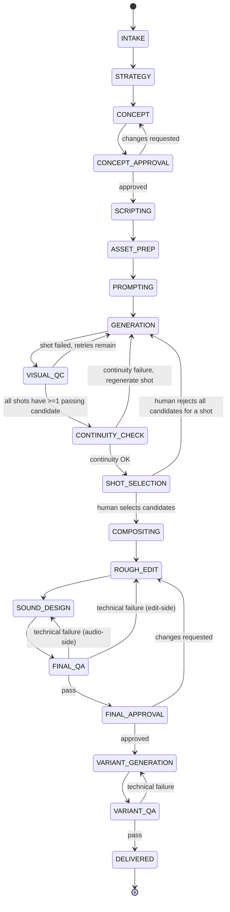
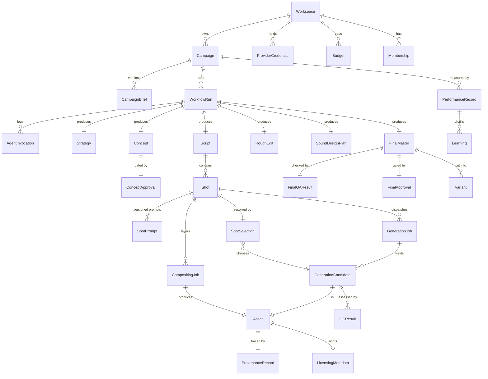

# Combat Creative OS — Architecture Proposal

Status: **DRAFT — awaiting approval**
Owner: Principal Architecture (this document)
Scope: System design only. No application code has been written. Nothing in this
document has been scaffolded yet.

---

## 0. Guiding constraints (restated, because they drive every decision below)

1. This is an **orchestrator + specialist agents** system, not a single autonomous
   "make an ad" agent, and not a free-form multi-agent chat. See
   [ADR-0001](./adr/0001-specialist-workflows-over-freeform-chat.md).
2. Every workflow transition is validated. Every agent output is schema-validated
   before it is trusted by anything downstream.
3. Three human approval gates are **structurally unbypassable**: concept approval,
   shot selection, final-master approval. "Unbypassable" is a workflow-engine
   guarantee (the workflow cannot progress past the gate without a recorded,
   authorized signal), not a UI convention.
4. Everything that costs money or calls a third party is metered, idempotent,
   retried with backoff, capped by budget, and observable.
5. Local development must work with **zero paid API keys** via mock providers that
   implement the exact same interfaces as production providers.

---

## 1. Monorepo package structure

Tooling: **pnpm workspaces + Turborepo** for task graph/caching. Turborepo is chosen
over Nx for lower configuration overhead given a moderate package count and because
the team's stated stack (Next.js, Vitest, Playwright) is Turborepo's home turf. This
is a low-risk, reversible choice — noted here, not treated as unresolved.

```
combat-creative-os/
├── apps/
│   ├── dashboard/            # Next.js frontend only: brief intake UI, approval-
│   │                         # gate UI, review queues, run inspector. Thin
│   │                         # server-rendering/session glue at most — no
│   │                         # business logic, no Temporal client, no direct DB
│   │                         # writes. Every command/query goes through apps/api.
│   ├── api/                   # Authenticated control-plane API (REST). Owns RBAC
│   │                         # enforcement, campaign CRUD, the three approval-gate
│   │                         # endpoints (the only path that signals Temporal on a
│   │                         # human's behalf), provider-credential and budget
│   │                         # management, and read queries backing the dashboard.
│   │                         # See §2.1 for why this is a separate app.
│   ├── webhook-receiver/     # Small Fastify service that verifies provider
│   │                         # webhook signatures and turns them into Temporal
│   │                         # signals via packages/workflow-client. Kept separate
│   │                         # from apps/api because its trust model is signature
│   │                         # verification, not user sessions/RBAC.
│   └── worker/               # Temporal worker process(es): hosts workflow
│                             # definitions + activity implementations
│
├── packages/
│   ├── domain/                # Zod schemas for every contract in the system:
│   │                          # CampaignBrief, agent I/O, workflow events, DTOs.
│   │                          # The single source of truth for "shape of data."
│   ├── db/                    # Prisma schema, migrations, generated client,
│   │                          # repository layer (no raw Prisma calls outside this pkg)
│   ├── workflows/              # Temporal workflow definitions only. Pure,
│   │                          # deterministic, no I/O, no fetch, no Date.now().
│   ├── activities/             # Temporal activity implementations. All I/O lives
│   │                          # here: DB writes, provider calls, ffmpeg, agent calls.
│   ├── workflow-client/         # Typed Temporal client wrapper (signal/query
│   │                          # helpers) shared by apps/api and apps/webhook-
│   │                          # receiver, so both authenticate differently but
│   │                          # dispatch through one typed, tested path.
│   ├── agent-runtime/           # IMPLEMENTED (ADR-0003, 2026-07-24). Shared harness:
│   │                          # AgentDefinition/executeAgent, prompt versioning,
│   │                          # schema-validated structured output via strict tool
│   │                          # use, one corrective re-prompt on schema failure,
│   │                          # cost/hash/latency accounting, redacted logging.
│   │                          # Every specialist agent is built on top of this.
│   ├── agents/                 # IMPLEMENTED (ADR-0003) for 11 of 14 agents; the
│   │                          # other 3 are typed NOT_IMPLEMENTED placeholders.
│   │   ├── campaign-strategist/
│   │   ├── creative-director/
│   │   ├── script-timing-director/         # displayName "Script Director"
│   │   ├── asset-manager/                  # placeholder — see ADR-0003
│   │   ├── shot-prompt-engineer/
│   │   ├── video-generation-coordinator/   # placeholder — see ADR-0003
│   │   ├── visual-quality-controller/      # displayName "Visual QA Controller"
│   │   ├── continuity-controller/
│   │   ├── motion-compositing-coordinator/ # placeholder — see ADR-0003
│   │   ├── edit-director/
│   │   ├── sound-director/
│   │   ├── final-qa-controller/
│   │   ├── variant-generator/
│   │   └── performance-analyst/
│   │       # Each folder: schema.ts (Zod input/result), prompts/v1.ts (versioned
│   │       # PromptTemplate), agent.ts (the AgentDefinition). No agent imports
│   │       # another agent — see ADR-0001. Not yet called from any Temporal
│   │       # workflow/Activity — that wiring is separate, later-milestone work.
│   │
│   ├── providers/
│   │   ├── video-gen/          # VideoGenerationProvider interface + gemini-veo,
│   │   │                       # runway, mock implementations
│   │   ├── design/              # DesignProvider interface + figma, mock
│   │   ├── motion-graphics/     # MotionGraphicsProvider interface + aerender, mock
│   │   ├── review/               # ReviewProvider (Frame.io-compatible) + mock
│   │   ├── reasoning/             # IMPLEMENTED (ADR-0003): ReasoningProvider interface,
│   │   │                       # MockReasoningProvider (default), ClaudeReasoningProvider
│   │   │                       # (real @anthropic-ai/sdk adapter, strict tool-use structured
│   │   │                       # output, gated behind ANTHROPIC_API_KEY via @combat/config)
│   │   └── storage/                # S3-compatible client (MinIO/S3), presigned URLs
│   │
│   ├── media/                  # FFmpeg wrapper: probe, thumbnail, proxy, assemble,
│   │                           # concat, loudness/technical checks
│   ├── observability/           # OTel SDK setup, structured logger (pino), trace
│   │                           # helpers, shared across every app/package
│   ├── auth/                    # RBAC model, permission checks, session helpers
│   ├── config/                  # Zod-validated env schema + per-environment loader
│   └── testing/                  # Shared fixtures, mock-provider factories, Temporal
│                                # TestWorkflowEnvironment helpers
│
├── infra/
│   ├── docker-compose.yml        # Postgres, MinIO, Temporal (server + UI), Jaeger
│   ├── docker-compose.prod.yml   # Prod-shaped compose for staging; real prod
│   │                             # hosting (incl. Temporal Cloud vs. self-hosted)
│   │                             # is an open question — see §7.2
│   └── temporal/                 # Namespace registration, dynamicconfig overrides
│
├── docs/
│   ├── architecture.md           # this file
│   └── adr/
│
├── .env.example
├── pnpm-workspace.yaml
├── turbo.json
└── package.json
```

**Dependency direction rule** (enforced later via lint/dependency-cruiser):
`workflows` → may depend on `domain` only (types/schemas), never on `activities`,
`providers`, or `agents` directly — Temporal workflow code must stay side-effect-free
and deterministic. `activities` orchestrates `agents`, `providers`, `media`, `db`.
`agents` depends on `agent-runtime` + `domain`, never on `db` or `providers` directly
(an agent's job is reasoning over inputs it's given, not fetching its own data).
`apps/dashboard` depends only on `apps/api`'s HTTP contract (typed via
`packages/domain`) — it may not import `packages/db`, `packages/workflow-client`,
or any provider package directly. This is what makes "UI visibility is not
authorization" (§2.2) a structural fact rather than a convention.

---

## 2. Service boundaries

These are the runtime deployables, distinct from the source packages above.

| Service                 | Responsibility                                                                                                                            | Talks to                                                                                                           |
| ----------------------- | ----------------------------------------------------------------------------------------------------------------------------------------- | ------------------------------------------------------------------------------------------------------------------ |
| **dashboard** (Next.js) | Human UI only: brief intake, all 3 approval-gate UIs, run inspector, RBAC-gated admin views                                               | `apps/api` over HTTP only — no DB access, no Temporal client, no provider calls                                    |
| **api**                 | Authenticated control-plane: RBAC enforcement, campaign CRUD, approval-gate commands, provider-credential/budget management, read queries | DB (read/write), Temporal client (signal/query) via `packages/workflow-client`, never calls provider APIs directly |
| **webhook-receiver**    | Verifies inbound provider webhooks (video-gen completion, review comments), converts to Temporal signals                                  | Temporal client (signal only, restricted signal set — see §2.1), audit log write                                   |
| **worker**              | Hosts all Temporal workflows + activities; the only process that calls providers, agents, and ffmpeg                                      | DB, S3/MinIO, Claude API, video-gen/design/motion/review providers, Temporal server                                |
| **temporal-server**     | Durable execution engine                                                                                                                  | Postgres (its own schema), workers                                                                                 |
| **postgres**            | System of record: campaigns, workflow metadata mirror, assets, approvals, audit trail, agent invocations, all workspace-scoped            | worker, api                                                                                                        |
| **MinIO / S3**          | All binary assets                                                                                                                         | worker (write), api (issues presigned URLs to dashboard)                                                           |

**Hard boundary:** Temporal workflow code never performs network I/O. All provider
and agent calls happen inside Activities. This is what keeps workflows replayable
and is non-negotiable for Temporal correctness, not just a style preference.

**Agent isolation boundary:** an agent's `run()` is a pure-ish function of
`(validated input) → (validated output)` plus one Claude API call. Agents cannot
invoke other agents and cannot read/write the database. Only Activities sequence
agents and persist their output. This is the mechanism that makes "no free-form
multi-agent chat" true in code, not just in intent.

### 2.1 Why `apps/api` is separate from `apps/dashboard`

Resolved per review: **a separate `apps/api` service is required**, not Next.js
route handlers inside `dashboard`. Reasoning, for the record:

- Workflow commands (the three approval signals), provider operations, and budget
  management are the most sensitive mutation paths in the system. Coupling their
  authorization logic to a UI framework's route-handler conventions makes it easy
  for a future dashboard redesign to accidentally change or bypass enforcement.
  A standalone API keeps RBAC enforcement in one place, testable independent of
  any frontend.
- Future external clients (a CLI, a CI-triggered campaign run, a future mobile
  reviewer app) need the same control-plane surface without depending on Next.js.
- It keeps the "who can hold a Temporal client" set small and explicit:
  `apps/api` and `apps/webhook-receiver` only, via `packages/workflow-client`.
  `apps/dashboard` is structurally incapable of signaling a workflow directly,
  which is one more layer behind "approval cannot be bypassed" (§2.2, §3.3).
- `apps/webhook-receiver` remains a distinct service from `apps/api` rather than
  merging into it, because its trust model is fundamentally different
  (signature-verified anonymous inbound traffic vs. authenticated user sessions).
  Both share the same typed signal/query dispatch (`packages/workflow-client`) so
  the Temporal integration itself isn't duplicated — only the authentication layer
  in front of it differs.

### 2.2 Access control model (RBAC)

Five roles, fixed for the initial build (`packages/auth` + `packages/domain`):

| Role                  | Scope                                                                                                       |
| --------------------- | ----------------------------------------------------------------------------------------------------------- |
| `OWNER_ADMIN`         | Workspace configuration, provider-credential management, budget configuration, and all three approval gates |
| `CREATIVE_DIRECTOR`   | Strategy/concept review, concept approval, final-master approval                                            |
| `PRODUCTION_OPERATOR` | Generation dispatch, asset management, render/compositing operations                                        |
| `REVIEWER`            | Candidate feedback, shot selection                                                                          |
| `ANALYST`             | Read-only performance and reporting access                                                                  |

Permission matrix (illustrative — enforced as an explicit table in
`packages/auth`, not inferred from role names at call sites):

| Action                           | OWNER_ADMIN | CREATIVE_DIRECTOR | PRODUCTION_OPERATOR | REVIEWER | ANALYST |
| -------------------------------- | :---------: | :---------------: | :-----------------: | :------: | :-----: |
| Configure providers/credentials  |      ✓      |                   |                     |          |         |
| Manage budgets                   |      ✓      |                   |                     |          |         |
| Approve concept                  |      ✓      |         ✓         |                     |          |         |
| Approve final master             |      ✓      |         ✓         |                     |          |         |
| Select shots / candidates        |      ✓      |                   |                     |    ✓     |         |
| Provide candidate feedback       |      ✓      |         ✓         |                     |    ✓     |         |
| Trigger generation / render jobs |      ✓      |                   |          ✓          |          |         |
| Manage assets                    |      ✓      |                   |          ✓          |          |         |
| View performance / reporting     |      ✓      |         ✓         |          ✓          |    ✓     |    ✓    |
| Manage workspace membership      |      ✓      |                   |                     |          |         |

**Governing principle:** every permission check happens in `apps/api` (and, for
inbound provider events, in `apps/webhook-receiver`'s narrow signal allowlist)
before a command is accepted. `apps/dashboard` may hide controls a role can't use,
but that is a UX convenience only — hiding a button is not, and never substitutes
for, the server-side check. An unauthorized request to `apps/api` is rejected
regardless of what the UI would have allowed.

---

## 3. Workflow state machine

> **Note (domain-model milestone, see §7.1 item 8 and
> `docs/adr/0002-campaign-lifecycle-alignment.md`):** the diagram below is the
> original illustrative design and is retained for historical context only.
> The canonical, implemented state machine is the 20-stage lifecycle in
> `docs/domain-model.md` §4 and `packages/domain/src/workflow/transition-rules.ts`.
> An interim revision of this work briefly implemented a 17-stage machine that
> folded performance analysis into the linear campaign pipeline — this was
> identified as a deviation from the decision below (§7.1 item 8) and
> corrected; see ADR-0002 for the full account.

### 3.1 Top-level stages



`PERFORMANCE_ANALYSIS` is intentionally **not** a stage in this diagram — it is a
separate, independently-triggered workflow (`PerformanceAnalysisWorkflow`) that
starts on a schedule or an external event (ad-platform metrics available) after
`DELIVERED`, and writes to a `Learning` store that future `STRATEGY`/`CONCEPT`
stages read as context. Coupling it into the linear pipeline would force the
production workflow to stay "open" for weeks waiting on ad performance, which is
the wrong lifetime for a durable execution that's meant to complete.

### 3.2 Temporal workflow decomposition

- **`CampaignProductionWorkflow`** (parent, one per production run): drives the
  linear stage sequence above via Activities, awaits the three approval gates via
  **Signals**, exposes current state via **Queries**.
- **`ShotGenerationWorkflow`** (child, one per shot, run in parallel via
  `Promise.all`/`startChild`): owns the `GENERATION ⇄ VISUAL_QC` retry loop for a
  single shot — submit N candidates, poll/await provider completion, run Visual QC
  per candidate, decide retry vs. escalate. This isolates the only truly
  unbounded-iteration part of the pipeline into a child workflow with its own
  bounded retry policy, so the parent stays simple and linear.
- **`CompositingWorkflow`** (child, one per shot needing motion graphics, parallel):
  owns the After Effects/aerender + Figma asset dispatch and polling.
- **`PerformanceAnalysisWorkflow`** (separate top-level workflow, decoupled as above).

### 3.3 Signals, queries, retry/escalation policy

These signals are dispatched exclusively by `apps/api`, after RBAC and workflow-
state validation (§2.1, §2.2). `apps/dashboard` holds no Temporal client and
cannot call these directly — a rejected approval never leaves the browser as
anything more than an HTTP request that `apps/api` can refuse. `apps/webhook-
receiver` is restricted to a narrow, non-approval signal set (generation/render
job completion) driven by verified provider webhooks; it cannot dispatch
`approveConcept`, `selectShots`, or `approveFinal` under any circumstance. This is
the concrete backend enforcement behind "human approval cannot be bypassed."

Signals on `CampaignProductionWorkflow`:
`approveConcept(decision, comments, userId)`,
`selectShots(selections[], userId)`,
`approveFinal(decision, comments, userId)`,
`cancelCampaign(reason, userId)`.

Queries: `getCurrentStage()`, `getStageHistory()`, `getPendingApprovals()`,
`getBudgetStatus()`.

Retry/escalation policy (applies inside `ShotGenerationWorkflow` and analogous
loops):

- Each stage-level Activity uses Temporal's built-in retry policy
  (exponential backoff, capped attempts, non-retryable-error allowlist for things
  like schema validation failures that won't fix themselves on retry).
- Each **shot** gets a bounded number of generation attempts (config, default 3)
  before it's marked `NEEDS_HUMAN` and surfaced at the Shot Selection gate instead
  of silently retrying forever.
- Every regeneration attempt is gated by a **budget check** activity that
  evaluates all four applicable levels — workspace, campaign, shot, and provider
  (see the `Budget`/`BudgetLedger` entities in §4.3) — and reserves against the
  tightest one before dispatch. If any level is exhausted, the shot is marked
  `BUDGET_EXCEEDED` and escalated to a human rather than failing silently or
  overspending.
- Visual QC and Continuity failures return **structured revision feedback**
  (`RevisionFeedback` schema — see §6), which determines whether the next attempt
  re-runs the same prompt, asks the Shot Prompt Engineer to revise it, or escalates.
  This routing decision is explicit workflow logic, not a free-form agent judgment
  call, so it stays auditable and testable.

### 3.4 Per-entity status enums (illustrative, defined fully in `packages/domain`)

- `WorkflowRunStatus`: `RUNNING | AWAITING_APPROVAL | FAILED | CANCELLED | COMPLETED`
- `ShotStatus`: `PENDING | GENERATING | QC_REVIEW | NEEDS_HUMAN | BUDGET_EXCEEDED | SELECTED | REJECTED`
- `ApprovalGateStatus`: `PENDING | APPROVED | CHANGES_REQUESTED | REJECTED`
- `GenerationJobStatus`: `QUEUED | SUBMITTED | POLLING | SUCCEEDED | FAILED | TIMED_OUT`

---

## 4. Database entities and relationships

PostgreSQL via Prisma. This is the system of record for everything except the
binary assets themselves (which live in object storage) and the transient
execution state of workflows (which lives in Temporal — Postgres holds a
queryable **mirror**, not the source of truth, for workflow status).

### 4.1 Core entity list

**Tenancy & identity:** `Workspace`, `User`, `Role`, `Membership` (user↔workspace↔role,
fixed to the five roles in §2.2). `Workspace` is the tenancy root — see §4.4.

**Campaign intake:** `Campaign`, `CampaignBrief` (versioned, immutable once accepted
into a run)

**Execution:** `WorkflowRun` (mirrors Temporal execution), `AgentInvocation`
(every specialist agent call: input, output, prompt version, model, tokens, cost,
latency, status), `AuditLogEntry` (append-only, every state transition/approval/
override)

**Creative artifacts:** `Strategy`, `Concept`, `ConceptApproval`, `Script`, `Shot`,
`ShotPrompt` (versioned per shot per provider)

**Generation:** `GenerationJob`, `GenerationCandidate`, `QCResult`,
`ContinuityCheck`, `ShotSelection`

**Post-production:** `CompositingJob`, `RoughEdit`, `SoundDesignPlan`,
`FinalMaster`, `FinalQAResult`, `FinalApproval`, `Variant`

**Assets & provenance:** `Asset` (polymorphic binary artifact), `ProvenanceRecord`,
`LicensingMetadata`, `Prompt` (agent system-prompt versions, distinct from
`ShotPrompt`)

**Governance:** `ProviderCredential` (workspace-scoped, encrypted at rest),
`Budget` (scoped via `level: WORKSPACE | CAMPAIGN | SHOT | PROVIDER` + `scopeId`),
`BudgetLedger` (append-only; every row is a `RESERVATION`, `CHARGE`, or `RELEASE`)

**Learning loop:** `PerformanceRecord`, `Learning`

### 4.2 Key relationships (ER diagram, primary path only)



### 4.3 Notes on the harder entities

- **`Asset`** is polymorphic and append-only: video candidates, thumbnails,
  proxies, motion-graphics renders, sound stems, and final masters are all rows
  here, distinguished by `kind`. Every `Asset` has an `s3Key`, `checksum`,
  `createdByAgentInvocationId | uploadedByUserId`, and a required
  `ProvenanceRecord` — this is what makes "asset provenance" and "no untrusted
  generated media" enforceable rather than aspirational.
- **`ProvenanceRecord`** is kept separate from `Asset` (rather than inlined)
  because provenance chains can be multi-hop (a `Variant` derived from a
  `FinalMaster` derived from a `RoughEdit` composed of several
  `GenerationCandidate`s) — it's a small append-only edge table
  (`assetId, derivedFromAssetId[], producedByInvocationId, providerJobRef`).
- **`LicensingMetadata`** is `0..1` on `Asset` deliberately — internally generated
  intermediate assets (proxies, thumbnails) don't need it; anything that could ship
  in a final ad does, and Final QA checks for its presence before allowing
  `FINAL_APPROVAL` to be requested.
- **`Budget`** and **`BudgetLedger`** are separate: `Budget` rows are configured
  caps at each of the four required levels (workspace, campaign, shot, provider —
  a shot can have its own cap independent of the campaign's, and a provider can
  have a workspace-wide cap independent of any single campaign). `BudgetLedger` is
  the append-only spend log every `GenerationJob` writes to before and after
  dispatch: a `RESERVATION` row is written synchronously before submission (under
  a `SELECT ... FOR UPDATE` / Postgres advisory lock keyed by the tightest
  applicable scope, so two parallel shots can't both pass a stale check), and
  either a `CHARGE` (on confirmed provider cost) or a `RELEASE` (on failure/
  cancellation) closes it out. No budget row is ever mutated in place — the ledger
  is the source of truth for "what has actually been spent or committed," and a
  `Budget`'s remaining amount is always a computed aggregate over it.

### 4.4 Tenancy scoping

Every entity that isn't purely global reference data (e.g. `Role`) carries a
`workspaceId` — directly on `Campaign`, `Asset`, `ProviderCredential`, `Budget`,
`BudgetLedger`, every approval record (`ConceptApproval`, `ShotSelection`,
`FinalApproval`), and `AuditLogEntry`, and transitively (via `Campaign`/`WorkflowRun`)
on everything else. `packages/db`'s repository layer takes `workspaceId` as a
mandatory first argument on every query and write — there is no code path that
reads or writes these tables without a workspace filter, so cross-workspace access
is a repository-layer bug class that unit tests can exhaustively cover (§8, M1),
not something each call site has to remember to check.

The initial deployment runs as a **single-workspace MVP**: exactly one `Workspace`
row is seeded, and there is no workspace-switching UI, workspace self-service
signup, or billing. The isolation is built now because retrofitting a
`workspaceId` onto ~15 tables and every repository method later is expensive;
turning on a second workspace later is not, because the schema and query layer
already require it.

---

## 5. Provider interfaces

All interfaces live in `packages/providers/*`, each with a `mock` implementation
used by default in local/test environments and selected via `packages/config`.
Every provider call is wrapped by the calling Activity with an **idempotency key**
derived from `(workflowRunId, stage, entityId, attempt)` so Temporal retries or
workflow replays never double-submit paid work.

Provider-specific status, resolved per review:

- **Video generation** (Veo, Runway): both remain mock-only through the milestones
  in §8. Veo is the preferred future provider for hero footage; Runway is the
  preferred future provider for alternative takes/shot repair (regenerating a
  single failed shot without re-running the whole set). Neither is connected with
  real credentials, and no real spend happens, until explicitly decided later —
  the interface and both adapter stubs are built now so that decision doesn't
  block anything else.
- **Motion graphics** (After Effects): `aerender` is **not** run inside Docker or
  any container in this architecture. It is treated as an external Windows render
  worker reachable only through `MotionGraphicsProvider` — a job-submission
  interface (submit → poll/webhook → fetch output), the same shape as the video-gen
  providers. Only the interface and a deterministic mock are built in the initial
  milestones; the real worker (a Windows machine or fleet polling a job queue, or
  invoked via a small agent process on that machine) is implemented later behind
  the unchanged interface.
- **Review** (Frame.io-compatible): the interface is provider-neutral by
  construction (`ReviewProvider`, below). A complete deterministic mock is built
  first and is sufficient for all local development — Frame.io is never a hard
  dependency for running the system locally. The real Frame.io integration is
  added only after the Shot Selection / review workflow passes end-to-end against
  the mock.

```ts
// providers/video-gen — illustrative signatures, not final API
interface VideoGenerationProvider {
  submit(input: {
    idempotencyKey: string;
    prompt: ShotPrompt;
    candidateCount: number;
    params: ProviderGenerationParams;
  }): Promise<GenerationJobHandle>;

  getStatus(handle: GenerationJobHandle): Promise<GenerationJobStatus>;
  fetchResult(handle: GenerationJobHandle): Promise<GeneratedCandidateRef[]>;
  cancel(handle: GenerationJobHandle): Promise<void>;
  // Providers may deliver results via webhook instead of polling; the webhook
  // receiver normalizes both into the same GenerationJobStatus transitions.
}

interface DesignProvider {
  // Figma
  fetchNode(fileKey: string, nodeId: string): Promise<DesignAssetRef>;
  exportAsset(fileKey: string, nodeId: string, format: ExportFormat): Promise<AssetRef>;
}

interface MotionGraphicsProvider {
  // After Effects / aerender
  submitRenderJob(input: {
    idempotencyKey: string;
    template: string;
    dataBindings: Record<string, unknown>;
  }): Promise<RenderJobHandle>;
  getRenderStatus(handle: RenderJobHandle): Promise<RenderJobStatus>;
  fetchRenderOutput(handle: RenderJobHandle): Promise<AssetRef>;
}

interface ReviewProvider {
  // Frame.io-compatible
  createReviewAsset(asset: AssetRef, context: ReviewContext): Promise<ReviewAssetRef>;
  postComment(reviewAssetId: string, comment: ReviewComment): Promise<void>;
  getApprovalStatus(reviewAssetId: string): Promise<ReviewStatus>;
  generateShareLink(reviewAssetId: string): Promise<string>;
}

interface StorageProvider {
  // S3-compatible (MinIO / S3)
  putObject(input: PutObjectInput): Promise<{ s3Key: string; checksum: string }>;
  getPresignedUrl(s3Key: string, expirySeconds: number): Promise<string>;
  headObject(s3Key: string): Promise<ObjectMetadata>;
  copyObject(src: string, dest: string): Promise<void>;
  // No hard-delete method exposed to application code; deletion is via
  // lifecycle policy only, to preserve provenance/audit guarantees.
}

interface ReasoningProvider {
  // Claude API, used by agent-runtime
  invoke(input: {
    idempotencyKey: string;
    promptVersion: string;
    systemPrompt: string;
    messages: ReasoningMessage[]; // supports multimodal (frames/thumbnails) for QC
    responseSchema: ZodSchema;
  }): Promise<{ raw: unknown; validated: unknown; modelMeta: ModelMeta }>;
}
```

`FfmpegService` in `packages/media` is not a "provider" in the third-party sense
(no external account/API key) but follows the same shape: `probe(asset)`,
`thumbnail(asset, t)`, `proxy(asset, profile)`, `assemble(timeline)`,
`encode(asset, profile)` — deterministic, local, still wrapped with structured
logging and idempotent output paths (content-addressed by input hash + profile).

---

## 6. Agent input/output contracts

Every specialist agent is built on a common envelope from `agent-runtime`, so
validation, versioning, and audit logging are handled once, not per-agent.

```ts
interface AgentInput<T> {
  invocationId: string; // uuid, generated by the calling Activity
  workflowRunId: string;
  stage: WorkflowStage;
  promptVersion: string; // pins the exact system prompt used
  input: T; // validated against the agent's Zod input schema
  context: {
    campaignId: string;
    priorArtifactRefs: ArtifactRef[]; // references, not inlined blobs — agents
    // fetch what they need via Activity-provided
    // resolved data, keeping payloads bounded
    budgetRemaining: Money;
    relevantLearnings?: Learning[]; // from Performance Analyst, strategy/concept only
  };
}

interface AgentOutput<T> {
  invocationId: string;
  output: T; // validated against the agent's Zod output schema
  rationale?: string; // free-text explanation, never trusted structurally
  modelMeta: { model: string; tokensIn: number; tokensOut: number; latencyMs: number };
  validationStatus: 'VALID' | 'SCHEMA_INVALID' | 'NEEDS_HUMAN_REVIEW';
}
```

`validationStatus` is set by `agent-runtime`, not by the agent itself — the harness
parses the model response against the Zod schema; on failure it retries once with a
corrective re-prompt (schema errors appended), and if that still fails it returns
`SCHEMA_INVALID` and the calling Activity fails the stage rather than passing
malformed data downstream. This is the concrete mechanism behind "generated text
and UI cannot be trusted without validation."

**Implemented (ADR-0003, 2026-07-24).** The real envelope lives in
`packages/domain/src/agent-envelope.ts` (`AgentInput<T>`/`AgentOutput<T>`,
plus an additive optional `attachments?: AgentInputAttachment[]` field for
multimodal frame/thumbnail assessment) and the real harness in
`packages/agent-runtime/src/execute-agent.ts` (`executeAgent`, returning an
`AgentRun<TResult>` — a superset of the illustrative `AgentOutput<T>` above
that also carries `inputHash`/`outputHash`/`cost`/`evaluation`). The
structured-output mechanism is Claude strict tool use (`tool_choice` forced
to a single schema-derived tool, `strict: true`), not a JSON-mode "hope for
the best" prompt — see `packages/agent-runtime/src/json-schema.ts` and
`packages/providers/src/reasoning.claude.ts`. See `packages/agents/README.md`
for what's implemented versus what's still orchestrator-wiring work.

**Activity boundary implemented (ADR-0004, 2026-07-24).**
`createExecuteSpecialistAgentActivity` (`packages/workflows/src/activities/
execute-specialist-agent-activity.ts`) is the Temporal Activity that calls
`executeAgent`: it resolves an agent through an injected registry, verifies
campaign ownership/stage, checks budget at the WORKSPACE/CAMPAIGN/PROVIDER
levels, and persists every terminal outcome as an `AgentInvocation` row
(§4.1). No `CampaignProductionWorkflow` calls it yet — that remains M3/M4's
sequencing work.

### 6.1 Representative per-agent schemas (field-level, not full Zod)

| Agent                          | Input (beyond envelope)                                            | Output                                                                                |
| ------------------------------ | ------------------------------------------------------------------ | ------------------------------------------------------------------------------------- |
| Campaign Strategist            | `CampaignBrief`, relevant `Learning[]`                             | `Strategy { positioning, targetAudience, keyMessages[], toneGuidelines }`             |
| Creative Director              | `Strategy`                                                         | `Concept { logline, visualDirection, narrativeArc, referenceNotes }`                  |
| Script & Timing Director       | `Concept`, target durations `[15,10,6]`                            | `Script { lines[] }`, `Shot[] { index, description, durationFrames, dependencies }`   |
| Asset Manager                  | `Shot[]`, brand asset library refs                                 | `AssetManifest { shotId → requiredAssets[], licensingFlags[] }`                       |
| Shot Prompt Engineer           | `Shot`, provider target, prior `RevisionFeedback?`                 | `ShotPrompt { providerId, promptText, negativePrompt?, params, version }`             |
| Video Generation Coordinator   | `ShotPrompt[]`, candidate count, budget                            | `GenerationJob[]` dispatch plan (this agent plans dispatch; the Activity executes it) |
| Visual Quality Controller      | `GenerationCandidate` (frames/thumbnails, multimodal), `Shot` spec | `QCResult { pass, scores{}, findings[], revisionFeedback? }`                          |
| Continuity Controller          | All `GenerationCandidate`s selected-so-far for a `Script`          | `ContinuityCheck { pass, conflicts[] { shotIds[], issue } }`                          |
| Motion-Compositing Coordinator | `Shot`, `SelectedCandidate`, brand template refs (Figma)           | `CompositingPlan { aeTemplate, dataBindings, figmaOverlays[] }`                       |
| Edit Director                  | Selected shots + compositing outputs, `Script` timing              | `RoughEditPlan { timeline[] }`                                                        |
| Sound Director                 | `RoughEditPlan`, brand audio guidelines                            | `SoundDesignPlan { musicBrief, sfxCues[], mixNotes }`                                 |
| Final QA Controller            | `FinalMaster` technical probe (ffmpeg) + visual (multimodal)       | `FinalQAResult { pass, technicalFindings[], visualFindings[] }`                       |
| Variant Generator              | `FinalMaster`, target duration                                     | `VariantPlan { cutPoints[], duration }`                                               |
| Performance Analyst            | `PerformanceRecord[]` for a campaign                               | `Learning[] { insight, appliesTo: "strategy"\|"concept"\|"prompting", tags[] }`       |

`RevisionFeedback` (shared shape, returned by QC/Continuity on failure and consumed
by Shot Prompt Engineer or the workflow's retry router):
`{ shotId, severity, category: "prompt"|"generation"|"continuity"|"technical", description, suggestedAction }`.

**Implemented schemas (ADR-0003).** `packages/agents/src/*/schema.ts` implements
this table's shape for the eleven built agents, field-for-field consistent
with the domain entities each stage eventually persists (`CreativeConcept`,
`Script`/`Shot`, `GenerationPrompt`, `QualityAssessment`/`QualityFailure`,
`Timeline`/`TimelineEntry`, `SoundCue`, `CreativeVariant`) but scoped to
*content only* — no `id`/`workspaceId`/foreign keys, which a future Activity
assigns at persistence time (agents don't write to the database).
`RevisionFeedback` above is `packages/agents/src/shared/quality-finding.ts`'s
`QualityFindingSchema`, reusing `@combat/domain`'s `QualityFailureCategory`/
`QualityFailureSeverity` enums. `Learning` is not yet a persisted
`@combat/domain` entity — Performance Analyst's `LearningSchema` is defined
locally in `packages/agents/src/performance-analyst/schema.ts` pending a
database milestone that promotes it into a real table. The three
placeholder agents (Asset Manager, Video Generation Coordinator,
Motion-Compositing Coordinator) each still get this table's contract
preserved in their own `schema.ts`, unimplemented — see ADR-0003.

---

## 7. Risk register

### 7.1 Resolved defaults (decided 2026-07-23, binding for scaffolding)

These were open questions in the original proposal and are now settled. They are
defaults, not permanent constraints — revisiting any of them later is a normal
architecture change, not a correction of this document.

0. **Naming, scaffolded 2026-07-23.** `apps/orchestrator-worker` was renamed
   to `apps/worker` and `packages/db` to `packages/database` to match the
   scaffolding request. `apps/webhook-receiver`,
   `packages/{auth,media,workflow-client}` are still deferred (not yet
   scaffolded) — they have no purpose until real provider integrations and
   `apps/api` endpoints beyond `/health` that would use them exist.
   `packages/agent-runtime` was scaffolded and implemented on 2026-07-24
   (ADR-0003), ahead of this item's original "deferred" call, once the
   specialist-agent execution framework was explicitly requested — see item
   9 below. `packages/activities` was folded into
   `packages/workflows/src/activities` for this milestone rather than split
   into its own package, since only one example activity exists so far; it
   can be split out once real activities justify the separation.
1. **Video-gen provider priority.** Both Veo and Runway stay mock-only through
   the milestone plan (§8). Veo is the preferred future provider for hero
   footage; Runway is the preferred future provider for alternative-take/shot-
   repair generation. No real credentials are connected and no money is spent
   through either until a later, explicit decision. See §5.
2. **After Effects execution environment.** `aerender` is not containerized. It
   is an external Windows render worker addressed only through
   `MotionGraphicsProvider`. Initial milestones build the interface and a
   deterministic mock; the real worker is implemented later behind the same
   interface. See §5.
3. **"Frame.io-compatible" scope.** Provider-neutral `ReviewProvider` interface;
   a complete deterministic mock ships first and is sufficient for all local
   development — Frame.io is never a hard local dependency. The real Frame.io
   integration is added only after the review/shot-selection workflow passes
   end-to-end against the mock. See §5.
4. **RBAC role list.** Fixed at five roles: `OWNER_ADMIN`, `CREATIVE_DIRECTOR`,
   `PRODUCTION_OPERATOR`, `REVIEWER`, `ANALYST`, enforced server-side in
   `apps/api` only — UI visibility is never authorization. See §2.2.
5. **Multi-tenancy.** Workspace isolation is built into the schema and the
   repository query layer from the start (`workspaceId` mandatory everywhere,
   §4.4), with cross-workspace-access tests from M1 onward. The initial
   deployment runs as a single-workspace MVP with no workspace admin UI or
   billing. See §4.4.
6. **Generation budget granularity.** Tracked at all four levels — workspace,
   campaign, shot, provider — via `Budget` + an append-only `BudgetLedger` of
   `RESERVATION` / `CHARGE` / `RELEASE` rows. See §4.1, §4.3.
7. **Control-plane API boundary.** `apps/api` is a separate service from
   `apps/dashboard`, and is the only app (besides the narrowly-scoped
   `apps/webhook-receiver`) that holds a Temporal client or enforces RBAC. See
   §2.1.
8. **Campaign state machine granularity (domain-model milestone, narrows
   §3.1; see `docs/adr/0002-campaign-lifecycle-alignment.md` for the full
   history).** The illustrative §3.1 diagram's coarser stage names are
   superseded by a **20-stage** pipeline (`DRAFT` through `DISTRIBUTED`)
   implemented in `packages/domain/src/workflow` and `packages/database`'s
   transition service — see `docs/domain-model.md` §4 for the full state
   diagram, transition table, and worked examples. This corrects an interim
   revision of this work that had implemented a 17-stage version folding
   `PERFORMANCE_COLLECTION`/`ITERATION_PLANNING` into the linear pipeline —
   that was identified as a direct reversal of this item's own guiding
   principle (below) and was removed; see ADR-0002. The corrected, canonical
   design:
   - **Human gates stay at exactly three**: `CONCEPT_REVIEW -> SCRIPT_REVIEW`
     (gate `CONCEPT`), `HUMAN_SHOT_SELECTION -> COMPOSITING` (gate
     `SHOT_SELECTION`), and `FINAL_APPROVAL -> VARIANT_GENERATION` (gate
     `FINAL`) — matching this document's original three-gate framing exactly.
     `STRATEGY_REVIEW` and `SCRIPT_REVIEW` are checkpoint stages (gated on
     artifact existence, not a `HumanApproval` record) — they do not add a
     fourth/fifth gate.
   - **Performance analysis remains fully decoupled.** `PERFORMANCE_COLLECTION`
     and `ITERATION_PLANNING` are not campaign-production stages; the
     `PerformanceAnalysisWorkflow` design in this section's prose (a separate,
     independently-triggered workflow over completed campaign/distribution
     records) stands as originally decided. `PerformanceMetrics` and related
     entities remain in the schema for that future, separate workflow.
   - **VISUAL_QA/CONTINUITY_QA, SOUND_DESIGN, and VARIANT_GENERATION/VARIANT_QA
     are distinct stages** (not collapsed), each with typed, failure-category-
     driven revision routing for stages with more than one valid repair
     target — see `packages/domain/src/workflow/quality-failure-routing.ts`.
   - The underlying principle (human gates require immutable approval
     records, enforced server-side, structurally unbypassable by
     workflow/activity code) is unchanged throughout both revisions.
     No live migration has been applied in this environment (no Docker, no
     local Postgres) — see `docs/domain-model.md` §8 for what was verified
     without a database connection and what remains to be run.
9. **Specialist-agent execution framework, implemented 2026-07-24
   (ADR-0003) — an explicit milestone-order exception.** `packages/agent-
   runtime` (the harness) and eleven of the fourteen `packages/agents`
   specialist agents were implemented ahead of the linear M2/M4/M6/M7/M9/
   M10/M11/M12/M13 order, on direct request. All fourteen canonical agent
   names from §6.1 are preserved unchanged; `asset-manager`,
   `video-generation-coordinator`, and `motion-compositing-coordinator` are
   registered as typed `NOT_IMPLEMENTED` placeholders (disabled by default,
   throw a non-retryable error if invoked) pending the provider/asset/
   compositing milestones §6.1 and §8 already scope them to. No Temporal
   workflow, Activity, or database repository calls any agent yet — that
   remains the relevant milestones' wiring work, not something this change
   did early. See ADR-0003 and `packages/agents/README.md` for the full
   accounting of what's implemented versus what's still pending.
10. **Specialist-agent execution Activity boundary, implemented 2026-07-24
    (ADR-0004) — a continuation of item 9's exception, one layer up.** The
    Temporal Activity that calls `executeAgent` — resolving an agent via the
    canonical registry, verifying campaign ownership/stage, checking budget
    at WORKSPACE/CAMPAIGN/PROVIDER, and persisting every terminal outcome as
    an `AgentInvocation` (§4.1) — is implemented ahead of M3/M4's full
    workflow sequencing. `CampaignProductionWorkflow` still does not exist;
    nothing calls this Activity stage-by-stage yet. See ADR-0004 for the
    idempotency-key design (keyed on the caller-supplied key alone, not a
    Temporal attempt number) and why ownership/stage-mismatch rejections
    throw rather than persist an `AgentInvocation` row.

### 7.2 Remaining open questions

These do not block M0–M7 but should be resolved before the milestones that
depend on them (noted per item).

1. **Rights/licensing for combat-sports footage and athlete likeness** in
   AI-generated ads is a legal question, not a software one — `LicensingMetadata`
   models it, but the actual policy (what's allowed, who signs off) needs
   Combat Reviews' legal input before Final QA's licensing check can be
   meaningfully strict rather than a rubber stamp. _Blocks: M11._
2. **Claude multimodal QA reliability and cost at production scale** is
   unverified — Visual QC and Final QA both lean on it. Needs an empirical spike
   (accuracy against a labeled sample, cost per shot) before trusting it as a
   gate rather than an advisory signal. _Blocks: M7, M11 going to production._
3. **Temporal Cloud vs. self-hosted** for production — self-hosted (via the
   provided docker-compose) is settled for local dev; the production hosting
   choice affects ops burden and is left open. _Blocks: production deploy, not
   any milestone._
4. **Approval SLA / escalation policy** is unspecified — what happens if a human
   doesn't act on a pending gate for N days? Temporal workflows can wait
   indefinitely, but indefinite is probably not the intended product behavior.
   _Blocks: M14 (hardening)._
5. **Target platforms/aspect ratios** (TikTok/IG Reels/YouTube Shorts) aren't
   specified beyond the three durations. Affects `Variant` schema (aspect ratio,
   safe-area, caption-burn requirements per platform) and Final QA's checklist.
   _Blocks: M12._
6. **Storage cost/retention policy** for multiple generation candidates per shot
   — at scale this is a lot of video. Needs a retention/lifecycle policy (e.g.,
   non-selected candidates purged after N days) before production launch.
   _Blocks: production launch, not any milestone._

---

## 8. Implementation plan — independently testable milestones

Each milestone below is scoped to be mergeable and testable on its own, with mocks
standing in for anything not yet built. No milestone requires paid API credentials.

- **M0 — Repo & infra scaffolding.** pnpm workspace, Turborepo, docker-compose
  (Postgres, MinIO, Temporal server+UI), CI skeleton, `packages/config` env
  validation, `packages/observability` OTel baseline, empty `apps/api` and
  `apps/dashboard` shells wired together over HTTP. _Test:_ `docker compose up`
  yields a healthy stack; CI runs an empty test suite green.
- **M1 — Domain contracts & database.** `packages/domain` Zod schemas for every
  entity in §4/§6 (including `Workspace`, `Budget`, `BudgetLedger`,
  `ProviderCredential`); `packages/db` Prisma schema, migrations, workspace-scoped
  repository layer, seed script (single seeded workspace). _Test:_ migration
  up/down round-trips; repository unit tests including explicit **cross-workspace
  access-denial tests** (a second seeded workspace whose data must be unreachable
  through every repository method); schema fixtures validate.
- **M2 — Agent runtime harness. Done (2026-07-24, ADR-0003), plus more than
  scoped.** `packages/agent-runtime` (versioned prompts, schema validation,
  retry-with-corrective-reprompt, redacted logging, cost metering) is
  implemented, and — ahead of this milestone's original scope of one agent —
  eleven of fourteen `packages/agents` specialists are implemented against
  it (the remaining three are typed placeholders; see §7.1 item 9). _Test:_
  unit tests on validation/retry logic in `packages/agent-runtime`; schema-
  contract and golden-fixture handoff tests in `packages/agents`. The
  originally-scoped "one integration test gated behind a real API key" was
  **not** added — `ClaudeReasoningProvider` (`packages/providers/src/
  reasoning.claude.ts`) is unit-tested with an injected fake client instead,
  so no automated test path can spend money even if a key is present; a
  real-key-gated integration test remains a candidate follow-up, not a gap
  in this milestone's own test requirements (CLAUDE.md: "Do not call paid
  APIs in automated tests").
- **M3 — Workflow skeleton + control plane.** `CampaignProductionWorkflow` with
  all stage states from §3.1 wired to stub Activities; `packages/workflow-client`;
  `apps/api` endpoints for the three approval signals enforcing RBAC (§2.2) and
  workspace scoping before dispatch. _Test:_ Temporal `TestWorkflowEnvironment`
  with time-skipping asserting every transition in the state diagram; `apps/api`
  tests asserting each non-`OWNER_ADMIN`/`CREATIVE_DIRECTOR` role is rejected on
  approval endpoints, and that a request scoped to the wrong workspace 404s rather
  than leaking existence.
- **M4 — Text-agent chain to Concept Approval.** Creative Director, Script &
  Timing Director wired in; `apps/dashboard` gets brief intake + Concept Approval
  UI, calling `apps/api` exclusively. _Test:_ end-to-end run through
  `CONCEPT_APPROVAL` with mock providers, Playwright test on the approval UI
  confirming a hidden-but-forged request from a non-approver role is still
  rejected server-side.
- **M5 — Storage & media pipeline.** `packages/providers/storage` (MinIO),
  `packages/media` (ffmpeg probe/thumbnail/proxy). _Test:_ unit tests against
  local MinIO container and fixture video files, independent of any workflow.
- **M6 — Video generation.** `providers/video-gen` deterministic mock for both
  Veo and Runway shapes; Shot Prompt Engineer; `ShotGenerationWorkflow` with
  multi-level budget checks (workspace/campaign/shot/provider) and idempotency
  enforcement. _Test:_ mock-provider integration test covering the full
  submit→poll→candidate loop, budget-exceeded path at each of the four levels,
  and ledger reservation/charge/release correctness. No real provider credentials
  used — that remains a future, separately-approved step per §7.1.
- **M7 — Visual QC & Continuity.** Visual Quality Controller, Continuity
  Controller, the `VISUAL_QC ⇄ GENERATION` and `CONTINUITY_CHECK ⇄ GENERATION`
  retry routing. _Test:_ fixture candidate sets (known-good/known-bad frames)
  drive deterministic pass/fail assertions.
- **M8 — Shot Selection gate.** `providers/review` (Frame.io-compatible mock,
  complete and sufficient for local dev — no real Frame.io dependency),
  `apps/dashboard` Shot Selection UI calling `apps/api`. _Test:_ Playwright
  covering select/reject flows and the reject→regenerate transition; RBAC test
  confirming only `REVIEWER`/`OWNER_ADMIN` can select shots.
- **M9 — Compositing & rough edit.** `providers/motion-graphics` (mock of the
  external-Windows-worker interface — no AE/aerender process run anywhere in
  this milestone), `providers/design` (Figma), `CompositingWorkflow`, Edit
  Director. _Test:_ mock render pipeline produces a rough-edit asset with
  correct provenance chain.
- **M10 — Sound design.** Sound Director + audio asset handling.
  _Test:_ plan generation + asset attachment, fixture-based.
- **M11 — Final QA & Final Approval gate.** Final QA Controller (ffmpeg technical
  checks + multimodal review), `apps/dashboard` Final Approval UI calling
  `apps/api`. _Test:_ fixture masters with known technical defects assert correct
  pass/fail/routing; RBAC test confirming only `CREATIVE_DIRECTOR`/`OWNER_ADMIN`
  can approve.
- **M12 — Variants.** Variant Generator (15/10/6s), variant QA reusing Final QA
  logic. _Test:_ cut-point correctness against fixture timelines; QA re-run per
  variant.
- **M13 — Performance Analyst loop.** Separate `PerformanceAnalysisWorkflow`,
  `Learning` ingestion, wired as optional context into Strategist/Creative
  Director. _Test:_ fixture performance data produces expected `Learning`
  records and that they're surfaced in a subsequent Strategist call.
- **M14 — Production hardening.** RBAC enforcement audit across every mutation
  path in `apps/api` (every endpoint checked against the full permission matrix
  in §2.2, not just the gates), full audit-trail completeness review, chaos/retry
  testing (kill worker mid-stage, confirm resumability), budget-limit enforcement
  under concurrency at all four levels, workspace-isolation fuzzing (attempt
  every mutation across a workspace boundary), secrets/config separation review
  (local vs. prod), full Playwright suite across all three gates end-to-end.

---

## 9. What this document deliberately does not do

Per instructions, no application code, no package.json, no Prisma schema file, and
no docker-compose file have been created — this is the design to be approved before
any of that is scaffolded.
