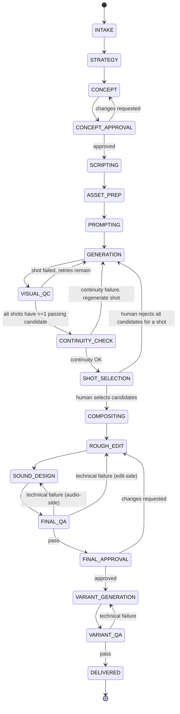
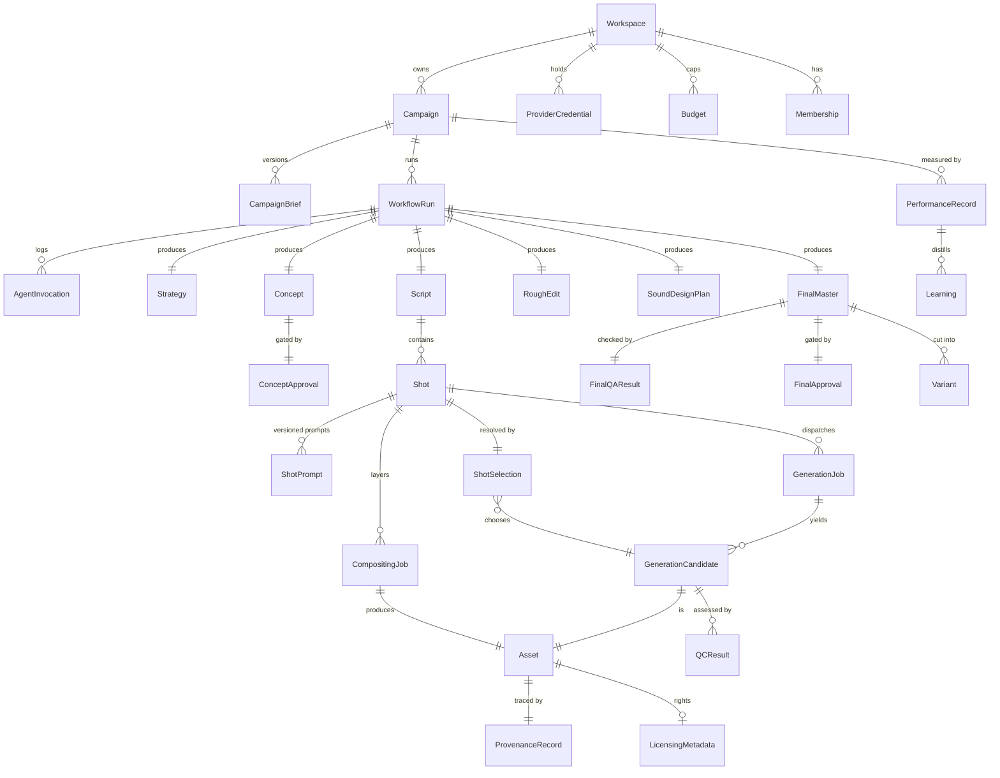

# Combat Creative OS — Architecture Proposal

Status: **DRAFT — awaiting approval**
Owner: Principal Architecture (this document)
Scope: System design only. No application code has been written. Nothing in this
document has been scaffolded yet.

---

## 0. Guiding constraints (restated, because they drive every decision below)

1. This is an **orchestrator + specialist agents** system, not a single autonomous
   "make an ad" agent, and not a free-form multi-agent chat. See
   [ADR-0001](./adr/0001-specialist-workflows-over-freeform-chat.md).
2. Every workflow transition is validated. Every agent output is schema-validated
   before it is trusted by anything downstream.
3. Three human approval gates are **structurally unbypassable**: concept approval,
   shot selection, final-master approval. "Unbypassable" is a workflow-engine
   guarantee (the workflow cannot progress past the gate without a recorded,
   authorized signal), not a UI convention.
4. Everything that costs money or calls a third party is metered, idempotent,
   retried with backoff, capped by budget, and observable.
5. Local development must work with **zero paid API keys** via mock providers that
   implement the exact same interfaces as production providers.

---

## 1. Monorepo package structure

Tooling: **pnpm workspaces + Turborepo** for task graph/caching. Turborepo is chosen
over Nx for lower configuration overhead given a moderate package count and because
the team's stated stack (Next.js, Vitest, Playwright) is Turborepo's home turf. This
is a low-risk, reversible choice — noted here, not treated as unresolved.

```
combat-creative-os/
├── apps/
│   ├── dashboard/            # Next.js frontend only: brief intake UI, approval-
│   │                         # gate UI, review queues, run inspector. Thin
│   │                         # server-rendering/session glue at most — no
│   │                         # business logic, no Temporal client, no direct DB
│   │                         # writes. Every command/query goes through apps/api.
│   ├── api/                   # Authenticated control-plane API (REST). Owns RBAC
│   │                         # enforcement, campaign CRUD, the three approval-gate
│   │                         # endpoints (the only path that signals Temporal on a
│   │                         # human's behalf), provider-credential and budget
│   │                         # management, and read queries backing the dashboard.
│   │                         # See §2.1 for why this is a separate app.
│   ├── webhook-receiver/     # Small Fastify service that verifies provider
│   │                         # webhook signatures and turns them into Temporal
│   │                         # signals via packages/workflow-client. Kept separate
│   │                         # from apps/api because its trust model is signature
│   │                         # verification, not user sessions/RBAC.
│   └── worker/               # Temporal worker process(es): hosts workflow
│                             # definitions + activity implementations
│
├── packages/
│   ├── domain/                # Zod schemas for every contract in the system:
│   │                          # CampaignBrief, agent I/O, workflow events, DTOs.
│   │                          # The single source of truth for "shape of data."
│   ├── db/                    # Prisma schema, migrations, generated client,
│   │                          # repository layer (no raw Prisma calls outside this pkg)
│   ├── workflows/              # Temporal workflow definitions only. Pure,
│   │                          # deterministic, no I/O, no fetch, no Date.now().
│   ├── activities/             # Temporal activity implementations. All I/O lives
│   │                          # here: DB writes, provider calls, ffmpeg, agent calls.
│   ├── workflow-client/         # Typed Temporal client wrapper (signal/query
│   │                          # helpers) shared by apps/api and apps/webhook-
│   │                          # receiver, so both authenticate differently but
│   │                          # dispatch through one typed, tested path.
│   ├── agent-runtime/           # IMPLEMENTED (ADR-0003, 2026-07-24). Shared harness:
│   │                          # AgentDefinition/executeAgent, prompt versioning,
│   │                          # schema-validated structured output via strict tool
│   │                          # use, one corrective re-prompt on schema failure,
│   │                          # cost/hash/latency accounting, redacted logging.
│   │                          # Every specialist agent is built on top of this.
│   ├── agents/                 # IMPLEMENTED (ADR-0003) for 11 of 14 agents; the
│   │                          # other 3 are typed NOT_IMPLEMENTED placeholders.
│   │   ├── campaign-strategist/
│   │   ├── creative-director/
│   │   ├── script-timing-director/         # displayName "Script Director"
│   │   ├── asset-manager/                  # placeholder — see ADR-0003
│   │   ├── shot-prompt-engineer/
│   │   ├── video-generation-coordinator/   # placeholder — see ADR-0003
│   │   ├── visual-quality-controller/      # displayName "Visual QA Controller"
│   │   ├── continuity-controller/
│   │   ├── motion-compositing-coordinator/ # placeholder — see ADR-0003
│   │   ├── edit-director/
│   │   ├── sound-director/
│   │   ├── final-qa-controller/
│   │   ├── variant-generator/
│   │   └── performance-analyst/
│   │       # Each folder: schema.ts (Zod input/result), prompts/v1.ts (versioned
│   │       # PromptTemplate), agent.ts (the AgentDefinition). No agent imports
│   │       # another agent — see ADR-0001. Not yet called from any Temporal
│   │       # workflow/Activity — that wiring is separate, later-milestone work.
│   │
│   ├── providers/
│   │   ├── video-gen/          # VideoGenerationProvider interface + gemini-veo,
│   │   │                       # runway, mock implementations
│   │   ├── design/              # DesignProvider interface + figma, mock
│   │   ├── motion-graphics/     # MotionGraphicsProvider interface + aerender, mock
│   │   ├── review/               # ReviewProvider (Frame.io-compatible) + mock
│   │   ├── reasoning/             # IMPLEMENTED (ADR-0003): ReasoningProvider interface,
│   │   │                       # MockReasoningProvider (default), ClaudeReasoningProvider
│   │   │                       # (real @anthropic-ai/sdk adapter, strict tool-use structured
│   │   │                       # output, gated behind ANTHROPIC_API_KEY via @combat/config)
│   │   └── storage/                # S3-compatible client (MinIO/S3), presigned URLs
│   │
│   ├── media/                  # FFmpeg wrapper: probe, thumbnail, proxy, assemble,
│   │                           # concat, loudness/technical checks
│   ├── observability/           # OTel SDK setup, structured logger (pino), trace
│   │                           # helpers, shared across every app/package
│   ├── auth/                    # RBAC model, permission checks, session helpers
│   ├── config/                  # Zod-validated env schema + per-environment loader
│   └── testing/                  # Shared fixtures, mock-provider factories, Temporal
│                                # TestWorkflowEnvironment helpers
│
├── infra/
│   ├── docker-compose.yml        # Postgres, MinIO, Temporal (server + UI), Jaeger
│   ├── docker-compose.prod.yml   # Prod-shaped compose for staging; real prod
│   │                             # hosting (incl. Temporal Cloud vs. self-hosted)
│   │                             # is an open question — see §7.2
│   └── temporal/                 # Namespace registration, dynamicconfig overrides
│
├── docs/
│   ├── architecture.md           # this file
│   └── adr/
│
├── .env.example
├── pnpm-workspace.yaml
├── turbo.json
└── package.json
```

**Dependency direction rule** (enforced later via lint/dependency-cruiser):
`workflows` → may depend on `domain` only (types/schemas), never on `activities`,
`providers`, or `agents` directly — Temporal workflow code must stay side-effect-free
and deterministic. `activities` orchestrates `agents`, `providers`, `media`, `db`.
`agents` depends on `agent-runtime` + `domain`, never on `db` or `providers` directly
(an agent's job is reasoning over inputs it's given, not fetching its own data).
`apps/dashboard` depends only on `apps/api`'s HTTP contract (typed via
`packages/domain`) — it may not import `packages/db`, `packages/workflow-client`,
or any provider package directly. This is what makes "UI visibility is not
authorization" (§2.2) a structural fact rather than a convention.

---

## 2. Service boundaries

These are the runtime deployables, distinct from the source packages above.

| Service                 | Responsibility                                                                                                                            | Talks to                                                                                                           |
| ----------------------- | ----------------------------------------------------------------------------------------------------------------------------------------- | ------------------------------------------------------------------------------------------------------------------ |
| **dashboard** (Next.js) | Human UI only: brief intake, all 3 approval-gate UIs, run inspector, RBAC-gated admin views                                               | `apps/api` over HTTP only — no DB access, no Temporal client, no provider calls                                    |
| **api**                 | Authenticated control-plane: RBAC enforcement, campaign CRUD, approval-gate commands, provider-credential/budget management, read queries | DB (read/write), Temporal client (signal/query) via `packages/workflow-client`, never calls provider APIs directly |
| **webhook-receiver**    | Verifies inbound provider webhooks (video-gen completion, review comments), converts to Temporal signals                                  | Temporal client (signal only, restricted signal set — see §2.1), audit log write                                   |
| **worker**              | Hosts all Temporal workflows + activities; the only process that calls providers, agents, and ffmpeg                                      | DB, S3/MinIO, Claude API, video-gen/design/motion/review providers, Temporal server                                |
| **temporal-server**     | Durable execution engine                                                                                                                  | Postgres (its own schema), workers                                                                                 |
| **postgres**            | System of record: campaigns, workflow metadata mirror, assets, approvals, audit trail, agent invocations, all workspace-scoped            | worker, api                                                                                                        |
| **MinIO / S3**          | All binary assets                                                                                                                         | worker (write), api (issues presigned URLs to dashboard)                                                           |

**Hard boundary:** Temporal workflow code never performs network I/O. All provider
and agent calls happen inside Activities. This is what keeps workflows replayable
and is non-negotiable for Temporal correctness, not just a style preference.

**Agent isolation boundary:** an agent's `run()` is a pure-ish function of
`(validated input) → (validated output)` plus one Claude API call. Agents cannot
invoke other agents and cannot read/write the database. Only Activities sequence
agents and persist their output. This is the mechanism that makes "no free-form
multi-agent chat" true in code, not just in intent.

### 2.1 Why `apps/api` is separate from `apps/dashboard`

Resolved per review: **a separate `apps/api` service is required**, not Next.js
route handlers inside `dashboard`. Reasoning, for the record:

- Workflow commands (the three approval signals), provider operations, and budget
  management are the most sensitive mutation paths in the system. Coupling their
  authorization logic to a UI framework's route-handler conventions makes it easy
  for a future dashboard redesign to accidentally change or bypass enforcement.
  A standalone API keeps RBAC enforcement in one place, testable independent of
  any frontend.
- Future external clients (a CLI, a CI-triggered campaign run, a future mobile
  reviewer app) need the same control-plane surface without depending on Next.js.
- It keeps the "who can hold a Temporal client" set small and explicit:
  `apps/api` and `apps/webhook-receiver` only, via `packages/workflow-client`.
  `apps/dashboard` is structurally incapable of signaling a workflow directly,
  which is one more layer behind "approval cannot be bypassed" (§2.2, §3.3).
- `apps/webhook-receiver` remains a distinct service from `apps/api` rather than
  merging into it, because its trust model is fundamentally different
  (signature-verified anonymous inbound traffic vs. authenticated user sessions).
  Both share the same typed signal/query dispatch (`packages/workflow-client`) so
  the Temporal integration itself isn't duplicated — only the authentication layer
  in front of it differs.

### 2.2 Access control model (RBAC)

Five roles, fixed for the initial build (`packages/auth` + `packages/domain`):

| Role                  | Scope                                                                                                       |
| --------------------- | ----------------------------------------------------------------------------------------------------------- |
| `OWNER_ADMIN`         | Workspace configuration, provider-credential management, budget configuration, and all three approval gates |
| `CREATIVE_DIRECTOR`   | Strategy/concept review, concept approval, final-master approval                                            |
| `PRODUCTION_OPERATOR` | Generation dispatch, asset management, render/compositing operations                                        |
| `REVIEWER`            | Candidate feedback, shot selection                                                                          |
| `ANALYST`             | Read-only performance and reporting access                                                                  |

Permission matrix (illustrative — enforced as an explicit table in
`packages/auth`, not inferred from role names at call sites):

| Action                           | OWNER_ADMIN | CREATIVE_DIRECTOR | PRODUCTION_OPERATOR | REVIEWER | ANALYST |
| -------------------------------- | :---------: | :---------------: | :-----------------: | :------: | :-----: |
| Configure providers/credentials  |      ✓      |                   |                     |          |         |
| Manage budgets                   |      ✓      |                   |                     |          |         |
| Approve concept                  |      ✓      |         ✓         |                     |          |         |
| Approve final master             |      ✓      |         ✓         |                     |          |         |
| Select shots / candidates        |      ✓      |                   |                     |    ✓     |         |
| Provide candidate feedback       |      ✓      |         ✓         |                     |    ✓     |         |
| Trigger generation / render jobs |      ✓      |                   |          ✓          |          |         |
| Manage assets                    |      ✓      |                   |          ✓          |          |         |
| View performance / reporting     |      ✓      |         ✓         |          ✓          |    ✓     |    ✓    |
| Manage workspace membership      |      ✓      |                   |                     |          |         |

**M4 addition (2026-07-25):** `MANAGE_CAMPAIGNS` (create campaign, save/submit
a brief, start the production workflow) — not in this illustrative matrix,
which predates campaign intake. Granted to `OWNER_ADMIN` and
`CREATIVE_DIRECTOR`. See §8's M4 entry and `packages/domain/src/roles.ts`.

**Governing principle:** every permission check happens in `apps/api` (and, for
inbound provider events, in `apps/webhook-receiver`'s narrow signal allowlist)
before a command is accepted. `apps/dashboard` may hide controls a role can't use,
but that is a UX convenience only — hiding a button is not, and never substitutes
for, the server-side check. An unauthorized request to `apps/api` is rejected
regardless of what the UI would have allowed.

---

## 3. Workflow state machine

> **Note (domain-model milestone, see §7.1 item 8 and
> `docs/adr/0002-campaign-lifecycle-alignment.md`):** the diagram below is the
> original illustrative design and is retained for historical context only.
> The canonical, implemented state machine is the 20-stage lifecycle in
> `docs/domain-model.md` §4 and `packages/domain/src/workflow/transition-rules.ts`.
> An interim revision of this work briefly implemented a 17-stage machine that
> folded performance analysis into the linear campaign pipeline — this was
> identified as a deviation from the decision below (§7.1 item 8) and
> corrected; see ADR-0002 for the full account.

### 3.1 Top-level stages



`PERFORMANCE_ANALYSIS` is intentionally **not** a stage in this diagram — it is a
separate, independently-triggered workflow (`PerformanceAnalysisWorkflow`) that
starts on a schedule or an external event (ad-platform metrics available) after
`DELIVERED`, and writes to a `Learning` store that future `STRATEGY`/`CONCEPT`
stages read as context. Coupling it into the linear pipeline would force the
production workflow to stay "open" for weeks waiting on ad performance, which is
the wrong lifetime for a durable execution that's meant to complete.

### 3.2 Temporal workflow decomposition

- **`CampaignProductionWorkflow`** (parent, one per production run): drives the
  linear stage sequence above via Activities, awaits the three approval gates via
  **Signals**, exposes current state via **Queries**.
- **`ShotGenerationWorkflow`** (child; M6, done — one instance per PROMPTING/
  SHOT_GENERATION visit, covering every shot in that visit via bounded
  parallel `Promise.all` batches internally, not one workflow instance per
  shot as this bullet originally sketched — see §8's M6 entry for why):
  dispatches each shot's generation, polls to a terminal state via `sleep`,
  retries a poll-time failure up to a bounded attempt count before
  escalating that shot, and reports per-shot results back to the parent.
  Visual QC is not yet part of this loop (M7); today's retry loop covers
  only the provider-dispatch/poll `GENERATION` half. This isolates the only
  truly unbounded-iteration part of the pipeline into a child workflow with
  its own bounded retry policy, so the parent stays simple and linear.
- **`CompositingWorkflow`** (child, one per shot needing motion graphics, parallel):
  owns the After Effects/aerender + Figma asset dispatch and polling.
- **`PerformanceAnalysisWorkflow`** (separate top-level workflow, decoupled as above).

### 3.3 Signals, queries, retry/escalation policy

These signals are dispatched exclusively by `apps/api`, after RBAC and workflow-
state validation (§2.1, §2.2). `apps/dashboard` holds no Temporal client and
cannot call these directly — a rejected approval never leaves the browser as
anything more than an HTTP request that `apps/api` can refuse. `apps/webhook-
receiver` is restricted to a narrow, non-approval signal set (generation/render
job completion) driven by verified provider webhooks; it cannot dispatch
`approveConcept`, `selectShots`, or `approveFinal` under any circumstance. This is
the concrete backend enforcement behind "human approval cannot be bypassed."

Signals on `CampaignProductionWorkflow`:
`approveConcept(decision, comments, userId)`,
`selectShots(selections[], userId)`,
`approveFinal(decision, comments, userId)`,
`cancelCampaign(reason, userId)`.

Queries: `getCurrentStage()`, `getStageHistory()`, `getPendingApprovals()`,
`getBudgetStatus()`.

Retry/escalation policy (applies inside `ShotGenerationWorkflow` and analogous
loops):

- Each stage-level Activity uses Temporal's built-in retry policy
  (exponential backoff, capped attempts, non-retryable-error allowlist for things
  like schema validation failures that won't fix themselves on retry).
- Each **shot** gets a bounded number of generation attempts (config, default 3)
  before it's marked `NEEDS_HUMAN` and surfaced at the Shot Selection gate instead
  of silently retrying forever.
- Every regeneration attempt is gated by a **budget check** activity that
  evaluates all four applicable levels — workspace, campaign, shot, and provider
  (see the `Budget`/`BudgetLedger` entities in §4.3) — and reserves against the
  tightest one before dispatch. If any level is exhausted, the shot is marked
  `BUDGET_EXCEEDED` and escalated to a human rather than failing silently or
  overspending.
- Visual QC and Continuity failures return **structured revision feedback**
  (`RevisionFeedback` schema — see §6), which determines whether the next attempt
  re-runs the same prompt, asks the Shot Prompt Engineer to revise it, or escalates.
  This routing decision is explicit workflow logic, not a free-form agent judgment
  call, so it stays auditable and testable.

### 3.4 Per-entity status enums (illustrative, defined fully in `packages/domain`)

- `WorkflowRunStatus`: `RUNNING | AWAITING_APPROVAL | FAILED | CANCELLED | COMPLETED`
- `ShotStatus`: `PENDING | GENERATING | QC_REVIEW | NEEDS_HUMAN | BUDGET_EXCEEDED | SELECTED | REJECTED`
- `ApprovalGateStatus`: `PENDING | APPROVED | CHANGES_REQUESTED | REJECTED`
- `GenerationJobStatus` (implemented M6 as `JobStatus`/`ShotGenerationAttemptStatus`): `QUEUED | SUBMITTED | POLLING | SUCCEEDED | FAILED | TIMED_OUT | CANCELLED`

---

## 4. Database entities and relationships

PostgreSQL via Prisma. This is the system of record for everything except the
binary assets themselves (which live in object storage) and the transient
execution state of workflows (which lives in Temporal — Postgres holds a
queryable **mirror**, not the source of truth, for workflow status).

### 4.1 Core entity list

**Tenancy & identity:** `Workspace`, `User`, `Role`, `Membership` (user↔workspace↔role,
fixed to the five roles in §2.2). `Workspace` is the tenancy root — see §4.4.

**Campaign intake:** `Campaign`, `CampaignBrief` (versioned, immutable once accepted
into a run)

**Execution:** `WorkflowRun` (mirrors Temporal execution), `AgentInvocation`
(every specialist agent call: input, output, prompt version, model, tokens, cost,
latency, status), `AuditLogEntry` (append-only, every state transition/approval/
override)

**Creative artifacts:** `Strategy`, `Concept`, `ConceptApproval`, `Script`, `Shot`,
`ShotPrompt` (versioned per shot per provider)

**Generation:** `GenerationJob`, `GenerationCandidate`, `QCResult`,
`ContinuityCheck`, `ShotSelection`

**Post-production:** `CompositingJob`, `RoughEdit`, `SoundDesignPlan`,
`FinalMaster`, `FinalQAResult`, `FinalApproval`, `Variant`

**Assets & provenance:** `Asset` (polymorphic binary artifact), `ProvenanceRecord`,
`LicensingMetadata`, `Prompt` (agent system-prompt versions, distinct from
`ShotPrompt`)

**Governance:** `ProviderCredential` (workspace-scoped, encrypted at rest),
`Budget` (scoped via `level: WORKSPACE | CAMPAIGN | SHOT | PROVIDER` + `scopeId`),
`BudgetLedger` (append-only; every row is a `RESERVATION`, `CHARGE`, or `RELEASE`)

**Learning loop:** `PerformanceRecord`, `Learning`

### 4.2 Key relationships (ER diagram, primary path only)



### 4.3 Notes on the harder entities

- **`Asset`** is polymorphic and append-only: video candidates, thumbnails,
  proxies, motion-graphics renders, sound stems, and final masters are all rows
  here, distinguished by `kind`. Every `Asset` has an `s3Key`, `checksum`,
  `createdByAgentInvocationId | uploadedByUserId`, and a required
  `ProvenanceRecord` — this is what makes "asset provenance" and "no untrusted
  generated media" enforceable rather than aspirational.
- **`ProvenanceRecord`** is kept separate from `Asset` (rather than inlined)
  because provenance chains can be multi-hop (a `Variant` derived from a
  `FinalMaster` derived from a `RoughEdit` composed of several
  `GenerationCandidate`s) — it's a small append-only edge table
  (`assetId, derivedFromAssetId[], producedByInvocationId, providerJobRef`).
- **`LicensingMetadata`** is `0..1` on `Asset` deliberately — internally generated
  intermediate assets (proxies, thumbnails) don't need it; anything that could ship
  in a final ad does, and Final QA is intended to check for its presence before
  allowing `FINAL_APPROVAL` to be requested. **Not implemented as of M11** — see
  §7.2 open question 1; the check is blocked on the licensing policy itself.
- **`Budget`** and **`BudgetLedger`** are separate: `Budget` rows are configured
  caps at each of the four required levels (workspace, campaign, shot, provider —
  a shot can have its own cap independent of the campaign's, and a provider can
  have a workspace-wide cap independent of any single campaign). `BudgetLedger` is
  the append-only spend log every `GenerationJob` writes to before and after
  dispatch: a `RESERVATION` row is written synchronously before submission (under
  a `SELECT ... FOR UPDATE` / Postgres advisory lock keyed by the tightest
  applicable scope, so two parallel shots can't both pass a stale check), and
  either a `CHARGE` (on confirmed provider cost) or a `RELEASE` (on failure/
  cancellation) closes it out. No budget row is ever mutated in place — the ledger
  is the source of truth for "what has actually been spent or committed," and a
  `Budget`'s remaining amount is always a computed aggregate over it.

### 4.4 Tenancy scoping

Every entity that isn't purely global reference data (e.g. `Role`) carries a
`workspaceId` — directly on `Campaign`, `Asset`, `ProviderCredential`, `Budget`,
`BudgetLedger`, every approval record (`ConceptApproval`, `ShotSelection`,
`FinalApproval`), and `AuditLogEntry`, and transitively (via `Campaign`/`WorkflowRun`)
on everything else. `packages/db`'s repository layer takes `workspaceId` as a
mandatory first argument on every query and write — there is no code path that
reads or writes these tables without a workspace filter, so cross-workspace access
is a repository-layer bug class that unit tests can exhaustively cover (§8, M1),
not something each call site has to remember to check.

The initial deployment runs as a **single-workspace MVP**: exactly one `Workspace`
row is seeded, and there is no workspace-switching UI, workspace self-service
signup, or billing. The isolation is built now because retrofitting a
`workspaceId` onto ~15 tables and every repository method later is expensive;
turning on a second workspace later is not, because the schema and query layer
already require it.

---

## 5. Provider interfaces

All interfaces live in `packages/providers/*`, each with a `mock` implementation
used by default in local/test environments and selected via `packages/config`.
Every provider call is wrapped by the calling Activity with an **idempotency key**
derived from `(workflowRunId, stage, entityId, attempt)` so Temporal retries or
workflow replays never double-submit paid work.

Provider-specific status, resolved per review:

- **Video generation** (Veo, Runway): both remain mock-only through the milestones
  in §8. Veo is the preferred future provider for hero footage; Runway is the
  preferred future provider for alternative takes/shot repair (regenerating a
  single failed shot without re-running the whole set). Neither is connected with
  real credentials, and no real spend happens, until explicitly decided later —
  the interface and both adapter stubs are built now so that decision doesn't
  block anything else. Extended in M6 — see §8's M6 entry for the full
  accounting; `video-generation-profiles.ts` documents illustrative Veo/Runway
  capability shapes, not real adapters.
- **Motion graphics** (After Effects): `aerender` is **not** run inside Docker or
  any container in this architecture. It is treated as an external Windows render
  worker reachable only through `MotionGraphicsProvider` — a job-submission
  interface (submit → poll/webhook → fetch output), the same shape as the video-gen
  providers. Only the interface and a deterministic mock are built in the initial
  milestones; the real worker (a Windows machine or fleet polling a job queue, or
  invoked via a small agent process on that machine) is implemented later behind
  the unchanged interface.
- **Review** (Frame.io-compatible): the interface is provider-neutral by
  construction (`ReviewProvider`, below). A complete deterministic mock is built
  first and is sufficient for all local development — Frame.io is never a hard
  dependency for running the system locally. The real Frame.io integration is
  added only after the Shot Selection / review workflow passes end-to-end against
  the mock.

```ts
// providers/video-generation — the real M6 interface (packages/providers/src/video-generation.ts)
interface VideoGenerationProvider {
  readonly name: string;
  getCapabilities(): VideoGenerationCapabilities; // supported modes, aspect ratios, duration range, reference-image/video support, seed/negative-prompt support, max candidates

  submit(input: {
    idempotencyKey: string;
    shotId: string;
    mode: 'TEXT_TO_VIDEO' | 'IMAGE_TO_VIDEO';
    promptText: string;
    negativePrompt?: string;
    referenceImages?: readonly { assetId: string; weight?: number }[];
    referenceVideo?: { description: string; styleNotes?: string; sourceAssetId?: string }; // metadata only — never uploaded bytes
    candidateCount: number;
    params: VideoGenerationParams; // durationSeconds, aspectRatio, resolution?, frameRate?, seed?, negativePrompt?, providerOptions?
  }): Promise<GenerationJobHandle>;

  getStatus(handle: GenerationJobHandle): Promise<JobStatus>; // QUEUED|SUBMITTED|POLLING|SUCCEEDED|FAILED|TIMED_OUT|CANCELLED
  getFailure(handle: GenerationJobHandle): Promise<VideoGenerationFailure | null>; // non-null only once terminal-failed
  fetchResult(handle: GenerationJobHandle): Promise<GeneratedCandidateRef[]>;
  getUsage(handle: GenerationJobHandle): Promise<VideoGenerationUsage>; // costCents, currency, computeUnits
  cancel(handle: GenerationJobHandle): Promise<void>;
  // Providers may deliver results via webhook instead of polling in a future
  // real adapter; the mock and every M6 Activity are polling-based only.
}

interface DesignProvider {
  // Figma
  fetchNode(fileKey: string, nodeId: string): Promise<DesignAssetRef>;
  exportAsset(fileKey: string, nodeId: string, format: ExportFormat): Promise<AssetRef>;
}

interface MotionGraphicsProvider {
  // After Effects / aerender
  submitRenderJob(input: {
    idempotencyKey: string;
    template: string;
    dataBindings: Record<string, unknown>;
  }): Promise<RenderJobHandle>;
  getRenderStatus(handle: RenderJobHandle): Promise<RenderJobStatus>;
  fetchRenderOutput(handle: RenderJobHandle): Promise<AssetRef>;
}

interface ReviewProvider {
  // Frame.io-compatible
  createReviewAsset(asset: AssetRef, context: ReviewContext): Promise<ReviewAssetRef>;
  postComment(reviewAssetId: string, comment: ReviewComment): Promise<void>;
  getApprovalStatus(reviewAssetId: string): Promise<ReviewStatus>;
  generateShareLink(reviewAssetId: string): Promise<string>;
}

interface StorageProvider {
  // S3-compatible (MinIO / S3). Extended in M5 — see §7.1's M5 entry for the
  // full accounting, including why `deleteObject` below doesn't reverse the
  // "no lifecycle delete" principle this comment originally stated.
  putObject(input: PutObjectInput): Promise<{ s3Key: string; checksum: string }>;
  getObject(s3Key: string): Promise<GetObjectResult>;
  objectExists(s3Key: string): Promise<boolean>;
  headObject(s3Key: string): Promise<ObjectMetadata>;
  getPresignedUploadUrl(s3Key: string, input: PresignedUploadInput): Promise<string>;
  getPresignedUrl(s3Key: string, expirySeconds: number): Promise<string>;
  copyObject(src: string, dest: string): Promise<void>;
  // Explicitly-authorized-only — requires an {authorizedBy, reason} pair,
  // never a bare zero-argument delete, and nothing in the application code
  // this document describes calls it. Deletion-by-default is still via
  // lifecycle policy, not this method.
  deleteObject(s3Key: string, authorization: DeleteAuthorization): Promise<void>;
}

interface ReasoningProvider {
  // Claude API, used by agent-runtime
  invoke(input: {
    idempotencyKey: string;
    promptVersion: string;
    systemPrompt: string;
    messages: ReasoningMessage[]; // supports multimodal (frames/thumbnails) for QC
    responseSchema: ZodSchema;
  }): Promise<{ raw: unknown; validated: unknown; modelMeta: ModelMeta }>;
}
```

`FfmpegService` in `packages/media` is not a "provider" in the third-party sense
(no external account/API key) but follows the same shape: `probe(asset)`,
`thumbnail(asset, t)`, `proxy(asset, profile)`, `assemble(timeline)`,
`encode(asset, profile)` — deterministic, local, still wrapped with structured
logging and idempotent output paths (content-addressed by input hash + profile).

---

## 6. Agent input/output contracts

Every specialist agent is built on a common envelope from `agent-runtime`, so
validation, versioning, and audit logging are handled once, not per-agent.

```ts
interface AgentInput<T> {
  invocationId: string; // uuid, generated by the calling Activity
  workflowRunId: string;
  stage: WorkflowStage;
  promptVersion: string; // pins the exact system prompt used
  input: T; // validated against the agent's Zod input schema
  context: {
    campaignId: string;
    priorArtifactRefs: ArtifactRef[]; // references, not inlined blobs — agents
    // fetch what they need via Activity-provided
    // resolved data, keeping payloads bounded
    budgetRemaining: Money;
    relevantLearnings?: Learning[]; // from Performance Analyst, strategy/concept only
  };
}

interface AgentOutput<T> {
  invocationId: string;
  output: T; // validated against the agent's Zod output schema
  rationale?: string; // free-text explanation, never trusted structurally
  modelMeta: { model: string; tokensIn: number; tokensOut: number; latencyMs: number };
  validationStatus: 'VALID' | 'SCHEMA_INVALID' | 'NEEDS_HUMAN_REVIEW';
}
```

`validationStatus` is set by `agent-runtime`, not by the agent itself — the harness
parses the model response against the Zod schema; on failure it retries once with a
corrective re-prompt (schema errors appended), and if that still fails it returns
`SCHEMA_INVALID` and the calling Activity fails the stage rather than passing
malformed data downstream. This is the concrete mechanism behind "generated text
and UI cannot be trusted without validation."

**Implemented (ADR-0003, 2026-07-24).** The real envelope lives in
`packages/domain/src/agent-envelope.ts` (`AgentInput<T>`/`AgentOutput<T>`,
plus an additive optional `attachments?: AgentInputAttachment[]` field for
multimodal frame/thumbnail assessment) and the real harness in
`packages/agent-runtime/src/execute-agent.ts` (`executeAgent`, returning an
`AgentRun<TResult>` — a superset of the illustrative `AgentOutput<T>` above
that also carries `inputHash`/`outputHash`/`cost`/`evaluation`). The
structured-output mechanism is Claude strict tool use (`tool_choice` forced
to a single schema-derived tool, `strict: true`), not a JSON-mode "hope for
the best" prompt — see `packages/agent-runtime/src/json-schema.ts` and
`packages/providers/src/reasoning.claude.ts`. See `packages/agents/README.md`
for what's implemented versus what's still orchestrator-wiring work.

**Activity boundary implemented (ADR-0004, 2026-07-24).**
`createExecuteSpecialistAgentActivity` (`packages/workflows/src/activities/
execute-specialist-agent-activity.ts`) is the Temporal Activity that calls
`executeAgent`: it resolves an agent through an injected registry, verifies
campaign ownership/stage, checks budget at the WORKSPACE/CAMPAIGN/PROVIDER
levels, and persists every terminal outcome as an `AgentInvocation` row
(§4.1). No `CampaignProductionWorkflow` calls it yet — that remains M3/M4's
sequencing work.

### 6.1 Representative per-agent schemas (field-level, not full Zod)

| Agent                          | Input (beyond envelope)                                            | Output                                                                                |
| ------------------------------ | ------------------------------------------------------------------ | ------------------------------------------------------------------------------------- |
| Campaign Strategist            | `CampaignBrief`, relevant `Learning[]`                             | `Strategy { positioning, targetAudience, keyMessages[], toneGuidelines }`             |
| Creative Director              | `Strategy`                                                         | `Concept { logline, visualDirection, narrativeArc, referenceNotes }`                  |
| Script & Timing Director       | `Concept`, target durations `[15,10,6]`                            | `Script { lines[] }`, `Shot[] { index, description, durationFrames, dependencies }`   |
| Asset Manager                  | `Shot[]`, brand asset library refs                                 | `AssetManifest { shotId → requiredAssets[], licensingFlags[] }`                       |
| Shot Prompt Engineer           | `Shot`, provider target, prior `RevisionFeedback?`                 | `ShotPrompt { providerId, promptText, negativePrompt?, params, version }`             |
| Video Generation Coordinator   | `ShotPrompt[]`, candidate count, budget                            | `GenerationJob[]` dispatch plan (this agent plans dispatch; the Activity executes it) |
| Visual Quality Controller      | `GenerationCandidate` (frames/thumbnails, multimodal), `Shot` spec | `QCResult { pass, scores{}, findings[], revisionFeedback? }`                          |
| Continuity Controller          | All `GenerationCandidate`s selected-so-far for a `Script`          | `ContinuityCheck { pass, conflicts[] { shotIds[], issue } }`                          |
| Motion-Compositing Coordinator | `Shot`, `SelectedCandidate`, brand template refs (Figma)           | `CompositingPlan { aeTemplate, dataBindings, figmaOverlays[] }`                       |
| Edit Director                  | Selected shots + compositing outputs, `Script` timing              | `RoughEditPlan { timeline[] }`                                                        |
| Sound Director                 | `RoughEditPlan`, brand audio guidelines                            | `SoundDesignPlan { musicBrief, sfxCues[], mixNotes }`                                 |
| Final QA Controller            | `FinalMaster` technical probe (ffmpeg) + visual (multimodal)       | `FinalQAResult { pass, technicalFindings[], visualFindings[] }`                       |
| Variant Generator              | `FinalMaster`, target duration                                     | `VariantPlan { cutPoints[], duration }`                                               |
| Performance Analyst            | `PerformanceRecord[]` for a campaign                               | `Learning[] { insight, appliesTo: "strategy"\|"concept"\|"prompting", tags[] }`       |

`RevisionFeedback` (shared shape, returned by QC/Continuity on failure and consumed
by Shot Prompt Engineer or the workflow's retry router):
`{ shotId, severity, category: "prompt"|"generation"|"continuity"|"technical", description, suggestedAction }`.

**Implemented schemas (ADR-0003).** `packages/agents/src/*/schema.ts` implements
this table's shape for the eleven built agents, field-for-field consistent
with the domain entities each stage eventually persists (`CreativeConcept`,
`Script`/`Shot`, `ShotSpecification` (M6 — supersedes the table's illustrative
`ShotPrompt`/the earlier, thinner `GenerationPrompt`; Shot Prompt Engineer's
real output is the fuller cinematographic-field-set shape §8's M6 entry
describes, not the table row above), `QualityAssessment`/`QualityFailure`,
`Timeline`/`TimelineEntry`, `SoundCue`, `CreativeVariant`) but scoped to
_content only_ — no `id`/`workspaceId`/foreign keys, which a future Activity
assigns at persistence time (agents don't write to the database).
`RevisionFeedback` above is `packages/agents/src/shared/quality-finding.ts`'s
`QualityFindingSchema`, reusing `@combat/domain`'s `QualityFailureCategory`/
`QualityFailureSeverity` enums. `Learning` **is now a persisted
`@combat/domain` entity** (M13) — `schemas/learning-record.ts`'s
`LearningRecord` plus a Prisma table, promoted out of the local
`packages/agents/src/performance-analyst/schema.ts` definition exactly as that
file's doc comment anticipated. The agent's own schema keeps only the
content-shaped `ProposedLearning`, with no confidence field: confidence is
derived downstream from evidence volume, never asserted by the model. The three
placeholder agents (Asset Manager, Video Generation Coordinator,
Motion-Compositing Coordinator) each still get this table's contract
preserved in their own `schema.ts`, unimplemented — see ADR-0003.

---

## 7. Risk register

### 7.1 Resolved defaults (decided 2026-07-23, binding for scaffolding)

These were open questions in the original proposal and are now settled. They are
defaults, not permanent constraints — revisiting any of them later is a normal
architecture change, not a correction of this document.

0. **Naming, scaffolded 2026-07-23.** `apps/orchestrator-worker` was renamed
   to `apps/worker` and `packages/db` to `packages/database` to match the
   scaffolding request. `apps/webhook-receiver` and `packages/{auth,media}`
   are still deferred (not yet scaffolded) — they have no purpose until real
   provider integrations exist and (for `auth`) until real session/token
   verification is decided. `packages/workflow-client` remains deferred too,
   but no longer for lack of a consumer: `apps/api` now has endpoints beyond
   `/health` (the three approval routes, §7.1 item 11) that signal
   `CampaignProductionWorkflow` directly against `@combat/workflows`'s signal
   definitions plus a small endpoint-local Temporal client wrapper, rather
   than through an extracted shared package — see item 11's own note on why.
   `packages/agent-runtime` was scaffolded and implemented on 2026-07-24
   (ADR-0003), ahead of this item's original "deferred" call, once the
   specialist-agent execution framework was explicitly requested — see item
   9 below. `packages/activities` was folded into
   `packages/workflows/src/activities` for this milestone rather than split
   into its own package, since only one example activity exists so far; it
   can be split out once real activities justify the separation.
1. **Video-gen provider priority.** Both Veo and Runway stay mock-only through
   the milestone plan (§8). Veo is the preferred future provider for hero
   footage; Runway is the preferred future provider for alternative-take/shot-
   repair generation. No real credentials are connected and no money is spent
   through either until a later, explicit decision. See §5.
2. **After Effects execution environment.** `aerender` is not containerized. It
   is an external Windows render worker addressed only through
   `MotionGraphicsProvider`. Initial milestones build the interface and a
   deterministic mock; the real worker is implemented later behind the same
   interface. See §5.
3. **"Frame.io-compatible" scope.** Provider-neutral `ReviewProvider` interface;
   a complete deterministic mock ships first and is sufficient for all local
   development — Frame.io is never a hard local dependency. The real Frame.io
   integration is added only after the review/shot-selection workflow passes
   end-to-end against the mock. See §5.
4. **RBAC role list.** Fixed at five roles: `OWNER_ADMIN`, `CREATIVE_DIRECTOR`,
   `PRODUCTION_OPERATOR`, `REVIEWER`, `ANALYST`, enforced server-side in
   `apps/api` only — UI visibility is never authorization. See §2.2.
5. **Multi-tenancy.** Workspace isolation is built into the schema and the
   repository query layer from the start (`workspaceId` mandatory everywhere,
   §4.4), with cross-workspace-access tests from M1 onward. The initial
   deployment runs as a single-workspace MVP with no workspace admin UI or
   billing. See §4.4.
6. **Generation budget granularity.** Tracked at all four levels — workspace,
   campaign, shot, provider — via `Budget` + an append-only `BudgetLedger` of
   `RESERVATION` / `CHARGE` / `RELEASE` rows. See §4.1, §4.3.
7. **Control-plane API boundary.** `apps/api` is a separate service from
   `apps/dashboard`, and is the only app (besides the narrowly-scoped
   `apps/webhook-receiver`) that holds a Temporal client or enforces RBAC. See
   §2.1.
8. **Campaign state machine granularity (domain-model milestone, narrows
   §3.1; see `docs/adr/0002-campaign-lifecycle-alignment.md` for the full
   history).** The illustrative §3.1 diagram's coarser stage names are
   superseded by a **20-stage** pipeline (`DRAFT` through `DISTRIBUTED`)
   implemented in `packages/domain/src/workflow` and `packages/database`'s
   transition service — see `docs/domain-model.md` §4 for the full state
   diagram, transition table, and worked examples. This corrects an interim
   revision of this work that had implemented a 17-stage version folding
   `PERFORMANCE_COLLECTION`/`ITERATION_PLANNING` into the linear pipeline —
   that was identified as a direct reversal of this item's own guiding
   principle (below) and was removed; see ADR-0002. The corrected, canonical
   design:
   - **Human gates stay at exactly three**: `CONCEPT_REVIEW -> SCRIPT_REVIEW`
     (gate `CONCEPT`), `HUMAN_SHOT_SELECTION -> COMPOSITING` (gate
     `SHOT_SELECTION`), and `FINAL_APPROVAL -> VARIANT_GENERATION` (gate
     `FINAL`) — matching this document's original three-gate framing exactly.
     `STRATEGY_REVIEW` and `SCRIPT_REVIEW` are checkpoint stages (gated on
     artifact existence, not a `HumanApproval` record) — they do not add a
     fourth/fifth gate.
   - **Performance analysis remains fully decoupled.** `PERFORMANCE_COLLECTION`
     and `ITERATION_PLANNING` are not campaign-production stages; the
     `PerformanceAnalysisWorkflow` design in this section's prose (a separate,
     independently-triggered workflow over completed campaign/distribution
     records) stands as originally decided. `PerformanceMetrics` and related
     entities remain in the schema for that future, separate workflow.
   - **VISUAL_QA/CONTINUITY_QA, SOUND_DESIGN, and VARIANT_GENERATION/VARIANT_QA
     are distinct stages** (not collapsed), each with typed, failure-category-
     driven revision routing for stages with more than one valid repair
     target — see `packages/domain/src/workflow/quality-failure-routing.ts`.
   - The underlying principle (human gates require immutable approval
     records, enforced server-side, structurally unbypassable by
     workflow/activity code) is unchanged throughout both revisions.
     The initial live migration has since been applied by AAMP-1 step 1 —
     see §8's AAMP-1 step 1 entry and `docs/domain-model.md` §8.
9. **Specialist-agent execution framework, implemented 2026-07-24
   (ADR-0003) — an explicit milestone-order exception.** `packages/agent-
runtime` (the harness) and eleven of the fourteen `packages/agents`
   specialist agents were implemented ahead of the linear M2/M4/M6/M7/M9/
   M10/M11/M12/M13 order, on direct request. All fourteen canonical agent
   names from §6.1 are preserved unchanged; `asset-manager`,
   `video-generation-coordinator`, and `motion-compositing-coordinator` are
   registered as typed `NOT_IMPLEMENTED` placeholders (disabled by default,
   throw a non-retryable error if invoked) pending the provider/asset/
   compositing milestones §6.1 and §8 already scope them to. No Temporal
   workflow, Activity, or database repository calls any agent yet — that
   remains the relevant milestones' wiring work, not something this change
   did early. See ADR-0003 and `packages/agents/README.md` for the full
   accounting of what's implemented versus what's still pending.
10. **Specialist-agent execution Activity boundary, implemented 2026-07-24
    (ADR-0004) — a continuation of item 9's exception, one layer up.** The
    Temporal Activity that calls `executeAgent` — resolving an agent via the
    canonical registry, verifying campaign ownership/stage, checking budget
    at WORKSPACE/CAMPAIGN/PROVIDER, and persisting every terminal outcome as
    an `AgentInvocation` (§4.1) — is implemented ahead of M3/M4's full
    workflow sequencing. `CampaignProductionWorkflow` still does not exist;
    nothing calls this Activity stage-by-stage yet. See ADR-0004 for the
    idempotency-key design (keyed on the caller-supplied key alone, not a
    Temporal attempt number) and why ownership/stage-mismatch rejections
    throw rather than persist an `AgentInvocation` row.
11. **`CampaignProductionWorkflow` and the three approval endpoints,
    implemented 2026-07-25 (M3) — with three deliberate, documented interim
    narrowings this item records rather than leaving as a silent gap.**
    `packages/workflows/src/workflows/campaign-production-workflow.ts` drives
    `advanceCampaignStageActivity`/`verifyHumanApprovalActivity` through the
    full 20-stage lifecycle; every branching decision (gate routing,
    duplicate/stale-signal rejection, bounded-revision escalation to
    `BLOCKED`) is factored into a pure, Temporal-runtime-free reducer
    (`campaign-production-workflow-state.ts`) so it is unit-testable without
    `TestWorkflowEnvironment` — see item 11a below for why that harness
    itself is out of reach here. `apps/api` gained
    `POST /workspaces/:workspaceId/campaigns/:campaignId/approvals/{concept,shot-selection,final}`,
    each: resolving the caller's role from a persisted `Membership` row and
    checking `roleHasPermission` first; scoping the campaign lookup to
    `workspaceId` (wrong-workspace 404s); persisting an immutable
    `HumanApproval` row _before_ signalling; and signalling
    `CampaignProductionWorkflow`, which independently re-verifies the
    approval rather than trusting the signal payload.
    - **(a) No `TestWorkflowEnvironment` coverage.** Its time-skipping test
      server requires downloading a native binary
      (`packages/testing/src/temporal-test-environment.ts` already flagged
      this as unavailable in this environment — confirmed again this session:
      the download host was unreachable). `campaign-production-workflow.test.ts`
      instead drives the real workflow entrypoint end-to-end by mocking
      `@temporalio/workflow`'s three context-bound calls
      (`proxyActivities`/`setHandler`/`condition`) with a small in-process
      fake (`packages/workflows/src/test-helpers/fake-temporal-workflow.ts`).
      This covers wiring and branching thoroughly but not genuine
      determinism-replay guarantees the real SDK's sandbox enforces — running
      the deferred `TestWorkflowEnvironment` suite once native-binary download
      is possible remains a real gap, not a redundant addition.
    - **(b) No real caller authentication — CLOSED by AAMP-1 step 2
      (2026-07-26), see §8's entry and ADR-0006.** As written at M3: the
      endpoints took a client-supplied `userId` in the request body and looked
      up its `Membership` row for role, which made the RBAC check real and
      tested (a spoofed _role_ was impossible without a genuine `Membership`
      row) but did not verify the caller _was_ that `userId`. `packages/auth`
      now exists, `apps/api` authenticates every non-public request against a
      verified Clerk session token before any route handler runs, and `userId`
      is gone from every request body and query string. Authorization is
      unchanged and still resolved from PostgreSQL.
    - **(c) No `WorkflowRun` mapping table.** Rather than add one (a schema
      migration, out of scope this session), the workflow ID is the
      deterministic `campaign-production:${campaignId}` convention
      (`apps/api/src/campaign-workflow-id.ts`). Whatever eventually calls
      `client.workflow.start(campaignProductionWorkflow, ...)` for a campaign
      — not built this session — must use the identical convention, or the
      two halves silently address different workflow executions.
    - **(d) Activities still are not registered with a real Worker.**
      `createAdvanceCampaignStageActivity`/`createVerifyHumanApprovalActivity`
      remain dependency-injectable factories (by design, for unit tests);
      nothing yet instantiates them with a live `PrismaClient` and hands the
      result to `Worker.create` in `apps/worker` — attempting that this
      session surfaced a real, narrow type gap (Prisma's nullable columns
      return `null`; the repository record types declare those fields
      `string | undefined`), which `apps/api/src/approval-database.ts` had to
      bridge for its own three narrower repositories (`Campaign`,
      `HumanApproval`, `Membership`). The same adapter pattern, extended to
      the five repositories `CampaignTransitionDataSource` composes, is the
      concrete next step for wiring `apps/worker` for real.

### 7.2 Remaining open questions

These do not block M0–M7 but should be resolved before the milestones that
depend on them (noted per item).

1. **Rights/licensing for combat-sports footage and athlete likeness** in
   AI-generated ads is a legal question, not a software one — `LicensingMetadata`
   models it, but the actual policy (what's allowed, who signs off) needs
   Combat Reviews' legal input before Final QA's licensing check can be
   meaningfully strict rather than a rubber stamp. **M11 shipped without it**:
   the Final QA Controller's rubric covers technical delivery, captions, brand
   safety and edit continuity, but performs _no_ licensing check, so the claim
   under `Asset`/`LicensingMetadata` below ("Final QA checks for its presence
   before allowing `FINAL_APPROVAL` to be requested") is not yet true — a
   FINAL_MASTER with no `LicensingMetadata` reaches the FINAL gate today, and
   the human approver is the only licensing control. _Blocks: production launch;
   no longer blocks M11._
2. **Claude multimodal QA reliability and cost at production scale** is
   unverified — Visual QC and Final QA both lean on it. Needs an empirical spike
   (accuracy against a labeled sample, cost per shot) before trusting it as a
   gate rather than an advisory signal. _Blocks: M7, M11 going to production._
3. **Temporal Cloud vs. self-hosted** for production — self-hosted (via the
   provided docker-compose) is settled for local dev; the production hosting
   choice affects ops burden and is left open. _Blocks: production deploy, not
   any milestone._
4. **Approval SLA / escalation policy** is unspecified — what happens if a human
   doesn't act on a pending gate for N days? Temporal workflows can wait
   indefinitely, but indefinite is probably not the intended product behavior.
   _Blocks: M14 (hardening)._
5. **Target platforms/aspect ratios** — **RESOLVED (M12, 2026-07-26)** as the
   `VERTICAL_SHORT_FORM_V1` delivery profile: Instagram Reels / TikTok /
   YouTube Shorts share one vertical contract, so one profile covers all three
   rather than three near-identical rows — 1080×1920, 9:16, 30fps, burned-in
   captions required, configurable safe-area metadata (`TOP`/`BOTTOM`/`CENTER`),
   durations 15s/10s/6s, and the CTA must remain visible in the final two
   seconds for any variant of at least 10s ("where duration permits" — the 6s
   cutdown is exempt via `ctaMinimumDurationSeconds`). Modeled as the immutable,
   versioned `DeliveryProfile` entity (`packages/domain/src/schemas/
delivery-profile.ts` + Prisma); the existing `DeliverySpecification` remains the
   per-platform row derived from it, so `CreativeVariant`'s FK is unchanged. Every
   `VariantSpecification` pins the exact profile `key`+`version` its cut points
   were computed against. A changed requirement is a new version, never an edit.
   Final QA's checklist still does **not** include a licensing check — that is
   item 1 above, and remains open.
6. **Storage cost/retention policy** for multiple generation candidates per shot
   — at scale this is a lot of video. Needs a retention/lifecycle policy (e.g.,
   non-selected candidates purged after N days) before production launch.
   _Blocks: production launch, not any milestone._

---

## 8. Implementation plan — independently testable milestones

Each milestone below is scoped to be mergeable and testable on its own, with mocks
standing in for anything not yet built. No milestone requires paid API credentials.

- **M0 — Repo & infra scaffolding.** pnpm workspace, Turborepo, docker-compose
  (Postgres, MinIO, Temporal server+UI), CI skeleton, `packages/config` env
  validation, `packages/observability` OTel baseline, empty `apps/api` and
  `apps/dashboard` shells wired together over HTTP. _Test:_ `docker compose up`
  yields a healthy stack; CI runs an empty test suite green.
- **M1 — Domain contracts & database.** `packages/domain` Zod schemas for every
  entity in §4/§6 (including `Workspace`, `Budget`, `BudgetLedger`,
  `ProviderCredential`); `packages/db` Prisma schema, migrations, workspace-scoped
  repository layer, seed script (single seeded workspace). _Test:_ migration
  up/down round-trips; repository unit tests including explicit **cross-workspace
  access-denial tests** (a second seeded workspace whose data must be unreachable
  through every repository method); schema fixtures validate.
- **M2 — Agent runtime harness. Done (2026-07-24, ADR-0003), plus more than
  scoped.** `packages/agent-runtime` (versioned prompts, schema validation,
  retry-with-corrective-reprompt, redacted logging, cost metering) is
  implemented, and — ahead of this milestone's original scope of one agent —
  eleven of fourteen `packages/agents` specialists are implemented against
  it (the remaining three are typed placeholders; see §7.1 item 9). _Test:_
  unit tests on validation/retry logic in `packages/agent-runtime`; schema-
  contract and golden-fixture handoff tests in `packages/agents`. The
  originally-scoped "one integration test gated behind a real API key" was
  **not** added — `ClaudeReasoningProvider` (`packages/providers/src/
reasoning.claude.ts`) is unit-tested with an injected fake client instead,
  so no automated test path can spend money even if a key is present; a
  real-key-gated integration test remains a candidate follow-up, not a gap
  in this milestone's own test requirements (CLAUDE.md: "Do not call paid
  APIs in automated tests").
- **M3 — Workflow skeleton + control plane. Done (2026-07-25), with three
  documented interim narrowings — see §7.1 item 11.** `CampaignProductionWorkflow`
  drives all 20 stages from §3.1 through the real `advanceCampaignStageActivity`/
  `verifyHumanApprovalActivity` (not stubs); `apps/api` gained the three approval
  endpoints enforcing RBAC (§2.2) and workspace scoping before dispatch, persisting
  each decision before signalling. A standalone `packages/workflow-client` was
  **not** scaffolded — `apps/api` imports the signal/query definitions directly
  from `@combat/workflows` and owns a small internal Temporal client wrapper
  (`apps/api/src/temporal-client.ts`) instead; revisit extracting a shared package
  once `apps/webhook-receiver` gives it a second consumer. _Test:_ 25 focused
  workflow tests (a pure-reducer suite plus a fake-runtime wiring suite — see §7.1
  item 11a for why `TestWorkflowEnvironment` itself isn't exercised) covering every
  gate, revision routing, duplicate/stale signals, bounded revisions, and gate
  non-bypass; 11 `apps/api` tests asserting non-approver roles are rejected, a
  request scoped to the wrong workspace 404s rather than leaking existence, the
  `HumanApproval` row is persisted before the signal fires, and an exact retry
  doesn't create a second row.
- **M4 — Text-agent chain to Concept Approval. Done (2026-07-25), with the
  interim decisions this item records.** `CampaignProductionWorkflow` now
  calls `runStrategyConceptScriptActivity`
  (`packages/workflows/src/activities/run-strategy-concept-script-activity.ts`)
  on every `STRATEGY_REVIEW` visit — the Activity ADR-0004 left unwired.
  It sequences Campaign Strategist → Creative Director → Script & Timing
  Director, each call going through the same `executeSpecialistAgentActivity`
  production code uses, persisting Strategy/CreativeConcept/Script+Shot rows
  as immutable versions before the workflow's existing auto-forward attempt.
  **All three agents run within `STRATEGY_REVIEW`, ahead of the `CONCEPT`
  gate** (still exactly the documented `CONCEPT_REVIEW -> SCRIPT_REVIEW`
  edge, §4.2/domain-model.md §4.2 — unmoved) so the Concept Review screen can
  show strategy, concept, and script together; this means the first
  `SCRIPT_REVIEW -> ASSET_COLLECTION` auto-forward after approval succeeds
  immediately (script already drafted) and the workflow proceeds to
  `ASSET_COLLECTION`, where it stops in `BLOCKED` — expected, since Asset
  Manager remains an unimplemented placeholder (§7.1 item 9) until M5, not a
  defect. A revision loop (`CHANGES_REQUESTED`/`REJECTED` at `CONCEPT`)
  re-runs all three agents with `revisionAttempt = revisionCounts.CONCEPT +
1` as both the new artifact `version` and the idempotency-key suffix, and
  the human reviewer's `comments` on the latest `CONCEPT` `HumanApproval` row
  are read back in as each agent's new optional `revisionFeedback` input
  field. `apps/api` gained `POST /workspaces/:workspaceId/campaigns`,
  `.../brief/draft`, `.../brief/submit`, `.../workflow/start` (deterministic
  ID, duplicate-`WorkflowExecutionAlreadyStartedError` treated as success),
  and `GET .../status`, `.../strategy`, `.../concept`, `.../script`,
  `.../brief`, `.../approvals/concept/state` — all RBAC- and
  workspace-scoped like the M3 approval endpoints, using a new
  `MANAGE_CAMPAIGNS` permission (additive to §2.2's matrix — granted to
  `OWNER_ADMIN` and `CREATIVE_DIRECTOR`) for the write routes and plain
  workspace membership for the read routes. `apps/api` also gained
  permissive CORS (`@fastify/cors`, `origin: true`) since `apps/dashboard`
  now makes real cross-origin browser requests to it — scope this down once
  a real deployed dashboard origin exists. `apps/dashboard` gained campaign
  list/create, a full brief editor (draft save + strict-schema submit), a
  production-progress screen, and the Concept Review screen (strategy +
  concept + timed script + approve/request-revision/reject, revision
  comments required on a non-approve decision) — every screen calls
  `apps/api` only, per a new `lib/api-client.ts`. There is still no
  session/auth layer (§7.1 item 11's narrowing continues to apply): a
  `lib/session.tsx` dev-only identity picker collects a `workspaceId`/
  `userId` once per browser and threads it into every request exactly like
  a real session would — explicitly not production authentication.
  _Test:_ 6 focused tests on `runStrategyConceptScriptActivity` (the 3-agent
  chain, idempotent retry, missing-brief, a second revision version,
  budget-exceeded, schema-invalid — all mock-provider-only, no paid calls),
  the `campaign-production-workflow` wiring suite extended to assert the new
  Activity is called with the right `revisionAttempt` at the right points,
  16 `apps/api` route tests (idempotent creation, workspace isolation,
  duplicate-submission rejection, duplicate-start protection, RBAC on both
  write and read routes), dashboard unit tests for the brief-editor's
  pure form transforms and the API client's error handling, and a Playwright
  suite exercising the real Concept Review screen — including the required
  test that a forged, well-formed `POST .../approvals/concept` from a
  `REVIEWER` role (lacking `APPROVE_CONCEPT`) is rejected server-side with
  403 — against a real Fastify server backed by in-memory fakes
  (`apps/api/src/dev-fake-server.ts`), since this environment has no live
  Postgres/Temporal to run a fully real stack against (§7.1 item 11a's same
  constraint, applied here to `apps/dashboard`'s e2e suite).
- **M5 — Storage & media pipeline. Done (2026-07-25), with one narrowing
  this item records.** `StorageProvider` (§5) gained `getObject`,
  `objectExists`, `getPresignedUploadUrl`, and an explicitly-authorized-only
  `deleteObject` — `storage.mock.ts`'s `MockStorageProvider` and a new real
  adapter, `storage.minio.ts` (`@aws-sdk/client-s3` +
  `@aws-sdk/s3-request-presigner`, SHA-256 computed by the adapter itself
  and round-tripped through S3 object metadata since `ETag` isn't a
  reliable hash), both implement it. New `packages/media` wraps
  ffprobe/ffmpeg behind an injected `CommandRunner` (array-args
  `execFile`, never a shell) — `probeMedia`/`inspectMedia` for
  image/video/audio inspection, `createFfmpegMediaProvider` for
  thumbnail/proxy generation, and a deterministic `MockMediaProvider`.
  Asset ingestion is a new `Asset.kind = 'UPLOADED_SOURCE'` path: a new
  `campaignId` (required), `originalFilename`, `sizeBytes`,
  `ingestionStatus` (`PENDING`/`READY`/`FAILED`), `mediaMetadata` (Json),
  and `inspectionFailureDetails` on `Asset`, workspace-wide dedup via
  `@@unique([workspaceId, checksum, kind])`, and a new
  `generatedByActivity` field alongside the existing
  `createdByAgentInvocationId`/`uploadedByUserId` — a derived
  thumbnail/proxy is neither agent-produced nor human-uploaded, so the
  `Asset` "exactly one of" refine (§4.1/domain-model.md) became a
  three-way XOR, not a two-way one, to represent it honestly rather than
  overloading one of the other two fields. Three new
  `packages/workflows/src/activities` — `ingestAssetActivity`,
  `inspectMediaActivity`, `generateMediaProxyActivity` — follow the same
  `createXActivity(deps)` pattern as every other Activity in this codebase;
  none is wired into `CampaignProductionWorkflow` (the M5 task explicitly
  scoped this milestone to not advance it beyond what's already
  documented), matching M3/M4's own "the Activity exists before a workflow
  calls it" precedent. `inspectMediaActivity` in particular is worker-owned
  per this document's own process table ("worker... the only process that
  calls providers, agents, and ffmpeg") — `apps/api`'s `confirm-upload`
  route registers an asset as `PENDING` and never runs ffprobe itself;
  inspection is a separate, not-yet-triggered Activity, consistent with
  that boundary rather than a workaround for lacking a live Temporal
  Worker. `apps/api` gained `POST .../assets/request-upload`,
  `.../confirm-upload`, and `GET .../assets/:assetId`,
  `.../assets/:assetId/download-url` — all reusing the existing
  `MANAGE_ASSETS` permission (§2.2, unchanged) for writes and workspace
  membership for reads. The uploaded object's key is always server-derived
  (`buildUploadS3Key`, sanitized filename, never a client-supplied value)
  and never returned to the client as a bare field. _Test:_ this
  environment has neither Docker nor a real MinIO/ffmpeg install (§7.1 item
  0/11a's same constraint), so every test — `storage.minio.ts` included —
  runs against mocks/fakes (a mocked `@aws-sdk/client-s3` `S3Client`,
  `FakeCommandRunner`, `MockMediaProvider`), not "a local MinIO container
  and fixture video files" as this document's original placeholder line
  said before this milestone actually shipped; that placeholder is
  superseded by this entry, not still accurate.
- **M6 — Shot prompting & video-generation orchestration. Done (2026-07-25),
  with the interim narrowings this item records.** `VideoGenerationProvider`
  (§5) gained `getCapabilities`, text-to-video/image-to-video `mode`,
  reference images/reference-video metadata (never real bytes — a
  `description`/`styleNotes` object, "without uploading copyrighted
  footage"), `getFailure`, `getUsage`, and a widened `JobStatus` (added
  `CANCELLED`); `video-generation-profiles.ts` documents illustrative
  Veo/Runway capability shapes, and `MockVideoGenerationProvider`
  (`video-generation.mock.ts`) is idempotent by `idempotencyKey`, rejects
  unsupported capability combinations before any state is recorded,
  supports configurable latency (`pollsUntilTerminal`, call-count-based,
  never wall-clock) and forced-failure injection, and never writes a binary
  file. The Shot Prompt Engineer agent's output contract was extended in
  place (prompt version bumped 1→2, `ShotPromptEngineerResultSchema` gained
  the full cinematographic field set — `visualObjective`/`action`/
  `subject`/`environment`/`cameraMovement`/`lensFraming`/`lighting`/
  `colorTreatment`/`motionIntensity`/`transitionIn`/`transitionOut`/
  `textSafeAreas`/`continuityRequirements`/`qualityRubric`) rather than a
  new agent, since it is still the same specialist, just with a richer
  output — `runShotPromptEngineerActivity` runs it once per shot in the
  campaign's latest script, resolves/validates the licensed
  `UPLOADED_SOURCE` reference-asset pool (fails the whole batch on any
  unlicensed asset), bridges the agent's code-level prompt version into a
  DB-level `PromptTemplate`/`PromptVersion` row
  (`getOrCreatePromptVersionForAgent`), and persists the result as an
  immutable versioned `ShotSpecification` (§4, superseding the earlier,
  thinner `GenerationPrompt` — same ER slot, extended field set).
  `ShotGenerationWorkflow` (§3.2) is a deterministic child workflow — one
  instance per PROMPTING/SHOT_GENERATION visit covering every shot in that
  visit, not one instance per shot, despite this document's original
  per-shot phrasing — dispatching shots in bounded parallel batches
  (`Promise.all` per batch, batches run sequentially), polling each via
  `sleep` (never busy-polling) to a terminal state, retrying a poll-time
  FAILED/TIMED_OUT attempt up to `MAX_SHOT_GENERATION_ATTEMPTS` (3, matching
  domain-model.md §4.4) before reporting `RETRY_EXHAUSTED`, and supporting
  cancellation (a `cancelShotGenerationSignal`) and progress inspection (a
  `getShotGenerationProgress` query) — all decision logic lives in a pure
  reducer (`shot-generation-workflow-state.ts`), unit-tested without any
  Temporal runtime, exactly like `campaign-production-workflow-state.ts`'s
  precedent. Three new Activities —
  `dispatchShotGenerationActivity`/`pollShotGenerationActivity`/
  `cancelShotGenerationActivity` — check and reserve budget at all four
  `BudgetLevel`s (workspace/campaign/shot/provider) before every dispatch,
  release the full reservation on a non-retryable/terminal failure or
  cancellation, and charge the provider's actual `getUsage()` cost (with any
  remainder released) on success; the fifth, "generation-attempt"
  granularity CLAUDE.md's budget rules ask for is satisfied by giving every
  attempt its own idempotency-key-scoped reservation under the existing
  four levels, not a fifth `BudgetLevel` enum value (§4.3's four-level
  design stays the explicitly resolved decision domain-model.md §8
  anticipated this milestone would exercise at generation-dispatch
  granularity). A successful candidate is registered through the existing
  asset lifecycle (`createAssetWithProvenance`, `AssetKind.VIDEO_CANDIDATE`,
  `generatedByActivity: 'pollShotGenerationActivity'`) — no new asset path.
  **Two narrowings**: (1) a dispatch-time failure (spec not found,
  unsupported capability, budget exceeded, or a provider error before any
  job existed) is terminal for that shot with no retry — only a poll-time
  terminal FAILED/TIMED_OUT (a job that was actually submitted) enters the
  bounded-retry loop, since retrying an unsupported capability or a
  not-found spec cannot succeed and a dispatch-time budget/provider failure
  is surfaced for a human/operator rather than blindly resubmitted; (2)
  there is no provider-selection mechanism yet, so
  `CampaignProductionWorkflowInput` gained a single campaign-wide
  `videoProviderId` (default `'mock-video-generation'`) rather than a
  per-shot or per-workspace provider config. `CampaignProductionWorkflow`
  now runs `runShotPromptEngineerActivity` on every `PROMPTING` visit and,
  at `SHOT_GENERATION`, resolves the visit's `ShotSpecification`s
  (`loadLatestShotSpecificationsActivity` — a DB-driven lookup, not a
  workflow-held variable, so a revision revisit from
  VISUAL_QA/CONTINUITY_QA/HUMAN_SHOT_SELECTION, which per §3.1's revision
  edges lands directly on SHOT_GENERATION rather than back on PROMPTING, is
  still self-sufficient) before `executeChild`-ing `ShotGenerationWorkflow`
  and only proceeding to the normal auto-forward attempt once it resolves —
  a BLOCKED/CANCELLED child result escalates the parent straight to
  BLOCKED, so no compositing ever begins ahead of successful generation.
  `apps/api` gained one read-only `GET .../shot-generation` endpoint
  (workspace-member-readable, no new permission) returning, per shot, its
  latest specification, generation job, full attempt history, and
  candidates, plus workspace/campaign budget consumption; `apps/dashboard`
  gained a matching read-only page (polling every 4s like the existing
  production-progress screen) that renders every candidate as an explicit
  placeholder card (`hasMedia: false`, no `<video>` element) since the mock
  provider never produces real media. _Test:_ deterministic-provider
  coverage (idempotent resubmission, capability rejection, text-to-video/
  image-to-video, configurable latency, forced failures, cancellation) in
  `packages/providers`; agent schema/prompt-snapshot coverage in
  `packages/agents`; `runShotPromptEngineerActivity` coverage (persistence,
  idempotency, a second revision version, stale-script-vs-concept
  rejection, unlicensed-reference rejection, agent failure) and the three
  generation Activities' coverage (all four budget levels, reservation
  release on both budget-exceeded and provider failure, estimated-vs-actual
  cost true-up, capability rejection, idempotent dispatch, cancellation) in
  `packages/workflows`; a 12-test pure-reducer suite plus a 7-test
  fake-runtime wiring suite for `ShotGenerationWorkflow` itself (bounded
  batches proven via an in-flight concurrency counter, bounded retry exactly
  exhausting at `maxAttempts`, cancellation mid-poll, progress query);
  3 wiring tests extending `campaign-production-workflow`'s existing fake-
  runtime suite (PROMPTING → SHOT_GENERATION → the child workflow →
  HUMAN_SHOT_SELECTION, a Shot Prompt Engineer failure blocking before any
  advance, a BLOCKED child result blocking before compositing); 5 `apps/api`
  route tests. No real provider credentials used anywhere — that remains a
  future, separately-approved step per §7.1.
- **M7 — Visual QC & Continuity. Done (2026-07-25), with the interim
  decisions this item records.** The existing `visual-quality-controller`
  and `continuity-controller` agents are wired into
  `CampaignProductionWorkflow` at the `VISUAL_QA` and `CONTINUITY_QA` stages
  through two new Activities —
  `runVisualQualityAssessmentsActivity`/`runContinuityAssessmentActivity`
  (`packages/workflows/src/activities`) — each of which loads the campaign's
  latest script → shots → latest `ShotSpecification`s → SUCCEEDED candidates
  (workspace-scoped, so a foreign or stale candidate is never even read),
  runs the agent through the same `executeSpecialistAgentActivity` boundary
  every other agent uses (so the agents never touch a repository, provider,
  or another agent), validates the structured output, and persists an
  immutable `QualityAssessment` (+ typed `QualityFailure` children) per
  candidate. Visual QC runs one agent call per shot; Continuity runs one call
  over the **ordered** candidate sequence and refuses to start until every
  shot has a VISUAL_QA-passed candidate. `QualityAssessmentSchema` and the
  Prisma model gained `campaignId` (campaign provenance + the
  mismatched-candidate guard's comparison column), `overallScore` (the mean
  of the per-criterion `scores`; `pass`, derived from the AND of every rubric
  criterion, stays the authoritative recommendation), and
  `createdByAgentInvocationId` (agent-invocation provenance, mirroring
  `ShotSpecification`), plus a `@@unique([generationCandidateId,
subjectStage])` idempotency constraint. `createQualityAssessmentForCandidate`
  is immutable + idempotent (an exact retry returns the existing row) and
  rejects cross-workspace, mismatched-campaign, and stale candidates (not
  SUCCEEDED, or superseded by a newer candidate for the same shot) before any
  insert. `advanceCampaignStageActivity` gained an `AUTO_RETRY` mode that can
  traverse **only** the two automated-QA revision edges
  (`VISUAL_QA`/`CONTINUITY_QA` → `SHOT_GENERATION`) — never a human-gated
  edge — still fully gated by the bounded
  `visualQARetryAllowed`/`continuityQARetryAllowed` facts (retries exhaust at
  the shot's `ShotGenerationJob.maxAttempts`, escalating to BLOCKED rather
  than looping) and budget-enforced (a `generationBudgetCents` reservation at
  WORKSPACE/CAMPAIGN before re-entering SHOT_GENERATION). The workflow runs
  both assessments before their AUTO_FORWARD attempt, routes a failed shot
  back to SHOT_GENERATION via AUTO_RETRY, and stops **awaiting the
  SHOT_SELECTION human gate** at `HUMAN_SHOT_SELECTION` — the exact M7
  stopping point (the gate UI and the compositing pipeline are M8/M9). All
  three human gates are untouched. **Interim decisions**: (1) a
  SHOT_GENERATION retry revisit regenerates _every_ shot's specification (the
  M6 child-workflow behavior), so an already-passing shot is re-assessed
  against a fresh candidate on the next VISUAL_QA visit — correct and still
  bounded by the same per-shot attempt cap, but partial (failed-shots-only)
  regeneration is a future refinement; (2) per-shot continuity pass is driven
  by blocking-conflict implication, with a sequence-level criterion failure
  that names no conflict failing every shot (a genuine continuity failure is
  cross-shot); (3) no new `apps/api`/`apps/dashboard` surface — a read-only QA
  view is deferred behind M8's Shot Selection UI, the next human-facing
  screen; (4) no frame extraction runs (the mock provider writes no media),
  so the agents' `frameCount`/`candidateRef` inputs are documented
  placeholders. _Test:_ repository guard tests (cross-workspace, stale,
  mismatched, idempotent, score/provenance persistence); visual + continuity
  activity tests (per-shot pass/fail, blocking vs non-blocking, ordered
  sequence, VISUAL_QA-incomplete rejection, workspace isolation, idempotent
  retry, agent-failure) driven by the deterministic `QueuedReasoningProvider`;
  AUTO_RETRY activity tests (routing, bounded exhaustion, budget rejection,
  human-gate refusal, idempotency); reducer tests; and QA workflow wiring
  tests (both stages to the gate, visual-QA and continuity-QA repair loops,
  bounded-exhaustion BLOCKED, human-gate non-bypass). No paid API calls.
- **M8 — Shot Selection gate. Done (2026-07-25), with the interim decisions
  this item records.** The full human review experience at
  HUMAN_SHOT_SELECTION. The `ReviewProvider` (`packages/providers`) was
  widened from its original four-method shape into a Frame.io-compatible
  session/version model — `createReviewSession`, `registerCandidateVersion`
  (version history), timecoded + annotated `postComment`, `setVersionDecision`,
  `listVersions`/`listComments`, `getShareLink` — all idempotency-keyed with
  typed `ReviewProviderError`s and a fully deterministic `MockReviewProvider`
  (counter-derived ids, no wall-clock). Candidate **eligibility** is a pure
  domain evaluator (`packages/domain/src/workflow/candidate-eligibility.ts`)
  over nine facts (SUCCEEDED, asset READY, latest candidate, VISUAL_QA passed,
  CONTINUITY_QA passed, no unresolved blocking defect, licensing valid,
  versions match, not superseded), fed by
  `gatherCandidateEligibility` (`packages/database`). Selections persist as a
  versioned, workspace-scoped `ShotSelectionSet` + per-shot `ShotSelection`
  aggregate (`packages/domain` schemas, Prisma models, `shot-selection-repository`)
  with DRAFT/APPROVED states, one candidate per required shot, deterministic
  sequence ordering, `ShotSelectionReplacement` history, optimistic-concurrency
  (`revision` compare-and-swap), immutable-once-APPROVED, and an
  `approveShotSelectionSet` that refuses an incomplete, ineligible, or stale
  set. `apps/api` gained RBAC-protected `shot-review` routes (the ordered
  review workspace, signed candidate preview URLs that never expose the s3Key,
  draft create, eligible-only select/replace, per-shot reject with regeneration
  feedback, review comments, approve, request-regeneration, history) — the
  **generic `/approvals/shot-selection` gate route was removed**, so the
  SHOT_SELECTION gate has exactly one approval path (`shot-review/approve`),
  which freezes the set, records the immutable `HumanApproval` **before**
  signalling, dedupes exact retries, and only signals a valid complete set.
  `CampaignProductionWorkflow` calls a new `verifyShotSelectionActivity` at the
  SHOT_SELECTION gate — even after `verifyHumanApprovalActivity` confirms the
  APPROVED record, the workflow re-reads the persisted set and refuses to
  advance to COMPOSITING unless it is APPROVED, complete, and current, so an
  API caller cannot fabricate gate satisfaction and a stale/incomplete
  selection never crosses. `apps/dashboard` gained a functional Shot Selection
  screen (candidate cards with deterministic placeholders, visual/continuity QA
  - defects, eligibility reasons, select/replace/reject/approve/request-
    regeneration, optimistic-concurrency conflict + failure handling, an explicit
    "approval advances the workflow" warning). **Interim decisions**: (1)
    regeneration preserves M6 behavior — a HUMAN_SHOT_SELECTION rejection routes
    to SHOT_GENERATION and every shot regenerates; per-shot feedback is persisted
    on `ShotSelection` rows and loaded by `loadShotSelectionRegenerationFeedbackActivity`
    into the generation stage for provenance, but the deterministic mock does not
    consume it and targeted (rejected-shots-only) regeneration is deferred; (2)
    the `allShotsSelected` transition fact is unchanged (approval-based) — the
    persisted-set guarantee lives in `verifyShotSelectionActivity`, not the fact
    derivation, to avoid re-touching the M7 transition-facts layer; (3) review
    comments live in the (in-memory mock) `ReviewProvider`, not a DB table — no
    review-session persistence table exists yet; (4) COMPOSITING remains an
    approved `NOT_IMPLEMENTED` placeholder (M9), so a real run legitimately
    reaches BLOCKED there once the gate is crossed — the exact M8 stopping point.
    No real Frame.io, no real generation provider, no compositing/sound/export,
    no live Postgres/Temporal/MinIO (the schema.prisma models are unmigrated in
    this environment — see docs/domain-model.md §8). _Test:_ deterministic
    review-provider coverage (sessions, version history, timecoded/annotated
    comments, idempotency, typed failures); domain eligibility-evaluator tests;
    shot-selection repository tests (draft/select/replace/reject/approve,
    optimistic concurrency, incomplete/ineligible-approval refusal, immutability,
    workspace isolation); `gatherCandidateEligibility` tests; 11 `apps/api`
    shot-review tests (ordered workspace, RBAC, eligible-only select,
    persistence-before-signal, incomplete/stale refusal, regeneration routing,
    cross-workspace 403, timecoded comment); `verifyShotSelectionActivity` and
    `loadShotSelectionRegenerationFeedbackActivity` tests; workflow gate-non-bypass
    wiring tests (invalid set does not advance; valid set advances to
    COMPOSITING); and dashboard api-client tests. No paid API calls, no real media.
- **M9 — Compositing & rough edit. Done (2026-07-25), with the interim
  decisions this item records.** Turns a human-approved `ShotSelectionSet` into
  a versioned rough-edit specification and a deterministic mock rough-edit
  asset. The `MotionGraphicsProvider` (`packages/providers`) was widened from
  its thin `submitRenderJob` shape into the M6-style external-Windows-worker
  contract — `getCapabilities`, idempotent `createProject`/`submitRender` (a
  provider-neutral `MotionGraphicsTimeline`, capability-rejected before any
  state is recorded), `getStatus`/`getFailure`/`fetchRenderOutput`/`getUsage`/
  `cancel` — with typed `MotionGraphicsProviderError`s and a deterministic
  `MockMotionGraphicsProvider` (configurable poll-count latency + forced
  failures, no wall-clock, never writes a binary); `DesignProvider` gained a
  capability check + typed errors. The Edit Director agent's output contract
  was extended in place (prompt v1→v2, full rough-edit brief: per-clip in/out
  timing, transitions, overlays [graphic/app-interface/typography/CTA/caption],
  pacing/beat structure, continuity notes, downstream placeholders, rationale,
  quality rubric). `runEditDirectorActivity` runs it through the ADR-0004
  `executeSpecialistAgentActivity` boundary and persists — combined with the
  revalidated approved selection + delivery context — the canonical, versioned
  `RoughEditSpecification` (`packages/domain`; timeline tracks/clips/transitions
  - overlays as validated nested structures, plus concept/script/selection
    versions and prompt/agent provenance). `CompositingWorkflow`
    (`packages/workflows/src/workflows`) is a deterministic child of
    `CampaignProductionWorkflow` (one per COMPOSITING visit): it starts only from
    a still-valid approved selection (re-verifying it via
    `verifyShotSelectionActivity` and re-checking every source's eligibility +
    licensing inside `runEditDirectorActivity`), runs the Edit Director, then a
    bounded-retry render dispatch/poll loop
    (`dispatchCompositionRenderActivity`/`pollCompositionRenderActivity`/
    `cancelCompositionRenderActivity`) that reserves budget at
    WORKSPACE/CAMPAIGN/PROVIDER before the provider `createProject`/`submitRender`,
    persists a `CompositionJob` + append-only `CompositionAttempt` history, and on
    success registers the rough-edit asset (`AssetKind.ROUGH_CUT`, deduped by
    checksum) + a SUCCEEDED COMPOSITING `RenderJob` (→ `compositingComplete`) +
    the derived `EditDecisionList` (→ `roughCutAssembled`), charges the provider's
    actual usage and releases the remainder — all idempotent under Activity
    retry/replay, with a `getCompositingProgress` query and a `cancelCompositing`
    signal. `CampaignProductionWorkflow` starts the child at COMPOSITING and, on
    COMPLETED, auto-forwards COMPOSITING → ROUGH_CUT → **SOUND_DESIGN, where it
    legitimately reaches BLOCKED** (no Sound Director until M10) — the exact M9
    stopping point; a BLOCKED/CANCELLED child, an invalid selection, or a
    bounded-out render escalates to BLOCKED without advancing. `apps/api` gained
    read-only compositing routes (rough-edit status, spec + source-selection +
    budget + render attempts/typed failures + workflow stage, a signed-URL
    preview that never exposes the s3Key) and an RBAC-gated cancel endpoint
    (`TRIGGER_GENERATION`) that signals the campaign-derived compositing child id
    (`compositingChildWorkflowId`) — the dashboard/API never advance the workflow.
    `apps/dashboard` gained a matching read/cancel screen rendering the rough edit
    as an explicit placeholder (the mock produces no bytes). **Interim
    decisions**: (1) timeline tracks/clip-instances/transitions/overlays are
    modeled as validated nested structures on the `RoughEditSpecification` (Zod +
    Json columns), not separate tables — the same approach `ShotSpecification`
    uses; (2) design/Figma overlays are metadata refs only (the mock
    `DesignProvider` writes no bytes) and no real overlay compositing runs; (3)
    one CompositingWorkflow per campaign (stable child id) rather than "one per
    shot needing motion graphics" as §3.2 originally sketched — a single assembled
    rough-edit render fits the mock pipeline and keeps cancellation targetable
    without a WorkflowRun mapping table; (4) resolution is derived from aspect
    ratio (documented MVP mapping, no per-campaign resolution field yet); (5) no
    new env config — the mock providers need no credentials or non-secret
    settings, so `.env.example` is unchanged. No real After Effects/aerender,
    Figma, Frame.io, Remotion, or ffmpeg; no real video; no sound/export/
    distribution; no live Postgres/Temporal/MinIO (the schema.prisma models are
    unmigrated in this environment — see docs/domain-model.md §8). _Test:_
    deterministic motion-graphics/design mock coverage; Edit Director schema/
    prompt-snapshot coverage; compositing repository tests (rough-edit-spec
    versioning, composition job/attempt idempotency, RenderJob/EDL fact
    visibility); `runEditDirectorActivity` (spec persistence + provenance, stale/
    ineligible-source rejection) and dispatch/poll/cancel coverage (budget
    reserve/charge/release, asset+RenderJob+EDL registration, idempotent
    dispatch/poll, capability + budget rejection, cancellation); a 5-test
    CompositingWorkflow reducer/wiring suite (happy, bounded retry, dispatch/edit
    failure) and a 3-test parent-wiring suite (COMPOSITING → ROUGH_CUT →
    SOUND_DESIGN BLOCKED, child-BLOCKED escalation, selection-invalid
    non-bypass); 6 `apps/api` route tests + dashboard api-client tests. No paid
    API calls, no real media.
- **M10 — Sound design. Done (2026-07-25), with the interim decisions this
  item records.** The existing `sound-director` agent is wired into
  `CampaignProductionWorkflow` at SOUND_DESIGN through
  `runSoundDirectorActivity` (`packages/workflows/src/activities`): it loads
  the campaign's latest `RoughEditSpecification` + brand audio guidelines
  (workspace-scoped), runs the agent through the same
  `executeSpecialistAgentActivity` boundary every other agent uses (the agent
  never touches a repository/provider/other agent), and persists — as a
  versioned unit keyed on the rough-edit version — the assembled `Timeline`
  (built from the rough-edit clips), the canonical immutable `SoundDesignPlan`
  (music brief + mix notes + brand guidelines + prompt/agent provenance,
  `packages/domain` schema + Prisma model), and one `SoundCue` per cue, each
  carrying a registered mock `SOUND_STEM` asset (deterministic checksum,
  deduped, no bytes — "audio asset handling"). Persistence is idempotent under
  Activity retry (Timeline/plan idempotent per `(campaign, version)`; cue+stem
  creation skipped once cues exist). The existence of SoundCues on the
  campaign's Timeline is what the `soundDesignComplete` fact reads, so on
  success the workflow auto-forwards SOUND_DESIGN → **FINAL_QA** (which M10 left
  BLOCKED and M11 now assesses — see the M11 entry); a Sound Director failure
  escalates to BLOCKED without advancing. `apps/api` gained one read-only `GET .../sound-design` route
  (plan + timeline + cues + budget + workflow stage, member-readable, no
  preview since stems carry no bytes); `apps/dashboard` gained a matching
  read-only screen rendering each cue's stem as an explicit placeholder.
  **Interim decisions**: (1) sound stems are mock `SOUND_STEM` assets with no
  audio bytes — no audio-generation provider exists (a real one is a later,
  separately-approved step), and the plan/cues are the reviewable artifact; (2)
  a fresh `Timeline` is assembled here from the rough edit (there was no earlier
  Timeline row in the pipeline) so the `SoundCue -> Timeline` FK and the
  `soundDesignComplete` join are satisfied; (3) no new env config — the Sound
  Director uses the existing mock reasoning provider, so `.env.example` is
  unchanged. No real audio generation, no ffmpeg, no export/distribution; no
  live Postgres/Temporal/MinIO (the `SoundDesignPlan` model is unmigrated in
  this environment — see docs/domain-model.md §8). _Test:_
  `runSoundDirectorActivity` coverage (plan/timeline/cue/stem persistence +
  provenance, idempotent retry, no-rough-edit + agent-failure rejection,
  workspace isolation); timeline + sound-design repository tests (versioning,
  fact visibility, workspace scoping); a 2-test SOUND_DESIGN parent-wiring
  suite (SOUND_DESIGN → FINAL_QA handoff, Sound-Director-failure escalation);
  4 `apps/api` route tests + a dashboard api-client test. No paid API calls, no
  real media.
- **M11 — Final QA & Final Approval gate. Done (2026-07-25), with the interim
  decisions this item records.** The existing `final-qa-controller` agent is
  wired into `CampaignProductionWorkflow` at FINAL_QA through
  `runFinalQaControllerActivity` (`packages/workflows/src/activities`): it
  registers the campaign's `FINAL_MASTER` asset (deterministic checksum derived
  from `(timeline, soundDesignPlan.version)`, deduped, no bytes) with a real
  provenance chain `FINAL_MASTER -> ROUGH_CUT + SOUND_STEM[]`, derives the
  master's technical probe and delivery specification from persisted production
  facts, runs the agent through the same `executeSpecialistAgentActivity`
  boundary every other agent uses (the agent never touches a
  repository/provider/other agent), and persists the verdict as the **immutable
  asset-based `QualityAssessment`** (`subjectStage: 'FINAL_QA'`, unique per
  `(assetId, subjectStage)` — `createQualityAssessmentForAsset` in
  `packages/database`) plus one typed `QualityFailure` per finding. This is the
  first asset-based assessment the system writes; the candidate-based path
  (M7) is unchanged, and `transition-facts.ts`'s `finalQAPassed` /
  `finalQARepairTargetIs*` / `finalQAAudioFailure` derivations already read
  exactly this shape.

  On a pass the workflow auto-forwards FINAL_QA → FINAL_APPROVAL, where the
  **FINAL human gate still applies unchanged** — the workflow never satisfies it
  itself; only `apps/api`'s existing `POST .../approvals/final` records the
  `HumanApproval` and signals, and `verifyHumanApprovalActivity` re-verifies it.
  On a failure the workflow issues a **repair-targeted `AUTO_RETRY`**: the
  Activity maps the findings' typed categories through `QUALITY_FAILURE_ROUTING`
  and selects the most upstream of FINAL_QA's three revision edges
  (COMPOSITING | ROUGH_CUT | SOUND_DESIGN — re-compositing regenerates
  everything behind it, so repairing downstream first would only be redone).
  `advanceCampaignStageActivity`'s AUTO_RETRY mode gained a `repairTarget` for
  this; it still filters to **non-gated** revision edges only and refuses an
  ambiguous multi-edge retry that supplies no target, so no automated retry can
  cross a human approval gate. A failure with no routable category, and every
  other Activity-level failure, escalates to BLOCKED rather than guessing an
  edge. `apps/api` gained one read-only `GET .../final-qa` route (verdict +
  findings + master + delivery context + budget + whether the caller holds
  `APPROVE_FINAL_MASTER`); `apps/dashboard` gained a Final Approval screen that
  renders the verdict and calls the existing approval endpoint. UI visibility is
  not authorization — the permission is enforced server-side on the approval
  route regardless of what the read route reports.

  **Interim decisions**: (1) the technical probe is **derived, not probed** —
  there is no real master media in this environment (the rough-edit render is
  the mock MotionGraphicsProvider's output, `sizeBytes: 0`, no bytes; stems are
  mock `SOUND_STEM` assets), so duration comes from the assembled `Timeline`'s
  real frame count / frame rate, resolution from the rough edit's declared
  output format, and caption presence from whether the edit actually carries a
  CAPTION overlay. These are genuine conformance checks. **Loudness is nominal,
  not measured**: with no audio bytes there is no ffmpeg `loudnorm` pass, so the
  master is reported at the delivery target and the loudness criterion is
  advisory until a real render worker exists. (2) No `DeliverySpecification` row
  is created — per-platform delivery requirements are §7.2 open question 5,
  which blocks M12, so the master is judged against what the campaign's accepted
  brief actually asked for (first requested duration) plus the rough edit's
  declared format, not against invented platform rules. (3) The `FINAL_MASTER`
  is a mock asset with no bytes for the same reason the M10 stems are; the
  assessment + findings are the reviewable artifact and the dashboard renders an
  explicit preview placeholder rather than a player. **M11 stopping point:** an
  approved final master advances FINAL_APPROVAL → **VARIANT_GENERATION, where it
  legitimately reaches BLOCKED** (no Variant Generator until M12). No variants,
  no export, no distribution, no real providers; no live
  Postgres/Temporal/MinIO/ffmpeg (the `QualityAssessment.assetId` column already
  exists in the Prisma schema, so M11 needed no migration). _Test:_ 18
  `runFinalQaControllerActivity` tests including fixture masters with known
  technical defects (over-duration, missing caption burn) asserting the derived
  probe surfaces them, and per-category pass/fail/routing
  (`COMPOSITING_TECHNICAL` → COMPOSITING, `EDIT_TIMING` → ROUGH_CUT,
  `AUDIO_TECHNICAL` → SOUND_DESIGN, most-upstream-wins, unroutable → escalate),
  plus idempotent retry, workspace isolation and agent-failure rejection; 6
  asset-based quality-assessment repository tests; 6 FINAL_QA AUTO_RETRY routing
  tests on `advanceCampaignStageActivity` (including "an AUTO_RETRY can never
  cross the FINAL gate"); an 8-test FINAL_QA parent-wiring suite (gate opens and
  is crossed only on a verified approval, repair routing per target, BLOCKED
  paths, and "a passing master never satisfies the FINAL gate on its own"); 11
  `apps/api` route tests including the RBAC matrix confirming only
  `CREATIVE_DIRECTOR`/`OWNER_ADMIN` may approve; 3 dashboard api-client tests.
  No paid API calls, no real media.

- **M12 — Delivery variants. Done (2026-07-26), with the interim decisions this
  item records.** The existing `variant-generator` agent is wired into a new
  deterministic `VariantWorkflow` child of `CampaignProductionWorkflow` (one per
  VARIANT_GENERATION visit, `variantChildWorkflowId(campaignId)`), which cuts one
  delivery variant per duration in the campaign's `DeliveryProfile`, renders each
  through the existing `MotionGraphicsProvider`, and **re-runs Final QA over every
  completed variant**.

  **The delivery-profile decision** (§7.2 item 5, now resolved) is
  `VERTICAL_SHORT_FORM_V1` — see that item for the full contract. It is a real,
  immutable, versioned entity, not a constant buried in an Activity.

  **Variant generation.** `runVariantGeneratorActivity` refuses to start from a
  master that did not pass Final QA (it re-reads the M11 `subjectStage:
'FINAL_QA'` assessment and requires `pass`), then hands the agent **only** the
  legal cut boundaries derived from the persisted `Timeline`'s entries, the
  discrete SFX/VO cue spans and caption spans it may not split, the parent's CTA
  span, and the profile's requirements — never a repository, storage key,
  provider or other agent. The agent's answer is checked by the pure
  `validateVariantCut` (`packages/domain/src/workflow/variant-cut-validation.ts`)
  **before anything is written**: an illegal cut is a typed `INVALID_CUT` failure,
  not a persisted specification. The mechanical pins (`retainedClips`' source
  assets and transitions, `retainedCues`) are derived here from the rough edit and
  sound-design plan rather than trusted from the agent, so a variant always
  references the exact approved source assets. The agent contract was widened for
  this (V1 → V2): the M0 shape (`mustKeepFrameRanges` → bare frame ranges) could
  not express a legal cut — same "the agent's real output is the fuller shape"
  supersession M6 applied to `ShotPrompt` → `ShotSpecification`.

  **Persistence.** Four new versioned, workspace-scoped entities:
  `DeliveryProfile`, `VariantSpecification` (immutable + versioned per
  `(campaign, parentMaster, targetDuration)`, pinning the full upstream
  provenance chain — parent master, its FINAL_QA assessment, and the timeline /
  concept / script / shot-selection / rough-edit / sound-design versions —
  **frozen outright once `approvedForExportAt` is set**, with supersession the
  only way to change a cut), and `VariantGenerationJob`/`VariantGenerationAttempt`
  (the same "mutable job status + immutable append-only attempt history" split
  `CompositionJob` establishes, carrying provider ids, budget reservation and
  actual usage, and typed failure). `CreativeVariant` gained
  `variantSpecificationId` + `qualityAssessmentId`.

  **Cut-point correctness** is deterministic and checks: duration matches target
  within the profile's tolerance (0 frames — cuts come from real frame
  boundaries, so anything else is a defect not rounding); every boundary
  coincides with a real `TimelineEntry` edge; no clip, caption, CTA or discrete
  audio cue is split; segments do not overlap and narrative order is preserved;
  the variant's own timeline is gapless from 0; retained clips are genuine spans
  of the parent timeline; the CTA is retained and still sits in the profile's
  tail window where duration permits; captions and safe-area metadata satisfy the
  profile.

  **Campaign integration.** An approved FINAL_APPROVAL enters VARIANT_GENERATION
  exactly as before — the FINAL human gate is untouched and still the only way
  in. On a COMPLETED child the normal AUTO_FORWARD finds `variantsGenerated` true
  and advances to VARIANT_QA; `variantQAPassed` (every `CreativeVariant` READY)
  then advances to **EXPORTING, where it legitimately reaches BLOCKED** — the
  exact M12 stopping point, since no export implementation exists. A failing
  variant routes back through the documented VARIANT_QA → VARIANT_GENERATION
  revision edge via AUTO_RETRY (a single non-gated edge, so no `repairTarget` is
  needed), bounded by the workflow's `maxVariantRepairAttempts` because
  `variantQAFailed` is not an exhaustible fact; exhausting it escalates to
  BLOCKED. `apps/api` gained a read-only `GET .../variants` (specifications, cut
  points, captions, CTA, safe areas, QA verdicts, job/attempt state, budget), a
  signed-preview endpoint, and one RBAC-gated `POST .../variants/cancel`;
  `apps/dashboard` gained a variant comparison screen. **No export, download or
  publish surface exists** — asserted by test.

  **Interim decisions**: (1) variant renders go through the existing
  `MotionGraphicsProvider` — a variant is the same kind of timeline render over a
  shorter timeline, so M12 adds no provider category; against the deterministic
  mock this writes **no real video bytes** (`sizeBytes: 0`), though the provenance
  chain `VARIANT -> FINAL_MASTER + retained sources` is real. (2) A continuous
  MUSIC bed is deliberately **not** a hard cut boundary — it spans the whole
  master and is re-mixed to length, so treating it as one would make every
  cutdown illegal by construction; only discrete SFX/VOICEOVER cues bound a cut.
  (3) Variant QA's technical probe is derived from the variant's own
  specification and, as in M11, **loudness is nominal rather than measured** (no
  audio bytes exist). (4) The variant Final QA re-run records its `AgentInvocation`
  at stage VARIANT_GENERATION (where the campaign actually is while the child
  runs) while the assessment's `subjectStage` is VARIANT_QA (what is judged) —
  the same split by which a `RoughEditSpecification` is written during COMPOSITING
  but describes the ROUGH_CUT. No export, no distribution, no real providers; no
  live Postgres/Temporal/MinIO/ffmpeg (the four new models are unmigrated in this
  environment — see docs/domain-model.md §8). _Test:_ 20 cut-validation tests over
  fixture timelines (all three durations legal, plus mid-clip / mid-caption /
  mid-CTA / mid-audio-cue / reordered / overlapping / gapped / CTA-dropped /
  CTA-out-of-tail / captions-absent / safe-area-missing rejections); 22 variant
  Activity tests (structured output for all three durations, cut-point rejection
  without persistence, stale/failed-master refusal, workspace isolation,
  idempotent dispatch, budget reserve/charge/release, provider failure,
  cancellation, and the Final QA re-run promoting/failing a variant); 14 variant
  repository tests (versioning, supersession, export-freeze immutability,
  workspace scoping); 10 `VariantWorkflow` tests (happy path across all three,
  bounded retry, non-retryable capability rejection, budget refusal, QA failure,
  cancellation, replay safety); 6 parent-wiring tests (stopping point at
  EXPORTING, bounded repair loop, repair-bound exhaustion, and that the FINAL gate
  still blocks any variant work); 15 `apps/api` route tests including the RBAC
  matrix and a no-export-surface assertion; 3 dashboard api-client tests and 6
  Playwright e2e tests (three-way comparison, placeholder flow, no export
  control, reviewer cannot cancel, two forged-request refusals). No paid API
  calls, no real media.

- **M13 — Performance analysis & creative learning. Done (2026-07-26), with the
  deferrals this item records.** A deterministic, **provider-independent**
  learning loop: closed-window performance data is ingested from fixtures or
  manual entry, the existing `performance-analyst` agent distils it into
  evidence-cited `LearningRecord`s in a separate top-level
  `PerformanceAnalysisWorkflow`, and approved learnings reach the Campaign
  Strategist and Creative Director as bounded, attributable context.

  **Entities.** `PerformanceObservation` (this is §4.1's `PerformanceRecord`,
  implemented — one immutable measurement of one published creative over one
  **closed** reporting window, carrying post identity, source provenance, raw
  counters and derived rates; it supersedes the thin M0 `PerformanceMetrics`
  shape, which had no post identity, no source, no window and accepted a
  caller-supplied `ctr`). `LearningRecord` (this is §4.1's `Learning`,
  promoted from the agent package into a real table — immutable, versioned per
  `learningKey`, carrying explicit evidence references, derived confidence,
  applicability and full agent/prompt provenance). Ingestion is idempotent on
  `(post, platform, window)`; a learning revision writes a new version and
  supersedes the prior one.

  **Three properties the agent cannot talk its way past.** (1) _Completed data
  only_ — an observation whose window has not elapsed is refused at the
  persistence boundary and filtered out before analysis. (2) _Evidence must be
  real_ — every `evidenceObservationId` an insight cites is checked against the
  observations actually supplied; a citation to anything else is a typed
  `UNSUPPORTED_EVIDENCE` failure, not a persisted learning. (3) _Confidence is
  derived, never asserted_ — `deriveLearningConfidence` computes the band from
  observation count **and** impression volume (MEDIUM at ≥2/5,000; HIGH at
  ≥4/50,000), so a single observation is always LOW however large, and the
  agent's schema has no confidence field to assert one with.

  **Decoupling is structural, not conventional.** `PerformanceAnalysisWorkflow`
  is a separate top-level workflow (§3.1/§3.2), and it _cannot_ reach production
  state: it proxies exactly one Activity whose only writes are `LearningRecord`
  rows, defines **no signals at all**, carries no stage/approval/asset/export
  field in its state or output, and never calls `advanceCampaignStageActivity`.
  There is simply no wiring through which it could advance a stage, satisfy or
  bypass a human gate, modify an approved asset, or trigger an export.

  **Bounded context injection.** `selectLearningContext` (pure, in
  `@combat/domain`) admits only APPROVED, non-superseded records in the caller's
  workspace, scoped to the requesting agent, at or above MEDIUM confidence, whose
  applicability overlaps _this_ campaign's platforms and durations — then ranks
  by confidence and evidence weight and caps at 5 items. Each surviving item is
  rendered with its confidence band, evidence weight and source `LearningRecord`
  id, so any claim in a resulting Strategy is traceable. It is offered
  **alongside** the approved brief, never in place of it: every brief-derived
  field is passed verbatim and is not filterable or overridable by a learning,
  and a fresh learning is `PROPOSED` until a human with `APPROVE_CONCEPT`
  approves it. `CreativeDirectorInputSchema` gained the same bounded
  `priorLearnings` field the Strategist already had; injection is opt-in via an
  optional `learningDb` dep, so every pre-M13 caller behaves exactly as before.

  **Surfaces.** `apps/api` gained `POST .../performance/observations` (RBAC:
  `MANAGE_CAMPAIGNS`), `GET .../performance` (`VIEW_REPORTING`),
  `GET /workspaces/:id/learnings` (`VIEW_REPORTING`) and
  `POST .../learnings/:id/review` (`APPROVE_CONCEPT`); `apps/dashboard` gained a
  campaign-performance screen and a learning-review screen showing evidence,
  applicability and whether a record clears the injection floor.

  **Explicitly deferred: real platform integration.** There is no ad-platform
  API client, OAuth flow, scraper, webhook or credential anywhere in M13 —
  `PerformanceSource` is `FIXTURE | MANUAL_ENTRY` only, and the dashboard says
  so in plain text. A real connector would add one `PerformanceSource` value
  feeding the same ingestion Activity, and would change nothing about
  normalization, confidence derivation, learning persistence or context
  injection. Also deferred: the `PROMPTING` learning scope is modeled and
  persistable but nothing consumes it (§5 scopes injection to strategy/concept),
  and no scheduler triggers `PerformanceAnalysisWorkflow` — it is started
  explicitly. No live Postgres/Temporal in this environment (the two new models
  are unmigrated — see docs/domain-model.md §8). _Test:_ 30 pure domain tests
  (metric validation, normalization with undefined-not-zero rates, the full
  confidence-band ladder, and every context-selection exclusion/cap/attribution
  rule); 19 repository tests (idempotent ingestion, closed-window refusal,
  invalid-metric rejection, versioning/supersession, review transitions,
  workspace isolation of the knowledge store, and deterministic fixture metrics
  producing exactly the expected confidence); 15 Activity tests (fixture and
  manual ingestion, batch-level rejection, evidence checking, thin-sample
  capping, idempotent replay, workspace isolation, and an explicit assertion
  that analysis leaves campaign stage/approvals/assets/variants/audits
  untouched); 15 workflow tests (reducer, SKIPPED-vs-BLOCKED, replay safety,
  and three decoupling proofs — only the analyst Activity is proxied, no signal
  exists, no production field appears in the output); 10 injection tests
  (context reaches both agents attributed, scope routing, the brief passed
  verbatim, the item cap, and every exclusion); 26 `apps/api` route tests
  including the RBAC matrix and cross-workspace rejection; 4 dashboard
  api-client tests and 9 Playwright e2e tests. No paid API calls, no real
  platform traffic.

- **M14 — Production hardening & operational safety. Done (2026-07-26), with the
  blockers this item records.** Not a feature milestone: no new agent, provider,
  entity or stage. It closes the gaps between "works" and "safe to run", and
  turns several previously-documented responsibilities into enforced code.

  **Authorization audit (`apps/api/src/route-authorization.ts`).** All 18
  mutating endpoints are enumerated in a typed `MUTATING_ROUTES` registry
  carrying the exact `Permission` from §2.2's canonical matrix, the target
  resource, and the ownership checks required. The registry is _executable_:
  `authorization-audit.test.ts` asserts it matches the routes Fastify actually
  registered, that every named permission exists in the domain matrix, that
  every campaign-scoped mutation verifies campaign ownership, and that no
  mutating permission is granted to `ANALYST`. An endpoint added without a
  registry entry fails the suite rather than shipping unaudited. Permission
  values are never redeclared here — the union comes from `@combat/domain`.

  **Two authorization defects found and fixed.** (1) The five shot-review
  mutations accepted a body-supplied `setId` verified only against the
  _workspace_, so a privileged caller could mutate one campaign's selection set
  through another campaign's route within the same tenant. (2) Performance
  ingestion accepted a `creativeVariantId`/`variantAssetId` and pinned it as
  provenance without checking it belonged to the path campaign. Both now run
  `assertBelongsToCampaign`, and both attacks are covered by tests. A third
  finding was a mis-scoped permission: `/shot-review/comment` required
  `SELECT_SHOTS` when commenting is feedback, not selection — narrowed to
  `PROVIDE_CANDIDATE_FEEDBACK`.

  **Tenant-isolation sweep.** 83 tests drive _every_ mutating endpoint from
  four hostile positions — no membership, insufficient role, valid caller
  against another workspace's campaign, and malformed body — and assert a
  byte-identical store snapshot afterwards (campaign stage/version, approvals,
  audits, assets, briefs, selection sets, budget ledger, observations,
  learnings, variants, agent invocations) plus zero workflow signals and zero
  workflow starts. Cross-tenant reads answer **404, never 403**, so resource ids
  are not probeable across workspaces.

  **Budget integrity (two real defects fixed).** `checkAndReserveBudget` was a
  read-then-write with no guard. Concurrent reservations for _distinct_ keys
  could both observe headroom and both commit, over-spending the cap; concurrent
  retries of the _same_ key all passed the pre-read and the losers crashed on
  the unique constraint instead of resolving idempotently. Both are now closed:
  a constraint violation resolves to the winner's row, and after insert the
  ledger prefix up to and including the new reservation is re-summed so the row
  that actually crossed the cap is compensated (released) while earlier writers
  stand — first-writer-wins. Proven with `Promise.all` races: two 600-cent
  reservations against a 1,000-cent cap yield exactly one winner; ten 250-cent
  racers never exceed the limit; five concurrent same-key retries reserve once.
  **The durable fix under Postgres is a `SERIALIZABLE` transaction (or
  `SELECT … FOR UPDATE` on the policy row) around the read-and-insert** — that
  cannot be exercised without a live database, so the compensating guard is what
  is actually tested here. **Superseded by AAMP-1 step 3** (see §8's entry): the
  compensating guard is removed and the reservation now runs inside a real
  `SERIALIZABLE` transaction, proven against live PostgreSQL.

  **Crash-point recovery.** Activity-level replay tests cover both dangerous
  windows: a worker dying _after persistence, before dispatch_ (a retry reuses
  the attempt, submits to the provider exactly once, reserves once) and _after
  dispatch, before persistence_ (a re-polled terminal attempt replays its
  outcome with no second asset, no second charge, no second release). A
  test-fidelity gap was closed along the way: the in-memory store did not
  enforce the schema's `@@unique([workspaceId, checksum, kind])` on `Asset`, so
  a missing checksum-dedup in an Activity could have passed tests while failing
  against Postgres.

  **Signal resilience.** Duplicate delivery, late re-delivery after the gate
  closed, a `FINAL` payload on the `CONCEPT` channel, a signal for a
  non-pending gate, an unverifiable (forged) approval, a gate-mismatched
  approval, a burst of distinct approvals, and a signal arriving _before_ the
  gate opened — each is driven at the real workflow, and in every case the gate
  is crossed at most once and a bad signal poisons nothing that follows.

  **Config and secrets.** `workerEnvSchema` now **fails closed**: selecting
  `REASONING_PROVIDER=claude` without `ANTHROPIC_API_KEY` is a startup error
  naming the variable, rather than the previously-documented-but-unenforced
  caller responsibility that could silently degrade production to the
  deterministic mock. `createLogger` gained pino redaction — it previously had
  none — censoring provider credentials, connection strings, auth headers, and
  model payloads (prompts and attachments, which carry brand-confidential
  material and signed URLs) at root and two levels deep, while deliberately
  leaving correlation identifiers (`workspaceId`, `campaignId`,
  `workflowRunId`, `correlationId`, `idempotencyKey`, `invocationId`) readable.
  `.env.example` is asserted to contain no real-looking credential and to
  default to the mock provider.

  **Enforced in code vs. still deferred.** Enforced: membership, permission,
  campaign ownership, child-resource association, cross-tenant 404s, budget
  idempotency and over-commit compensation, activity replay safety, signal
  handling, config fail-closed, log redaction. Deferred and unchanged:
  real caller authentication (the request-supplied `userId` remains the
  documented temporary development identity — M14 hardens what an identity may
  _do_, never proves _who_ it is), applied database migrations, live
  Postgres/Temporal/MinIO/ffmpeg, real media and export providers, and the
  licensing check at Final QA (§7.2 item 1).

  _Test:_ 83 `apps/api` authorization/isolation tests; 13 budget-integrity
  concurrency tests; 7 crash-recovery replay tests; 8 signal-resilience tests;
  21 log-redaction tests; 11 config-safety tests. **Limitation:** a true
  kill-the-worker integration test needs a live Temporal server, which this
  environment does not have (see
  `packages/testing/src/temporal-test-environment.ts`); what is proven is that
  re-invoking any Activity with identical input is safe at every crash point,
  not Temporal's own delivery and heartbeat behaviour around it.

- **Post-M14 corrective maintenance — foundation audit repair. Done
  (2026-07-26).** Not a milestone: a read-only audit of the M14 tree returned
  FAIL, and this is the repair. No new feature, agent, provider, stage or gate.
  Six findings, each traced to code below.

  **C-1 — no activity was actually registered with the Worker.** `apps/worker`
  passed `@combat/workflows`' `activities` namespace to `Worker.create`. That
  namespace exports `create*Activity(deps)` _factories_, not the functions the
  workflows proxy, so **zero** proxied names were registered and every workflow
  would have failed on its first Activity task against a real Temporal server.
  Nothing caught it because no test ever built the registration object.
  - Each executable workflow's Activity contract now also exports a runtime name
    tuple (`CAMPAIGN_PRODUCTION_ACTIVITY_NAMES`, `SHOT_GENERATION_ACTIVITY_NAMES`,
    `COMPOSITING_ACTIVITY_NAMES`, `VARIANT_ACTIVITY_NAMES`,
    `PERFORMANCE_ANALYSIS_ACTIVITY_NAMES`, `PING_ACTIVITY_NAMES`), constrained
    both ways: `satisfies readonly (keyof Contract)[]` rejects a name the
    interface does not declare, and `Expect<Equal<…>>`
    (`workflows/activity-name-contract.ts`) rejects an interface member the tuple
    omits. There is no second, hand-maintained list anywhere.
  - `packages/workflows/src/worker/createWorkerActivities(deps)` builds the real
    registration object from those same contracts, typed as their intersection,
    so a contract that grows fails to compile until the Activity is built.
    Dependency injection is preserved: every Activity is still constructed from
    its own factory with explicit collaborators.
  - `apps/worker` is now the composition root — `activity-dependencies.ts` wires
    Prisma, the deterministic provider mocks, `AGENT_REGISTRY` and Temporal's own
    attempt counter; `prisma-activity-database.ts` bridges Prisma's `null` to the
    repository record types' `undefined` structurally (shallow by design: no
    repository issues a Prisma `include:`, and a recursive conversion would
    corrupt JSON columns). This adds `@combat/agents`, `@combat/database`,
    `@combat/providers` and `@temporalio/activity` to `apps/worker`'s
    dependencies — a composition root depending on what it composes, consistent
    with §1's direction rules.
  - _Test:_ 11 conformance tests asserting exact coverage in both directions with
    named missing/unexpected diagnostics, per-workflow resolution, and a proof
    that a dropped registration is detected; 4 tests that the production wiring
    itself yields complete coverage; 10 tests for the Prisma bridge. No Temporal
    server, database or credential involved.

  **C-2 — `spentCents` reported roughly double what was spent.** All three
  settlement paths (`pollShotGenerationActivity`,
  `pollCompositionRenderActivity`, `pollVariantRenderActivity`) charged the
  provider's actual cost and released only `estimated − actual`, leaving the
  original RESERVATION row on the ledger beside its CHARGE. Since
  `computeSpentCents` counts both, a successful job inflated spend to about
  twice its real cost — and an _under_-estimated job had no remainder to release
  at all, so its whole reservation stood permanently. A workspace could be
  locked out of budget it had never spent. A test encoded the wrong behaviour
  (`expect(spentCents).toBe(1_400)` for a 700-cent job) and has been corrected.
  - `settleBudgetReservation` is now the single settlement path: charge the
    actual cost, release the reservation **in full**. `chargeBudget` and
    `releaseBudget` are idempotent on `(policyId, idempotencyKey)`, resolving to
    the winning row instead of throwing, so a retried Activity that already
    settled observes the same ledger.
  - _Test:_ 20 budget-integrity tests including `spentCents === actualCostCents`
    after one job, over- and under-estimate settlement, triple-replayed
    settlement writing exactly one row of each type, distinct concurrent jobs
    still bounded by the cap, failure paths leaving no charge, and
    workspace/campaign totals staying isolated; plus 3 end-to-end
    dispatch→poll Activity assertions.

  **C-3 — registry conformance was not real.** The M14 check asserted only that
  each audited path's _last URL segment_ appeared somewhere in the router dump,
  against a hardcoded `expect(paths.length).toBe(18)`. A route registered at the
  wrong path or under the wrong method satisfied it, and it said nothing about a
  real mutating endpoint missing from `MUTATING_ROUTES` entirely.
  - `apps/api/src/route-inventory.ts` parses `app.printRoutes({ includeHooks:
false })` into full `(method, path)` pairs by concatenating radix-tree labels,
    and `diffRouteSets` compares against the registry as exact sets in both
    directions.
  - Permission probes now drive every registry entry twice: once by the role
    holding the audited permission with valid resource ownership (asserting a 2xx,
    with real prerequisites seeded — submitted brief, QA-passed candidates,
    completed or rejected selections, a genuine presigned-upload round trip), and
    once by the most-privileged canonical role that lacks it (asserting 403 and a
    byte-identical store snapshot, zero signals, zero workflow starts).
  - _Test:_ 45 tests — 5 proving the comparison detects each kind of drift,
    3 proving the parser reassembles full paths, 18 positive probes, 18 negative
    probes, plus a check that neither probe is vacuous for any permission.

  **H-1 — the in-memory store mirrored only three schema constraints.** A
  duplicate `(campaignId, version)` row or a double-inserted generation attempt
  passed the entire suite and would have failed on the first real database. The
  fake now enforces every `(campaignId, version)` family (briefs, strategies,
  concepts, scripts, timelines, sound-design plans, rough-edit specs, EDLs,
  selection sets), `(shotId, version)` on shot specifications, every per-job
  idempotency-key constraint (shot-generation, composition and variant attempts;
  performance observations; campaign intake), the one-job-per-specification
  constraints, and `(shotGenerationAttemptId, candidateIndex)`. No Prisma
  constraint was weakened. _Test:_ 14 constraint tests mapping 1:1 to the schema.

  **H-2 — no continuous integration.** `.github/workflows/ci.yml` runs exactly
  the documented validation commands (`typecheck`, `lint`, `test`, `build`,
  `format:check`, and the dashboard Playwright suite) on the existing Node/pnpm
  versions and the committed lockfile. No deployment, secrets, paid services,
  Docker or external infrastructure — the whole suite already runs green against
  in-memory fakes, which is what makes a credential-free job possible.

  **H-3 — two of the three human gates had no browser coverage.** The CONCEPT
  gate was covered; SHOT_SELECTION and FINAL were exercised only at the API
  level. `dev-fake-server.ts` gained a campaign parked at `HUMAN_SHOT_SELECTION`
  (two shots, a QA-passed candidate each, a DRAFT selection set with nothing
  selected) and one parked at `FINAL_APPROVAL` (a registered `FINAL_MASTER` with
  its passing Final QA assessment). _Test:_ 8 Playwright tests — each gate's
  review UI is reachable, each gate-advancing control is disabled until its
  required state exists, and the request behind each disabled control is refused
  server-side when sent directly (incomplete selection → 409; a foreign
  campaign's selection set → 404; a `REVIEWER` at the FINAL gate → 403).

  **Unchanged by this repair.** Every production blocker §7.1 and the M14 entry
  record still stands: no real caller authentication, no applied migrations (no
  live Postgres in this environment), no live Temporal/MinIO/ffmpeg, no real
  Veo/Runway/ComfyUI adapters, no real export/render implementation, no
  ad-platform integration, and no licensing check at Final QA (§7.2 item 1). In
  particular, C-1 makes the Worker _registration_ correct and provable without a
  Temporal server; it does not prove the Worker runs against one, because none is
  available here.

### AAMP-1 step 1 — live PostgreSQL migration baseline (2026-07-26)

The first AAMP implementation work, and the smallest possible slice of AAMP-1:
`docs/aamp-architecture.md` §6 implementation tasks 1–3 only. No application
code changed — no workflow, agent, API, dashboard, media or provider behaviour
is different after this entry than before it.

Docker Desktop, WSL 2 and Docker Compose became available in this environment,
removing the dependency AAMP-0 named as "the first practical dependency"
(§12.2). `infrastructure/docker-compose.yml`'s `postgres` service was brought up
alone — Temporal, the Temporal UI, MinIO and `minio-init` were deliberately left
down, since nothing in this step needs them. The Compose file itself is
unchanged: `postgres:16-alpine` (resolving to PostgreSQL 16.14) was retained
rather than re-pinned, its named `postgres-data` volume and `pg_isready` health
check were already correct, and its credentials are the same non-secret local
placeholders `.env.example` documents.

**The migration is the first one this repository has ever had.** There was no
prior migration history, so `packages/database/prisma/migrations/20260726053508_init/`
is a full-schema initial migration, generated by `prisma migrate dev` against
the live instance and never hand-edited. Its DDL was reviewed before commit
against `schema.prisma` and corresponds exactly: 50 tables for 50 models, 41
enums, 41 unique indexes (35 `@@unique` plus 6 inline `@unique`), 76 indexes,
and 68 foreign keys whose delete behaviour matches one-to-one (53 `CASCADE`, 8
`RESTRICT`, 7 `SET NULL`). All 48 workspace-owned tables carry a `workspaceId`
column with an index led by it, satisfying CLAUDE.md's tenancy rule at the DDL
level rather than only at the schema level.

**Verified, not assumed.** `prisma migrate status` reports the history applied;
`prisma migrate diff --from-schema-datasource --to-schema-datamodel --exit-code`
reports `No difference detected.` with exit code 0 (AAMP-1 task 2's drift
check); re-running the migrate command reports `Already in sync` and produces no
second migration; and the migration was deployed to a second, fresh, disposable
database (`migration_verify`, created and dropped for the purpose) where it
applied cleanly and also showed zero drift. The database this ran against was
positively identified as new — no container and no volume existed beforehand —
so no destructive command was ever aimed at an unresolved target.

**AAMP-1 task 3's rollback documentation** is `docs/runbooks/database-migrations.md`:
local startup and health verification, the development `migrate dev` versus
production `migrate deploy` split, the drift check, the verified-backup
requirement before any production migration, expand/contract for destructive
changes, `migrate resolve --rolled-back`/`--applied` for a part-way failure, and
local recovery via reset. It states plainly that Prisma migrations are
forward-only — recovery is a forward fix or a restore from backup, never an
invented down migration — and prohibits `migrate reset` and `docker compose
down -v` against staging or production.

**Unchanged by this step.** Everything §7.1 and the M14/audit entries record as
a production blocker still stands except the migration one. In particular:
there is still no real caller authentication (AAMP-1 task 4 — closed by the
next entry, which is where the current state is recorded); no application
process has yet been pointed at live Postgres, so `apps/api`, the Playwright
suite and `packages/database`'s own Vitest suite all still run against the
in-memory store and the dev fake server; Temporal, MinIO and ffmpeg are still
not live (AAMP-1 tasks 6–9); `checkAndReserveBudget` still uses M14's
compensating guard rather than a `SERIALIZABLE` transaction (AAMP-1 task 5); and
Final QA still performs no licensing check (§7.2 item 1). A migrated schema
proves the schema is deployable — it does not prove anything runs against it.

### AAMP-1 step 2 — verified Clerk authentication (2026-07-26)

Closes §7.1 item 0 and item 11b, and `docs/aamp-architecture.md` §6 task 4. Full
rationale and rejected alternatives: **ADR-0006**. This is the standing
production blocker the whole system carried from M3 onward.

**What changed.** `packages/auth` finally exists: `ClerkTokenVerifier` /
`ClerkProfileDirectory` interfaces, a `VerifiedPrincipal`, `resolvePrincipal`,
and one real `@clerk/backend` adapter behind them. `apps/api` installs a single
instance-wide `onRequest` hook that resolves the principal **before** any route
handler, Zod parse, repository read or `roleHasPermission` call. It is
default-deny — `/health` and `/ready` are the entire public allowlist — so a
route added later is authenticated without its author doing anything.
`apps/dashboard` uses `@clerk/nextjs` with one `clerkMiddleware`, `ClerkProvider`
and a `UserButton`; the development identity picker and its `localStorage`
"session" are deleted.

**Identity is verified; authorization did not move.** A verified token yields
exactly one fact — the Clerk subject. Role, membership, workspace and permission
are still read from PostgreSQL through the same repository boundary, in the same
order (membership → permission → campaign ownership → child-resource
association). `route-authorization.ts`'s registry and its both-directions
conformance tests are untouched and still pass; the cross-workspace 404 behaviour
is unchanged and re-proven. A test pins the property directly: with a
byte-identical token, changing only `Membership.role` turns 403 into 201.

**Schema.** `User.clerkUserId String? @unique`, migration
`20260726062308_add_user_clerk_subject`. Nullable because a user may exist before
first sign-in (seeded fixtures, invited members); unique because one subject
resolving to two local users would split a person's permissions undetectably.
`resolveUserForClerkSubject` is idempotent in three ordered steps — already
mapped (writes nothing, calls Clerk not at all), invited-but-unlinked (links, so
pre-granted `Membership` rows survive), genuinely new (creates; a concurrent
duplicate loses the unique index and re-reads the winner). The migration was
generated by `prisma migrate diff` rather than `migrate dev`, because
`migrate dev` demands a TTY it cannot get here and the new unique constraint
raises a confirmation prompt; it is still generator-produced, was applied with
`migrate deploy`, and `migrate status` plus a drift check both report clean.

**Client-supplied identity is removed, not ignored.** `userId` is gone from every
body and query string in `apps/api` and from all 32 dashboard API calls. The body
schemas that carried it are `.strict()`, so sending one is a 400 rather than a
silent discard, and a source-level test asserts no route file reads `userId` from
`request.body`/`request.query`. `GET /me` is new: it returns the verified
caller's own `Membership` rows, which is where the dashboard's `workspaceId` now
comes from — the browser cannot name a workspace it is not in.

**Clerk Organizations are not used.** Tenancy stays `Workspace` + `Membership`.
`VerifiedPrincipal` deliberately carries no workspace or organisation field, so
no route can take tenant scope from a token. Tests scan `packages/auth`, every
`apps/api` route file and the dashboard source tree for organisation claims and
components.

**Fails closed.** `apiEnvSchema` refuses to start without `CLERK_SECRET_KEY` in
_any_ environment, rejects a `pk_*` publishable key pasted into the secret slot,
and requires `CLERK_AUTHORIZED_PARTIES` when `NODE_ENV=production`. The
dashboard's schema has no secret-key field at all, and a test asserts no
dashboard source file mentions one — the structural half of "the secret cannot
enter a client bundle".

**Still not proven.** Authentication has not run against live Clerk from this
environment: every test uses deterministic in-process fakes, with no credential
and no network call. What is proven is the verification path, the subject-to-user
mapping, provisioning idempotency under concurrency, and the 401/403/404 matrix.
The Playwright suite runs in an `e2e-fake` mode where the browser presents a
fixture token — not a bypass (the API verifies either way, the fake verifier is
unreachable from any production import path and unselectable by configuration,
and the mode is refused when `NEXT_PUBLIC_DEPLOY_ENV=production`), but it does
mean the browser suite does not exercise Clerk itself.

**Unchanged.** Every other production blocker stands: no application process has
been pointed at live Postgres, so tests still run against the in-memory store;
Temporal, MinIO and ffmpeg are not live (AAMP-1 tasks 6–9);
`checkAndReserveBudget` still uses M14's compensating guard rather than a
`SERIALIZABLE` transaction (task 5); there are no real Veo/Runway/ComfyUI
adapters, no real export/render implementation, no ad-platform integration, and
Final QA still performs no licensing check (§7.2 item 1).

---

### AAMP real-media vertical slice 1 — real FFmpeg advertisement rendering (2026-07-26)

The first milestone that produces bytes. It implements the AAMP-4 (§9 of
`docs/aamp-architecture.md`) composition and actual-media-QA path far enough to
produce **one playable, downloadable 1080×1920 MP4 from a single manifest**, and
deliberately stops there: no ComfyUI, no Creative Memory, no publishing, no
analytics.

**What changed.**

- **`packages/media` gained a render surface.** `render/manifest.ts` is a
  versioned, `.strict()` Zod contract — sources with licensing metadata, ordered
  scenes with trim/framing/motion/transitions, overlays, caption cues, branding,
  CTA, audio tracks with a loudness target, and the exact expected output
  specification. Cross-field rules reject a dangling `sourceId`, a still with a
  trim range, a CTA past the end of the cut, and — the important one — a
  timeline whose scene durations minus transition overlaps do not land exactly
  on the requested duration. `render/source-resolution.ts` is the licensing
  gate: only `OWNED` and `LICENSED_FOR_OUTPUT` resolve, expiry is checked
  against a caller-supplied instant, and an `ANALYSIS_ONLY` reference is refused
  with a typed error **before the filesystem is touched or ffprobe is invoked**.
  `render/filter-graph.ts` is a pure function from manifest plus resolved
  sources to the complete argv. `render/renderer.ts` executes it in a
  job-scoped temporary directory and places the result according to what QA
  measured.
- **`CommandRunner` became production-shaped.** `spawn` rather than `execFile`,
  so a render has a hard timeout, is cancellable mid-encode from an
  `AbortSignal`, and keeps a bounded stderr _tail_ instead of buffering an
  unbounded progress log. Binary locations are configurable
  (`FFMPEG_PATH`/`FFPROBE_PATH`, read via `resolveFfmpegBinaries(env)` — the
  environment is an argument, never a `process.env` read in library code).
- **Motion, not a slideshow.** `zoompan` push-ins/push-outs/pans driven by the
  output frame index (so a move lands where it was aimed rather than drifting);
  a layered parallax treatment for app screenshots — a blurred, darkened
  backplate zooming under a bezelled foreground drifting at a different rate;
  `xfade` transitions mapped per kind (`circleopen` for a masked UI reveal,
  `smoothleft` for a whip pan, `fadewhite` for an impact cut); animated
  typography via ASS `\fad`, `\move` and `\t` scale transforms.
- **Two structural safety rules in the graph.** No operator- or agent-authored
  string ever becomes filter grammar: captions, overlay copy and CTA text all
  travel in one ASS file, so only numbers and validated enum values are
  interpolated. And FFmpeg runs with its working directory set to the job
  directory, referencing that file by bare filename — a Windows `C:\…` path
  inside a filter argument collides with the `:` option separator and has no
  portable escaping.
- **`ActualMediaQaService`, measured not asserted.** Container, codecs,
  dimensions, display aspect ratio, frame rate, duration and pixel format come
  from ffprobe on the produced file; blank-frame, CTA-presence, CTA-copy and
  caption checks come from arithmetic over RGB frames extracted from it. The
  caption checks measure an **outlined-type signature** — a near-white pixel
  with a near-black one within three pixels — at native resolution rather than a
  bright-pixel count, because bright footage defeats the latter (it did, on the
  first fixture render, and that is why the check is what it is). A report with
  any failed binding check sends the file to `rejected/` with
  `ingestionStatus: FAILED`; the deliverable path is reachable only through a
  passing report.
- **`FfmpegMotionGraphicsProvider`** implements the existing
  `MotionGraphicsProvider` interface unchanged. The provider-neutral
  `MotionGraphicsTimeline` has no vocabulary for captions, licensing, audio or a
  CTA, so the `RenderManifest` travels in the interface's existing
  `dataBindings` slot. `submitRender` starts the encode and returns, as a hosted
  render API would; a QA failure reaches `FAILED`, never `SUCCEEDED`, and
  `fetchRenderOutput` refuses to describe a file that failed a binding check.
- **New dependency edge: `providers` → `media`.** The renderer lives in
  `packages/media`; the adapter that presents it as a `MotionGraphicsProvider`
  lives in `packages/providers`. This is the direction §9's "existing components
  reused / new components" list implies, and it keeps `packages/media`
  vendor-neutral and free of any provider interface. `packages/media` still
  depends on nothing else in the workspace (it gained only `zod`), and
  `packages/domain` and `packages/media` continue not to depend on each other —
  `RenderManifest`'s output block is kept _structurally_ compatible with
  `DeliveryProfile`/`VERTICAL_SHORT_FORM_V1`, the same arrangement
  `MediaMetadataSchema` already uses in the other direction.
- **Usable surface.** `pnpm aamp:render --manifest <path>` validates, resolves,
  renders, measures and prints exactly six facts. `pnpm aamp:fixtures`
  regenerates the synthetic media the checked-in fixture manifest refers to,
  entirely from FFmpeg `lavfi` sources — no downloaded footage and no
  copyrighted material enters the repository. `.aamp-output/` and
  `packages/media/fixtures/generated/` are git-ignored; generated video is never
  committed.

**Proven by measurement.** The 15-second fixture renders to 1080×1920, 9:16,
30 fps, H.264 High + AAC in MP4, yuv420p, faststart, at exactly 15.000 s, with
all 20 binding QA checks passing. Two independent encodes of the same manifest
into different output roots produce byte-identical files, so the content-address
reuse is sound rather than assumed. Representative frames were inspected by eye
at the opening, the middle and the CTA.

**Deliberately not done.** No ComfyUI or any real video-generation adapter; no
Creative Memory; no publishing or analytics. No Temporal Activity or `apps/api`
route calls the renderer yet — the CLI is the entry point this milestone
delivers, and wiring the compositing Activity to the new provider is the natural
next composition step. The asset and provenance records are produced as
structured JSON beside the master rather than written to Postgres, because no
application process is pointed at a live database (unchanged from AAMP-1 step 2)
and database work was out of scope here. Loudness is normalised in a single
`loudnorm` pass with fixed parameters and is **not** measured back out of the
file, so the ±1 LU acceptance criterion in §9.3 is not yet proven; nor are
`blackdetect`/`freezedetect`, `astats` clipping, safe-area geometry, brand-colour
sampling or export-integrity checksums. Caption _timing_ is verified as a
cue-versus-gap comparison, not per-cue to ±2 frames. CI still never invokes real
FFmpeg: the live integration test detects the binary and skips loudly when it is
absent.

**Next milestone: ComfyUI video generation integration behind
`VideoGenerationProvider`.**

---

### AAMP generation vertical slice 2 — ComfyUI video generation (2026-07-26)

Closes the loop from a campaign prompt to a rendered advertisement: **PROMPT →
existing specialist agents → shot specifications → real ComfyUI generation →
generated clips → the existing FFmpeg renderer → actual-media QA → a
downloadable 1080×1920 MP4.** Scope was held to exactly that — no Creative
Memory, no publishing, no analytics, no tenancy or billing work.

**One thing this slice does not do: prove real generation.** See "Honest
status" below. Full operational detail is in
`docs/runbooks/comfyui-video-generation.md`.

**What changed.**

- **A real ComfyUI adapter behind the existing interface.**
  `packages/providers/src/video-generation.comfyui.ts` implements
  `VideoGenerationProvider` over ComfyUI's documented HTTP/WebSocket protocol
  (`/prompt`, `/history/{id}`, `/queue`, `/view`, `/interrupt`, `/object_info`,
  `/system_stats`, `/upload/image`, `/ws`). `comfyui/protocol.ts` is the parse
  boundary — every response crosses a Zod schema, so an unexpected shape is a
  typed `MALFORMED_RESPONSE` rather than an `undefined` three frames later.
  Three properties are load-bearing: the job id **is** ComfyUI's `prompt_id`,
  derived deterministically from the attempt's idempotency key, so status and
  retrieval survive a worker restart and a retry never queues a second paid
  render; callers **cannot author graphs**; and provider success is **not**
  treated as a usable file — `fetchResult` downloads, hashes and refuses empty
  or missing output.

- **Versioned, provider-owned workflow profiles.** `comfyui/workflow-profiles.ts`
  declares model identifier, expected model files, licence metadata, required
  node classes, VRAM/RAM/disk floors, supported modes/dimensions/durations,
  reference control, default negative prompt, template version and a
  compatibility-validation function. Node class and input names were read out of
  ComfyUI's own source, never recalled. A `templateStatus` field records how far
  verification actually got: `LTX_2_3_DRAFT` is
  `SIGNATURES_VERIFIED_NOT_EXECUTED`, and `HUNYUAN_VIDEO_1_5_QUALITY` is
  `REQUIRES_LIVE_VERIFICATION` and **refuses to build a graph**, because its
  dual text-encoder wiring could not be established from official sources.
  Guessing it and shipping it as working is precisely what "never claim support
  merely because a profile exists" forbids.

- **A new composition root, `apps/aamp-cli`.** `pnpm aamp:generate --manifest
<campaign-generation-manifest.json>` runs the existing Campaign Strategist,
  Creative Director, Script/Timing Director and Shot Prompt Engineer through
  `executeAgent` and the canonical `AGENT_REGISTRY`, submits shots to the
  configured provider, measures the retrieved clips, assembles the existing
  `RenderManifest`, and calls the existing `renderAdvertisement`. It is
  composition, not a second agent framework or a second renderer. It lives in
  `apps/` rather than a library because it wires config to concrete
  collaborators, exactly as `apps/worker` does — which also keeps
  `@combat/workflows` from acquiring a dependency on `@combat/config`.

- **Configuration-driven provider selection, failing closed twice.**
  `apps/worker` previously constructed `MockVideoGenerationProvider`
  unconditionally. `workerEnvSchema` now refuses `VIDEO_GENERATION_PROVIDER=mock`
  in production and refuses `comfyui` with no `COMFYUI_BASE_URL`, and
  `createVideoGenerationProvider` re-checks both at construction. A production
  process cannot be talked into the mock by configuration.

- **Measured media gates asset readiness.** `pollShotGenerationActivity` takes a
  `GeneratedMediaInspector` and, for any candidate carrying a real file, probes
  it with ffprobe before persisting. Duration, size, checksum and MIME type on
  the `Asset` are now measurements; an unreadable, empty or non-video result
  fails the attempt and releases the reservation instead of registering a READY
  asset the renderer would choke on later. The previous code wrote
  `sizeBytes: 0` and used the candidate id as the checksum.

- **Rights enforced before transmission.** `comfyui/reference-rights.ts` refuses
  `ANALYSIS_ONLY`, missing rights metadata, an expired licence and an
  unrecognised usage class — before any upload is attempted. It is the
  generation-side twin of `@combat/media`'s render-side source resolution.
  `dispatchShotGenerationActivity` resolves each reference's rights from its
  `LicenseRecord` and passes the Shot Prompt Engineer's structured creative
  attributes through to the adapter, so framing, lighting and camera decisions
  reach the model instead of surviving only if the agent restated them in prose.

**Boundaries.** `packages/providers` gained `zod`; it still does not depend on
`@combat/domain` or `@combat/config` — `ShotCreativeAttributes` and
`ReferenceRights` are structural mirrors, and the composition roots map between
them. `apps/worker` gained `@combat/media` for ffprobe. All three human gates are
untouched; the CLI dispatches no approval signal.

- **Every result declares what produced it.** The command has two independent
  substitution points — reasoning and generation — so there are four execution
  modes (`REAL_REASONING_AND_REAL_GENERATION`,
  `REAL_REASONING_AND_FIXTURE_GENERATION`,
  `FIXTURE_REASONING_AND_REAL_GENERATION`,
  `FIXTURE_REASONING_AND_FIXTURE_GENERATION`), derived from the selected
  providers so a label cannot disagree with what ran. The mode is announced on
  stderr before work begins, repeated after the result, included in `--json`,
  and written to a `*.generation-provenance.json` sidecar carrying
  `isRealAdvertisement`. Only one mode sets it true. The risk being managed is
  not a crash: it is a plausible-looking 1080×1920 MP4 with a `PASS` verdict
  being mistaken for genuine prompt-driven generation.
- **Real generation never silently degrades.** Selecting `comfyui` and getting
  an endpoint that cannot run the profile is a hard failure — the CLI verifies
  nodes and VRAM first and exits 3 with the specific problems. There is no
  fallback to fixtures.
- **Fixture generation is demo-only and cannot reach production.**
  `FixtureVideoGenerationProvider` synthesises rights-free FFmpeg `lavfi` test
  patterns so the render/QA/deliverable stages are exercisable with no GPU. It
  lives in `apps/aamp-cli`, deliberately outside `packages/providers`, so no
  `apps/worker` configuration value can select it, and it records itself as
  `modelIdentifier: NONE-SYNTHETIC-TEST-PATTERN`.

**Honest status.** No real, model-generated frame has passed through this code.
Inspection found a **GTX 1650 Ti with 4 GB VRAM** — three times below
`LTX_2_3_DRAFT`'s 12 GB floor and six times below Hunyuan's 24 GB — and no
`COMFYUI_BASE_URL` was configured. Execution mode is `UNAVAILABLE`:
**`BLOCKED_BY_HARDWARE`** locally, **`BLOCKED_BY_MISSING_REMOTE_ENDPOINT`**
remotely. No model was downloaded, because none could run. Every protocol test
runs against an in-process fake ComfyUI server, which proves the adapter speaks
the protocol correctly and proves nothing whatever about video quality; the
binding acceptance test is opt-in (`COMFYUI_INTEGRATION=1 pnpm --filter
@combat/providers test:comfyui`) and additionally asserts non-zero motion via
`mpdecimate`, so a frozen frame fails it. Image-to-video through the _Temporal_
path is not yet reachable: reference bytes need storage materialisation in the
dispatch Activity, so it fails closed; the CLI path supplies real local paths
and is fully exercisable. The CLI does not write `Asset`/`AssetProvenance` rows —
repository registration stays with the Activity. No live Temporal server is
available here, so the wired Worker has not been run against one. And with
`REASONING_PROVIDER=mock` the agents replay committed golden fixtures, so the
manifest's campaign prompt has no effect on the creative — real prompt-driven
creative requires `REASONING_PROVIDER=claude`.

**What is proven, precisely:** real FFmpeg rendering (a genuine playable
1080×1920 h264 MP4 passing actual-media QA, measured by ffprobe); the full
`aamp:generate` command chain end to end; and ComfyUI protocol integration
against a fake protocol server. **What is not:** real AI video generation, on
hardware that cannot execute either intended quality profile.

**Next milestone: real prompt-driven source-based advertisement generation.**

---

### AAMP — real prompt-driven source-based advertisement generation (2026-07-27)

Makes `pnpm aamp:generate` produce a genuinely prompt-specific advertisement on
an ordinary laptop: a natural-language brief plus a library of real owned assets
in, a rights-clean 1080×1920 MP4 out, with **no GPU, no ComfyUI and no generated
footage**. ComfyUI remains an optional generation source. Full operating detail:
`docs/runbooks/prompt-driven-advertisement-generation.md`.

**What changed.**

- **A campaign request replaces the generation manifest as the canonical
  input.** `CampaignRequestV1Schema` describes a _campaign_ — the brief in the
  requester's own words, structured product and event facts, audience,
  objective, platform, CTA and brand kit — where the previous document described
  a _cut_. A `promptFile` field keeps multi-paragraph briefs out of PowerShell
  quoting. The legacy `--manifest` form still works.

- **The brief now reaches the agents.** `campaignPrompt` and ordered
  `factualConstraints` are additive typed inputs on all four planning agents,
  and each gained a new prompt version carrying a shared brief-handling
  addendum: the brief is authoritative, facts are binding, do not restate, and
  **never name or imitate an agency** — creative intent is expressed as explicit
  properties instead. Previously the agents saw only a derived summary and the
  requester's actual words never left the CLI.

- **Genuine reasoning is now required.** The previous milestone defaulted to
  fixture creative because the generic mock could not satisfy the agent schemas.
  That default is wrong once the claim is prompt-specificity, so the polarity is
  inverted: a normal run **exits 3** with an actionable message rather than
  quietly producing generic output, and fixture creative requires an explicit
  `--fixture-demo`.

- **A production asset manifest with enforced rights.**
  `ProductionAssetManifestV1Schema` records classification, owner, permitted
  output use, optional attribution and expiry, checksum and declared metadata.
  `ANALYSIS_ONLY` and `UNKNOWN_RIGHTS` are refused at parse time — benchmark and
  competitor material cannot enter a production manifest at all — and
  resolution additionally refuses expired licences, unsafe paths, missing or
  empty files, checksum mismatches and kind mismatches. Rights and containment
  are checked before any byte is read; everything accepted is measured with
  ffprobe, and a declared value that disagrees is recorded as a discrepancy
  while the measured one is used.

- **Deterministic, explainable source selection.** Successive `FEATURE` beats
  walk `INFORMATION → PREDICTION → DISCUSSION`, turning generic beats into the
  requested arc. Scoring is a pure function of request and manifest with an
  asset-id tie-break, so the same approved request always yields the same edit —
  without which a human approval would mean nothing. Every selection records why
  it won. No usable source means a designed `BRAND_CARD` or a typed
  missing-source error, never unrelated footage.

- **Prompt-specific edit, scorecard and a run directory.** The edit builder
  chooses transitions from the story move being made, holds stills with a push,
  places captions per scene inside the declared safe areas, and carries
  per-source provenance. `creative-scorecard.json` separates _measured_ checks
  (product-visible timing, cut density, CTA duration, export compliance) from
  _heuristic_ dimension scores, and always carries `requiresHumanApproval: true`
  and `agencyGradeClaim: NOT_ASSESSED`. Each run writes ten artefacts; a test
  asserts no secret appears in any of them.

**Boundaries.** `packages/agents` gained additive optional input fields and four
new prompt versions (snapshots updated deliberately); no other package changed.
The three human gates are untouched — the CLI dispatches no approval signal, and
writes no `Asset`/`AssetProvenance` rows.

**Proven.** The committed Combat Reviews acceptance fixture runs the whole chain
to a real 1080×1920 H.264/AAC 15.000s MP4, ffprobe-verified, QA `PASS`, with
every render source covered by provenance and the requested event → information
→ prediction → discussion arc present and in order.

**Not proven.** The acceptance fixture runs in `FIXTURE_DEMO`, so it establishes
the pipeline rather than the prompt-specificity of the copy; prompt propagation
is proven separately at the input boundary, where it needs no model. Real AI
video generation remains unproven on this hardware. Sources are trimmed from
their start with no in-point search, scene audio is not mixed, and loudness is
normalised but not measured back out.

**Next milestone: Creative Memory benchmark ingestion.**

---

### AAMP — Creative Memory lawful benchmark ingestion (2026-07-27)

The first Creative Memory layer: reference advertisements can be catalogued and
structurally analysed, with a legal and architectural separation from
production that is enforced by construction rather than by convention. Analysis
and ingestion only — no semantic retrieval, no embeddings, no Qdrant, no agent
access, no reference-conditioned generation. Full detail:
`docs/runbooks/creative-memory-ingestion.md`.

**What changed.**

- **A reference-side domain and persistence model.**
  `@combat/domain`'s `creative-memory.ts` defines the rights classifications,
  the thirteen AAMP business roles, the nine processing states and ten entity
  contracts; `packages/database` adds eleven `reference_*` tables in a separate
  namespace with no relation into `Asset`, `LicenseRecord` or `RenderJob`.
  Migration `20260727010351_add_creative_memory_reference_tables` was generated
  by Prisma against live PostgreSQL and applied; the drift check reports
  `No difference detected.`

- **Separation that cannot be spelled around.** The reference and production
  rights vocabularies share no output-permitting value:
  `LICENSED_FOR_OUTPUT` and `PRODUCTION_ASSET` are absent from both the Zod enum
  and the Prisma enum, so a benchmark cannot be described in a way the renderer
  would accept. `referenceGrantsNoOutputRights()` is total over the enum, the
  manifest refuses an entry claiming output-like permitted use or omitting an
  output prohibition, and the repository refuses a forbidden classification at
  the boundary. Sixteen tests assert the boundary, including that no reference
  classification is accepted by the production asset manifest.

- **Link-only ingestion.** A professional reference can be registered from
  metadata and an official URL with **no bytes acquired**. Scene extraction is
  impossible for such a record and no technical or craft measurement is ever
  produced — the manifest refuses a link-only entry that supplies a local path
  or a checksum. Nothing in this repository scrapes, downloads or automates
  access to any advertisement.

- **Real scene detection with no new dependency.** PySceneDetect (pinned 0.6.4,
  `detect-adaptive`) is used when the operator installed it;
  `FfmpegSceneDetectionProvider` — FFmpeg's `select=gt(scene,T)` filter read as
  machine-readable JSON through `ffprobe` — is the fallback and is what runs
  here. That fallback is why Creative Memory can segment references on a machine
  where PySceneDetect was never installed, which was the alternative to shipping
  an unexercised boundary.

- **Deterministic craft measurement, kept apart from judgement.** Duration,
  scene count, first cut, average/median/min/max scene duration, cuts per
  second, histogram, aspect ratio, geometry, codecs, bitrate, and silence and
  black-frame runs read as ffprobe frame _metadata_. `ReferenceCraftMetrics`
  contains no subjective field; "powerful", "premium" and "engaging" live only
  in an attributed, versioned `ReferenceAnnotation`, always paired with the
  `prohibitedDirectSimilarity` that bounds the lesson.

- **Provenance on every derived byte**, and originals never modified.
  `pnpm aamp:reference` provides register / ingest / list / inspect / approve /
  project with ten distinct exit codes. FiftyOne projection is idempotent and
  disposable — PostgreSQL stays canonical, and FiftyOne's absence is a typed,
  actionable error rather than an ingestion failure.

**Proven.** The acceptance fixture builds three deliberately different synthetic
advertisements from FFmpeg `lavfi` sources — nothing third-party is required to
test a system for studying third-party work — and ingests them with real
detection and real frame extraction: 6/3/2 scenes found at the correct
timestamps, 18/9/6 frames written, pacing and aspect ratio measured correctly
(`9:16` versus `16:9`), provenance complete, duplicate re-ingestion detected,
originals byte-identical afterwards, and no reference reaching
`READY_FOR_RETRIEVAL` without human approval.

**Not proven.** PySceneDetect, Whisper and FiftyOne are not installed here, so
the adaptive detector, transcription and the browser UI are unexercised on this
machine. Scene detection finds hard cuts only. Semantic retrieval does not
exist.

**Next milestone: multimodal embedding, Qdrant retrieval and reranking.**

---

### AAMP — Creative Memory retrieval, Qdrant and reranking (2026-07-27)

Makes the reference library searchable: query and filters in, ranked
agent-safe insights out, through real vector search. Retrieval only — no agent
consumes it yet. Detail: `docs/runbooks/creative-memory-retrieval.md`.

**What changed.**

- **Versioned retrieval contracts** in `@combat/domain`, with two distinct
  result types. `AGENT_SAFE` carries abstractions and measurements;
  `ADMIN` adds title, agency, URL and diagnostics. A test walks the serialised
  agent-safe payload against `AGENT_SAFE_FORBIDDEN_KEYS` and path/URL/media
  patterns — checking the JSON rather than the type, because the risk is a
  field added later that the type permits and nobody re-reads.

- **A real non-neural baseline.** `STRUCTURAL_BASELINE_V1` ranks references on
  this machine with no weights, GPU or endpoint: a hashed bag-of-terms block
  over reviewed annotations plus a structured block of measured craft
  statistics, deterministic end to end. It is lexical, not semantic, and is
  labelled `NON_NEURAL_STRUCTURAL_BASELINE` wherever it surfaces.

- **Typed Qwen3-VL adapters, honestly scoped.** Model IDs and dimensions
  (2B → 2048, 8B → 4096) are from the official repository. That repository
  documents `transformers` and vLLM serving and **no HTTP API**, so the
  adapter's request shape is recorded as a _repository-defined_ contract rather
  than presented as official. Normalisation is unspecified upstream, so it is
  enforced defensively rather than assumed. `checkHealth()` confirms model and
  width before indexing.

- **Qdrant, with collections keyed by identity.** A collection name encodes
  profile, model revision, dimension and document schema version, so
  incomparable vectors cannot share one — a mismatch becomes a missing
  collection instead of silently incoherent neighbours. Point ids are
  deterministic, so re-indexing overwrites. Payloads carry filterable
  non-secret metadata only.

- **Eligibility enforced twice.** Only `READY_FOR_RETRIEVAL` references with an
  approved annotation are indexed, and eligibility is recomputed from
  PostgreSQL _after_ the vector search — so a reference withdrawn since
  indexing vanishes immediately rather than at the next reindex.

- **Reranking that cannot lie.** `fallbackStatus` is part of the contract, in
  every explanation and in agent-safe output. A neural reranker that errors
  falls back to structural reranking explicitly labelled as such. There is no
  generated natural-language explanation — only real scoring components.

- **Infrastructure and persistence.** Qdrant added to Compose (`v1.12.4`, named
  volume, health check, 127.0.0.1-bound) leaving Postgres, Temporal and MinIO
  volumes untouched. Migration `20260727020143_add_creative_memory_retrieval_index`
  adds index-state tables; drift check reports no difference.

**A real defect found and fixed during integration.** Defaulting
`QDRANT__SERVICE__API_KEY` to an empty string made Qdrant enable authentication
with an empty key: `/healthz` kept answering while every data request returned
401, which reads as a client bug. The default was removed and the reason
recorded in the Compose file.

**Proven.** `STRUCTURAL_BASELINE_V1` end to end against **live Qdrant**: real
collection creation at the declared width, indexing, all three benchmark
queries returning the objectively-correct top-one reference, persistence across
a fresh client, point deletion removing a reference from results, dimension
refusal, and a typed outage failure. Plus 21 ranking/boundary tests covering
filters, diversification, idempotence, staleness, workspace isolation and the
agent-safe boundary.

**Not proven.** Qwen 2B and 8B retrieval quality — implemented, offline-tested
for dimension, mismatch, malformed-response, timeout and redaction behaviour,
but never run against a real endpoint. FiftyOne 1.0.1 cannot install on this
repository's Python 3.12.10 (it declares 3.9–3.11); the pin was deliberately
left unchanged and both supported paths documented.

---

### AAMP — role-specific Creative Memory injection and benchmark governance (2026-07-27)

Connects retrieval to the prompt-to-ad pipeline. `pnpm aamp:generate` can now
retrieve role-specific, agent-safe craft intelligence and inject it into the
four specialist agents that produce the campaign plan. Detail:
`docs/runbooks/creative-memory-retrieval.md` §§16–22.

**What changed.**

- **Four versioned retrieval plans**, one per planning agent
  (`@combat/domain`'s `creative-memory-retrieval-plans.ts`). Each declares the
  Creative Memory roles it queries, the inputs its query is built from, the
  observation fields it may be told, top-K, context budget, source-diversity
  rules, minimum governance status, deterministic tie-break and fallback. Query
  construction is pure — no clock, no I/O — so the same request produces the
  same query. Platform is written into the query rather than applied as a hard
  filter: a hard platform filter on a small library silently empties the
  context, and hook latency, cut density and transition mechanics transfer
  across vertical short-form platforms.

- **One canonical agent context envelope.** `CreativeMemoryContext` carries
  reference and annotation ids, role, retrieval and rerank scores, structural
  measurements, the approved craft principle, a system-authored intended
  application, a risk warning and provenance. It carries no path, URL, byte,
  transcript, copy, logo, brand, title or agency. `assertAgentSafeContext`
  walks the serialised envelope against `AGENT_SAFE_FORBIDDEN_KEYS`, path/URL/
  media patterns and imitation phrasing **before every agent invocation** and
  fails closed. Prohibition fields are exempt from the imitation check alone,
  because a prohibition necessarily names what it forbids.

- **Agency benchmark governance.** `BenchmarkGovernanceProfile` records
  workspace, name, version, applicable role/platform/campaign, active and
  review status, permitted reference roles and collections, top-K and
  context-budget ceilings, diversity policy, originality requirement,
  prohibited-similarity rules, reviewer identity, approval instant and
  immutable activation provenance with a governing-field checksum. Rows are
  never rewritten: a change is a new version carrying `supersedesProfileId`,
  and withdrawal is the only mutation — which is why the checksum stays valid
  for the row's lifetime and a mismatch means tampering. A profile may only
  **tighten** a plan's limits. Migration
  `20260727041853_add_benchmark_governance_profiles`; operator surface is
  `aamp:reference benchmark-seed|benchmark-list|benchmark-resolve|benchmark-withdraw`.

- **Divergence and a deterministic originality evaluator.** Each of the four
  agents now returns `creativeMemoryDivergence` — principles used, the
  campaign-specific transformation, what was changed, what was avoided, a
  self-assessed risk level and a rationale. `evaluateOriginality` reads the
  structured outputs and detects copied eight-word runs from a reference craft
  note, a beat plan reproducing a reference's scene sequence, dependence on one
  source, affirmative agency-imitation instructions, leaked paths/URLs, missing
  divergence records and unknown citations. HIGH blocks production planning
  before any source is selected; MEDIUM is recorded for human review; LOW
  continues. It is a governance signal, not copyright detection, and says so in
  every report.

- **`--creative-memory required|optional|off`** on `aamp:generate`, defaulting
  to `off` so an existing command line is unchanged. `required` exits 9
  (`CREATIVE_MEMORY_UNAVAILABLE`) before any agent runs if retrieval, an
  approved profile or eligible context is missing; `optional` continues with an
  explicit `NOT_USED` reason in provenance; `off` performs no retrieval. A
  HIGH originality result exits 10 (`ORIGINALITY_RISK_BLOCKED`). Runs write
  `creative-memory-provenance.json` and `originality-report.json` carrying the
  profile and version, mode, query hashes, provider/profile, reference and
  annotation ids, scores, per-agent context hashes, governance decisions,
  divergence results, fallback reasons and an explicit
  `anyReferenceOutputEligible: false`.

- **Prompt versions.** Campaign Strategist, Creative Director and
  Script/Timing Director to v3; Shot-Prompt Engineer to v4 — each composed from
  its previous immutable version plus one shared Creative Memory addendum.
  Snapshots were updated deliberately, and a test asserts the section is
  present in exactly those four prompts.

**Proven.** Four agents receive four different role-appropriate contexts from
the synthetic benchmark fixture; contexts are deterministic; different briefs
produce different queries; all three modes behave as specified; a retrieval
outage cannot activate fixture creative; the agent-safe walk holds on real
retrieved material; only `READY_FOR_RETRIEVAL` references with approved
annotations and only approved, active, same-workspace profiles are used;
diversity is enforced; a HIGH result blocks with FFmpeg never invoked and no
render manifest written; ON versus OFF changes hook strategy, beat plan, a
transition decision, the shot specification and the render manifest, while the
manifest still contains only output-eligible sources.

**Not proven.** Creative quality. The ON/OFF comparison is driven by a
deterministic fixture provider that derives from measurements; it demonstrates
the mechanism, not judgement, and says nothing about how a real model would use
the context. Qwen retrieval remains unproven (no endpoint). The three human
gates are untouched and still the only approval path.

---

### AAMP — production composition root and operational doctor (2026-07-27)

Turns the components the previous milestones proved separately into one real
execution path with one owner. Detail:
`docs/runbooks/prompt-driven-advertisement-generation.md` §§10–13 and
`docs/runbooks/creative-memory-retrieval.md` §23.

**What changed.**

- **One canonical composition root.** `apps/aamp-cli/src/production/dependency-factory.ts`
  builds and owns validated configuration, the PrismaClient, the PostgreSQL
  reference and benchmark-governance repositories, the Qdrant client, the
  embedder and reranker, the reasoning provider, the video-generation provider,
  the FFmpeg toolchain and actual-media QA, the logger and shutdown. Failures
  are typed (`AampDependencyError` over ten `AampDependencyFailure` kinds), each
  naming the remedy. Construction keeps a closer stack and unwinds it on
  success, failure and cancellation; `close()` is idempotent. `aamp:generate`
  no longer constructs a PrismaClient, a Qdrant client, an embedder or a
  reasoning provider of its own.

- **Typed execution modes, derived from evidence.** `FIXTURE`,
  `LOCAL_PRODUCTION` and `PRODUCTION` (`production/aamp-execution-mode.ts`).
  `resolveAttainedExecutionMode` takes only a `DependencyEvidence` record — six
  axes: persistence, vector search, reasoning, video generation, rendering, QA
  — and **cannot see the requested mode**, so a label can never be promoted by
  what the operator typed. `--execution-mode` is a _floor_: it can refuse a run
  and nothing else. `PRODUCTION` additionally refuses fixture reasoning,
  fixture generation, an in-memory store and any injected test collaborator,
  each with its own failure kind. `NOT_REQUIRED` is distinguished from both
  "real" and "simulated" so a source-only campaign is not penalised for needing
  no generation, and `UNAVAILABLE` is distinguished from "simulated" so a
  missing renderer is not reported as a substitute.

- **`pnpm aamp:doctor`** — a read-only preflight over configuration,
  PostgreSQL, Prisma migration status (compared against the migration
  directories on disk), Qdrant, the expected collection name, vector
  dimensions, approved benchmark profiles per planning role, eligible approved
  references, reasoning configuration, FFmpeg/ffprobe, ComfyUI, production
  asset rights and output-directory writability. Every check is marked required
  or advisory _for the mode being asked about_, so it reports all problems at
  once rather than the first — deliberately not the factory's fail-fast path.
  Statuses READY/DEGRADED/BLOCKED map to exit codes 0/1/2. It makes no
  generation call, spends nothing, writes no database row, renders nothing and
  never contacts the reasoning provider; its one write is a probe file it
  removes.

- **Durable run provenance.** Every run writes a canonically-serialised,
  self-checksummed `aamp-run-provenance.json` carrying workspace, campaign,
  request hash, prompt hash, requested and attained mode, dependency evidence,
  the label, every provider's identity/version/capability/simulated flag,
  Creative Memory mode, per-role retrieval evidence (profile id and version,
  governing checksum, query and context hashes, reference/annotation/scene ids,
  scores), agent prompt versions, reasoning and render providers, the measured
  output checksum, QA verdict, originality decision, cost basis, failure and
  fallback reasons, correlation and idempotency identifiers, and
  `requiresHumanApproval: true`. `assertRunProvenanceSafe` walks it against
  forbidden keys _and_ credential-shaped value patterns and fails closed.
  **No new Prisma model was added**: every campaign-lifecycle table is keyed to
  a `Campaign` row only the workflow path creates, and those rows drive the
  three human gates — fabricating them so a CLI run had somewhere to hang
  provenance would be worse than the problem. The record instead references the
  PostgreSQL rows that are already canonical.

- **Creative Memory index-entry persistence, finally wired.**
  `creative_memory_index_runs` and `creative_memory_index_entries` were created
  by the retrieval migration and `indexWorkspace` had always accepted seams for
  them, but nothing passed those seams: the tables stayed empty and every
  re-index re-embedded every scene. `packages/database`'s
  `creative-memory-index-repository.ts` fills them, and `aamp:reference index`
  wires it. Failure detail is redacted before persistence.

- **`aamp:reference workspace-ensure`.** The tenancy root had no creation path
  anywhere in the repository, so a live setup was impossible without a
  hand-written `INSERT`. Idempotent by id; refuses a slug that already belongs
  to a different workspace.

**Defects found and fixed.**

1. **Index entries claimed `INDEXED` before the Qdrant upsert had succeeded.**
   A failure mid-batch left rows saying scenes were searchable when the
   collection held nothing for them — and the next run, seeing an unchanged
   input hash, would skip exactly those scenes. Entries are now written after
   the upsert returns, and a failed batch is recorded `FAILED` /
   `UPSERT_FAILED` with its outcomes rewritten in place.
2. **`aamp:reference ingest --force` never refreshed declared metadata.** An
   operator who corrected a reference's `businessRoles` and re-ran got a fresh
   analysis attached to the stale roles, with nothing saying the edit had been
   ignored — and a role a retrieval plan queries would silently never match.
   `updateReferenceDeclaredMetadata` now refreshes the declared fields under
   `--force`; analysis outcomes are untouched.
3. **`--creative-memory off` still performed retrieval when collaborators were
   injected.** Introduced while wiring the factory and caught by a test that
   counts Qdrant searches rather than inspecting results. Both the factory and
   the CLI now guard on the mode.

**Proven, against live local infrastructure.** Docker PostgreSQL and Qdrant
running; real FFmpeg 8.1.2; workspace ensured; four synthetic references
ingested, annotated, approved and indexed (11 scenes, 288-dimensional
collection); a second index run skipping all 11 unchanged; four approved
benchmark profiles seeded; doctor READY for `local-production`; a full
`aamp:generate --execution-mode local-production --creative-memory required
--fixture-demo` producing a genuine 1080×1920 h264/aac MP4 of exactly 15.000 s
(ffprobe-verified, QA `PASS`), whose sha256 matches the provenance record;
the run labelled `LOCAL_PRODUCTION — PARTIALLY SIMULATED` naming reasoning as
the simulated half; `--execution-mode production` refused with exit 11 having
produced nothing; doctor BLOCKED with exit 2 and no database row written.
Unit and integration coverage: mode derivation and labelling, every production
refusal, resource release, secret-free errors and reports, provenance safety
and tamper detection, doctor READY/DEGRADED/BLOCKED, doctor read-only,
`off` performing zero searches, workspace isolation in PostgreSQL and Qdrant,
`ANALYSIS_ONLY` refused before FFmpeg is invoked, and no source-level path from
this milestone's code to an approval signal.

**Not proven.** Creative quality — the run's reasoning is still a committed
fixture that ignores the campaign prompt. `PRODUCTION` mode itself has never
executed, because no `ANTHROPIC_API_KEY` is configured here; what is proven is
that it refuses correctly. ComfyUI generation remains unexecuted. Cost is
recorded as `NOT_METERED_BY_CLI` with zeros: the CLI reserves no budget and
writes no ledger row, and token metering is not plumbed through `planCampaign`.
The three human gates are untouched.

---

### AAMP — controlled creative benchmark runner (2026-07-27)

`pnpm aamp:benchmark` runs the same campaign twice — Creative Memory `off` then
`required` — and compares what came out. Detail:
`docs/runbooks/creative-benchmark.md`.

**What changed.**

- **A versioned `CreativeBenchmarkExperiment` contract**
  (`apps/aamp-cli/src/benchmark/experiment.ts`): experiment and workspace ids,
  the immutable inputs hashed as one unit, benchmark profile versions with
  their governing checksums, execution mode and dependency evidence, the
  settings held constant, both arms, experiment/comparison/human-review status,
  paid-provider authorisation, cost basis and a self-checksum. It lives in the
  app rather than `packages/domain` because it names `CampaignRequest`,
  `AampExecutionMode` and `DependencyEvidence` — lifting it into the domain
  package would drag app types across a dependency edge that runs the other
  way.

- **Control is checked, not assumed.** The request is deep-frozen and hashed
  once; the production asset manifest is hashed by **bytes**, not by path; each
  arm records the hashes it actually received; and `assertArmsWereControlled`
  refuses to emit a comparison when they disagree, when the OFF arm's mode is
  not `off`, or when the OFF arm performed any retrieval. Separate run
  directories, workflow run ids, injectors and reasoning-provider instances per
  arm; the PostgreSQL and Qdrant handles are shared and read-only.

- **A nineteen-dimension comparison, computed from the artefacts on disk** —
  hook strategy, hook latency, narrative arc, beat count, beat timing, shot
  count, shot durations, camera movement, motion design, transitions, caption
  density, CTA timing, CTA duration, reference roles, reference diversity,
  originality risk, manifest, actual-media QA and cost. Each row is marked
  `STRUCTURE` or `MEASUREMENT`. Reading the durable artefacts rather than
  in-memory state means a finished experiment can be re-compared months later,
  and an artefact that turns out to be insufficient is a defect discovered
  here. Nothing ranks the arms; `DIFFERENCE IS NOT IMPROVEMENT` is on every
  report, and a test asserts no verdict word appears.

- **A versioned human scorecard.** Fourteen dimensions, 1–5, each requiring a
  reviewer id, a note of at least twenty characters, evidence (timestamp or
  shot index), a blocking classification and a timestamp. The runner emits only
  an **empty template**; `pnpm aamp:benchmark score` validates a file a named
  person wrote. There is no function in the repository that produces a score,
  and a source-level test holds that.

- **A four-condition paid-provider gate.** A real provider configured, an
  explicit `--allow-paid-providers`, a computable maximum cost printed _before_
  the first call, and the authorisation written into provenance. The cost
  rates (`BENCHMARK_INPUT_COST_CENTS_PER_MTOK`,
  `BENCHMARK_OUTPUT_COST_CENTS_PER_MTOK`) are deliberately not defaulted:
  without them nothing can be authorised, because paid work must never be
  authorised against an unknown number, and a hardcoded price table here would
  go stale silently. A test asserts no test file passes the flag and that the
  runner reaches a real provider only inside the authorised branch.

- **`runSourceCampaign` gained `skipRender`**, so the benchmark can produce
  both plans and both render manifests on a machine with no toolchain. It is
  not a quiet degradation: the caller asks explicitly and the result carries
  `renderSkipped`, because an absent output path is also what "QA never ran"
  looks like.

**Persistence.** Durable checksummed artefacts under
`.aamp-output/benchmarks/<experiment-id>/` — `experiment.json`,
`comparison-report.json`, `comparison-report.md`, an empty scorecard template
per arm, and each arm's full run directory including its
`aamp-run-provenance.json`. No new Prisma model, for the reason recorded in the
composition-root entry above; the experiment references the canonical
PostgreSQL rows (benchmark profile ids and versions, reference and annotation
ids) rather than copying them.

**Proven, against live local infrastructure.** A complete benchmark producing
two genuine 1080×1920 h264/aac MP4s of exactly 15.000 s, both QA `PASS`,
ffprobe-verified. Twelve of nineteen dimensions changed — hook strategy
(generic message → a measured 1.0 s proposition window), hook latency
(3.767 s → 1.0 s), beat count (4 → 8), beat timing, shot count, shot durations,
camera movement (`static` → `fast push in`), motion design (`LOW` → `HIGH`),
transitions, reference roles, reference diversity (0 → 3 distinct references)
and the render manifest checksum. The OFF arm performed **zero** retrievals;
the REQUIRED arm performed eleven across three distinct references and all four
planning roles. A human scorecard was submitted and summarised. All artefacts
git-ignored. Deterministic-fixture coverage additionally proves: identical
immutable inputs across arms, no state leaking between them, REQUIRED failing
rather than degrading when no profile is approved, deterministic reports,
rights-safe manifests in both arms, no reference id in any output, a HIGH
originality result stopping the experiment with the blocked arm holding no
render manifest at all, every paid-provider refusal path, no secret in any
report, and no path from this milestone's code to an approval signal.

**Not proven.** Creative quality, and nothing here should be read as evidence of
it — the reasoning is the deterministic context-aware fixture, which derives
from measured craft statistics and demonstrates the mechanism only. No real
Claude benchmark has run (no key configured). `actualCostCents` is always
`null`: the CLI meters no spend. A single experiment is two arms of one
campaign, not a sample.

**Next milestone: AAMP-1 step 3 — the `SERIALIZABLE` budget transaction**
(`docs/aamp-architecture.md` §6 task 5), now done — see the entry below.

### AAMP-1 step 3 — durable `SERIALIZABLE` budget enforcement (2026-07-27)

**What changed.** `checkAndReserveBudget`'s compensating guard is gone. Budget
reservation now runs inside one PostgreSQL `SERIALIZABLE` transaction, through
a seam the repository layer owns and the vendor adapter implements:

- `packages/database/src/repositories/budget-transaction.ts` — the
  vendor-neutral `BudgetTransactionRunner`, the failure classification, the
  bounded retry loop and the in-process serialized runner the in-memory stores
  use. `SerializableBudgetDataSource` is `BudgetDataSource` plus a runner;
  reservation requires it, while status/charge/release keep the narrower type,
  so `apps/api`'s read-only budget views are structurally incapable of
  reserving.
- `packages/database/src/prisma-budget-transaction.ts` —
  `createPrismaBudgetTransactionRunner`, the only place a budget reservation
  reaches `prisma.$transaction(..., { isolationLevel: 'Serializable' })`.
  `apps/worker`'s `createPrismaActivityDatabase` supplies it from the same
  client.
- `reserveBudgetAcrossScopes` replaces the per-level loop at all five call
  sites (three dispatch Activities, the specialist-agent Activity, and
  `attemptCampaignTransition`). Every applicable policy is loaded, summed and
  decided inside one transaction, then every RESERVATION is written together.
  `checkAndReserveBudget` remains as the one-scope spelling of it, so the whole
  existing test suite and its public contract stand unchanged.

**Why `SERIALIZABLE` and not `REPEATABLE READ`.** The decision is a
read-then-write over an _aggregate_ — the ledger sum for a policy. Only
serializable snapshot isolation detects that two transactions read the same set
and each wrote a row invalidating the other's read. Repeatable read would let
both commit, which is exactly the over-commitment being removed.

**Ordering and retries.** Scopes are looked up in a fixed level order and then
processed in **policy-id order**, which is stable across every caller in the
system, so two dispatches gated on overlapping scope sets cannot approach the
same rows from opposite ends. A serialization abort, a deadlock, Prisma's
`P2034` and a lost idempotency-key race are the four retryable outcomes;
everything else propagates unchanged, and an invalid request is rejected
(`InvalidBudgetRequestError`) before the transaction opens so it can never be
retried into existence. Exhausted contention throws
`BudgetTransactionContentionError` rather than returning `BUDGET_EXCEEDED` —
every caller treats a returned failure as a terminal business decision, and
reporting contention that way would be a lie about the workspace's money.

**A defect the live tests found.** The first bound (five attempts, no backoff)
was exhausted outright by eight simultaneous dispatches on one campaign policy:
aborted transactions retried in lockstep and simply re-collided. The bound is
now ten attempts with exponential-full-jitter backoff, and the same eight-way
case settles well inside it. This is recorded because it is exactly the class
of thing an in-memory test cannot find.

**Two accounting defects fixed along the way.** (1) `attemptCampaignTransition`
kept only the _most recent_ reservation, so when both WORKSPACE and CAMPAIGN
policies existed, a losing compare-and-swap released one of the two and left
the other sterilising budget permanently. It now releases every level it
reserved — and, with the atomic reservation, a refusal writes nothing to
release in the first place. (2) `InMemoryTransitionStore` did not mirror
`budget_ledger_entries (budgetPolicyId, idempotencyKey)`, so a missing
idempotency guard could pass there while double-reserving against Postgres.

**Proven against live PostgreSQL** (`pnpm --filter @combat/database
test:postgres`, ten tests, run repeatedly): twenty concurrent distinct-key
reservations against a 1,000-cent cap accept exactly four and write four
RESERVATION rows and nothing else; twelve concurrent same-key retries produce
exactly one reservation and one result; WORKSPACE/CAMPAIGN/PROVIDER/SHOT
policies each enforce their own limit and a refusal at the tight level writes
nothing at the three that would have fitted; sixteen callers declaring their
scopes in _opposing_ orders all commit with PostgreSQL's own
`pg_stat_database.deadlocks` counter unmoved; settlement leaves `spentCents`
equal to the actual cost and repeats idempotently; an Activity replay
re-reserves and re-charges nothing; a cross-workspace reservation writes
nothing and is reported exactly as an unconfigured scope is, revealing no
existence.

**Not proven.** No application process still runs against live Postgres in
normal operation — this suite drives the repository directly, so the Worker's
_use_ of it under a real Temporal server remains unexercised (that is step 4).
The retry profile is measured on one developer machine; the observed abort
count per burst is reported by the test, not asserted.

**Deviation from the plan, recorded deliberately.** `docs/aamp-architecture.md`
§6 task 5 said to keep the compensating logic "as a tested fallback for
non-serializable stores". It is removed instead. A fallback would mean a store
that cannot serialize is still allowed to reserve, which is the failure the
milestone exists to close; the in-memory stores implement the seam by strictly
serializing bodies and rolling back a failed one, which is a _stricter_ fake
and therefore never a source of false confidence.

**Next milestone: the zero-cost footage-first creative preview**, now done —
see the entry below. AAMP-1 step 4 (`apps/worker` against a live Temporal
server, `docs/aamp-architecture.md` §6 task 6) follows it.

### Zero-cost footage-first creative preview (2026-07-27)

**Why.** Every route to a strong Combat Reviews advertisement had a cost or a
prerequisite this machine cannot meet: real reasoning needs a paid key, real
generation needs 12 GB of VRAM against a 4 GB card, and the fixture path
ignores the campaign prompt entirely. The one remaining source of genuine
creative judgement that costs nothing is **a person** — so this milestone lets
a human author the creative decisions as a validated plan and has the pipeline
execute them deterministically, with no reasoning provider and no generation
provider constructed at all.

**What changed.**

- **`HUMAN_ASSISTED_PREVIEW`, a fourth execution mode**
  (`production/aamp-execution-mode.ts`). It is decided by a new evidence value,
  `reasoning: HUMAN_SUPPLIED_PLAN`, which no other mode permits — so a
  model-planned run cannot be labelled a preview and a preview cannot be
  labelled PRODUCTION, whatever infrastructure either stood on. It also
  requires `videoGeneration: NOT_REQUIRED`, which makes "zero generation calls"
  structural. `satisfiesExecutionFloor` matches it exactly rather than by rank,
  because it is a different _kind_ of run, not a weaker tier.
- **`preview/human-plan.ts`** — the strict, versioned plan schema carrying
  strategy, creative direction, hook, beat timing, per-beat shot
  specifications, transitions, motion, captions, CTA timing, audio intentions,
  factual constraints and brand constraints. It is bound to one brief by
  `campaignPromptSha256`, requires a named author, enforces the same
  exact-duration contract the render manifest does, and carries the
  no-agency-imitation prohibition that would otherwise live only in a prompt.
  `--emit-plan-template` writes a deterministic skeleton.
- **The composition root builds no reasoning provider** in this mode. Not a
  fixture one either: `AampDependencies.reasoningProvider` is optional, and a
  path that needs one calls `requireReasoningProvider`. There is nothing to
  call, which is a stronger guarantee than a spy that counts calls.
- **`preview/asset-root-preflight.ts`** — an external, operator-supplied asset
  root (`brand/`, `app-ui/`, `combat-clips/`, `audio/`, `references/`) is
  validated for canonical containment (resolve _and_ `realpath`, so a symlink
  out of the root is caught), existence, checksums, media kind, codec,
  dimensions, duration, audio presence, duplicate content, corruption, rights
  and sufficiency for the shortest beat. Anything under `references/` is
  counted and refused entry to the production manifest whatever its declared
  rights say.
- **`preview/segment-selection.ts` removes the `inSeconds: 0` limitation.**
  `packages/media/src/analysis/clip-analysis.ts` measures scene boundaries,
  black regions and frozen regions from each clip with lavfi's own machine-
  readable `metadata` stream; selection then scores candidate windows across
  the whole runtime, rejects those over black, frozen or already-used footage,
  requires transition handles, and records every rejected alternative.
- **`packages/media/src/render/motion-treatments.ts`** — the typed, validated,
  versioned catalogue that is now the single producer of motion, transition,
  decoration and typography grammar. The filter graph builds none of its own;
  v1 manifests map onto the same compiler, so there is no second push-in.
- **Render manifest v2, strictly additive.** One schema object, two versions:
  every v2 field is optional and `manifestVersion: 1` refuses each of them _by
  name_. v1's meaning is frozen and a v1 manifest parses to exactly what it did
  before.
- **A real deterministic audio mix** — placed cues (bell, crowd, impact, UI
  click, confirmation pulse, CTA emphasis) with per-role gain clamping, trim
  ceilings, ducking, fades, an equal-power bed crossfade and a brick-wall
  limiter ahead of loudness normalisation.
- **Storyboard artefacts before the render** — `storyboard.json`, a
  self-contained `storyboard.html` (no server, no network, no script),
  `contact-sheet.png` from the actual in-points, `source-selection-report.json`,
  `audio-plan.json` and `render-summary.json`. `assertStoryboardSafe` fails
  closed on credentials, absolute paths and reference-analysis paths.
- **Expanded actual-media QA** — 37 binding checks on this cut, including
  faststart read from the container's atom table, measured integrated loudness,
  true peak, clipping, silence, channel layout and sample rate from a decode of
  the master, a black/freeze walk across the body of the cut, CTA hold, safe-area
  compliance, rights, provenance completeness and storyboard-to-render
  agreement. An unmeasurable binding property is reported with its reason and
  is never a pass.

**Proven, live, on this machine.** A genuine ffprobe-verified 1080×1920
h264/AAC MP4 at exactly 15.000 s, QA `PASS` across all 37 checks, measured at
−13.8 LUFS against a −14 target with 0 clipped samples; the run succeeds in an
environment where `REASONING_PROVIDER=claude` is set with **no API key** (a
campaign run exits 3 there), which is what proves no provider was constructed;
two runs of the same plan produce a byte-identical master; real detection found
the deliberate black stretch and scene joins in the fixture clip and the
selector chose a non-zero, black-avoiding in-point; a QA failure sends the
master to `rejected/`, returns a non-zero exit code and marks the asset
`FAILED`.

**Not proven.** Creative quality — a human wrote the plan, and whether it is a
good advertisement is a human judgement this pipeline neither makes nor claims.
The example plan and the synthetic asset root demonstrate the mechanism against
`lavfi`-generated material, not against real Combat Reviews footage. Nothing
here is evidence about autonomous reasoning, which this mode does not use.

**Next milestone: AAMP-1 step 4 — `apps/worker` against a live Temporal server**
(`docs/aamp-architecture.md` §6 task 6), confirming every name in
`activity-name-contract.ts` is registered against a real server.

---

## 9. What this document deliberately does not do

Per instructions, no application code, no package.json, no Prisma schema file, and
no docker-compose file have been created — this is the design to be approved before
any of that is scaffolded.
