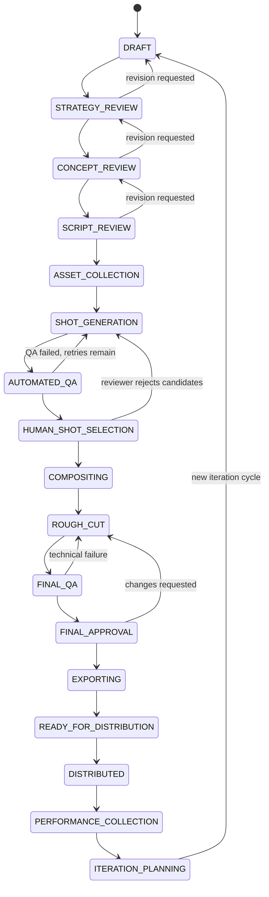

# Combat Creative OS — domain model, persistence, and campaign state machine

Status: implemented this milestone (domain schemas, Prisma models, transition
service, repository layer, tests). No specialist agent, provider integration,
or dashboard UI is implemented here — see `packages/agents/README.md` and
`docs/architecture.md` §7.1/§8. Live migrations have **not** been applied —
see "Known limitations" at the end of this document.

---

## 1. Where things live

| Concern | Location |
| --- | --- |
| Zod schemas (source of truth; TS types are inferred, never hand-duplicated) | `packages/domain/src/schemas/*.ts` |
| Campaign stage enum, transition table, typed errors, pure evaluator | `packages/domain/src/workflow/*.ts` |
| Prisma models/migrations | `packages/database/prisma/schema.prisma` |
| Transition service (atomicity/idempotency/concurrency/budget/audit) | `packages/database/src/repositories/campaign-transition-service.ts` |
| Fact derivation from persisted state | `packages/database/src/repositories/transition-facts.ts` |
| Budget ledger | `packages/database/src/repositories/budget-repository.ts` |
| Asset lineage | `packages/database/src/repositories/asset-repository.ts` |
| Prompt versioning | `packages/database/src/repositories/prompt-repository.ts` |
| Human approval (immutable) | `packages/database/src/repositories/human-approval-repository.ts` |

Every Zod schema has an inferred `type X = z.infer<typeof XSchema>` — there is
no hand-written interface anywhere in `packages/domain` duplicating a schema's
shape.

---

## 2. The 24 required domain schemas

| Schema | File | Notes |
| --- | --- | --- |
| CampaignBrief | `schemas/campaign.ts` | versioned, immutable once `acceptedAt` is set |
| AudienceProfile | `schemas/audience-profile.ts` | child of a CampaignBrief |
| CreativeConcept | `schemas/creative-concept.ts` | versioned |
| VisualLanguage | `schemas/creative-concept.ts` | 1:1 with a CreativeConcept version |
| Script | `schemas/script.ts` | versioned |
| Timeline | `schemas/timeline.ts` | versioned; `entries` reference Shot + TransitionSpecification |
| Shot | `schemas/shot.ts` | belongs to a Script |
| TransitionSpecification | `schemas/transition-specification.ts` | reusable cut/dissolve/wipe/fade definition |
| GenerationPrompt | `schemas/generation-prompt.ts` | `promptVersionId` is **mandatory** |
| GenerationCandidate | `schemas/generation-candidate.ts` | one video-gen attempt |
| QualityAssessment | `schemas/quality-assessment.ts` | assesses a candidate *or* a final-master asset (XOR) |
| QualityFailure | `schemas/quality-assessment.ts` | structured failure detail on an assessment |
| HumanApproval | `schemas/human-approval.ts` | **immutable** — insert-only repository |
| Asset | `schemas/asset.ts` | polymorphic; always has a ProvenanceRecord |
| AssetProvenance | `schemas/asset.ts` | lineage edge list (`derivedFromAssetIds`) |
| LicenseRecord | `schemas/license-record.ts` | 0..1 on Asset |
| RenderJob | `schemas/render-job.ts` | COMPOSITING or EXPORT |
| SoundCue | `schemas/sound-cue.ts` | belongs to a Timeline |
| EditDecisionList | `schemas/edit-decision-list.ts` | versioned; `entries` reference Asset |
| DeliverySpecification | `schemas/delivery-specification.ts` | per platform/aspect-ratio |
| CreativeVariant | `schemas/creative-variant.ts` | a rendered delivery-spec-conformant cut |
| PerformanceMetrics | `schemas/performance-metrics.ts` | per CreativeVariant, per platform |
| PromptTemplate | `schemas/prompt-template.ts` | one per agent/purpose |
| PromptVersion | `schemas/prompt-template.ts` | monotonically versioned; pinned by GenerationPrompt |
| BudgetPolicy | `schemas/budget-policy.ts` | cap at WORKSPACE/CAMPAIGN/SHOT/PROVIDER level |

Three supporting tables exist beyond the literal 24, because the explicit
requirements ("audited", "idempotent", "immutable approval records") need
somewhere to live:

- **Campaign** — the aggregate root the state machine operates on (`schemas/campaign.ts`).
- **BudgetLedgerEntry** — the append-only spend log a BudgetPolicy's remaining
  amount is computed over (`schemas/budget-policy.ts`).
- **CampaignTransitionAudit** — the append-only, per-attempt audit trail and
  idempotency mechanism (`workflow/transition-audit.ts`).

---

## 3. Tenancy scoping

Every table above carries a `workspaceId` column with an index (CLAUDE.md).
A real FK-with-cascade to `Workspace` is declared only on the aggregate roots
queried directly by API/activity code — `Campaign`, `Asset`, `HumanApproval`,
`PromptTemplate`, `BudgetPolicy`, `BudgetLedgerEntry`, `CampaignTransitionAudit`.
Deeply-nested child tables (`Shot`, `GenerationPrompt`, `QualityFailure`, …)
rely on their immediate parent's FK chain up to `Campaign`/`Workspace` for
referential integrity, and carry `workspaceId` as a denormalized, indexed
scoping column so the repository layer can always filter directly on it
without joining up the chain — consistent with the existing
`membership-repository.ts` convention of taking `workspaceId` as every
function's first argument.

---

## 4. Campaign state machine

### 4.1 Stages



This is the exhaustive transition table — see
`packages/domain/src/workflow/transition-rules.ts`'s `CAMPAIGN_TRANSITIONS`
constant. Any `(from, to)` pair not listed there is invalid by construction;
there is no fallback/default-allow path. 24 transitions total: 16 forward, 8
revision/failure loops.

**Relationship to docs/architecture.md §3.1.** That earlier diagram used
coarser stage names (`CONCEPT`, `SCRIPTING`, `PROMPTING`, `GENERATION`, …)
and treated only concept/shot-selection/final-master as human gates. This
schema work supersedes it with the 17-stage breakdown above per this
milestone's requirements, and — per CLAUDE.md's rule that a narrowing of a
"resolved" architecture decision gets a note rather than a silent edit — a
corresponding entry has been added to `docs/architecture.md` §7.1 (item 8)
recording that **STRATEGY_REVIEW, CONCEPT_REVIEW, and SCRIPT_REVIEW are now
also treated as immutable-approval-gated human review stages**, in addition
to the three gates the architecture doc originally called out. The
underlying principle ("human gates require immutable approval records,
enforced server-side, never bypassable by workflow/activity code") is
unchanged; only the *count* of gated stages grew.

### 4.2 Prerequisites and human gates

Every transition has a `requiredFacts: TransitionFactKey[]` list; the pure
`evaluateCampaignTransition(from, to, facts)` function only returns `{ ok: true }`
once every required fact is `true`. Five forward transitions additionally
carry a `requiredApprovalGate`:

| Transition | Gate |
| --- | --- |
| `STRATEGY_REVIEW -> CONCEPT_REVIEW` | `STRATEGY` |
| `CONCEPT_REVIEW -> SCRIPT_REVIEW` | `CONCEPT` |
| `SCRIPT_REVIEW -> ASSET_COLLECTION` | `SCRIPT` |
| `HUMAN_SHOT_SELECTION -> COMPOSITING` | `SHOT_SELECTION` |
| `FINAL_APPROVAL -> EXPORTING` | `FINAL` |

The corresponding fact (e.g. `strategyApproved`) is derived by
`computeTransitionFacts` from the **most recent `HumanApproval` row at that
gate** (`latestApprovalForGate`, sorted by `decidedAt`) — never from a
caller-supplied claim. `HumanApproval` rows are immutable: a revised decision
is a new row, and `human-approval-repository.ts` exposes only `create` and
read helpers, no update/delete. Every applied transition through a gate
records the deciding `HumanApproval.id` on the `CampaignTransitionAudit.approvalId`
column, so "which approval authorized this transition" is always
reconstructible.

### 4.3 Atomicity, idempotency, concurrency, audit

`attemptCampaignTransition` (`campaign-transition-service.ts`) performs, as
one caller-managed transaction:

1. **Idempotency check.** `(campaignId, idempotencyKey)` is unique on
   `CampaignTransitionAudit`. A duplicate request returns the original
   outcome (reconstructed from the stored audit row) instead of
   re-evaluating anything.
2. **Rule evaluation.** Facts are derived from persisted state
   (§4.2/§5) and checked against the pure transition table.
3. **Budget check + reservation** (only for transitions into
   `SHOT_GENERATION`) at the WORKSPACE and CAMPAIGN levels — see §5.3.
4. **Compare-and-swap stage update.** `campaign.updateMany({ where: { id,
   workspaceId, currentStage, version }, data: { currentStage: next, version:
   { increment: 1 } } })`. If no row matches (because another attempt already
   moved the campaign), `count === 0` and the caller gets a typed
   `CONCURRENT_MODIFICATION` error — this is what makes concurrent transition
   attempts safe without a Postgres advisory lock.
5. **Audit write.** Every attempt — applied or rejected, for every reason —
   writes a `CampaignTransitionAudit` row. Nothing is audited only on success.

A production caller wraps this in `prisma.$transaction(async (tx) =>
attemptCampaignTransition(tx, request))` so steps 1–5 commit or roll back
together (a Prisma `TransactionClient` structurally satisfies the narrow
`CampaignTransitionDataSource` interface this function takes — the same
narrow-interface convention `membership-repository.ts` established).
`campaign-transition-service.test.ts` exercises the same logic against an
in-memory fake that reproduces Postgres's unique-constraint and
row-matching semantics, including a real `Promise.all` race for the
concurrency test.

**Example: a rejected transition attempt (JSON sketch of the audit row that would be written)**

```json
{
  "id": "b2b9…",
  "campaignId": "8f31…",
  "idempotencyKey": "wf-run-42:CONCEPT_REVIEW:approve:1",
  "fromStage": "CONCEPT_REVIEW",
  "toStage": "SCRIPT_REVIEW",
  "result": "REJECTED_MISSING_PREREQUISITE",
  "reason": "Cannot transition campaign from CONCEPT_REVIEW to SCRIPT_REVIEW: missing prerequisite(s) conceptApproved",
  "approvalId": null,
  "createdAt": "2026-07-23T18:04:11.000Z"
}
```

**Example: budget rejection.** A `BudgetPolicy` at `level=CAMPAIGN` with
`limitCents=100000` and ledger entries summing (via `computeSpentCents`) to
95000 spent; a request to enter `SHOT_GENERATION` with
`generationBudgetCents=8000` computes `remaining=5000 < 8000` and is rejected
with `{ type: 'BUDGET_EXCEEDED', level: 'CAMPAIGN', requiredCents: 8000,
remainingCents: 5000 }` — no stage change, no ledger row written, and (if an
earlier level in the same request had already reserved) that reservation is
released before returning.

### 4.4 Bounded retries

`AUTOMATED_QA -> SHOT_GENERATION` (retry) is only valid while
`automatedQARetryAllowed` is true: a shot that hasn't yet passed automated QA
and whose highest `GenerationCandidate.attempt` is still below
`MAX_SHOT_GENERATION_ATTEMPTS` (3, matching architecture.md §3.3's stated
default). Once a shot exhausts its attempts, this fact is false and the
workflow-level caller must route it to `HUMAN_SHOT_SELECTION` as a
`NEEDS_HUMAN` shot instead of retrying forever — there is no unbounded loop
in this table.

---

## 5. Deriving facts from persisted state

`loadTransitionFactInputs` fetches flat, un-nested rows (briefs, approvals,
scripts, shots, generation prompts/candidates, quality assessments, render
jobs, edit decision lists, delivery specs, creative variants, performance
metrics) for one campaign. `computeTransitionFacts` then joins them **in
memory** into the boolean facts a transition needs. This split (I/O layer vs.
pure computation layer) is what lets `transition-rules.test.ts` (in
`packages/domain`) test the rule table with hand-built facts, and what lets
`campaign-transition-service.test.ts` (in `packages/database`) test the full
service against an in-memory store — neither needs a live database.

Several facts are deliberate MVP heuristics, called out here so they're not
mistaken for finished business logic:

- `allShotsHaveRequiredAssets` is approximated as "the latest Script has at
  least one Shot" — there is no dedicated `RequiredAsset` join table yet.
- `compositingComplete` / `exportRenderComplete` check for *any* successful
  `RenderJob` of the right kind, not a per-shot completeness join.
- `deliverySpecMet` / `distributionConfirmed` check for *any* `CreativeVariant`
  in the right status, not a full per-platform matrix.

These will be tightened once the workflows/activities milestones (M6–M12,
architecture.md §8) that actually populate these tables in fine grain are
built. The mechanism they plug into (atomicity, idempotency, audit, typed
errors) does not depend on the heuristics being exact.

---

## 6. Asset lineage

Every `Asset` is created together with its `AssetProvenance` row in one call
(`createAssetWithProvenance`) — there is no code path that creates an asset
without one. `traceAssetLineage` walks `derivedFromAssetIds` backwards
breadth-first (cycle-guarded) to return an asset's full ancestry:

```
FINAL_MASTER "final.mp4"
  ← derivedFrom: MOTION_GRAPHICS_RENDER "composited.mp4"
      ← derivedFrom: VIDEO_CANDIDATE "candidate.mp4"  (createdByAgentInvocationId, providerJobRef recorded)
```

`traceAssetLineage(db, workspaceId, finalMasterId)` returns
`["composited.mp4"'s id, "candidate.mp4"'s id]` — see
`asset-repository.test.ts` for the executable version of this example.

---

## 7. Prompt versioning

`PromptTemplate` (one per agent/purpose) has many `PromptVersion` rows,
versioned by a monotonically increasing integer (`nextPromptVersionNumber`).
`GenerationPrompt.promptVersionId` is a **mandatory**, non-nullable field
(both in the Zod schema and the Prisma FK) — there is no
`recordGenerationPrompt` call that can omit it. Given a `GenerationPrompt`
row, the exact system prompt text used for that generation is always
reconstructible via `promptVersionId -> PromptVersion.systemPrompt`.

---

## 8. Known limitations

- **No live migration has been applied.** This environment has neither
  Docker nor a locally running Postgres (`docker` is not installed; port 5432
  is not listening). `pnpm db:validate` and `pnpm db:generate` (schema
  validation and Prisma Client generation) succeed without a database
  connection and have been run — the schema is valid and compiles to correct
  PostgreSQL DDL (spot-checked via `prisma migrate diff --from-empty
  --to-schema-datamodel ... --script`, which also needs no live connection).
  Per CLAUDE.md's migration rule, migration files are only ever created by
  `pnpm --filter @combat/database run migrate` (`prisma migrate dev`) against
  a live Postgres — they are never hand-authored — so no migration has been
  written to `packages/database/prisma/migrations/`. Run `docker compose -f
  infrastructure/docker-compose.yml up -d postgres` and then `pnpm db:migrate`
  to create and apply the initial migration once Postgres is available.
- Fact-derivation heuristics are MVP-level — see §5.
- No specialist agent, provider integration, or dashboard UI exists yet
  (out of scope for this milestone — see `packages/agents/README.md`).
- The four-level (workspace/campaign/shot/provider) budget check is fully
  implemented in `budget-repository.ts` and exercised at the WORKSPACE and
  CAMPAIGN levels by the transition service; SHOT- and PROVIDER-level checks
  are expected to be invoked at generation-dispatch granularity inside the
  future `ShotGenerationWorkflow` activity (architecture.md §3.3), not at the
  campaign-stage-transition granularity this milestone implements.
