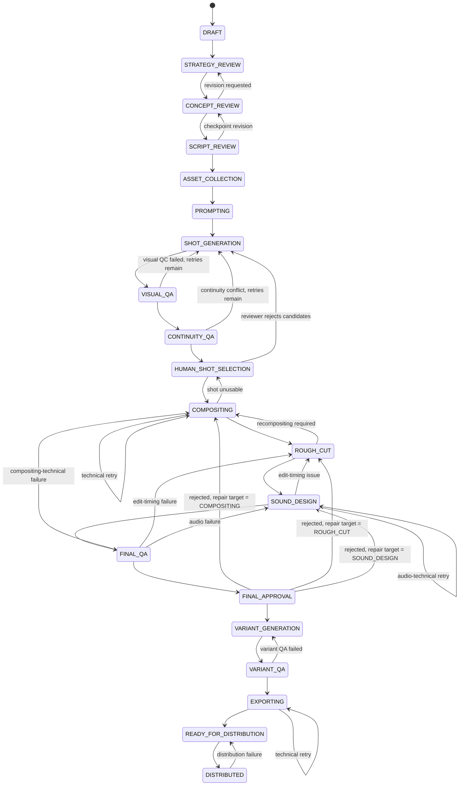

# Combat Creative OS — domain model, persistence, and campaign state machine

Status: implemented this milestone (domain schemas, Prisma models, transition
service, repository layer, tests). No specialist agent, provider integration,
or dashboard UI is implemented here — see `packages/agents/README.md` and
`docs/architecture.md` §7.1/§8. Live migrations have **not** been applied —
see "Known limitations" at the end of this document.

**This document describes the corrected, canonical 20-stage state machine.**
An interim revision briefly implemented a 17-stage machine that folded
performance analysis into the linear campaign pipeline and dropped several
distinct stages/gates — that was identified as a deviation from
`docs/architecture.md` §3.1's decoupled-performance-analysis decision and has
been corrected; see `docs/adr/0002-campaign-lifecycle-alignment.md` for the
full history.

---

## 1. Where things live

| Concern                                                                     | Location                                                            |
| --------------------------------------------------------------------------- | ------------------------------------------------------------------- |
| Zod schemas (source of truth; TS types are inferred, never hand-duplicated) | `packages/domain/src/schemas/*.ts`                                  |
| Campaign stage enum, transition table, typed errors, pure evaluator         | `packages/domain/src/workflow/*.ts`                                 |
| Prisma models/migrations                                                    | `packages/database/prisma/schema.prisma`                            |
| Transition service (atomicity/idempotency/concurrency/budget/audit)         | `packages/database/src/repositories/campaign-transition-service.ts` |
| Fact derivation from persisted state                                        | `packages/database/src/repositories/transition-facts.ts`            |
| Budget ledger                                                               | `packages/database/src/repositories/budget-repository.ts`           |
| Asset lineage                                                               | `packages/database/src/repositories/asset-repository.ts`            |
| Prompt versioning                                                           | `packages/database/src/repositories/prompt-repository.ts`           |
| Specialist-agent invocation outcomes (ADR-0004)                             | `packages/database/src/repositories/agent-invocation-repository.ts` |
| Human approval (immutable)                                                  | `packages/database/src/repositories/human-approval-repository.ts`   |

Every Zod schema has an inferred `type X = z.infer<typeof XSchema>` — there is
no hand-written interface anywhere in `packages/domain` duplicating a schema's
shape.

---

## 2. The 24 required domain schemas

| Schema                   | File                                  | Notes                                                                                                                                                                                                                                                                    |
| ------------------------ | ------------------------------------- | ------------------------------------------------------------------------------------------------------------------------------------------------------------------------------------------------------------------------------------------------------------------------ |
| CampaignBrief            | `schemas/campaign.ts`                 | versioned, immutable once `acceptedAt` is set                                                                                                                                                                                                                            |
| AudienceProfile          | `schemas/audience-profile.ts`         | child of a CampaignBrief                                                                                                                                                                                                                                                 |
| CreativeConcept          | `schemas/creative-concept.ts`         | versioned                                                                                                                                                                                                                                                                |
| VisualLanguage           | `schemas/creative-concept.ts`         | 1:1 with a CreativeConcept version                                                                                                                                                                                                                                       |
| Script                   | `schemas/script.ts`                   | versioned                                                                                                                                                                                                                                                                |
| Timeline                 | `schemas/timeline.ts`                 | versioned; `entries` reference Shot + TransitionSpecification                                                                                                                                                                                                            |
| Shot                     | `schemas/shot.ts`                     | belongs to a Script                                                                                                                                                                                                                                                      |
| TransitionSpecification  | `schemas/transition-specification.ts` | reusable cut/dissolve/wipe/fade definition                                                                                                                                                                                                                               |
| ShotSpecification        | `schemas/shot-specification.ts`       | M6 — supersedes the originally-scoped, thinner `GenerationPrompt`; `promptVersionId` is **mandatory**; versioned per shot, full cinematographic brief (see §8's M6 accounting via docs/architecture.md §8)                                                               |
| GenerationCandidate      | `schemas/generation-candidate.ts`     | one requested video-gen output within a `ShotGenerationAttempt`                                                                                                                                                                                                          |
| QualityAssessment        | `schemas/quality-assessment.ts`       | **immutable**; assesses a candidate _or_ a stage-output asset (XOR); `subjectStage` disambiguates which stage; M7 added `campaignId`, `overallScore`, and `createdByAgentInvocationId` provenance, plus a unique `(generationCandidateId, subjectStage)` idempotency key |
| QualityFailure           | `schemas/quality-assessment.ts`       | structured failure detail on an assessment; `category` drives typed revision routing (§4.2)                                                                                                                                                                              |
| HumanApproval            | `schemas/human-approval.ts`           | **immutable** — insert-only repository; `repairTarget` required for a rejected `FINAL` decision                                                                                                                                                                          |
| ShotSelectionSet         | `schemas/shot-selection.ts`           | M8 — one versioned revision of the reviewer's shot choices at HUMAN_SHOT_SELECTION; DRAFT is editable, **APPROVED is immutable**; `revision` is an optimistic-concurrency counter                                                                                        |
| ShotSelection            | `schemas/shot-selection.ts`           | M8 — one choice per required shot within a set; SELECTED needs a candidate, REJECTED needs regeneration feedback; carries the concept/script/spec versions + QA-assessment ids the choice was made against                                                               |
| ShotSelectionReplacement | `schemas/shot-selection.ts`           | M8 — append-only replacement history (who swapped which candidate, and why)                                                                                                                                                                                              |
| Asset                    | `schemas/asset.ts`                    | polymorphic; always has a ProvenanceRecord                                                                                                                                                                                                                               |
| AssetProvenance          | `schemas/asset.ts`                    | lineage edge list (`derivedFromAssetIds`)                                                                                                                                                                                                                                |
| LicenseRecord            | `schemas/license-record.ts`           | 0..1 on Asset                                                                                                                                                                                                                                                            |
| RenderJob                | `schemas/render-job.ts`               | COMPOSITING or EXPORT                                                                                                                                                                                                                                                    |
| SoundCue                 | `schemas/sound-cue.ts`                | belongs to a Timeline; M10 attaches a mock `SOUND_STEM` asset; its existence on the campaign's Timeline is the `soundDesignComplete` fact                                                                                                                                |
| SoundDesignPlan          | `schemas/sound-design-plan.ts`        | M10 — the Sound Director's **immutable**, versioned plan (music brief + mix notes + brand guidelines + prompt/agent provenance); references its Timeline + rough edit                                                                                                    |
| EditDecisionList         | `schemas/edit-decision-list.ts`       | versioned; `entries` reference Asset; its existence is the `roughCutAssembled` fact                                                                                                                                                                                      |
| RoughEditSpecification   | `schemas/rough-edit-specification.ts` | M9 — the Edit Director's canonical, **immutable**, versioned rough-edit brief (timeline tracks/clips/transitions + overlays as validated nested structures); pins the approved ShotSelectionSet + concept/script versions + prompt/agent provenance                      |
| CompositionJob           | `schemas/composition-job.ts`          | M9 — mutable status row grouping the bounded-retry render attempts for one RoughEditSpecification (same split as ShotGenerationJob)                                                                                                                                      |
| CompositionAttempt       | `schemas/composition-job.ts`          | M9 — immutable append-only render attempt; provider project/job ids, budget reservation + actual usage, typed failure                                                                                                                                                    |
| DeliveryProfile          | `schemas/delivery-profile.ts`         | M12 — the named, **immutable**, versioned delivery contract variants are cut and judged against (`VERTICAL_SHORT_FORM_V1`); resolves architecture.md §7.2 item 5                                                                                                         |
| DeliverySpecification    | `schemas/delivery-specification.ts`   | per platform/aspect-ratio; derived from a DeliveryProfile                                                                                                                                                                                                                |
| VariantSpecification     | `schemas/variant-specification.ts`    | M12 — the canonical, **immutable**, versioned cut recipe (exact cut points + retained clips/cues/captions + CTA placement); pins the parent FINAL_MASTER, its FINAL_QA assessment, and every upstream version. Frozen once approved for export                           |
| VariantGenerationJob     | `schemas/variant-generation-job.ts`   | M12 — mutable status row grouping the bounded-retry render attempts for one VariantSpecification (same split as CompositionJob)                                                                                                                                          |
| VariantGenerationAttempt | `schemas/variant-generation-job.ts`   | M12 — immutable append-only render attempt; provider ids, budget reservation + actual usage, typed failure                                                                                                                                                               |
| CreativeVariant          | `schemas/creative-variant.ts`         | a rendered delivery-spec-conformant cut; M12 links it to its VariantSpecification and its VARIANT_QA assessment                                                                                                                                                          |
| PerformanceMetrics       | `schemas/performance-metrics.ts`      | M0 per-variant rollup shape; **superseded by `PerformanceObservation`** as the real ingestion entity (no post identity, no source, no window, caller-supplied `ctr`)                                                                                                     |
| PerformanceObservation   | `schemas/performance-observation.ts`  | M13 — architecture.md §4.1's `PerformanceRecord`: one **immutable** measurement of one published creative over one **closed** window; post identity + source provenance + raw counters + derived rates. Idempotent per (post, platform, window)                          |
| LearningRecord           | `schemas/learning-record.ts`          | M13 — architecture.md §4.1's `Learning`, promoted into a real table: **immutable**, versioned per `learningKey`, with explicit evidence references, **derived** confidence, applicability and agent/prompt provenance                                                    |
| PromptTemplate           | `schemas/prompt-template.ts`          | one per agent/purpose                                                                                                                                                                                                                                                    |
| PromptVersion            | `schemas/prompt-template.ts`          | monotonically versioned; pinned by ShotSpecification                                                                                                                                                                                                                     |
| BudgetPolicy             | `schemas/budget-policy.ts`            | cap at WORKSPACE/CAMPAIGN/SHOT/PROVIDER level                                                                                                                                                                                                                            |

Three supporting tables exist beyond the literal 24, because the explicit
requirements ("audited", "idempotent", "immutable approval records") need
somewhere to live:

- **Campaign** — the aggregate root the state machine operates on (`schemas/campaign.ts`).
- **BudgetLedgerEntry** — the append-only spend log a BudgetPolicy's remaining
  amount is computed over (`schemas/budget-policy.ts`).
- **CampaignTransitionAudit** — the append-only, per-attempt audit trail and
  idempotency mechanism (`workflow/transition-audit.ts`).

M6 added two more, for the same reason — `ShotGenerationWorkflow`'s
bounded-retry attempt history and per-attempt provider-job identity need
somewhere to live that isn't overloaded onto `GenerationCandidate`:

- **ShotGenerationJob** (`schemas/shot-generation-job.ts`) — one per
  `ShotSpecification`, mutable status/`attemptCount` row (same "mutable
  status, immutable content" split as `RenderJob`/`CreativeVariant`), groups
  the attempt sequence below.
- **ShotGenerationAttempt** (`schemas/shot-generation-attempt.ts`) — one row
  per bounded-retry attempt (append-only retry history), carrying
  `idempotencyKey`, `providerId`/`providerJobId`, `generationParams`,
  `estimatedCostCents`/`actualCostCents`, and terminal failure detail.
  `GenerationCandidate` now references its producing attempt
  (`shotGenerationAttemptId`) rather than carrying its own `attempt` number.

---

## 3. Tenancy scoping

Every table above carries a `workspaceId` column with an index (CLAUDE.md).
A real FK-with-cascade to `Workspace` is declared only on the aggregate roots
queried directly by API/activity code — `Campaign`, `Asset`, `HumanApproval`,
`PromptTemplate`, `BudgetPolicy`, `BudgetLedgerEntry`, `CampaignTransitionAudit`.
Deeply-nested child tables (`Shot`, `ShotSpecification`, `QualityFailure`, …)
rely on their immediate parent's FK chain up to `Campaign`/`Workspace` for
referential integrity, and carry `workspaceId` as a denormalized, indexed
scoping column so the repository layer can always filter directly on it
without joining up the chain — consistent with the existing
`membership-repository.ts` convention of taking `workspaceId` as every
function's first argument.

---

## 4. Campaign state machine

### 4.1 Stages



This is the exhaustive transition table — see
`packages/domain/src/workflow/transition-rules.ts`'s `CAMPAIGN_TRANSITIONS`
constant. Any `(from, to)` pair not listed there is invalid by construction;
there is no fallback/default-allow path. **38 transitions total: 19 forward,
19 revision/failure loops** — three of which (`COMPOSITING`, `SOUND_DESIGN`,
`EXPORTING`) are same-stage technical-retry loops that don't regress any
earlier creative approval.

**Relationship to docs/architecture.md §3.1 and ADR-0002.** That earlier
diagram used different stage names for an equivalent 19-stage pipeline. This
document's 20-stage machine is the corrected, canonical implementation —
see `docs/adr/0002-campaign-lifecycle-alignment.md` for the full account of
what changed and why, including a brief interim 17-stage implementation that
was found to deviate from the architecture and has been superseded.

### 4.2 Prerequisites and human gates

Every transition has a `requiredFacts: TransitionFactKey[]` list; the pure
`evaluateCampaignTransition(from, to, facts)` function only returns `{ ok: true }`
once every required fact is `true`. **Exactly three** forward transitions
carry a `requiredApprovalGate` — matching docs/architecture.md's original
three-gate design exactly:

| Transition                             | Gate             |
| -------------------------------------- | ---------------- |
| `CONCEPT_REVIEW -> SCRIPT_REVIEW`      | `CONCEPT`        |
| `HUMAN_SHOT_SELECTION -> COMPOSITING`  | `SHOT_SELECTION` |
| `FINAL_APPROVAL -> VARIANT_GENERATION` | `FINAL`          |

The corresponding fact (e.g. `conceptApproved`) is derived by
`computeTransitionFacts` from the **most recent `HumanApproval` row at that
gate** (`latestApprovalForGate`, sorted by `decidedAt`) — never from a
caller-supplied claim. `HumanApproval` rows are immutable: a revised decision
is a new row, and `human-approval-repository.ts` exposes only `create` and
read helpers, no update/delete. Every applied transition through a gate
records the deciding `HumanApproval.id` on the `CampaignTransitionAudit.approvalId`
column, so "which approval authorized this transition" is always
reconstructible.

`STRATEGY_REVIEW` and `SCRIPT_REVIEW` are deliberately **not** gates —
`STRATEGY_REVIEW -> CONCEPT_REVIEW` requires only `conceptDrafted` (a
`CreativeConcept` exists) and `SCRIPT_REVIEW -> ASSET_COLLECTION` requires
only `scriptDrafted` (a `Script` exists); neither checks a `HumanApproval`
record. `SCRIPT_REVIEW`'s revision edge back to `CONCEPT_REVIEW` is
consequently the **one** transition in the entire table with an empty
`requiredFacts` list — a deliberate, documented exception (see the inline
comment on that entry in `transition-rules.ts`), not an oversight of "every
transition must have prerequisites."

#### Typed failure routing

`COMPOSITING`, `SOUND_DESIGN`, and `FINAL_QA` each have more than one valid
revision target, disambiguated by a **typed `QualityFailureCategory`** rather
than caller choice:

| Category                | Routes to              | Used by                                 |
| ----------------------- | ---------------------- | --------------------------------------- |
| `SHOT_UNUSABLE`         | `HUMAN_SHOT_SELECTION` | `COMPOSITING`                           |
| `COMPOSITING_TECHNICAL` | `COMPOSITING`          | `COMPOSITING` (self-retry), `FINAL_QA`  |
| `EDIT_TIMING`           | `ROUGH_CUT`            | `SOUND_DESIGN`, `FINAL_QA`              |
| `AUDIO_TECHNICAL`       | `SOUND_DESIGN`         | `SOUND_DESIGN` (self-retry), `FINAL_QA` |

`packages/domain/src/workflow/quality-failure-routing.ts`'s
`QUALITY_FAILURE_ROUTING` map is the single source of truth for this table;
`transition-facts.ts` reverse-looks-up a target stage's category from that
map rather than hardcoding it a second time. Each candidate revision edge
checks for the **existence** of an asset-based `QualityAssessment` (`pass:
false`) tagged `subjectStage` for that stage, with an attached `QualityFailure`
of the matching category (`assetAssessmentExists` in `transition-facts.ts`).

`FINAL_APPROVAL`'s rejection is the one case where the target is a **human
choice**, not an automated category: `HumanApproval.repairTarget` is
required (and Zod-validated to one of `COMPOSITING | ROUGH_CUT |
SOUND_DESIGN`) exactly when `gate = FINAL` and `decision != APPROVED`. Because
`latestApprovalForGate` only considers the single most recent decision per
gate, a campaign can only be actively routed to _one_ of the three targets at
a time from a given rejection — reflected in
`campaign-transition-service.test.ts`'s dedicated per-target tests for this
edge (it is not covered by the generic all-revision-facts-true fixture used
for every other revision transition).

`ROUGH_CUT -> COMPOSITING`, `EXPORTING -> EXPORTING`, and `DISTRIBUTED ->
READY_FOR_DISTRIBUTION` each have exactly one target and need no category
disambiguation — they're gated on a plain existence/status fact instead.

### 4.3 Atomicity, idempotency, concurrency, audit

`attemptCampaignTransition` (`campaign-transition-service.ts`) performs, as
one caller-managed transaction:

1. **Idempotency check.** `(campaignId, idempotencyKey)` is unique on
   `CampaignTransitionAudit`. A duplicate request returns the original
   outcome (reconstructed from the stored audit row) instead of
   re-evaluating anything.
2. **Rule evaluation.** Facts are derived from persisted state
   (§4.2/§5) and checked against the pure transition table.
3. **Budget check + reservation** (only for transitions into
   `SHOT_GENERATION`) at the WORKSPACE and CAMPAIGN levels — see §5.3.
4. **Compare-and-swap stage update.** `campaign.updateMany({ where: { id,
workspaceId, currentStage, version }, data: { currentStage: next, version:
{ increment: 1 } } })`. If no row matches (because another attempt already
   moved the campaign), `count === 0` and the caller gets a typed
   `CONCURRENT_MODIFICATION` error — this is what makes concurrent transition
   attempts safe without a Postgres advisory lock.
5. **Audit write.** Every attempt — applied or rejected, for every reason —
   writes a `CampaignTransitionAudit` row. Nothing is audited only on success.

A production caller wraps this in `prisma.$transaction(async (tx) =>
attemptCampaignTransition(tx, request))` so steps 1–5 commit or roll back
together (a Prisma `TransactionClient` structurally satisfies the narrow
`CampaignTransitionDataSource` interface this function takes — the same
narrow-interface convention `membership-repository.ts` established).
`campaign-transition-service.test.ts` exercises the same logic against an
in-memory fake that reproduces Postgres's unique-constraint and
row-matching semantics, including a real `Promise.all` race for the
concurrency test.

**Example: a rejected transition attempt (JSON sketch of the audit row that would be written)**

```json
{
  "id": "b2b9…",
  "campaignId": "8f31…",
  "idempotencyKey": "wf-run-42:CONCEPT_REVIEW:approve:1",
  "fromStage": "CONCEPT_REVIEW",
  "toStage": "SCRIPT_REVIEW",
  "result": "REJECTED_MISSING_PREREQUISITE",
  "reason": "Cannot transition campaign from CONCEPT_REVIEW to SCRIPT_REVIEW: missing prerequisite(s) conceptApproved",
  "approvalId": null,
  "createdAt": "2026-07-23T18:04:11.000Z"
}
```

**Example: budget rejection.** A `BudgetPolicy` at `level=CAMPAIGN` with
`limitCents=100000` and ledger entries summing (via `computeSpentCents`) to
95000 spent; a request to enter `SHOT_GENERATION` with
`generationBudgetCents=8000` computes `remaining=5000 < 8000` and is rejected
with `{ type: 'BUDGET_EXCEEDED', level: 'CAMPAIGN', requiredCents: 8000,
remainingCents: 5000 }` — no stage change, no ledger row written, and (if an
earlier level in the same request had already reserved) that reservation is
released before returning.

### 4.4 Bounded retries

`VISUAL_QA -> SHOT_GENERATION` and `CONTINUITY_QA -> SHOT_GENERATION` (each a
retry) are only valid while `visualQARetryAllowed`/`continuityQARetryAllowed`
is true: a shot that hasn't yet passed the respective check and whose
`ShotGenerationJob.attemptCount` is still below its `maxAttempts` (M6 —
before `ShotGenerationJob` existed, this was tracked as a per-candidate
`attempt` field; that field is gone, superseded by the job's own
`attemptCount`/`maxAttempts`, both set from
`MAX_SHOT_GENERATION_ATTEMPTS`, 3, matching architecture.md §3.3's stated
default). Once a shot exhausts its attempts, the fact is false and the
workflow-level caller must route it to `HUMAN_SHOT_SELECTION` as a
`NEEDS_HUMAN` shot instead of retrying forever — there is no unbounded loop
for shot generation in this table.

The three same-stage technical-retry loops (`COMPOSITING`, `SOUND_DESIGN`,
`EXPORTING`) are **not** currently bounded by an attempt counter — each is
gated only on the existence of a matching technical-failure signal, not a
capped retry count. This is a known limitation (§8), consistent with
CLAUDE.md's "bound retries explicitly" rule only being fully applied to the
shot-generation loop in this milestone; extending bounded retries to these
three loops is expected before production hardening (architecture.md §8,
M14).

**M14 hardening notes.** Two invariants this document describes were previously
enforced only by convention and are now enforced by code and covered by tests:

- _Resource association, not just tenancy._ A repository call that folds
  `workspaceId` into its lookup proves the row belongs to the tenant, but not
  that it belongs to the **campaign** being acted on. Two campaigns in one
  workspace are distinct resources, so `apps/api` now verifies a client-supplied
  `setId` / `creativeVariantId` / `variantAssetId` against the path campaign
  before use (`assertBelongsToCampaign`). Cross-tenant lookups answer 404 rather
  than 403, so ids stay unprobeable.
- _Budget reservation is compensating, not transactional._ `BudgetLedgerEntry`
  is append-only and every amount is derived from it, so a reservation is a
  read-then-write. Under concurrency the ledger prefix up to a new reservation
  is re-summed and the row that crossed the cap is released, leaving earlier
  writers standing. The durable fix is a `SERIALIZABLE` transaction in Postgres;
  the compensating guard is what this environment can actually test.

---

## 5. Deriving facts from persisted state

`loadTransitionFactInputs` fetches flat, un-nested rows (briefs, approvals,
concepts, scripts, shots, generation prompts/candidates, quality assessments
and failures, render jobs, edit decision lists, delivery specs, creative
variants, timelines, sound cues) for one campaign. `computeTransitionFacts`
then joins them **in memory** into the boolean facts a transition needs.
This split (I/O layer vs. pure computation layer) is what lets
`transition-rules.test.ts` (in `packages/domain`) test the rule table with
hand-built facts, and what lets `campaign-transition-service.test.ts` (in
`packages/database`) test the full service against an in-memory store —
neither needs a live database. Performance-related tables are deliberately
never loaded here — performance analysis is a separate, decoupled workflow
(ADR-0002) and must not feed campaign-stage transition facts.

Several facts are deliberate MVP heuristics, called out here so they're not
mistaken for finished business logic:

- `allShotsHaveRequiredAssets` is approximated as "the latest Script has at
  least one Shot" — there is no dedicated `RequiredAsset` join table yet.
- `compositingComplete` / `exportRenderComplete` / `soundDesignComplete`
  check for _any_ successful `RenderJob`/`SoundCue` of the right kind, not a
  per-shot completeness join.
- `deliverySpecMet` checks for _any_ `CreativeVariant` in the right status,
  not a full per-platform matrix.
- The typed-failure-routing facts (`*RepairTargetIs*`, `finalQAAudioFailure`,
  `roughCutFailureRequiresRecompositing`) check for the **existence** of a
  matching `QualityFailure` among a campaign's asset-based assessments, not
  specifically the most recent one for a given subject — a stale failure
  that was actually fixed by a later, unassessed attempt could in principle
  still satisfy the fact. Tightening this to "most recent assessment per
  subject" is a natural next refinement once the activities that create
  these rows exist.
- `distributionFailureDetected` and `variantQAFailed` currently share one
  underlying signal (`CreativeVariant.status === 'FAILED'`), because no
  dedicated distribution-attempt entity exists in this schema yet.

The candidate-based `VISUAL_QA`/`CONTINUITY_QA` assessments these facts read
are now produced by M7's `runVisualQualityAssessmentsActivity`/
`runContinuityAssessmentActivity` (docs/architecture.md §8, M7). Those
Activities persist through `createQualityAssessmentForCandidate`, which
refuses to record an assessment for a cross-workspace, mismatched-campaign,
or stale candidate (one that never reached `SUCCEEDED`, or has been superseded
by a newer candidate for the same shot) — so a stale assessment can't be
created in the first place, and therefore can't satisfy `allShotsPassedVisualQA`/
`allShotsPassedContinuityQA` or a `visualQARetryAllowed`/`continuityQARetryAllowed`
retry fact. The asset-based typed-failure-routing facts above remain the
existence-check heuristic described here until the compositing/sound
milestones (M9+) create those asset assessments.

M8 adds the human Shot Selection at HUMAN_SHOT_SELECTION. Candidate
eligibility is a pure evaluator (`packages/domain/src/workflow/candidate-eligibility.ts`)
fed by `gatherCandidateEligibility` (`packages/database`): a candidate may be
selected only when it is SUCCEEDED, its asset is READY, it is the latest
candidate, VISUAL_QA and CONTINUITY_QA passed, it carries no unresolved
blocking defect, its licensing/versions match, and it has not been superseded.
The `allShotsSelected` transition fact is deliberately **unchanged** (still the
existence of an APPROVED SHOT_SELECTION `HumanApproval`); the stronger
"a valid, complete, current `ShotSelectionSet` exists" guarantee is enforced
in the workflow by `verifyShotSelectionActivity` before the GATE_DECISION
advance, and in `apps/api` by `approveShotSelectionSet` (which freezes the set
before recording the approval), rather than by widening the M7 fact
derivation.

M9 populates the compositing facts. `pollCompositionRenderActivity`, on a
SUCCEEDED render, writes a SUCCEEDED COMPOSITING `RenderJob` (which
`compositingComplete` reads) and the derived `EditDecisionList` (which
`roughCutAssembled` reads) — both deduped/idempotent — so a completed rough
edit lets the campaign auto-forward COMPOSITING → ROUGH_CUT → SOUND_DESIGN,
where M9 stops (BLOCKED, no Sound Director until M10). The
`CompositingWorkflow` starts only from a `verifyShotSelectionActivity`-valid
approved selection and re-checks every selected source's eligibility +
licensing (via `gatherCandidateEligibility`) inside `runEditDirectorActivity`,
so a stale/ineligible/unlicensed source can never produce a rough edit.

M10 populates `soundDesignComplete`. `runSoundDirectorActivity` runs the Sound
Director over the latest `RoughEditSpecification` and persists an assembled
`Timeline` + versioned `SoundDesignPlan` + `SoundCue`s (each with a mock
`SOUND_STEM` asset) — the existence of those cues on the campaign's Timeline is
exactly what `soundDesignComplete` joins through to find, so a completed sound
design lets the campaign auto-forward SOUND_DESIGN → FINAL_QA.

M11 populates `finalQAPassed`, `finalQARepairTargetIsCompositing`,
`finalQARepairTargetIsRoughCut` and `finalQAAudioFailure`.
`runFinalQaControllerActivity` registers the campaign's `FINAL_MASTER` asset and
runs the Final QA Controller over it, persisting the verdict as the system's
**first asset-based `QualityAssessment`** — `subjectStage: 'FINAL_QA'`, unique
per `(assetId, subjectStage)`, with one typed `QualityFailure` per finding
(`createQualityAssessmentForAsset` in `packages/database`). That is exactly the
row shape `assetAssessmentExists` already looked for, so the four FINAL_QA facts
become live without any change to their derivations.

On a pass the campaign auto-forwards FINAL_QA → FINAL_APPROVAL, where the FINAL
human gate applies unchanged. On a failure the Activity maps the findings'
categories through `QUALITY_FAILURE_ROUTING` (below), picks the **most upstream**
of FINAL_QA's three revision edges, and the workflow issues an `AUTO_RETRY`
carrying that `repairTarget`. The retry is still gated by the persisted
`finalQARepairTargetIs*` fact for the edge it names, and `AUTO_RETRY` only ever
traverses **non-gated** revision edges — a failing master can never cross the
FINAL gate, and a multi-edge stage that supplies no `repairTarget` is refused
rather than defaulted. A failure whose findings carry no routable category
M12 populates `variantsGenerated`, `variantQAPassed` and `variantQAFailed`.
The `VariantWorkflow` child cuts one `VariantSpecification` per
`DeliveryProfile` duration from the approved, Final-QA-passed `FINAL_MASTER`,
renders each, and re-runs Final QA over every completed variant — persisting
each verdict as an asset-based `QualityAssessment` with `subjectStage:
'VARIANT_QA'` over the variant's own asset, and promoting the `CreativeVariant`
to `READY` only on a pass. Those `CreativeVariant.status` values are exactly
what the three facts read: `variantsGenerated` (any variant row),
`variantQAPassed` (every row READY), `variantQAFailed` (any row FAILED).

Because only the QA re-run may set `READY`, a render alone can never satisfy
`variantQAPassed`. A failing variant takes the documented VARIANT_QA →
VARIANT_GENERATION revision edge via a bounded `AUTO_RETRY` — a single
non-gated edge, so no `repairTarget` is needed. Unlike the shot-generation
retries, `variantQAFailed` never becomes false on its own, so the bound lives
in the workflow (`maxVariantRepairAttempts`); exhausting it escalates to
BLOCKED rather than looping. Cut legality is enforced _before_ persistence by
the pure `validateVariantCut`, against the persisted `Timeline` entries, the
`RoughEditSpecification`'s caption overlays and the `SoundDesignPlan`'s discrete
cues — never against a duration guess. M12 stops at EXPORTING (BLOCKED, no
export implementation).

**M13 adds no transition facts at all**, which is the point. Performance
analysis writes only `PerformanceObservation` and `LearningRecord` rows;
neither is read by `computeTransitionFacts`, so no amount of performance data
or distilled learning can make a campaign transition become valid. The
decoupling architecture.md §3.1 requires is therefore enforced by the fact
layer as well as by the workflow's own wiring: `PerformanceAnalysisWorkflow`
proxies one Activity, defines no signals, and carries no stage, approval, asset
or export field in its state.

Learning context flows the other way — from the knowledge store _into_ an agent
prompt, never into a transition. `selectLearningContext` admits only APPROVED,
non-superseded, workspace-scoped records at or above MEDIUM confidence whose
applicability overlaps the target campaign, caps them at 5, and renders each
with its confidence band, evidence weight and source record id. A learning is
advisory context offered alongside the approved brief; the brief's own fields
are passed verbatim and are not overridable by any learning, and a human with
`APPROVE_CONCEPT` must approve a record before it is ever injected.

M11 stops at VARIANT_GENERATION (BLOCKED, no Variant
Generator until M12).

These will be tightened once the workflows/activities milestones (M6–M12,
architecture.md §8) that actually populate these tables in fine grain are
built. The mechanism they plug into (atomicity, idempotency, audit, typed
errors) does not depend on the heuristics being exact.

---

## 6. Asset lineage

Every `Asset` is created together with its `AssetProvenance` row in one call
(`createAssetWithProvenance`) — there is no code path that creates an asset
without one. `traceAssetLineage` walks `derivedFromAssetIds` backwards
breadth-first (cycle-guarded) to return an asset's full ancestry:

```
FINAL_MASTER "final.mp4"
  ← derivedFrom: MOTION_GRAPHICS_RENDER "composited.mp4"
      ← derivedFrom: VIDEO_CANDIDATE "candidate.mp4"  (createdByAgentInvocationId, providerJobRef recorded)
```

`traceAssetLineage(db, workspaceId, finalMasterId)` returns
`["composited.mp4"'s id, "candidate.mp4"'s id]` — see
`asset-repository.test.ts` for the executable version of this example.

### 6.1 Asset ingestion lifecycle (M5)

A user-uploaded asset (`kind: 'UPLOADED_SOURCE'` — the only kind
`ingestAssetActivity` itself creates; every other `AssetKind` is
agent/render-produced) moves through `ingestionStatus`:

```
PENDING --(inspectMediaActivity succeeds)--> READY
PENDING --(inspectMediaActivity fails)-----> FAILED
```

`confirm-upload` (`apps/api`) creates the row as `PENDING` once
`StorageProvider.headObject` confirms the object actually exists — it does
not run ffprobe itself (`inspectMediaActivity` is a separate, worker-owned
Activity per docs/architecture.md's process table; not wired to any live
Temporal Worker yet, matching this document's own "no live migration" /
M3's "the Activity exists before anything calls it" pattern). A `FAILED`
row is not discarded — `inspectionFailureDetails` keeps the reason, so a
failed ingestion attempt stays a permanent, auditable record rather than a
silently-lost API error.

Every `UPLOADED_SOURCE` asset also gets a `campaignId` (required — the
campaign it was ingested for) and, because licensing is mandatory for a
direct upload but optional for internally-generated assets (§2's
`LicenseRecord` "0..1 by design" note is unchanged for those), a
`LicenseRecord` created in the same ingestion call — `ingestAssetActivity`
rejects the request outright if `licenseType`/`rightsHolder` are missing,
before ever touching storage.

Duplicate uploads are deduped by `(workspaceId, checksum, kind)` —
deliberately not campaign-scoped: re-uploading the same bytes to a second
campaign in the same workspace resolves to the existing `Asset` row (its
`campaignId` stays whichever campaign ingested it first) rather than
creating a second copy.

A derived asset (a `THUMBNAIL`/`PROXY` `generateMediaProxyActivity`
produces from a source asset) is neither agent-produced nor
human-uploaded, so `Asset`'s "exactly one of `createdByAgentInvocationId`
or `uploadedByUserId`" rule (§2) is now a three-way XOR against a third
field, `generatedByActivity` (the producing Activity's name, e.g.
`generateMediaProxyActivity`) — see that Activity's doc comment. Its
output object key is content-addressed (sha256 of source checksum + kind +
profile/timestamp), so a repeated request for the same source/profile
writes to the same key and dedupes to the same `Asset` row, matching
`FfmpegService`'s "idempotent output paths" design (docs/architecture.md
§5).

---

## 7. Prompt versioning

`PromptTemplate` (one per agent/purpose) has many `PromptVersion` rows,
versioned by a monotonically increasing integer (`nextPromptVersionNumber`).
`ShotSpecification.promptVersionId` is a **mandatory**, non-nullable field
(both in the Zod schema and the Prisma FK) — there is no
`createShotSpecification` call that can omit it. Given a `ShotSpecification`
row, the exact system prompt text used for that generation is always
reconstructible via `promptVersionId -> PromptVersion.systemPrompt`. M6's
`getOrCreatePromptVersionForAgent` (`packages/database`) is the idempotent
bridge from an in-code `AgentDefinition.promptVersion` (an integer per
agent, e.g. Shot Prompt Engineer's prompt v2) to this DB-level
`PromptTemplate`/`PromptVersion` pair — it is what every
`ShotSpecification.promptVersionId` is ultimately resolved from.

---

## 8. Known limitations

- **No live migration has been applied.** This environment has neither
  Docker nor a locally running Postgres (`docker` is not installed; port 5432
  is not listening). `pnpm db:validate` and `pnpm db:generate` (schema
  validation and Prisma Client generation) succeed without a database
  connection and have been run — the schema is valid and compiles to correct
  PostgreSQL DDL (spot-checked via `prisma migrate diff --from-empty
--to-schema-datamodel ... --script`, which also needs no live connection).
  Per CLAUDE.md's migration rule, migration files are only ever created by
  `pnpm --filter @combat/database run migrate` (`prisma migrate dev`) against
  a live Postgres — they are never hand-authored — so no migration has been
  written to `packages/database/prisma/migrations/`. Run `docker compose -f
infrastructure/docker-compose.yml up -d postgres` and then `pnpm db:migrate`
  to create and apply the initial migration once Postgres is available.
- **`AgentInvocation` (ADR-0004)** was added to the schema alongside this
  milestone's Temporal Activity boundary (`packages/workflows/src/activities/
execute-specialist-agent-activity.ts`) but is not one of this document's
  original 24 schemas/three supporting tables — it belongs to
  `docs/architecture.md` §4.1's execution-entity list. `workflowRunId` is a
  plain indexed string, not a foreign key, since no `WorkflowRun` table
  exists yet (see that section's note in architecture.md §6). Like every
  other model in this schema, it has not been through a live migration —
  the same "no live migration has been applied" limitation above applies.
- Fact-derivation heuristics are MVP-level — see §5.
- No specialist agent, provider integration, or dashboard UI exists yet
  (out of scope for this milestone — see `packages/agents/README.md`).
- The four-level (workspace/campaign/shot/provider) budget check is fully
  implemented in `budget-repository.ts`, exercised at the WORKSPACE and
  CAMPAIGN levels by the transition service, and — as this note previously
  anticipated — now also exercised at the SHOT and PROVIDER levels by M6's
  `dispatchShotGenerationActivity`/`pollShotGenerationActivity`/
  `cancelShotGenerationActivity` at generation-dispatch granularity
  (architecture.md §8's M6 entry), not campaign-stage-transition granularity.
  The "generation-attempt" level CLAUDE.md's budget rules also ask for is
  satisfied by giving every `ShotGenerationAttempt` its own
  idempotency-key-scoped reservation under these same four levels, not a
  fifth `BudgetLevel` enum value.
- The `COMPOSITING`, `SOUND_DESIGN`, and `EXPORTING` same-stage technical-retry
  loops are not yet bounded by an attempt counter (§4.4) — only the
  shot-generation retry loop (`VISUAL_QA`/`CONTINUITY_QA`) is bounded in this
  milestone.
- This document describes the campaign lifecycle corrected in
  `docs/adr/0002-campaign-lifecycle-alignment.md`; that ADR records the prior,
  superseded 17-stage implementation for historical context.
